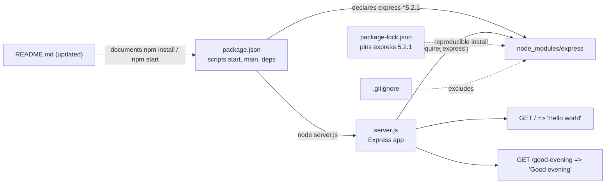

# Technical Specification

# 0. Agent Action Plan

## 0.1 Intent Clarification

This Agent Action Plan translates the user's request into a precise, file-level implementation blueprint for the Blitzy Platform. The user's verbatim request is preserved below as the authoritative source of intent:

> "add feature to a existing product. this is a tutorial of node js server hosting one endpoint that returns the response 'Hello world'. Could you add expressjs into the project and add another endpoint that return the reponse of 'Good evening'?"

A critical observation governs the entire plan: the request describes an *existing* Node.js server, but the repository is empty. The only file present is `README.md`, containing the single line `# Artifact2` [README.md:L1], confirmed by the repository's lone "Initial commit" (`eb78648`) which tracks only that file. This absence is independently corroborated by the Technical Specification, which records that the repository contains no programming-language source files and no backend web framework [Technical Specification §3.2.1, §3.3.1]. Consequently, the described "Hello world" server **does not yet exist** and must be bootstrapped as part of fulfilling the request. The Blitzy Platform therefore treats this work as a **near-greenfield bootstrap plus feature addition** rather than a modification of pre-existing server code.

### 0.1.1 Core Feature Objective

Based on the prompt, the Blitzy platform understands that the new feature requirement is to **introduce the Express.js web framework into a minimal Node.js project and expose a second HTTP endpoint that returns "Good evening", while preserving the originally described endpoint that returns "Hello world".**

Each requirement, restated with enhanced technical clarity:

- **R1 — Add Express.js:** Introduce Express.js as a direct production dependency of the project so that HTTP routing is handled by Express rather than by a hand-rolled Node.js `http` server.
- **R2 — Preserve the baseline endpoint:** Serve the existing, described behavior — an HTTP `GET /` route that returns the plaintext response `Hello world` (User Example: `"Hello world"`).
- **R3 — Add the new endpoint:** Add a second HTTP `GET` route that returns the plaintext response `Good evening` (User Example: `"Good evening"`). The user did not specify the route path; the Blitzy platform interprets this as `GET /good-evening` — an explicit, self-describing path. This is the single point of interpretive latitude in the plan.
- **R4 — Runnable server:** The Express application must boot and listen on a configurable TCP port (default `3000`) and serve both routes concurrently from a single application instance.

**Implicit requirements and prerequisites surfaced by the Blitzy platform** (these are necessary to fulfill the request but are not stated verbatim):

- **Project bootstrap (critical):** Because no `package.json`, no entry file, and no `node_modules` exist [Technical Specification §1.3.2], a Node.js project foundation must be created — a `package.json` manifest and a server entry file — before Express can be added or any endpoint can be served.
- **Dependency installation:** Express must be installed into `node_modules` via `npm install`, which also generates a `package-lock.json` lockfile for reproducible builds.
- **Run script:** An `npm start` script must be provided so the server is launchable with a standard, documented command.
- **Documentation:** `README.md` should be updated to describe the two endpoints and how to install and run the server.
- **VCS hygiene:** A `.gitignore` excluding `node_modules/` should accompany the change so the dependency tree is not committed.

### 0.1.2 Special Instructions and Constraints

No user-specified implementation rules were provided (the rules input is an empty list), and no attachments accompany the request. The following constraints are therefore *derived* by the Blitzy platform from the prompt's own wording and the verified repository state:

- **Backward compatibility (C1):** The `Hello world` response must remain intact and reachable at the root route. Adding Express must not alter the described baseline behavior.
- **Tutorial simplicity (C2):** The user explicitly frames the project as a "tutorial." The implementation must therefore favor a minimal, single-entry-file architecture (two `app.get` handlers in one file) over a full controller/service/model layering. The conventional modular Express layout (`routes/`, `controllers/`, `app.js` + `server.js`) is documented only as the future scale-up path, not as in-scope work.
- **Verbatim response strings (C3):** The exact response strings must be preserved character-for-character: `Hello world` and `Good evening`.
- **Empty-repository bootstrap (C4):** The described "existing" server is absent and must be created. This is flagged explicitly rather than assumed away.

**Architectural conventions to follow:** Use the idiomatic Express routing pattern — register routes with `app.get(path, handler)` and return string bodies via `res.send(...)`, allowing Express to set the response `Content-Type` automatically. Co-locate both routes on a single Express `app` instance.

**Web search requirements:** Research was required to (a) confirm the current stable Express version and its Node.js runtime requirement, and (b) confirm the idiomatic minimal routing pattern. This research was conducted and is documented in §0.2.2.

### 0.1.3 Technical Interpretation

These feature requirements translate to the following technical implementation strategy. Each user-facing requirement is mapped to a concrete, file-level action:

| Requirement | Technical Action |
|---|---|
| R1 — Add Express.js | To add Express, we will **create** `package.json` declaring `express` at `^5.2.1` and run `npm install`, producing `node_modules/` and `package-lock.json`. |
| R2 — Preserve "Hello world" | To preserve the baseline, we will **create** the entry file `server.js` registering `app.get('/', (req, res) => res.send('Hello world'))`. |
| R3 — Add "Good evening" | To add the new endpoint, we will register `app.get('/good-evening', (req, res) => res.send('Good evening'))` in the same `server.js`. |
| R4 — Runnable server | To make it runnable, we will call `app.listen(process.env.PORT || 3000, ...)` and add `"start": "node server.js"` to `package.json`. |
| Implicit — Documentation & hygiene | We will **update** `README.md` with endpoint and run instructions and **create** `.gitignore` excluding `node_modules/`. |

The end state is a working, installable, and runnable Express server in a repository that previously contained only a documentation placeholder. This transition is precisely the "material change requiring re-evaluation" of scope that the Technical Specification anticipates when implementation artifacts are introduced into the empty repository [Technical Specification §1.3.3].

## 0.2 Repository Scope Discovery

This section catalogs every file and integration point relevant to the feature, grounded in exhaustive repository inspection. The repository was examined by directory enumeration, full Git history review, semantic file search, and cross-referencing against the existing Technical Specification — all converging on the same finding: the repository is an empty placeholder.

### 0.2.1 Comprehensive File Analysis

The repository's complete tracked surface area is a single file. A recursive listing and a semantic search for any "Node.js server entry point with HTTP endpoint handlers and routing" both confirmed that **no source code, no manifests, and no configuration files exist** — the semantic search returned zero results.

| Path | Type | Status | Role in This Feature |
|---|---|---|---|
| `README.md` | Markdown doc | Exists (UNCHANGED today) | Sole pre-existing file; content is `# Artifact2` [README.md:L1]. Will be **UPDATED** with endpoint and run documentation. |
| `package.json` | Manifest | **Absent** | Must be **CREATED** to declare the Express dependency and the run script. |
| `server.js` | Source | **Absent** | Must be **CREATED** as the Express application entry point hosting both routes. |
| `.gitignore` | VCS config | **Absent** | Must be **CREATED** to exclude `node_modules/`. |
| `package-lock.json` | Lockfile | **Absent** | **GENERATED** by `npm install`. |
| `node_modules/` | Dependency tree | **Absent** | **GENERATED** by `npm install`; Git-ignored. |

**Integration-point discovery (existing system):** A deliberate search was performed for each conventional Express integration surface. None exist, because no application code is present:

- **API endpoints / routers:** None present — no existing routes to register against [Technical Specification §1.2.1].
- **Database models / migrations:** None present — no data layer exists [Technical Specification §1.2.2].
- **Service classes:** None present.
- **Controllers / handlers:** None present.
- **Middleware / interceptors:** None present.

Because every conventional touchpoint is absent, this feature introduces — rather than modifies — the application's HTTP surface. The only pre-existing artifact that is modified is `README.md`.

### 0.2.2 Web Search Research Conducted

Research was performed to ensure the dependency version and routing approach reflect current, validated practice:

- **Current Express version and stability:** The current stable release line is Express 5, published to npm as `5.2.1` (the npm `latest` dist-tag). Express is described as a minimalist, flexible Node.js web framework.
- **Runtime requirement for Express 5:** Express 5 requires Node.js 18 or higher as its minimum supported version. The installed runtime is Node.js v22.22.2, which satisfies this requirement.
- **Version recommendation:** Current guidance recommends Express 5 for projects on Node.js 18+, citing improved security and modern JavaScript support. Express `4.22.2` remains available as the conservative alternative for legacy environments but is not selected here.
- **Idiomatic routing pattern:** Endpoints are defined with `app.get(path, (req, res) => res.send('...'))`; larger applications optionally modularize routes via `express.Router()` in a `routes/` directory. For the user's stated "tutorial" scope, a single entry file with two `app.get` handlers is the idiomatic minimal form, with the modular layout reserved as a documented scale-up path.

**Empirical validation:** The plan was validated end-to-end in an isolated scratch workspace (not the repository): `npm install express` resolved to `express@5.2.1` and generated a `package-lock.json`; a six-line `server.js` then served `GET /` → `Hello world` (HTTP 200) and `GET /good-evening` → `Good evening` (HTTP 200), with unknown paths returning Express's default `404`. This confirms the dependency, version, and routing approach are correct and runnable on the target runtime.

### 0.2.3 New File Requirements

The following new files will be created. Generated artifacts (produced by `npm install`) are marked as such.

- **New source / manifest files:**
  - `package.json` — project manifest declaring `express@^5.2.1`, `"main": "server.js"`, and `"scripts": { "start": "node server.js" }`.
  - `server.js` — Express application entry point: imports `express`, constructs the `app`, registers `GET /` (`Hello world`) and `GET /good-evening` (`Good evening`), and calls `app.listen(...)`.
- **New configuration files:**
  - `.gitignore` — excludes `node_modules/` (and npm debug logs) from version control.
- **Generated files (via `npm install`):**
  - `package-lock.json` — pins `express@5.2.1` and its full transitive dependency tree (lockfileVersion 3).
  - `node_modules/` — installed dependency tree (~65 packages); present in the working tree but Git-ignored.

No new test files or feature-specific configuration files (e.g., YAML settings) are required for this minimal scope; their exclusion is documented in §0.6.2.

## 0.3 Dependency Inventory

This feature introduces the project's first and only direct dependency. Because the repository previously declared no dependency manifest [Technical Specification §3.3.2], there are no dependency *updates* or *removals* — only a single *addition*.

### 0.3.1 Public Package Additions

| Package | Registry | Version (declared / resolved) | Purpose |
|---|---|---|---|
| `express` | npm (npmjs.com) | `^5.2.1` / `5.2.1` | Minimalist Node.js web framework providing the HTTP routing and `res.send` used by both endpoints. |

The version `5.2.1` is the verified npm `latest` release and was confirmed by an actual install in validation (not a placeholder). Express 5 declares `engines.node` of `>= 18`, satisfied by the installed Node.js v22.22.2.

**Transitive dependencies (informational, not directly declared):** Installing `express@5.2.1` pulls in approximately 65 packages, pinned automatically through `package-lock.json`. Notable Express 5 core dependencies observed during validation include `router@2.2.0`, `body-parser@2.2.2`, `send@1.2.1`, `finalhandler@2.1.1`, and `qs@6.15.2`. These are managed transitively by npm and require no direct declaration.

**Development dependencies:** None are required for this scope. Optional tooling such as `nodemon` is intentionally excluded to honor the tutorial-simplicity constraint (C2).

### 0.3.2 Lockfile and Runtime

- **`package-lock.json`** will be generated by `npm install` (lockfileVersion 3), pinning `express@5.2.1` and the complete transitive tree for reproducible installs. It is a tracked deliverable.
- **Runtime:** Node.js `>= 18` is required by Express 5; the documented build/run runtime is Node.js v22.22.2 with npm 11.1.0. No `.nvmrc` previously existed; an optional `"engines": { "node": ">=18" }` field may be added to `package.json` to encode this constraint.

### 0.3.3 Import and Reference Updates

No import-rewrite or external-reference migration is required. Because no source files, configuration files, build files, or CI/CD definitions previously existed [Technical Specification §1.3.2], there are no existing imports or references to transform. The single `require('express')` statement in the new `server.js` is introduced fresh rather than migrated.

## 0.4 Integration Analysis

Because the repository contains no application code, there are **no in-place modifications to existing source code** — the conventional integration surfaces (entry-point initialization, route registration files, dependency-injection containers, schema/migration directories) do not exist [Technical Specification §1.2.1, §1.2.2]. The "integration" for this feature is therefore the internal bootstrap wiring that binds the newly created artifacts into a runnable whole, plus the one update to the existing `README.md`.

### 0.4.1 Existing Code Touchpoints

- **Direct modifications to existing code:** None. No `main`/`app` entry file, no `routes` module, and no `models` index exist to amend.
- **Dependency injection wiring:** Not applicable — no DI container exists; the single Express `app` instance is constructed directly in `server.js`.
- **Database / schema updates:** Not applicable — no data layer, migrations, or schema files exist, and the feature requires none.
- **Existing documentation:** `README.md` [README.md:L1] is the only pre-existing file and will be updated with endpoint and run instructions.

### 0.4.2 Bootstrap Wiring (New Internal Integration)

The integration points created by this feature are entirely internal to the new project foundation:

- `package.json` `"main"` and `"scripts.start"` → resolve and launch `server.js` via `node server.js`.
- `server.js` `require('express')` → resolves to `node_modules/express`, installed by the new `express` dependency.
- Both routes — `GET /` and `GET /good-evening` — are registered on the single Express `app` instance in `server.js`; the `app` object is the sole integration surface for the HTTP layer.
- `README.md` run instructions → reference `npm install` and `npm start`.
- `.gitignore` → excludes `node_modules/` from version control while the committed `package-lock.json` preserves reproducibility.

The following diagram summarizes the wiring among the new and updated artifacts:




## 0.5 Technical Implementation

This section defines the exhaustive, file-by-file execution plan. Every file listed here will be created, generated, or updated; no file is listed speculatively.

### 0.5.1 File-by-File Execution Plan

**Group 1 — Project Foundation (authored source):**

- **CREATE `package.json`** — Declare project metadata, `"main": "server.js"`, `"scripts": { "start": "node server.js" }`, `"dependencies": { "express": "^5.2.1" }`, and optionally `"engines": { "node": ">=18" }`.
- **CREATE `server.js`** — Express application entry point hosting both routes and the listener.

**Group 2 — Configuration and Generated Artifacts:**

- **CREATE `.gitignore`** — Exclude `node_modules/` and npm debug logs from version control.
- **GENERATE `package-lock.json`** — Produced by `npm install`; pins `express@5.2.1` and the transitive tree (lockfileVersion 3). Committed.
- **GENERATE `node_modules/`** — Produced by `npm install` (~65 packages); present in the working tree, Git-ignored, not a tracked deliverable.

**Group 3 — Documentation:**

- **UPDATE `README.md`** — Preserve the `# Artifact2` heading [README.md:L1]; append an overview, prerequisites (Node.js >= 18), install (`npm install`) and run (`npm start`) instructions, and an endpoint table.

**Logical execution order:** `package.json` → `server.js` → `.gitignore` → `npm install` (generates lockfile and `node_modules/`) → `README.md` update → verification (`npm start` then `curl` both routes).

### 0.5.2 Implementation Approach per File

- **`package.json`:** Establish the project foundation so the toolchain recognizes a Node.js package, the Express dependency resolves, and `npm start` launches the server. The `express` dependency is fixed at `^5.2.1`.

- **`server.js`:** Implement the HTTP surface using the idiomatic Express pattern validated end-to-end. The core registration is concise:

```javascript
app.get('/', (req, res) => res.send('Hello world'));
app.get('/good-evening', (req, res) => res.send('Good evening'));
```

  The application is bootstrapped with `const app = express();` and started with `app.listen(process.env.PORT || 3000, ...)`, binding to a configurable port with a sensible default. Both routes are co-located on the single `app` instance. The `Hello world` route preserves the described baseline (C1); the `/good-evening` route adds the requested feature (R3); response strings are reproduced verbatim (C3).

- **`.gitignore`:** Add `node_modules/` to keep the installed dependency tree out of version control while the committed `package-lock.json` guarantees reproducible installs.

- **`README.md`:** Document the two endpoints and the install/run workflow so a reader can reproduce the running server. This is the only modification to a pre-existing file.

- **Generated artifacts (`package-lock.json`, `node_modules/`):** Produced by running `npm install`; no manual authoring. The lockfile is committed; `node_modules/` is ignored.

No file in this plan references any user-provided Figma URL, because none were supplied (see §0.8).

### 0.5.3 User Interface Design

**Not applicable.** This feature is a backend HTTP server that returns plaintext string responses (`Hello world` and `Good evening`). There is no front-end, no rendered view, no templating engine, and no component library or design system involved. Consequently, no UI design, no Figma-to-component mapping, and no Design System Alignment Protocol applies to this work.

## 0.6 Scope Boundaries

### 0.6.1 Exhaustively In Scope

All paths are relative to the repository root. Authored/tracked deliverables are distinguished from generated artifacts.

- **Project manifest and source (CREATE):**
  - `package.json` — Express dependency (`^5.2.1`), `main`, and `start` script.
  - `server.js` — Express app exposing `GET /` (`Hello world`) and `GET /good-evening` (`Good evening`), plus the listener.
- **Configuration (CREATE):**
  - `.gitignore` — excludes `node_modules/`.
- **Generated artifacts (via `npm install`):**
  - `package-lock.json` — pins `express@5.2.1` and the transitive tree (tracked).
  - `node_modules/**` — installed dependency tree (Git-ignored; not a tracked deliverable).
- **Documentation (UPDATE):**
  - `README.md` — endpoint table and install/run instructions; `# Artifact2` heading preserved [README.md:L1].

Every explicit requirement (R1–R4) and every surfaced implicit requirement (project bootstrap, dependency install, run script, documentation, VCS hygiene) maps to one of the artifacts above; no requirement is left unaddressed.

### 0.6.2 Explicitly Out of Scope

The following are intentionally excluded to prevent scope creep and to honor the tutorial-simplicity constraint (C2). None are required to satisfy the request:

- **Persistence:** Databases, ORMs, schemas, migrations, and seed data — none requested; none exist [Technical Specification §1.2.2].
- **Security:** Authentication, authorization, sessions, and security middleware.
- **Additional endpoints:** Any route beyond `GET /` and `GET /good-evening`.
- **Automated testing:** Test frameworks and test suites. Verification for this scope is performed via manual `curl` checks (recommended for future hardening, but not a mandatory deliverable here).
- **Tooling:** TypeScript, bundlers, transpilers, linters, and formatters.
- **Middleware and configuration:** Custom logging/body-parsing middleware and `.env` files beyond an optional `PORT` override.
- **Front-end / UI:** Templating/view engines, static assets, and any design system or component library.
- **Operations:** Deployment, containers (Docker), CI/CD pipelines, infrastructure-as-code, and cloud configuration.
- **Refactoring and optimization:** Refactoring of existing code (none exists) and performance/scalability work beyond serving the two routes.
- **Express 4.x:** Adopting or downgrading to the Express 4.x line; `5.2.1` is the selected version, with `4.22.2` noted only as a conservative alternative for legacy runtimes.

## 0.7 Rules for Feature Addition

No user-specified implementation rules were provided for this project (the rules input is an empty list). The following conventions are therefore *derived* by the Blitzy platform from the prompt's wording and verified repository state, and govern the implementation:

- **Preserve the baseline behavior:** The `GET /` route must continue to return exactly `Hello world`. Introducing Express must not change the originally described response (constraint C1).
- **Reproduce response strings verbatim:** Endpoint bodies must be the exact strings `Hello world` and `Good evening`, character-for-character (constraint C3).
- **Honor tutorial simplicity:** Implement the minimal viable structure — a single `server.js` entry file with two `app.get` handlers. Do not introduce controller/service/model layering, routers, or additional abstractions for this scope (constraint C2). The modular `routes/`-based layout is the documented scale-up path only.
- **Use idiomatic Express routing:** Register routes with `app.get(path, handler)` and return bodies via `res.send(...)`, letting Express manage the `Content-Type`.
- **Pin a verified dependency version:** Declare `express` at `^5.2.1` (verified npm `latest`); never use placeholder versions such as `latest` or `1.0.0`. Commit `package-lock.json` for reproducibility.
- **Respect the runtime floor:** Target Node.js `>= 18` (Express 5's minimum); the documented build/run runtime is Node.js v22.22.2.
- **Keep dependencies out of version control:** Exclude `node_modules/` via `.gitignore` while committing the lockfile.
- **Make the server runnable and documented:** Provide an `npm start` script and update `README.md` so the server can be installed, started, and exercised with standard commands.

There are no rule-mandated files (e.g., migrations, fixtures, or configuration templates) to add beyond those already enumerated in §0.6.1, because the rules input imposes none.

## 0.8 Attachments

No attachments were provided with this request.

- **File attachments:** None. The project contains no uploaded PDFs, images, or other documents.
- **Figma designs:** None. No Figma frames or URLs were supplied; consequently, no design-to-component mapping, token manifest, or Design System Alignment Protocol applies to this work (see also §0.5.3).

All implementation guidance in this Agent Action Plan derives solely from the user's textual prompt and the verified state of the repository.

