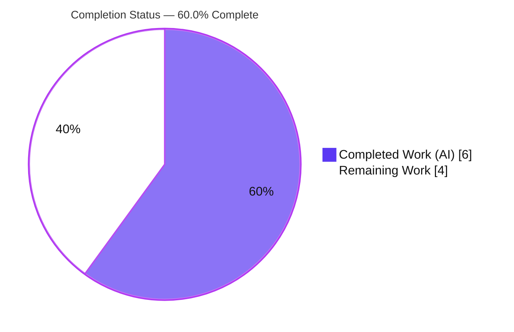
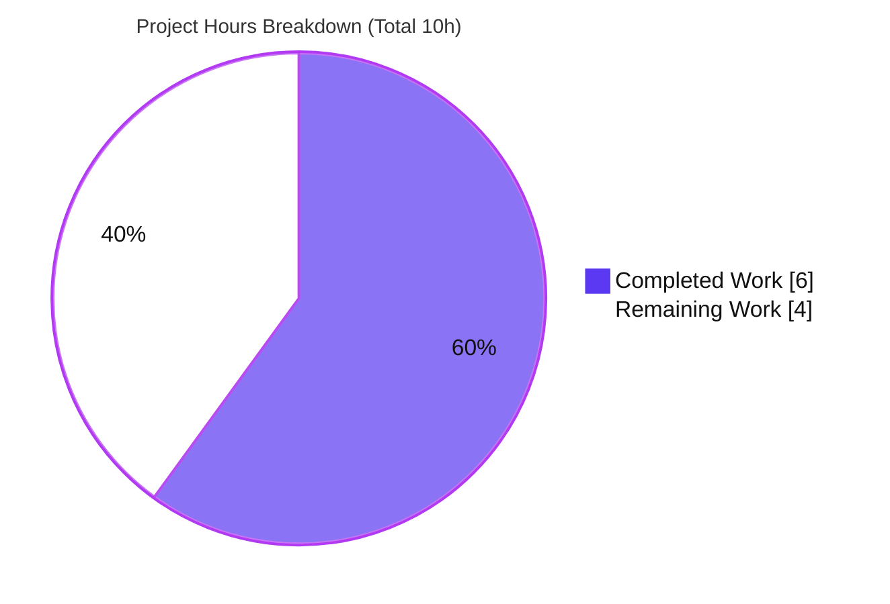
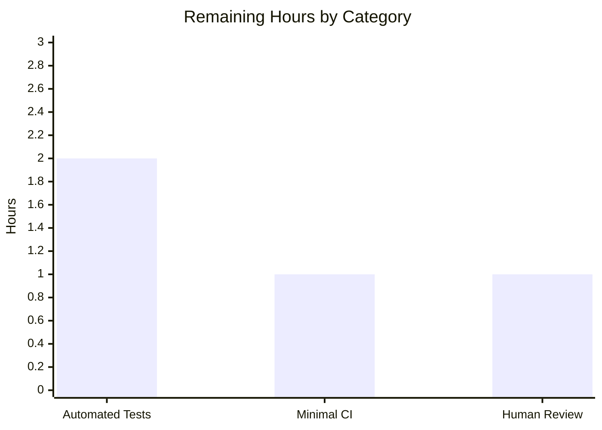

# Blitzy Project Guide — Artifact2: Express.js Greeting Server

> **Brand legend.** <span style="color:#5B39F3">**■ Completed / AI Work — Dark Blue (#5B39F3)**</span> · **□ Remaining / Not Completed — White (#FFFFFF)** · accents in Violet-Black (#B23AF2), highlights in Mint (#A8FDD9).

---

## 1. Executive Summary

### 1.1 Project Overview

Artifact2 is a minimal Node.js HTTP service that introduces the **Express.js** framework into a previously empty repository and exposes two `GET` endpoints: `/` returning `Hello world` and `/good-evening` returning `Good evening`. The intended users are developers following a Node.js tutorial; the value delivered is a runnable, reproducible reference server demonstrating Express routing. The technical scope is a single CommonJS entry point (`index.js`), a dependency manifest (`package.json`) pinning Express `5.2.1`, a committed lockfile for reproducible installs, and standard ignore hygiene (`.gitignore`). The original `README.md` is preserved unchanged. Autonomous agents delivered all four mandated artifacts and validated them end-to-end; the remaining work is standard path-to-production hardening.

### 1.2 Completion Status

**60.0% complete — 6 of 10 total hours.**



| Metric | Hours |
|--------|-------|
| **Total Hours** | **10.0** |
| **Completed Hours (AI + Manual)** | **6.0** (AI 6.0 + Manual 0.0) |
| **Remaining Hours** | **4.0** |
| **Percent Complete** | **60.0%** |

> **Reconciliation.** The autonomous validator reported "PRODUCTION-READY / 100% on all gates." That refers to **AAP-scoped code quality** — the delivered code compiles, runs, and passes every functional check with zero defects, which is genuinely 100%. The **60.0% overall** figure additionally counts standard **path-to-production** work (automated tests, CI, human review) that the AAP deliberately placed out of autonomous scope. Both statements are true at different scopes.

### 1.3 Key Accomplishments

- ✅ Express.js (`^5.2.1`) introduced as the project's first web framework; resolves to exactly `5.2.1` with **0 vulnerabilities**.
- ✅ `GET /` endpoint returns the exact body `Hello world` (HTTP 200, Content-Length 11).
- ✅ `GET /good-evening` endpoint returns the exact body `Good evening` (HTTP 200, Content-Length 12).
- ✅ Runnable server with `npm start` → logs `Server listening on port 3000`; `PORT` environment override verified.
- ✅ Reproducible installs via committed `package-lock.json` (lockfileVersion 3); `npm ci` → 66 packages, 0 vulnerabilities.
- ✅ `node_modules/` correctly git-ignored; `README.md` preserved byte-identical (`# Artifact2`).
- ✅ Route boundaries verified: unknown path and non-GET method both return 404.
- ✅ Browser-verified via Chrome DevTools; `X-Powered-By: Express` header confirms the serving framework; screenshots captured.
- ✅ Full AAP compliance with the "Make minimal changes" rule: only the four mandated artifacts exist; zero modifications, zero deletions.

### 1.4 Critical Unresolved Issues

There are **no blocking defects**. The items below are governance/quality gates for production, not bugs in delivered code.

| Issue | Impact | Owner | ETA |
|-------|--------|-------|-----|
| Human code review & production sign-off not yet performed | Required gate before merge/deploy (RG2 caps autonomous completion below 100%) | Human reviewer / Maintainer | 1h |
| No automated test suite | Endpoint regressions could go undetected on future changes | Backend developer | 2h |
| No CI pipeline | Deploys are manual and unverified by automation | DevOps / Backend developer | 1h |

### 1.5 Access Issues

**No access issues identified.** The project has no external dependencies requiring credentials.

| System/Resource | Type of Access | Issue Description | Resolution Status | Owner |
|-----------------|----------------|-------------------|-------------------|-------|
| — | — | No repository, service, or third-party access issues identified | N/A | — |

The application uses only the public npm registry for `express` (installed and verified, 0 vulnerabilities). There are no databases, API keys, secrets, or third-party services involved.

### 1.6 Recommended Next Steps

1. **[High]** Perform human code review of the four in-scope files and sign off for production (~1h).
2. **[Medium]** Add an automated smoke/integration test suite covering `GET /`, `GET /good-evening`, and the 404 boundary; wire an `npm test` script (~2h).
3. **[Medium]** Add a minimal CI workflow (`npm ci` → start-check → run tests on push/PR) (~1h).
4. **[Low]** Consider optional production hardening if the service graduates beyond tutorial scope: containerization, graceful shutdown, a `/health` endpoint, and structured logging (see §8; not counted in project hours).

---

## 2. Project Hours Breakdown

### 2.1 Completed Work Detail

All completed work was performed autonomously (AI). Each row traces to a specific AAP requirement or its mandated validation.

| Component | Hours | Description |
|-----------|-------|-------------|
| Current-state analysis & repository reconnaissance | 0.5 | Confirmed greenfield state; established the four artifacts to create per AAP §0.3–§0.4 |
| `package.json` authoring | 0.5 | Express dependency (`^5.2.1`), `start` script, `engines.node >=18`, CommonJS metadata (AAP §0.4.1) |
| `index.js` authoring | 1.0 | Express app instance, `GET /` → `Hello world`, `GET /good-evening` → `Good evening`, `app.listen(process.env.PORT || 3000)`, explanatory comments |
| `.gitignore` authoring | 0.5 | Ignores `node_modules/` and `npm-debug.log*` (AAP §0.4.1) |
| Express install + `package-lock.json` generation | 0.5 | `npm install` resolving express to `5.2.1`; lockfile committed for reproducibility |
| Dependency validation | 0.5 | `npm ci` (66 pkgs), `npm ls express` (5.2.1), `npm audit` (0 vulnerabilities) |
| Static / compilation validation | 0.5 | `node --check index.js` (Syntax OK); `package.json` & `package-lock.json` valid JSON; route registration confirmed |
| Runtime functional validation | 1.0 | Endpoint bodies/status, 404 & non-GET boundaries, `PORT` override; 11/11 functional assertions |
| Browser / UI validation | 0.5 | Chrome DevTools render check, network panel (`X-Powered-By: Express`), screenshots, multi-version Express (5.2.1 + 4.x) confirmation |
| Git commits & scope-compliance hygiene | 0.5 | Two well-structured agent commits; clean tree; scope/minimal-changes compliance |
| **Total** | **6.0** | **Matches Completed Hours in §1.2** |

### 2.2 Remaining Work Detail

Each category is standard path-to-production work that the AAP deliberately excluded from autonomous scope (§0.5.2).

| Category | Hours | Priority |
|----------|-------|----------|
| Human code review & production sign-off | 1.0 | High |
| Automated test suite (smoke/integration: `GET /`, `GET /good-evening`, 404 boundary) | 2.0 | Medium |
| Minimal CI pipeline (`npm ci` → start-check → run tests) | 1.0 | Medium |
| **Total** | **4.0** | **Matches Remaining Hours in §1.2 and §7** |

### 2.3 Hours Reconciliation & Methodology

Completion is computed using the PA1 AAP-scoped, hours-based methodology:

```
Completion % = Completed Hours / (Completed Hours + Remaining Hours) × 100
             = 6.0 / (6.0 + 4.0) × 100
             = 6.0 / 10.0 × 100
             = 60.0%
```

**Cross-section integrity (all verified):**

| Rule | Check | Result |
|------|-------|--------|
| Rule 1 | §1.2 Remaining = §2.2 sum = §7 "Remaining Work" | 4.0 = 4.0 = 4.0 ✅ |
| Rule 2 | §2.1 total + §2.2 total = §1.2 Total | 6.0 + 4.0 = 10.0 ✅ |
| Rule 3 | All §3 tests originate from Blitzy autonomous logs | ✅ |
| Rule 4 | §1.5 access issues validated | ✅ (none) |
| Rule 5 | Completed = #5B39F3, Remaining = #FFFFFF | ✅ |

---

## 3. Test Results

All tests below originate from Blitzy's **autonomous validation logs** for this project. The AAP explicitly excludes a unit-test suite (§0.5.2); functional verification was performed in lieu of one, and was independently re-confirmed during this assessment.

| Test Category | Framework | Total Tests | Passed | Failed | Coverage % | Notes |
|---------------|-----------|-------------|--------|--------|------------|-------|
| Functional — HTTP harness | Node.js `http` (custom harness) | 8 | 8 | 0 | N/A | Spawns the real server; asserts status codes and exact bodies for `/`, `/good-evening`, plus 404 / non-GET boundaries |
| Functional — clean-env assertions | Node.js / shell | 3 | 3 | 0 | N/A | Deterministic final clean-environment checks |
| Unit tests | — (none by design) | 0 | 0 | 0 | N/A | No unit suite per AAP §0.5.2; `npm test` → `Missing script: "test"` is the documented, intended behavior — **not** a defect |
| **Total** | | **11** | **11** | **0** | **N/A** | **100% pass rate; 0 failures** |

**Code coverage:** Not instrumented. With no unit-test framework in scope, coverage percentage is not applicable; functional coverage of the two defined routes and their negative boundaries is complete (100% of routes exercised).

---

## 4. Runtime Validation & UI Verification

**Status legend:** ✅ Operational · ⚠ Partial / By-design note · ❌ Failing

**Server lifecycle**
- ✅ Boot: `npm start` (and `node index.js`) → `Server listening on port 3000`.
- ✅ `PORT` override: `PORT=4100 npm start` → `Server listening on port 4100`, `GET /` → 200 `Hello world`.
- ✅ Clean shutdown; no stack traces or errors on start or stop.

**HTTP endpoints (API integration)**
- ✅ `GET /` → **200**, body `Hello world`, `Content-Length: 11`, `Content-Type: text/html; charset=utf-8`.
- ✅ `GET /good-evening` → **200**, body `Good evening`, `Content-Length: 12`.
- ✅ `GET /missing` → **404** (routing active and bounded).
- ✅ `POST /` → **404** (no matching route for non-GET method; expected per AAP §0.3.3).
- ✅ `X-Powered-By: Express` response header confirms Express is the serving framework.

**UI / Browser verification (Chrome DevTools)**
- ✅ `http://localhost:3000/` renders `Hello world` as plain text (screenshot: `blitzy/screenshots/root_hello_world_3000.png`).
- ✅ `http://localhost:3000/good-evening` renders `Good evening` as plain text (screenshot: `blitzy/screenshots/good_evening_3000.png`).
- ✅ Network panel shows `GET /good-evening` → 200 with `content-type: text/html; charset=utf-8`.
- ⚠ Browser console shows a benign Quirks-Mode notice — expected because `res.send(plain string)` emits no DOCTYPE. This is by-design, not an error, and is out of scope to "fix."

**Overall:** ✅ All runtime and UI checks operational; zero runtime errors.

---

## 5. Compliance & Quality Review

Cross-mapping of AAP deliverables and governing rules to quality benchmarks. Fixes applied during autonomous validation: **zero source fixes** were required — the committed implementation already matched AAP §0.4.1 byte-for-byte.

| Benchmark / Deliverable | Requirement Source | Status | Progress | Notes |
|--------------------------|--------------------|--------|----------|-------|
| Express.js introduced as dependency | AAP §0.4.1 | ✅ Pass | 100% | `express ^5.2.1` declared; resolves to 5.2.1 |
| `GET /` → `Hello world` | AAP §0.4.1 | ✅ Pass | 100% | 200, exact body, CL 11 |
| `GET /good-evening` → `Good evening` | AAP §0.4.1 | ✅ Pass | 100% | 200, exact body, CL 12 |
| Runnable entry point + `npm start` | AAP §0.4.1 | ✅ Pass | 100% | Logs listening message; `PORT` override works |
| Reproducible install (lockfile) | AAP §0.4.2 | ✅ Pass | 100% | `package-lock.json` v3 committed; `npm ci` clean |
| `node_modules/` ignored | AAP §0.4.1 | ✅ Pass | 100% | Confirmed via `git check-ignore` |
| `README.md` preserved | AAP §0.5.2 | ✅ Pass | 100% | Byte-identical (`# Artifact2`, 11 bytes) |
| No out-of-scope additions (tests/CI/Docker/middleware) | AAP §0.5.2 | ✅ Pass | 100% | Only the four mandated artifacts exist |
| "Make minimal changes" rule | AAP §0.7 | ✅ Pass | 100% | Zero modifications, zero deletions; no refactoring |
| Dependency security | Quality gate | ✅ Pass | 100% | `npm audit` → 0 vulnerabilities |
| Syntax / static validity | Quality gate | ✅ Pass | 100% | `node --check` OK; manifests valid JSON |
| Automated test suite | Path-to-production | □ Outstanding | 0% | Excluded by AAP; recommended for production (§2.2) |
| CI/CD pipeline | Path-to-production | □ Outstanding | 0% | Excluded by AAP; recommended for production (§2.2) |
| Human code review & sign-off | Governance gate | □ Outstanding | 0% | Required before merge/deploy (§2.2) |

**Outstanding compliance items** are confined to path-to-production governance and automation; none represent a defect in the delivered AAP scope.

---

## 6. Risk Assessment

Overall risk posture is **Low**. The service is intentionally minimal — no user input, no data persistence, no authentication, and no external integrations — which keeps security and integration risk inherently low. Severities below reflect impact in a real production deployment.

| Risk | Category | Severity | Probability | Mitigation | Status |
|------|----------|----------|-------------|------------|--------|
| No automated test suite → endpoint regressions undetected | Technical | Medium | Medium | Add smoke/integration tests (§2.2) | Open (AAP-deferred) |
| No graceful shutdown (SIGTERM/SIGINT) → in-flight requests dropped on restart | Technical | Low | Medium | Add signal handlers + `server.close()` | Open |
| Express 5.2.1 is a recent major; some legacy middleware targets v4 | Technical | Low | Low | App uses no middleware; AAP documents v4.x as drop-in fallback | Mitigated / Accepted |
| `X-Powered-By: Express` header exposed (framework disclosure) | Security | Low | Low | `app.disable('x-powered-by')` or `helmet` (out of AAP scope) | Open (informational) |
| No security middleware (helmet / rate-limit / CORS) | Security | Low | Low | Minimal attack surface (GET-only static strings, no input/DB/auth); add if exposed publicly | Open (low surface) |
| Dependency vulnerabilities over time | Security | Low | Low | Currently 0 vulns; add Dependabot / periodic `npm audit` | Mitigated (0 now) |
| No health-check endpoint → orchestrator probes lack a target | Operational | Medium | Medium | Add `GET /health` | Open |
| Minimal logging (single startup line; no request/structured logs) | Operational | Medium | Medium | Add structured logging (pino/morgan) | Open |
| No process manager / restart policy → no auto-restart on crash | Operational | Medium | Medium | PM2 / systemd / container restart policy | Open |
| No CI/CD gate → manual, unverified deploys | Operational | Medium | Medium | Add minimal CI (§2.2) | Open |
| No external integrations exist (no DB/API/credentials) | Integration | Low | Low | N/A — none by design | N/A (by design) |
| Default port 3000 may collide on a shared host | Integration | Low | Low | `PORT` env override supported and verified | Mitigated |
| `node_modules` not committed → deploy must run `npm ci` | Integration | Low | Low | Documented in run instructions; enforce in CI | Mitigated (documented) |

---

## 7. Visual Project Status

**Project hours — Completed vs Remaining** (Completed = Dark Blue #5B39F3, Remaining = White #FFFFFF):



**Remaining hours by category** (sums to 4.0h, matching §2.2):



| Category | Hours | Priority |
|----------|-------|----------|
| Automated test suite | 2.0 | Medium |
| Minimal CI pipeline | 1.0 | Medium |
| Human review & sign-off | 1.0 | High |
| **Total Remaining** | **4.0** | — |

---

## 8. Summary & Recommendations

**Achievements.** The feature request is fully delivered: Express.js is introduced as the project's first web framework, and both requested endpoints (`GET /` → `Hello world`, `GET /good-evening` → `Good evening`) are implemented, runnable via `npm start`, and validated end-to-end including in a real browser. The implementation matches the Agent Action Plan byte-for-byte, requires **zero source fixes**, ships with **0 dependency vulnerabilities**, and fully honors the "make minimal changes" rule (only four artifacts created; `README.md` untouched).

**Remaining gaps.** The project is **60.0% complete** when standard path-to-production work is counted. The four remaining hours are governance and automation that the AAP intentionally excluded from autonomous scope: human code review/sign-off (1h), an automated test suite (2h), and a minimal CI pipeline (1h). None of these are defects — the delivered AAP scope is itself 100% complete and validated.

**Critical path to production.**
1. Human code review & sign-off of the four files → approve for merge.
2. Add smoke/integration tests for both endpoints and the 404 boundary; wire `npm test`.
3. Add a minimal CI workflow to run install + start-check + tests on every push.

**Optional future enhancements (not counted in project hours; AAP §0.5.2 excluded these — pursue only if the service is hardened beyond tutorial scope):** containerization (Dockerfile + `.dockerignore`), graceful shutdown on SIGTERM/SIGINT, a `/health` liveness endpoint, structured request logging, a process manager/restart policy, security hardening (helmet, disable `X-Powered-By`, rate-limiting) if exposed publicly, and Dependabot/scheduled `npm audit`.

**Success metrics.**

| Metric | Target | Actual |
|--------|--------|--------|
| Both endpoints return exact bodies with HTTP 200 | Yes | ✅ Yes |
| Dependency vulnerabilities | 0 | ✅ 0 |
| Functional assertions passing | 100% | ✅ 11/11 |
| Reproducible install (`npm ci`) | Clean | ✅ 66 pkgs, 0 vulns |
| AAP scope compliance | Full | ✅ Full |

**Production readiness assessment.** The delivered code is **production-ready in quality** (clean compile, clean run, zero defects). Before a real production deployment, complete the human review and add the recommended test + CI safety nets. Overall risk is **Low**; there are no blocking issues.

---

## 9. Development Guide

All commands below were tested against the live repository during this assessment.

### 9.1 System Prerequisites

- **Node.js** ≥ 18 (validated on **v20.20.2**). Express 5 requires Node ≥ 18; `package.json` declares `engines.node >=18`.
- **npm** (validated on **11.1.0**) — bundled with Node.
- **git** (validated on **2.51.0**) — optional, for version control.
- **OS:** any Linux/macOS/Windows host capable of running Node.js. No databases, caches, or message queues are required.

### 9.2 Environment Setup

No environment variables are required. One optional variable is supported:

- `PORT` — the TCP port to bind. Defaults to `3000` when unset.

```bash
# Optional: run on a custom port
export PORT=4100
```

### 9.3 Dependency Installation

Run from the repository root. Use `npm ci` for reproducible installs from the committed lockfile (recommended):

```bash
npm ci
```

Expected output (abridged):

```
added 66 packages, and audited 67 packages in <time>
found 0 vulnerabilities
```

> Use `npm install` only when you intend to regenerate the lockfile. `node_modules/` is git-ignored by design and must be installed locally before starting.

### 9.4 Application Startup

```bash
npm start          # equivalent to: node index.js
```

Expected stdout:

```
> artifact2@1.0.0 start
> node index.js

Server listening on port 3000
```

Run on a custom port:

```bash
PORT=4100 npm start    # → Server listening on port 4100
```

### 9.5 Verification Steps

With the server running:

```bash
curl http://localhost:3000/                 # → Hello world      (HTTP 200)
curl http://localhost:3000/good-evening     # → Good evening     (HTTP 200)
curl -o /dev/null -w "%{http_code}\n" http://localhost:3000/missing   # → 404
```

Inspect headers (confirms framework and content type):

```bash
curl -sI http://localhost:3000/
# Content-Type: text/html; charset=utf-8
# Content-Length: 11
# X-Powered-By: Express
```

### 9.6 Example Usage

```bash
# End-to-end in one block:
npm ci
npm start &                                  # start in background (see troubleshooting note below)
sleep 2
curl http://localhost:3000/                  # Hello world
curl http://localhost:3000/good-evening      # Good evening
```

### 9.7 Troubleshooting

- **`Cannot find module 'express'`** — run `npm ci` first; `node_modules/` is git-ignored and not committed.
- **`EADDRINUSE` (port already in use)** — identify the listener with `lsof -i :3000`, then free it or start on another port via `PORT=<n> npm start`.
- **Stopping a backgrounded server / orphaned process** — when backgrounding with `npm start &` or `node index.js &`, the shell's `$!` may capture the npm wrapper rather than the real `node index.js` process, leaving an **orphaned listener** that keeps holding the port. Prefer running the server in the **foreground** and stopping with `Ctrl-C`. For scripted shutdown, find the true listener and kill that exact PID:
  ```bash
  kill "$(lsof -t -i:3000 -sTCP:LISTEN)"      # or: ss -ltnp 'sport = :3000'
  ```
  Never use a broad `pkill`/`killall`.
- **`npm test` prints `Missing script: "test"`** — expected and by-design; the AAP excludes a test suite (§0.5.2). This is not an error.
- **Browser console "Quirks Mode" notice** — benign; `res.send(plain string)` emits no DOCTYPE. Not an error.

---

## 10. Appendices

### Appendix A — Command Reference

| Command | Purpose |
|---------|---------|
| `npm ci` | Reproducible install from `package-lock.json` (66 pkgs, 0 vulns) |
| `npm install` | Install/refresh deps and regenerate the lockfile |
| `npm start` | Start the server (`node index.js`) |
| `node index.js` | Start the server directly |
| `node --check index.js` | Syntax-check without executing |
| `npm ls express` | Show resolved Express version (5.2.1) |
| `npm audit` | Check dependency vulnerabilities (currently 0) |
| `curl http://localhost:3000/` | Verify `Hello world` endpoint |
| `curl http://localhost:3000/good-evening` | Verify `Good evening` endpoint |
| `lsof -t -i:3000 -sTCP:LISTEN` | Find the PID listening on port 3000 |

### Appendix B — Port Reference

| Port | Service | Configurable | Default |
|------|---------|--------------|---------|
| 3000 | Express HTTP server | Yes, via `PORT` env var | Yes |
| (any) | Override example: `PORT=4100` | — | — |

### Appendix C — Key File Locations

| Path | Type | Status | Purpose |
|------|------|--------|---------|
| `index.js` | Source (CommonJS) | Created | Express app: both routes + `app.listen` |
| `package.json` | Manifest | Created | Express dependency, `start` script, `engines` |
| `package-lock.json` | Lockfile (v3) | Generated | Reproducible dependency resolution |
| `.gitignore` | Config | Created | Ignores `node_modules/`, `npm-debug.log*` |
| `README.md` | Docs | Preserved | Original `# Artifact2` (unchanged) |
| `blitzy/screenshots/` | Artifacts | Untracked | Browser-validation screenshots (not committed) |

### Appendix D — Technology Versions

| Technology | Version | Notes |
|------------|---------|-------|
| Node.js | v20.20.2 | Satisfies `engines.node >=18` and Express 5's Node ≥ 18 |
| npm | 11.1.0 | Bundled with Node |
| Express | 5.2.1 | Pinned in lockfile; v4.x is a documented drop-in fallback |
| git | 2.51.0 | Optional |
| Lockfile format | lockfileVersion 3 | 66 packages installed, 0 vulnerabilities |

### Appendix E — Environment Variable Reference

| Variable | Required | Default | Purpose |
|----------|----------|---------|---------|
| `PORT` | No | `3000` | TCP port the HTTP server binds to |

### Appendix F — Developer Tools Guide

- **Static check:** `node --check index.js` (no build step — plain CommonJS).
- **Dependency health:** `npm audit` and `npm ls` to confirm a clean tree.
- **Runtime probes:** `curl` for endpoint bodies/status; `curl -sI` for headers.
- **Browser validation:** Chrome DevTools Network panel verifies `200` responses and the `X-Powered-By: Express` header; screenshots are saved under `blitzy/screenshots/`.
- **Process inspection:** `lsof -i :3000` / `ss -ltnp` to locate the listener; kill by exact PID only.

### Appendix G — Glossary

| Term | Definition |
|------|------------|
| AAP | Agent Action Plan — the primary directive defining project scope |
| CommonJS | Node.js module system using `require()` (no `"type": "module"` here) |
| Path-to-production | Standard activities (tests, CI, review) needed to deploy beyond a validated local build |
| Lockfile | `package-lock.json` capturing exact dependency versions for reproducible installs |
| Greenfield | A repository/project with no pre-existing application code |
| Quirks Mode | Browser rendering mode triggered when a document lacks a DOCTYPE |
