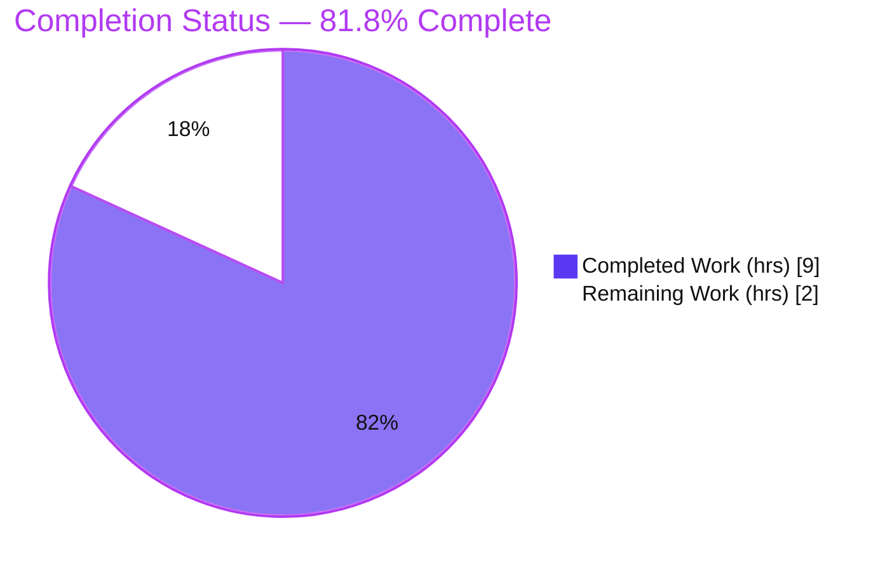
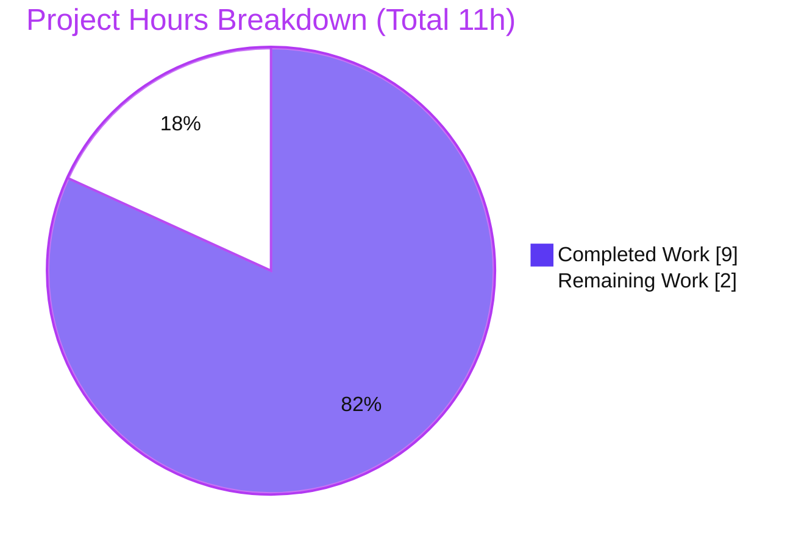
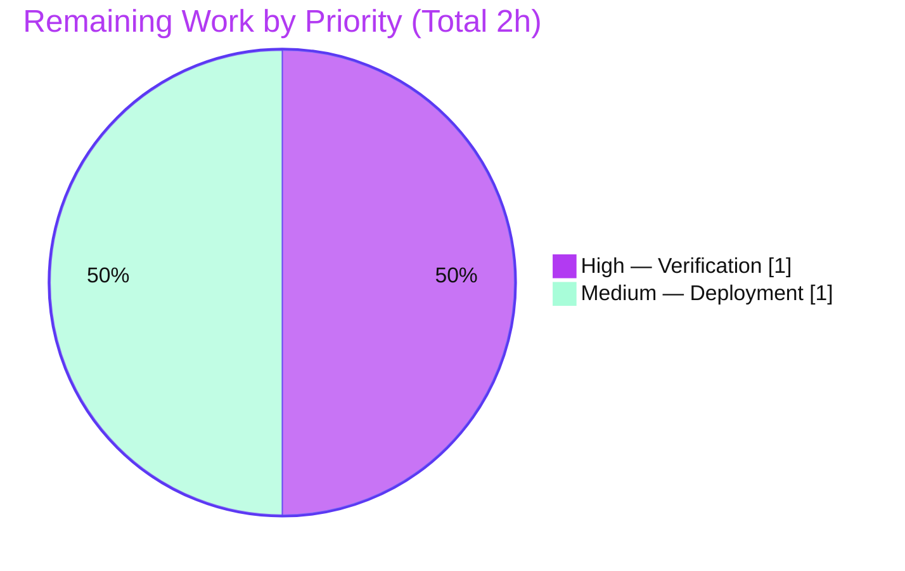

# Blitzy Project Guide — Artifact2 (Node.js + Express Tutorial Server)

## 1. Executive Summary

### 1.1 Project Overview

Artifact2 is a minimal Node.js HTTP server built on the Express.js web framework, delivered as a tutorial-grade reference. Starting from a repository that contained only a `README.md` placeholder, Blitzy bootstrapped a complete, runnable project that exposes two plaintext `GET` endpoints: `/` returning **"Hello world"** (the preserved baseline) and `/good-evening` returning **"Good evening"** (the newly added feature). Express 5.2.1 handles routing; the server binds to a configurable TCP port (default `3000`). The target users are developers learning idiomatic Express routing. The technical scope is intentionally minimal — a single entry file with two route handlers — with persistence, authentication, and front-end concerns explicitly out of scope. The business value is a clean, reproducible, documented starting point for Express-based services.

### 1.2 Completion Status



| Metric | Hours |
|---|---|
| **Total Hours** | 11 |
| **Completed Hours (AI + Manual)** | 9 (AI: 9, Manual: 0) |
| **Remaining Hours** | 2 |
| **Percent Complete** | **81.8%** |

> Completion is computed using the AAP-scoped methodology: `Completion % = Completed Hours / (Completed + Remaining) = 9 / 11 = 81.8%`. All 9 completed hours were delivered autonomously by Blitzy agents (0 manual hours to date). 100% of the Agent Action Plan (AAP) deliverables (R1–R4 plus implicit requirements) are complete and verified; the remaining 2 hours are standard path-to-production activities (human acceptance and deployment) that the AAP itself defers.

### 1.3 Key Accomplishments

- ✅ **Bootstrapped an empty repository** into a runnable Node.js + Express project (resolved the AAP's empty-repo finding, C4).
- ✅ **Added Express.js 5.2.1** as the sole production dependency (R1) — declared `^5.2.1`, resolved and pinned to `5.2.1`.
- ✅ **Preserved the baseline endpoint** `GET /` → `Hello world` (R2, C1) — verified HTTP 200, exact body.
- ✅ **Added the new endpoint** `GET /good-evening` → `Good evening` (R3, C3) — verified HTTP 200, exact body.
- ✅ **Configurable, runnable server** via `app.listen(process.env.PORT || 3000)` (R4) — verified on port 3000 and via `PORT=8080` override.
- ✅ **Reproducible installs** — committed `package-lock.json` (lockfileVersion 3); `npm ci` succeeds with **0 vulnerabilities**.
- ✅ **Documented** — `README.md` updated with prerequisites, install, run, PORT override, an endpoint table, and `curl` examples (heading `# Artifact2` preserved).
- ✅ **VCS hygiene** — `.gitignore` excludes `node_modules/`, debug logs, and `.env`.
- ✅ **All five autonomous validation gates passed** — dependencies, syntax, tests-scope, runtime, and file integrity.

### 1.4 Critical Unresolved Issues

| Issue | Impact | Owner | ETA |
|---|---|---|---|
| None — all AAP deliverables implemented, installed cleanly (0 vulnerabilities), and verified serving correct responses | None | — | — |

> No critical unresolved issues were identified. The Final Validator reported zero unresolved issues and zero fixes required; this assessment independently re-verified all five gates against the live repository with identical results.

### 1.5 Access Issues

| System/Resource | Type of Access | Issue Description | Resolution Status | Owner |
|---|---|---|---|---|
| Git repository | Source control | Repository accessible on branch `blitzy-86c0cfa7-b3b0-4c02-b328-02cfaa2df5eb` | ✅ No issue | — |
| npm registry | Package install | `express@5.2.1` and transitive tree resolved during `npm ci` | ✅ No issue | — |
| External services / APIs | Credentials | None required — project has zero external integrations | ✅ Not applicable | — |

> **No access issues identified.** The project requires no API keys, service credentials, or special permissions.

### 1.6 Recommended Next Steps

1. **[High]** Verify the server in your target environment — run `npm ci`, `npm start`, then `curl` both endpoints (`/` → `Hello world`, `/good-evening` → `Good evening`) and a nonexistent path (expect `404`). Sign off on functional acceptance.
2. **[Medium]** Set up deployment & process management — choose a host/runtime, add a process supervisor (pm2/systemd) or a `Dockerfile`, set `PORT` for the environment, and confirm restart-on-crash.
3. **[Low]** Add optional hardening (recommended, out of AAP scope) — a lightweight automated endpoint test (e.g., `supertest`), request logging, a `/health` endpoint, and `npm audit` automation (Dependabot/Renovate).

---

## 2. Project Hours Breakdown

### 2.1 Completed Work Detail

| Component | Hours | Description |
|---|---|---|
| Dependency integration & project manifest | 2 | Express version research/selection (5.2.1 on Node ≥ 18); authored `package.json` (`main`, `start` script, `engines`, `dependencies.express ^5.2.1`); ran `npm install`; generated tracked `package-lock.json` (lockfileVersion 3). Implements **R1**. |
| `server.js` Express application | 3 | Constructed the single Express `app`; registered `GET /` → `Hello world` (**R2**) and `GET /good-evening` → `Good evening` (**R3**); configurable listener `process.env.PORT || 3000` (**R4**); comprehensive JSDoc documentation. |
| Documentation & VCS hygiene | 2 | Updated `README.md` (overview, prerequisites, install, run, PORT override, endpoint table, `curl` examples; `# Artifact2` heading preserved); created and refined `.gitignore` (excludes `node_modules/`, debug logs, `.env`). |
| Autonomous validation & QA | 2 | Five-gate validation: `npm ci` reproducibility, `node --check` + JSON validity, runtime `curl` (both endpoints + 404), `PORT=8080` override, `npm audit` (0 vulnerabilities), plus CVE research and dependency-inventory QA artifacts. |
| **Total Completed** | **9** | |

> **Validation:** the Hours column sums to **9**, matching the Completed Hours in Section 1.2.

### 2.2 Remaining Work Detail

| Category | Hours | Priority |
|---|---|---|
| Human verification & environment sign-off (clone, `npm ci`, `npm start`, `curl` both endpoints + 404 in target environment) | 1 | High |
| Deployment & process management setup (process supervisor/Docker, `PORT` config, restart-on-crash, clean shutdown) | 1 | Medium |
| **Total Remaining** | **2** | |

> **Validation:** the Hours column sums to **2**, matching the Remaining Hours in Section 1.2 and the "Remaining Work" value in the Section 7 pie chart.
>
> **Note on optional hardening:** automated test suites, request logging, a `/health` endpoint, and CI/CD are explicitly **out of AAP scope** (§0.6.2). They are recommended as future work (see Sections 1.6 and 8) but are **not** included in the remaining-hours total because they are not required to satisfy the AAP or to perform a minimal deployment of the delivered feature.

### 2.3 Hours Reconciliation & Methodology

| Quantity | Value |
|---|---|
| Section 2.1 Completed total | 9 |
| Section 2.2 Remaining total | 2 |
| **Total Project Hours (2.1 + 2.2)** | **11** |
| Completion % (9 ÷ 11) | **81.8%** |

The work universe for this estimate is defined by the AAP: (a) all AAP deliverables (R1–R4 and the surfaced implicit requirements — bootstrap, dependency install, run script, documentation, VCS hygiene), and (b) the standard path-to-production activities required to deploy those deliverables. 100% of the AAP-scoped deliverables are complete; the residual 2 hours are path-to-production (human acceptance + minimal deployment).

---

## 3. Test Results

Automated test frameworks are **out of AAP scope** (§0.6.2); the AAP designates **manual `curl` verification** as the accepted method. The table below aggregates the checks executed by Blitzy's autonomous validation system (the five-gate validation), all sourced from the validation logs and independently re-confirmed against the live repository during this assessment.

| Test Category | Framework / Tool | Total Tests | Passed | Failed | Coverage % | Notes |
|---|---|---|---|---|---|---|
| Dependency install & lockfile sync | `npm ci` (npm 11.1.0) | 1 | 1 | 0 | N/A | Added 66 packages, audited 67; `package.json` ↔ `package-lock.json` in sync |
| Static / syntax validation | `node --check`, `JSON.parse` | 3 | 3 | 0 | N/A | `server.js` (exit 0); `package.json` & `package-lock.json` valid JSON (lockfileVersion 3) |
| API / functional (runtime) | `curl` (manual, per AAP) | 4 | 4 | 0 | 100% routes | `GET /`→`Hello world` (200); `GET /good-evening`→`Good evening` (200); unknown→404; `PORT=8080` override |
| Security audit | `npm audit` | 1 | 1 | 0 | N/A | **0 vulnerabilities** across the 66-package tree |
| **Total** | — | **9** | **9** | **0** | — | **100% pass rate** |

> **Integrity note:** there is no instrumented code-coverage metric because no automated unit/integration suite is in scope; "Coverage %" reflects **functional route coverage** (both routes plus the 404 fallback and the PORT override were exercised). `npm test` returns "Missing script: test", which is the **expected, documented** state — not a failure.

---

## 4. Runtime Validation & UI Verification

**Runtime health** (independently re-verified this assessment):

- ✅ **Server boot** — `npm start` launches `node server.js`; logs `Server listening on port 3000`.
- ✅ **`GET /`** — responds `Hello world` with HTTP **200** (exact match; `Content-Type: text/html; charset=utf-8`).
- ✅ **`GET /good-evening`** — responds `Good evening` with HTTP **200** (exact match).
- ✅ **Unknown path** — returns HTTP **404** via Express's default fallback handler.
- ✅ **Configurable port** — `PORT=8080 npm start` logs `Server listening on port 8080`; both endpoints serve correctly.
- ✅ **Process hygiene** — spawned processes were cleaned up by exact PID; ports 3000/8080 freed (no lingering listeners).

**API integration outcomes:**

- ✅ **Express routing** — `express()`, `app.get(...)`, and `res.send(...)` operate as expected; routes co-located on a single `app` instance.
- ✅ **Dependency resolution** — `require('express')` resolves to `node_modules/express@5.2.1`.

**UI verification:**

- ⚠ **Not applicable** — this is a backend plaintext HTTP server with no front-end, no rendered views, and no design system (AAP §0.5.3). No UI verification, screenshots, or browser automation are warranted. Endpoint responses are plaintext strings validated via `curl`.

---

## 5. Compliance & Quality Review

The matrix cross-maps AAP deliverables and constraints to their validated status.

| Requirement / Constraint | Benchmark | Status | Evidence |
|---|---|---|---|
| **R1** — Add Express.js | `express ^5.2.1` declared & resolved | ✅ Pass | `package.json` deps; lockfile pins `5.2.1`; `npm ls express` |
| **R2** — Preserve `GET /` → `Hello world` | Exact plaintext, HTTP 200 | ✅ Pass | `server.js:46`; `curl` 200 exact |
| **R3** — Add `GET /good-evening` → `Good evening` | Exact plaintext, HTTP 200 | ✅ Pass | `server.js:50`; `curl` 200 exact |
| **R4** — Runnable, configurable port | `app.listen(PORT||3000)` | ✅ Pass | `server.js:58-64`; verified 3000 & 8080 |
| Implicit — Project bootstrap | `package.json` + `server.js` created | ✅ Pass | commits 84caaa5, 7170f9a |
| Implicit — Dependency install / lockfile | `node_modules` + tracked `package-lock.json` | ✅ Pass | `npm ci` 0 vuln; lockfileVersion 3 |
| Implicit — Run script | `npm start` | ✅ Pass | `package.json` `scripts.start` |
| Implicit — Documentation | `README.md` endpoints + run instructions | ✅ Pass | commit 525f779 |
| Implicit — VCS hygiene | `.gitignore` excludes `node_modules/` | ✅ Pass | commits 84caaa5, 1459e46 |
| **C1** — Backward compatibility | Baseline preserved | ✅ Pass | `GET /` unchanged behavior |
| **C2** — Tutorial simplicity | Single file, two `app.get`, no layering | ✅ Pass | `server.js` structure |
| **C3** — Verbatim response strings | Character-exact | ✅ Pass | `curl` body match |
| **C4** — Empty-repo bootstrap | Created, not assumed | ✅ Pass | git history |
| Code quality — no placeholders | Zero stubs/TODOs | ✅ Pass | `server.js` fully implemented, JSDoc'd |
| Security — dependency audit | 0 known vulnerabilities | ✅ Pass | `npm audit` |

**Fixes applied during autonomous validation:** None required — implementation agents had authored and committed all in-scope deliverables correctly; `git diff --stat HEAD` was empty after validation.

**Outstanding compliance items:** None within AAP scope. Optional production hardening (tests, logging, monitoring) is deferred by the AAP and tracked as future recommendations.

---

## 6. Risk Assessment

| Risk | Category | Severity | Probability | Mitigation | Status |
|---|---|---|---|---|---|
| No automated test suite — endpoints could regress on future edits | Technical | Low | Medium | Add `supertest`/`jest` endpoint tests | Open (AAP-deferred; manual `curl` is the AAP-chosen verification) |
| No custom error middleware / graceful shutdown | Technical | Low | Low | Add error handler + SIGTERM handling | Open (out of AAP scope) |
| Dependency drift / future CVEs in transitive tree | Security | Low | Medium | Periodic `npm audit` + Dependabot/Renovate | Mitigated now (0 vulnerabilities); monitor ongoing |
| No security middleware (helmet, rate limiting, CORS) | Security | Low | Low | Add `helmet` + rate limiting if publicly exposed | Open (no sensitive data / auth surface; out of scope) |
| No structured logging / monitoring | Operational | Low | Medium | Add `morgan`/`winston` + metrics | Open (out of AAP scope) |
| No health-check endpoint | Operational | Low | Medium | Add `/health` route | Open |
| No deployment / process management | Operational | Medium | High | Containerize or configure pm2/systemd | Open (path-to-production; in Remaining hours) |
| Single dependency, no external integrations | Integration | Very Low | Low | None needed | N/A / Mitigated |
| PORT collision at default 3000 | Integration | Low | Low | `PORT` override implemented & documented | Mitigated (configurable, R4) |

**Overall risk posture: LOW.** No risk blocks the AAP-scoped functionality (all verified working). The only Medium-severity item (deployment/process management) is a standard path-to-production gap already captured in the remaining hours. The security posture is clean (0 vulnerabilities), and the minimal tutorial scope inherently limits attack surface and failure modes.

---

## 7. Visual Project Status

**Project hours breakdown** (Completed = Dark Blue `#5B39F3`, Remaining = White `#FFFFFF`):



**Remaining work by priority** (sums to the 2 remaining hours):



> **Integrity check:** the "Remaining Work" value (2) equals the Remaining Hours in Section 1.2 and the sum of the Section 2.2 Hours column. The "Completed Work" value (9) equals the Completed Hours in Section 1.2 and the sum of the Section 2.1 Hours column.

---

## 8. Summary & Recommendations

**Achievements.** Blitzy transformed an empty repository (only a `# Artifact2` README) into a complete, runnable, documented Node.js + Express tutorial server. Every Agent Action Plan requirement is satisfied and independently verified: Express 5.2.1 is integrated (R1), `GET /` still returns `Hello world` (R2), the new `GET /good-evening` returns `Good evening` (R3), and the server runs on a configurable port (R4). All four constraints (C1–C4) hold, dependencies install reproducibly with **0 vulnerabilities**, and all five autonomous validation gates pass.

**Remaining gaps.** The project is **81.8% complete** on an AAP-scoped basis. The residual **2 hours** are standard path-to-production activities the AAP itself defers: a human acceptance check in the target environment (1h) and minimal deployment/process-management setup (1h). Optional hardening (automated tests, logging, `/health`, CI/CD) is recommended for long-term maintenance but is explicitly out of AAP scope and not counted in the remaining hours.

**Critical path to production.**
1. Human verification & sign-off in the target environment (High).
2. Deployment & process management (Medium).
3. Optional hardening as the project matures (Low).

**Success metrics (all met for AAP scope).**

| Metric | Target | Actual |
|---|---|---|
| AAP requirements satisfied | R1–R4 | ✅ 4/4 |
| Constraints satisfied | C1–C4 | ✅ 4/4 |
| Endpoint responses exact | 2/2 | ✅ 2/2 (+ 404) |
| Dependency vulnerabilities | 0 | ✅ 0 |
| Validation gates passed | 5/5 | ✅ 5/5 |

**Production readiness assessment.** For its **tutorial scope**, the deliverable is functionally production-ready: it builds, installs cleanly, runs, and serves both endpoints with exact expected responses. Before a real production deployment, a team should complete the human acceptance check and add process management; optional hardening can follow as needs grow. **Recommendation: APPROVE for merge**, then proceed with the human verification and deployment steps.

---

## 9. Development Guide

> Every command below was executed successfully against this repository during assessment.

### 9.1 System Prerequisites

- **Node.js ≥ 18** (Express 5 minimum). Verified runtime: `v20.20.2`.
- **npm** (bundled with Node.js). Verified: `11.1.0`.
- **OS:** any Node-supported OS (Linux/macOS/Windows). No database or external services required.

```bash
node --version   # expect v18+ (verified v20.20.2)
npm --version    # verified 11.1.0
```

### 9.2 Environment Setup

- Work from the repository root (it contains `package.json` and `server.js`).
- Optional environment variable: **`PORT`** overrides the default listen port (`3000`). `server.js` reads `process.env.PORT || 3000`.
- No `.env` file is required (and `.env` is git-ignored).

### 9.3 Dependency Installation

```bash
# Reproducible install from the committed lockfile (recommended):
npm ci
# expected: "added 66 packages, and audited 67 packages" ... "found 0 vulnerabilities"

# Alternative (also valid):
npm install

# Confirm the Express version:
npm ls express
# expected: └── express@5.2.1
```

### 9.4 Application Startup

```bash
# Start on the default port 3000:
npm start
# expected log: "Server listening on port 3000"

# Start on a custom port:
PORT=8080 npm start
# expected log: "Server listening on port 8080"
```

### 9.5 Verification Steps

```bash
# Syntax check (no build step needed — plain CommonJS):
node --check server.js          # exit 0 = OK

# With the server running, exercise the endpoints:
curl http://localhost:3000/                 # -> Hello world   (HTTP 200)
curl http://localhost:3000/good-evening     # -> Good evening  (HTTP 200)
curl -i http://localhost:3000/missing       # -> HTTP/1.1 404

# Security audit:
npm audit                       # expected: found 0 vulnerabilities
```

### 9.6 Example Usage

```bash
$ curl http://localhost:3000/
Hello world
$ curl http://localhost:3000/good-evening
Good evening
$ curl -i http://localhost:3000/
HTTP/1.1 200 OK
Content-Type: text/html; charset=utf-8
...
Hello world
```

### 9.7 Troubleshooting

- **`Error: listen EADDRINUSE :::3000`** — port 3000 is in use. Start on another port: `PORT=8080 npm start` (or free the port).
- **`npm error Missing script: "test"`** — expected; no test script exists by design (AAP §0.6.2). Not an error.
- **`Cannot find module 'express'`** — dependencies are not installed (`node_modules/` is git-ignored). Run `npm install` (or `npm ci`).
- **Node engine warning / version error** — install Node.js ≥ 18; check with `node --version`.
- **Stopping the server** — press `Ctrl+C` in the foreground, or kill the exact `node server.js` PID.

---

## 10. Appendices

### Appendix A — Command Reference

| Command | Purpose |
|---|---|
| `node --version` / `npm --version` | Verify runtime versions |
| `npm ci` | Reproducible install from `package-lock.json` |
| `npm install` | Install dependencies (also updates lockfile) |
| `npm ls express` | Confirm resolved Express version |
| `node --check server.js` | Syntax-check the entry file |
| `npm start` | Run the server (`node server.js`) |
| `PORT=8080 npm start` | Run on a custom port |
| `npm audit` | Security audit of dependencies |
| `curl http://localhost:3000/` | Exercise the `Hello world` endpoint |
| `curl http://localhost:3000/good-evening` | Exercise the `Good evening` endpoint |

### Appendix B — Port Reference

| Port | Service | Configurable | Notes |
|---|---|---|---|
| `3000` | Express HTTP server (default) | Yes — `PORT` env var | `process.env.PORT || 3000` |
| `8080` | Example custom port | Yes | Used in `PORT=8080 npm start` validation |

### Appendix C — Key File Locations

| Path | Role |
|---|---|
| `server.js` | Express app entry point; both routes + listener (`app.get` at lines 46 & 50; `app.listen` at 58–64) |
| `package.json` | Manifest: `main`, `scripts.start`, `engines.node >=18`, `dependencies.express ^5.2.1` |
| `package-lock.json` | Lockfile (lockfileVersion 3); pins `express@5.2.1` + transitive tree |
| `.gitignore` | Excludes `node_modules/`, debug logs, `.env` |
| `README.md` | Project docs: prerequisites, install, run, PORT, endpoint table, `curl` examples |
| `node_modules/` | Installed dependencies (65 packages); git-ignored |

### Appendix D — Technology Versions

| Technology | Version | Source |
|---|---|---|
| Node.js | v20.20.2 | Runtime (satisfies Express 5 floor ≥ 18) |
| npm | 11.1.0 | Bundled |
| Express | 5.2.1 | `package.json` `^5.2.1`; pinned in lockfile |
| Lockfile format | lockfileVersion 3 | `package-lock.json` |
| Module system | CommonJS | No `"type": "module"` in `package.json` |

### Appendix E — Environment Variable Reference

| Variable | Default | Required | Description |
|---|---|---|---|
| `PORT` | `3000` | No | TCP port the server listens on (`process.env.PORT || 3000`) |

### Appendix F — Developer Tools Guide

| Tool | Use |
|---|---|
| `node --check <file>` | Static syntax validation without execution |
| `npm ci` | Clean, reproducible installs in CI / verification |
| `npm audit` | Detect known vulnerabilities in the dependency tree |
| `npm ls <pkg>` | Inspect the resolved dependency tree |
| `curl` / `curl -i` | Manual endpoint verification (AAP-designated method) |

### Appendix G — Glossary

| Term | Definition |
|---|---|
| **Express.js** | Minimalist Node.js web framework providing HTTP routing and the response API used here. |
| **Endpoint / route** | A URL path + HTTP method handled by the server (e.g., `GET /good-evening`). |
| **CommonJS** | Node's default module system using `require(...)` (used by `server.js`). |
| **Lockfile** | `package-lock.json`; pins exact dependency versions for reproducible installs. |
| **`res.send(...)`** | Express response method that sends a body and auto-sets `Content-Type`. |
| **Path-to-production** | Standard activities (verification, deployment, process management) required to ship delivered code. |
| **AAP** | Agent Action Plan — the authoritative, file-level implementation blueprint for this work. |

---

*Generated by the Blitzy Platform. Completion is measured against the Agent Action Plan (AAP) scope plus standard path-to-production activities. Brand colors: Completed = `#5B39F3`, Remaining = `#FFFFFF`.*