# Technical Specification

# 1. Introduction

## 1.1 Executive Summary

### 1.1.1 Project Overview

The repository under analysis, identified as **Artifact2**, is presently in a pre-initialization or placeholder state. Exhaustive enumeration of the repository contents reveals a single tracked artifact — a `README.md` file containing only a top-level Markdown heading (`# Artifact2`) — with no source code, configuration manifests, build descriptors, dependency declarations, test assets, infrastructure definitions, or supplementary documentation present at any level of the directory hierarchy.

Because the repository contains no implementation artifacts, this Technical Specification documents the **observable state of the repository as of analysis** rather than a functioning system. All sections that ordinarily characterize a software system (capabilities, components, integrations, runtime behaviors, performance targets) are constrained by what the repository evidences. Where the standard Introduction template requires content that the repository does not supply, this document explicitly records "Not defined in repository" rather than introducing speculative content.

### 1.1.2 Business Problem and Value Proposition

| Introduction Element | Status in Repository | Evidence |
|---|---|---|
| Core business problem | Not defined in repository | `README.md` contains only the heading `# Artifact2` |
| Value proposition | Not defined in repository | No mission statement, product description, or goals documented |
| Expected business impact | Not defined in repository | No metrics, outcomes, or value statements present |
| Strategic positioning | Not defined in repository | No market, competitive, or domain context documented |

No business problem, target outcome, or value proposition can be derived from the repository contents. The single-line README provides only a project identifier (`Artifact2`) and does not include narrative, purpose, or motivation.

### 1.1.3 Key Stakeholders and Users

| Stakeholder Category | Identified in Repository | Notes |
|---|---|---|
| End users / personas | No | No user stories, personas, or audience documentation |
| Business sponsors | No | No ownership, contribution, or governance documentation |
| Technical owners | No | No `CODEOWNERS`, maintainers list, or contributor file |
| External integrators | No | No API contracts, SDKs, or integration documentation |

The repository does not contain user personas, audience descriptions, ownership documents, contribution guides, or governance metadata that would allow identification of stakeholders or users.

## 1.2 System Overview

### 1.2.1 Project Context

#### Repository State and Structure

The repository's complete structural footprint is depicted below. The structure has been verified through both directory enumeration and semantic content searches, all of which converged on the same finding.

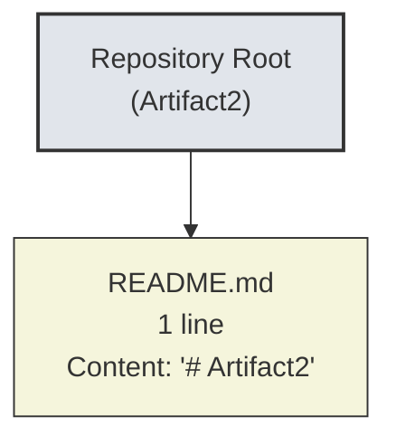

#### Business and Market Context

| Context Dimension | Repository Evidence | Determinable? |
|---|---|---|
| Industry / domain | None present | No |
| Target market segment | None present | No |
| Competitive positioning | None present | No |
| Regulatory environment | None present | No |

No business or market context can be derived from the repository. There is no documentation, no domain code, and no configuration that would reveal the intended industry, geography, customer segment, or competitive frame.

#### Existing System and Legacy Integration

The repository does not document a predecessor system, a system being replaced, or a system being upgraded. There are no integration manifests, API client configurations, or interface definitions that would indicate participation in an existing enterprise landscape.

#### Enterprise Integration Landscape

| Integration Surface | Evidence in Repository | Status |
|---|---|---|
| Inbound APIs | None | Not defined |
| Outbound API clients | None | Not defined |
| Message brokers / queues | None | Not defined |
| Databases / data stores | None | Not defined |
| Identity providers | None | Not defined |

### 1.2.2 High-Level Description

#### Primary System Capabilities

No system capabilities are implemented or specified in the repository. The repository contains no executable code, no service definitions, no user interface assets, and no workflow definitions from which capabilities could be derived.

| Capability Area | Implemented? | Documented? |
|---|---|---|
| User-facing functionality | No | No |
| Data processing | No | No |
| Integration / API surface | No | No |
| Background / scheduled work | No | No |
| Administrative / operational tooling | No | No |

#### Major System Components

The repository contains no software components. There are no modules, packages, services, libraries, microservices, frontends, backends, workers, or any other unit of deployable or reusable software.

| Component Layer | Files Present | Notes |
|---|---|---|
| Presentation / UI | 0 | No HTML, CSS, JS, or framework assets |
| Application / API | 0 | No service or controller code |
| Domain / Business logic | 0 | No domain modules |
| Data / Persistence | 0 | No schemas, ORMs, or migrations |
| Infrastructure / Platform | 0 | No IaC, Dockerfiles, or pipeline configs |

#### Core Technical Approach

No technology stack, programming language, framework, or architectural style can be identified. The only file type present is Markdown (`.md`), used for documentation rather than implementation. There are no language-specific files, dependency manifests (`package.json`, `requirements.txt`, `pyproject.toml`, `pom.xml`, `Cargo.toml`, `go.mod`, etc.), or framework indicators (configuration files, lockfiles, or build scripts) from which a technical approach could be inferred.

### 1.2.3 Success Criteria

#### Measurable Objectives

No measurable objectives are documented in the repository. The README does not list goals, acceptance criteria, or target outcomes.

#### Critical Success Factors

No critical success factors are documented in the repository.

#### Key Performance Indicators (KPIs)

| KPI Category | Defined in Repository | Source |
|---|---|---|
| Business KPIs | No | No business documentation present |
| Product / usage KPIs | No | No analytics or metrics configuration |
| Technical SLOs / SLAs | No | No service-level documentation |
| Operational KPIs | No | No runbooks, dashboards, or monitoring config |

No quantitative or qualitative success metrics are present in the repository. Because no system is implemented, no operational targets, service-level objectives, or performance budgets are observable.

## 1.3 Scope

The scope tables below reflect the empirically verified state of the repository. Items are categorized as **In-Scope** only when supported by repository evidence; all other items are listed as **Out-of-Scope** or **Not Defined**.

### 1.3.1 In-Scope Elements

#### Core Features and Functionalities

| Element | Present | Evidence |
|---|---|---|
| Project identifier (`Artifact2`) | Yes | `README.md` top-level heading |
| Single-file Markdown placeholder | Yes | `README.md` (1 line) |
| User workflows | No | No code, UI, or workflow definitions |
| Essential integrations | No | No integration manifests or clients |
| Technical requirements | No | No requirements documentation |

Concretely, the only element verifiable as in-scope of the current repository is the existence of a `README.md` file declaring the project name `Artifact2`. No functional capability is implemented or specified.

#### Implementation Boundaries

| Boundary Dimension | Defined? | Notes |
|---|---|---|
| System boundary | No | No system exists to bound |
| User groups | No | No user definitions present |
| Geographic / market coverage | No | No locale or market configuration |
| Data domains | No | No data models or schemas present |

### 1.3.2 Out-of-Scope Elements

Because the repository contains no implementation artifacts, virtually every dimension typically classified as in-scope for a software system is, for this repository, out-of-scope or undefined. The following table enumerates the categories of work or content that are explicitly **not present** in the repository and therefore out-of-scope of the current Technical Specification snapshot.

| Out-of-Scope Category | Specific Items Excluded |
|---|---|
| Application source code | All language-specific source files; no `.py`, `.js`, `.ts`, `.java`, `.go`, `.rs`, `.cpp`, `.c`, etc. |
| Dependency management | `package.json`, `requirements.txt`, `pyproject.toml`, `Cargo.toml`, `pom.xml`, `build.gradle`, `go.mod`, lockfiles |
| Runtime configuration | `.env`, `.yaml`, `.yml`, `.toml`, `.ini`, `.json` configuration files |
| Build and packaging | `Makefile`, `Dockerfile`, `docker-compose.yml`, package build scripts |
| CI/CD automation | GitHub Actions, GitLab CI, Jenkinsfile, or other pipeline definitions |
| Testing assets | Unit tests, integration tests, fixtures, test harnesses, coverage configuration |
| API contracts | OpenAPI / Swagger, GraphQL schemas, Protobuf / gRPC IDL, AsyncAPI |
| Data layer | Database schemas, migrations, seed data, ORM mappings |
| Infrastructure-as-Code | Terraform, Pulumi, CloudFormation, Helm charts, Kubernetes manifests |
| Security artifacts | Secrets management, key material, security policies |
| Governance documents | `LICENSE`, `CONTRIBUTING.md`, `CODE_OF_CONDUCT.md`, `CODEOWNERS`, `SECURITY.md` |
| Supplementary documentation | `/docs` directory, ADRs, design notes, runbooks |

#### Future Phase Considerations

No future phases, roadmap entries, or planned features are documented in the repository. Any subsequent introduction of code, dependencies, configuration, or documentation would represent a material change requiring re-evaluation of this Technical Specification's scope statement.

#### Integration Points Not Covered

Because no integrations are implemented or declared, **all** potential integration points are uncovered. This includes — but is not limited to — authentication providers, payment gateways, analytics platforms, observability backends, message brokers, and third-party APIs.

#### Unsupported Use Cases

The repository in its current state supports **no end-user or programmatic use cases**. It is observable only as a named placeholder. Any attempt to derive supported workflows, runtime behaviors, or operational scenarios from the repository would not be substantiated by the available evidence.

### 1.3.3 Documentation Approach Under Empty-Repository Conditions

Given that subsequent sections of this Technical Specification (e.g., architecture, data design, security, deployment) require substantive implementation artifacts to document meaningfully, each downstream section will be constrained by the same evidentiary limits established here. Specifically:

1. **No fabricated architecture**: No component diagrams, sequence flows, or deployment topologies will be inferred where no code or configuration exists to support them.
2. **No speculative technology stack**: No frameworks, runtimes, or platforms will be named unless their presence is verifiable in the repository.
3. **Transparency markers**: Sections lacking evidentiary support will use the explicit marker "Not defined in repository" to maintain auditability.
4. **Revisability**: This Technical Specification represents a snapshot. Once implementation artifacts are introduced, the Introduction's scope statement and downstream sections should be revised to reflect the new evidence base.

## 1.4 References

#### Files Examined

- `README.md` — Single-line Markdown file containing the heading `# Artifact2`. This file is the sole content artifact in the repository and provides the project identifier used throughout this Introduction.

#### Folders Explored

- Repository root (`/`) — Verified via directory enumeration to contain exactly one direct child (`README.md`) and zero subfolders. No deeper hierarchy exists.

#### Search Operations Performed (Negative Confirmation Evidence)

- Semantic search for "source code implementation modules" — Returned no results, confirming absence of application code.
- Semantic search for "configuration package dependencies" — Returned no results, confirming absence of dependency manifests or configuration files.
- Semantic search for "main entry point application" — Returned no results, confirming absence of executable entry points.
- Semantic search for "code graph schema JSON" — Returned only `README.md`, confirming no schema or structured-data artifacts.
- Semantic search for "README documentation artifact" — Returned only `README.md`.
- Folder search for "application source code modules" — Returned no folders.
- Folder search for "project root configuration" — Returned no folders.
- `.blitzyignore` filesystem check — No ignore rules present; all repository content was visible to the analysis.

#### Cross-Section References

- No other Technical Specification sections were retrievable for cross-reference during the authoring of this Introduction; the cross-reference index supplied for this section was empty.

# 2. Product Requirements

This section catalogues the product features, functional requirements, feature relationships, and implementation considerations of the system represented by the **Artifact2** repository. In keeping with the evidentiary methodology established in Section 1 (notably Section 1.3.3, "Documentation Approach Under Empty-Repository Conditions"), this section reflects only what can be substantiated by repository contents. Where the standard Product Requirements template requires content that the repository does not supply, the explicit marker **"Not defined in repository"** is used in lieu of speculative material.

## 2.1 EVIDENTIARY BASIS AND DOCUMENTATION APPROACH

### 2.1.1 Repository State Summary

As documented in Section 1.1.1 (Project Overview) and Section 1.2.1 (Project Context), the repository contains exactly one tracked artifact — a `README.md` file consisting of a single Markdown heading (`# Artifact2`). There are no source files, configuration files, dependency manifests, build descriptors, test assets, infrastructure definitions, schema files, API contracts, or supplementary documentation present at any level of the directory hierarchy. Consequently, no product features, no functional requirements, and no implementation artifacts exist from which the contents of this section could be derived.

### 2.1.2 Constraints Imposed by the Section Prompt

The Section 2 prompt establishes four explicit constraints that govern authorship under the present evidentiary conditions:

| Constraint | Implication for Authorship |
|---|---|
| Only include sections and items actually relevant to this system | Empty-state placeholders are used in lieu of fabricated entries |
| Don't add any features of your own | No invented `F-XXX` feature identifiers are introduced |
| Don't add any items that aren't clearly applicable | Subsections without evidence are explicitly marked rather than filled |
| Only document feature relationships clearly evident in source code | The relationship graph is reported as empty rather than imagined |

These prohibitions, combined with the absence of repository evidence, require that every subsection below be populated with verifiable status markers rather than speculative feature definitions.

### 2.1.3 Cross-References to Prior Sections

The following findings, already established and verified in Section 1, are foundational to this section and are not re-derived here:

| Prior Finding | Source Subsection | Relevance to Section 2 |
|---|---|---|
| Repository contains a single `README.md` file | 1.1.1 Project Overview | Establishes the universe of available artifacts |
| No business problem or value proposition documented | 1.1.2 Business Problem and Value Proposition | Eliminates source for "Business Value" fields |
| No stakeholders or users identified | 1.1.3 Key Stakeholders and Users | Eliminates source for "User Benefits" fields |
| No system capabilities implemented | 1.2.2 High-Level Description | Eliminates source for "Feature Overview" fields |
| No major system components present | 1.2.2 Major System Components | Eliminates source for "Shared Components" fields |
| No integrations declared | 1.2.1 Enterprise Integration Landscape | Eliminates source for "Integration Requirements" fields |
| No KPIs or success criteria defined | 1.2.3 Success Criteria | Eliminates source for "Acceptance Criteria" fields |
| Only the README placeholder is in-scope | 1.3.1 In-Scope Elements | Constrains the set of features to the empty set |
| All feature/code categories are out-of-scope | 1.3.2 Out-of-Scope Elements | Confirms the empty Feature Catalog |

## 2.2 FEATURE CATALOG

### 2.2.1 Feature Inventory

The complete inventory of features observable in the repository is enumerated in the table below. No feature identifiers have been assigned because there are no features to identify.

| Feature ID | Feature Name | Category | Status |
|---|---|---|---|
| Not defined in repository | Not defined in repository | Not defined in repository | No features present |

The Feature Catalog is empty. The repository does not implement, describe, or specify any feature. The single artifact (`README.md`) declares only the project name `Artifact2` and contains no feature listing, no roadmap, no capability description, and no functional narrative.

### 2.2.2 Feature Metadata Status

The Feature Metadata schema — comprising Unique ID, Feature Name, Category, Priority Level, and Status — cannot be populated because no features exist to which metadata could be attached.

| Metadata Element | Required by Template | Available in Repository |
|---|---|---|
| Unique ID (format `F-XXX`) | Yes | No — no subjects to assign |
| Feature Name | Yes | No — no features named |
| Feature Category | Yes | No — no taxonomy defined |
| Priority Level | Yes | No — no prioritization documented |
| Status (Proposed/Approved/etc.) | Yes | No — no lifecycle metadata present |

### 2.2.3 Feature Description Status

The Feature Description schema — comprising Overview, Business Value, User Benefits, and Technical Context — cannot be populated because no features exist to describe.

| Description Element | Required by Template | Available in Repository |
|---|---|---|
| Overview | Yes | No — no narrative content in README |
| Business Value | Yes | No — value proposition undefined (per Section 1.1.2) |
| User Benefits | Yes | No — users undefined (per Section 1.1.3) |
| Technical Context | Yes | No — technology stack undefined (per Section 1.2.2) |

### 2.2.4 Feature Dependencies Status

The Feature Dependencies schema — comprising Prerequisite Features, System Dependencies, External Dependencies, and Integration Requirements — cannot be populated because no features exist whose dependencies could be enumerated.

| Dependency Element | Required by Template | Available in Repository |
|---|---|---|
| Prerequisite Features | Yes | No — no feature graph exists |
| System Dependencies | Yes | No — no system components present |
| External Dependencies | Yes | No — no dependency manifest present |
| Integration Requirements | Yes | No — no integration surfaces (per Section 1.2.1) |

## 2.3 FUNCTIONAL REQUIREMENTS

### 2.3.1 Requirements Inventory

The complete inventory of functional requirements derivable from the repository is enumerated below. No requirement identifiers have been assigned because there are no requirements to identify.

| Requirement ID | Description | Priority | Complexity |
|---|---|---|---|
| Not defined in repository | Not defined in repository | Not defined in repository | Not defined in repository |

No functional requirements, user stories, acceptance criteria, business rules, or specification documents exist in the repository. The single-line `README.md` does not contain any normative statement of behavior, input/output contract, or expected outcome.

### 2.3.2 Requirement Detail Status

The Requirement Detail schema — comprising Requirement ID, Description, Acceptance Criteria, Priority, and Complexity — cannot be populated for any feature because no features exist and no requirements have been authored.

| Detail Element | Required by Template | Available in Repository |
|---|---|---|
| Requirement ID (format `F-XXX-RQ-YYY`) | Yes | No — no parent feature identifiers exist |
| Description | Yes | No — no requirement statements present |
| Acceptance Criteria | Yes | No — no acceptance criteria documented |
| Priority (Must/Should/Could-Have) | Yes | No — no prioritization framework applied |
| Complexity (High/Medium/Low) | Yes | No — no implementation to estimate |

### 2.3.3 Technical Specifications Status

The Technical Specifications schema — comprising Input Parameters, Output/Response, Performance Criteria, and Data Requirements — cannot be populated because no executable behavior, interface contract, or data model is present.

| Specification Element | Required by Template | Available in Repository |
|---|---|---|
| Input Parameters | Yes | No — no functions, endpoints, or interfaces present |
| Output / Response | Yes | No — no return contracts or response schemas present |
| Performance Criteria | Yes | No — no SLOs/SLAs defined (per Section 1.2.3) |
| Data Requirements | Yes | No — no data layer present (per Section 1.2.2) |

### 2.3.4 Validation Rules Status

The Validation Rules schema — comprising Business Rules, Data Validation, Security Requirements, and Compliance Requirements — cannot be populated because no business logic, data flows, security posture, or regulatory context has been declared.

| Validation Element | Required by Template | Available in Repository |
|---|---|---|
| Business Rules | Yes | No — no domain logic present |
| Data Validation | Yes | No — no schemas, validators, or models present |
| Security Requirements | Yes | No — no security artifacts (per Section 1.3.2) |
| Compliance Requirements | Yes | No — no regulatory context (per Section 1.2.1) |

## 2.4 FEATURE RELATIONSHIPS

### 2.4.1 Feature Dependency Map

A feature dependency map cannot be constructed because the Feature Catalog (Section 2.2) is empty. There are zero features and therefore zero possible directed edges in any dependency graph.

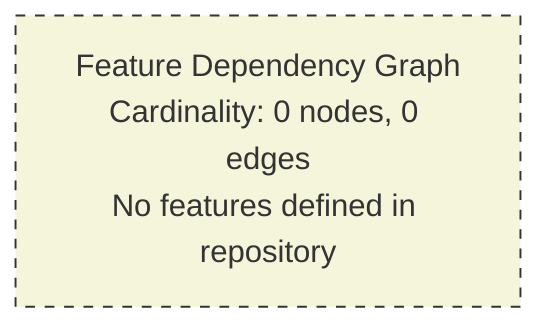

The graph above visualizes the empty state of the feature relationship space. Any subsequent introduction of features would require this section to be re-authored against the new evidence base.

### 2.4.2 Integration Points

Integration points are documented in Section 1.2.1 (Enterprise Integration Landscape), which confirms that no inbound APIs, outbound API clients, message brokers, databases, or identity providers are declared in the repository. The integration relationship table for Section 2 is therefore empty.

| Integration Point | Participating Features | Direction | Status |
|---|---|---|---|
| Not defined in repository | None | N/A | No integrations present |

### 2.4.3 Shared Components and Common Services

Shared components and common services are documented in Section 1.2.2 (Major System Components), which confirms that the repository contains zero files at every architectural layer (Presentation, Application, Domain, Data, Infrastructure). The shared-component relationship table is therefore empty.

| Shared Component | Consumers | Layer | Status |
|---|---|---|---|
| Not defined in repository | None | N/A | No components present |

## 2.5 IMPLEMENTATION CONSIDERATIONS

This subsection ordinarily captures the technical constraints, performance requirements, scalability properties, security implications, and maintenance burden of each feature. Because the Feature Catalog (Section 2.2) is empty and no implementation exists, no such considerations can be evidence-based at this time. Each subsection below records the empty state explicitly.

### 2.5.1 Technical Constraints

| Constraint Category | Evidence in Repository | Status |
|---|---|---|
| Language / Runtime constraints | None | Not defined in repository |
| Framework / Library constraints | None | Not defined in repository |
| Platform / OS constraints | None | Not defined in repository |
| Toolchain / Build constraints | None | Not defined in repository |

No technical constraints are observable because no technology stack, runtime, or toolchain is present (cross-reference: Section 1.2.2, "Core Technical Approach").

### 2.5.2 Performance Requirements

| Performance Dimension | Target Documented | Status |
|---|---|---|
| Throughput | No | Not defined in repository |
| Latency | No | Not defined in repository |
| Resource utilization | No | Not defined in repository |
| Availability / Uptime | No | Not defined in repository |

No performance requirements are documented (cross-reference: Section 1.2.3 KPIs table, which confirms absence of technical SLOs/SLAs).

### 2.5.3 Scalability Considerations

| Scalability Dimension | Strategy Documented | Status |
|---|---|---|
| Horizontal scaling | No | Not defined in repository |
| Vertical scaling | No | Not defined in repository |
| Data volume scaling | No | Not defined in repository |
| User concurrency scaling | No | Not defined in repository |

No scalability strategy is documented because no deployable units exist to scale.

### 2.5.4 Security Implications

| Security Dimension | Posture Documented | Status |
|---|---|---|
| Authentication | No | Not defined in repository |
| Authorization | No | Not defined in repository |
| Data protection / Encryption | No | Not defined in repository |
| Threat model / Compliance | No | Not defined in repository |

No security artifacts (policies, secrets management, key material, threat models, or `SECURITY.md`) are present (cross-reference: Section 1.3.2 Out-of-Scope Elements).

### 2.5.5 Maintenance Requirements

| Maintenance Dimension | Process Documented | Status |
|---|---|---|
| Versioning / Release management | No | Not defined in repository |
| Patching / Update cadence | No | Not defined in repository |
| Monitoring / Observability | No | Not defined in repository |
| Documentation upkeep | No | Not defined in repository |

No maintenance processes are documented because no system exists to maintain.

## 2.6 TRACEABILITY MATRIX

### 2.6.1 Requirement-to-Feature Traceability

The traceability matrix maps requirements to features, and features to source artifacts. With both axes of the matrix empty (zero features in Section 2.2.1, zero requirements in Section 2.3.1), the matrix collapses to a single row recording the empty state.

| Requirement ID | Feature ID | Source Artifact | Verification Status |
|---|---|---|---|
| Not defined in repository | Not defined in repository | None applicable | No items to trace |

### 2.6.2 Verification Methodology

The verification methodology employed to confirm the empty state of the Product Requirements space comprises the activities enumerated below. Each activity converged on the same finding: zero features, zero requirements, zero implementation artifacts.

| Activity | Mechanism | Outcome |
|---|---|---|
| Repository root enumeration | Directory listing | 1 file (`README.md`), 0 subfolders |
| README content inspection | File read | Single line: `# Artifact2` |
| Semantic search — features | Vector search of repository | 0 matching results |
| Semantic search — source code | Vector search of repository | 0 matching results |
| Semantic search — user stories | Vector search of repository | 0 matching results |
| Semantic search — dependencies | Vector search of repository | 0 matching results |
| Semantic search — APIs / interfaces | Vector search of repository | 0 matching results |
| Folder search — application source | Folder vector search | 0 matching folders |
| Ignore-file check | Filesystem inspection | No `.blitzyignore` present; full visibility |
| Cross-section verification | Tech spec retrieval | Sections 1.1–1.4 confirm empty state |

### 2.6.3 Negative Evidence Summary

The following queries explicitly returned zero results and collectively constitute the negative evidence supporting the empty-state declarations throughout this section.

| Query Phrase | Result Count | What This Disproves |
|---|---|---|
| "feature requirements functional specifications product capabilities" | 0 | No requirements documentation exists |
| "application source code modules implementation" | 0 | No application source code exists |
| "user stories acceptance criteria business requirements" | 0 | No user stories or acceptance criteria exist |
| "configuration package dependencies manifest" | 0 | No dependency manifests exist |
| "API endpoints service definitions interfaces" | 0 | No API or service contracts exist |
| "source code application features modules" (folder) | 0 | No code-bearing folders exist |

## 2.7 ASSUMPTIONS, CONSTRAINTS, AND REVISABILITY

### 2.7.1 Assumptions

The following assumptions underpin this section and should be considered when interpreting the empty-state findings:

| Assumption | Basis |
|---|---|
| The repository snapshot analyzed is the authoritative current state | No alternate branches, tags, or staging areas were excluded from analysis |
| No content was hidden from analysis by ignore rules | `.blitzyignore` filesystem check returned no such file (per Section 1.4) |
| The single-line `README.md` is intentional and not truncated or corrupted | File content is well-formed Markdown and contains a valid heading token |
| Future commits may introduce features and requirements | Pre-initialization repositories conventionally evolve to add content |

### 2.7.2 Constraints

The following constraints apply to this section:

| Constraint | Source |
|---|---|
| No fabricated features may be authored | Section 2 prompt: "Don't add any features of your own" |
| No imagined feature relationships may be authored | Section 2 prompt: "Don't imagine any feature relationships of your own" |
| Only repository-evident items may be included | Section 2 prompt: "Only include sections and items that are actually relevant" |
| Transparency markers must be used in lieu of speculation | Section 1.3.3 Documentation Approach |

### 2.7.3 Revisability Statement

This Section 2 represents a **point-in-time snapshot** of the Product Requirements space, derived from the empirical state of the repository at the moment of analysis. The introduction of any of the following artifacts in subsequent commits would constitute a material change requiring this section to be re-authored against the new evidence base:

| Triggering Artifact | Required Section 2 Update |
|---|---|
| Source code files (`.py`, `.js`, `.ts`, `.java`, etc.) | Populate Feature Catalog from observable capabilities |
| Requirements documents (e.g., `/docs/requirements/`) | Populate Functional Requirements from authored specifications |
| User stories / issue tracker exports | Populate Feature Metadata and Description sections |
| API contracts (OpenAPI, GraphQL SDL, Protobuf IDL) | Populate Integration Points and Technical Specifications |
| Dependency manifests (`package.json`, `pyproject.toml`, etc.) | Populate External Dependencies fields |
| Test assets (unit, integration, acceptance tests) | Populate Acceptance Criteria fields via test-to-requirement traceability |
| Roadmap / `CHANGELOG.md` | Populate Status and Priority fields |

Until such artifacts are introduced, this section remains in its current empty-state form, with all subsections marked **"Not defined in repository"**.

## 2.8 REFERENCES

### 2.8.1 Files Examined

- `README.md` — The single tracked artifact in the repository, containing exactly one line of Markdown (`# Artifact2`). Inspected for any feature listing, roadmap, capability description, or requirement statement; none were found.

### 2.8.2 Folders Explored

- Repository root (`/`) — Enumerated to confirm exactly one direct child (`README.md`) and zero subfolders. No descent into subfolders was possible because no subfolders exist.

### 2.8.3 Cross-Referenced Technical Specification Sections

- **Section 1.1 Executive Summary** — Sourced confirmation that the repository is in pre-initialization state, that no business problem or value proposition is documented, and that no stakeholders or users are identified.
- **Section 1.2 System Overview** — Sourced the authoritative capability table (zero implemented capabilities across all five architectural layers), the empty Enterprise Integration Landscape table, and the absence of KPIs/SLOs.
- **Section 1.3 Scope** — Sourced the In-Scope Elements table (which lists only the `README.md` placeholder as in-scope), the comprehensive Out-of-Scope Elements table, and the Documentation Approach Under Empty-Repository Conditions (Section 1.3.3) that establishes the use of "Not defined in repository" markers and the revisability principle.
- **Section 1.4 References** — Sourced the catalogue of prior semantic searches and the `.blitzyignore` filesystem-check result, both of which support the negative-evidence summary in Section 2.6.3.

### 2.8.4 Search Operations Performed for Section 2

The following search operations were performed specifically to verify the absence of product requirements artifacts. All returned zero results, providing convergent negative evidence.

- Semantic search: "feature requirements functional specifications product capabilities" — 0 results.
- Semantic search: "application source code modules implementation" — 0 results.
- Semantic search: "user stories acceptance criteria business requirements" — 0 results.
- Semantic search: "configuration package dependencies manifest" — 0 results.
- Semantic search: "API endpoints service definitions interfaces" — 0 results.
- Folder search: "source code application features modules" — 0 folders.
- Filesystem check: `find / -name ".blitzyignore"` — No ignore file present; full repository visibility confirmed.

# 3. Technology Stack

This section documents the technology stack of the **Artifact2** repository. Authorship of this section is bounded by the same evidentiary methodology established in Section 1 (notably Section 1.3.3, "Documentation Approach Under Empty-Repository Conditions") and reinforced throughout Section 2 (notably Section 2.5.1, "Technical Constraints," which already records all four constraint categories — Language/Runtime, Framework/Library, Platform/OS, and Toolchain/Build — as "Not defined in repository"). Because the repository contains no implementation artifacts beyond a single-line `README.md` placeholder, every category of the technology stack ordinarily characterized in this section is empty, and the explicit marker **"Not defined in repository"** is used in lieu of speculative material.

## 3.1 EVIDENTIARY POSTURE AND DOCUMENTATION APPROACH

### 3.1.1 Constraint Inheritance from Prior Sections

The authorship of this Technology Stack section inherits four binding principles from Section 1.3.3, "Documentation Approach Under Empty-Repository Conditions." These principles directly govern which technologies may be named in this section:

| Inherited Principle | Source | Effect on Section 3 |
|---|---|---|
| No fabricated architecture | Section 1.3.3, Principle 1 | No platform, runtime, or deployment topology is named without verifiable evidence |
| No speculative technology stack | Section 1.3.3, Principle 2 | No framework, runtime, or platform is named unless its presence is verifiable in the repository |
| Transparency markers | Section 1.3.3, Principle 3 | All empty categories use the explicit marker "Not defined in repository" |
| Revisability | Section 1.3.3, Principle 4 | This section is a point-in-time snapshot subject to revision when implementation artifacts are introduced |

Additionally, Section 1.2.2 ("Core Technical Approach") explicitly establishes that "no technology stack, programming language, framework, or architectural style can be identified" in the repository. Section 2.5.1 already records all four technical-constraint categories as "Not defined in repository." This section reaffirms and elaborates those findings across the six technology subdomains required by the Technology Stack template.

### 3.1.2 Inapplicability of the Default Technology Stack

A Default Technology Stack — comprising AWS, Docker, Terraform, GitHub Actions, Python, Flask, Auth0, MongoDB, LangChain, React with TypeScript, TailwindCSS, React Native, Swift, Kotlin, Objective-C, and ElectronJS — was supplied as a hypothetical reference framework. **This Default Technology Stack cannot be applied to the present repository** for the reasons enumerated below.

| Reason | Source |
|---|---|
| None of the default technologies have any evidence in the repository | Direct file enumeration; only `README.md` is present |
| The Section 3 authorship prompt itself directs: "Don't add any items that aren't clearly applicable" | Section 3 prompt boundary condition |
| Section 1.3.3 explicitly prohibits naming "frameworks, runtimes, or platforms... unless their presence is verifiable in the repository" | Section 1.3.3, Principle 2 |
| Section 2.5.1 already documents the absence of all language, framework, platform, and toolchain constraints | Section 2.5.1 Technical Constraints table |

The Default Technology Stack is therefore referenced only to explicitly disqualify it from the documented stack of this system. Any future commits introducing implementation artifacts would require this section to be re-authored against the new evidence base, at which point the Default Technology Stack may or may not be relevant depending on what is actually committed.

### 3.1.3 Empty-State Technology Stack Visualization

The figure below visualizes the empty state of the technology stack space, in the same convention used by Section 2.4.1 for the empty Feature Dependency Graph.

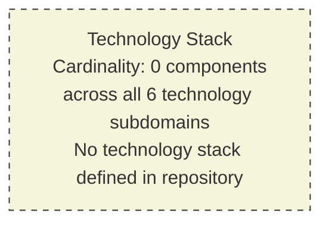

The six technology subdomains referenced — Programming Languages, Frameworks and Libraries, Open Source Dependencies, Third-Party Services, Databases and Storage, and Development and Deployment — are each documented individually in the subsections that follow.

## 3.2 PROGRAMMING LANGUAGES

### 3.2.1 Languages Observable in the Repository

The repository contains no programming-language source files. The only file extension present is `.md` (Markdown), used solely for documentation rather than implementation. Markdown is not a programming language and does not constitute a runtime, compile-time, or interpreted language target.

| Platform / Component | Language Identified | Version | Status |
|---|---|---|---|
| Backend service | None | N/A | Not defined in repository |
| Frontend application | None | N/A | Not defined in repository |
| Mobile / cross-platform | None | N/A | Not defined in repository |
| Native iOS | None | N/A | Not defined in repository |
| Native Android | None | N/A | Not defined in repository |
| Native macOS | None | N/A | Not defined in repository |
| Desktop application | None | N/A | Not defined in repository |
| Infrastructure scripting | None | N/A | Not defined in repository |
| Build / automation scripting | None | N/A | Not defined in repository |

### 3.2.2 Language-Specific Source File Indicators Searched

The following file-extension indicators were searched across the repository and confirmed absent. The list is presented to demonstrate the breadth of the negative-evidence collection and to make the absence auditable.

| Language Family | Representative Extensions Searched | Found |
|---|---|---|
| Python | `.py`, `.pyi`, `.pyx` | None |
| JavaScript / TypeScript | `.js`, `.mjs`, `.cjs`, `.ts`, `.tsx`, `.jsx` | None |
| Java / JVM | `.java`, `.kt`, `.scala`, `.groovy` | None |
| C-family | `.c`, `.h`, `.cpp`, `.hpp`, `.cc`, `.cs` | None |
| Systems | `.go`, `.rs` | None |
| Apple platforms | `.swift`, `.m`, `.mm` | None |
| Dynamic languages | `.rb`, `.php`, `.pl` | None |
| Mobile / cross-platform | `.dart` | None |
| Markup / Configuration | `.html`, `.css`, `.scss`, `.yaml`, `.yml`, `.toml`, `.ini`, `.json` | None |

Only `.md` extensions appear in the repository (specifically, `README.md`). This is consistent with the finding documented in Section 1.2.2 that "the only file type present is Markdown (`.md`), used for documentation rather than implementation."

### 3.2.3 Selection Criteria, Constraints, and Dependencies

Because no programming language is present, no selection criteria, constraints, or language-version dependencies are documentable. The following template fields, ordinarily populated for a software system, are explicitly empty.

| Criterion | Documented in Repository | Status |
|---|---|---|
| Selection rationale | No | Not defined in repository |
| Version pinning policy | No | Not defined in repository |
| Compiler / interpreter constraints | No | Not defined in repository |
| Cross-language interop dependencies | No | Not defined in repository |
| End-of-life / support window considerations | No | Not defined in repository |

## 3.3 FRAMEWORKS AND LIBRARIES

### 3.3.1 Core Frameworks Observable in the Repository

The repository declares no application frameworks. There are no framework configuration files (e.g., `next.config.js`, `angular.json`, `nuxt.config.js`, `vite.config.ts`, `webpack.config.js`, `astro.config.mjs`, `remix.config.js`), no framework-specific directory conventions (e.g., `pages/`, `app/`, `src/`, `components/`, `views/`, `controllers/`), and no framework lock or descriptor files.

| Framework Category | Framework Name | Version | Status |
|---|---|---|---|
| Backend web framework | None | N/A | Not defined in repository |
| Frontend web framework | None | N/A | Not defined in repository |
| Mobile / cross-platform framework | None | N/A | Not defined in repository |
| CSS / styling framework | None | N/A | Not defined in repository |
| ORM / data access framework | None | N/A | Not defined in repository |
| Testing framework | None | N/A | Not defined in repository |
| AI / ML framework | None | N/A | Not defined in repository |

### 3.3.2 Supporting Libraries

Because the repository declares no programming language and no dependency manifest, no supporting libraries can be enumerated. The supporting-library table below records the empty state.

| Library Category | Library Name | Version | Purpose | Status |
|---|---|---|---|---|
| Utility libraries | None | N/A | N/A | Not defined in repository |
| HTTP clients | None | N/A | N/A | Not defined in repository |
| Logging / observability | None | N/A | N/A | Not defined in repository |
| Serialization / validation | None | N/A | N/A | Not defined in repository |
| Cryptography / security | None | N/A | N/A | Not defined in repository |

### 3.3.3 Compatibility Requirements and Justification

No compatibility requirements (e.g., minimum framework versions, peer-dependency matrices, language-runtime version compatibility tables) are documented in the repository. No justification for any framework selection can be authored because no framework selection is observable. This entire subsection of the Technology Stack template is, accordingly, empty.

## 3.4 OPEN SOURCE DEPENDENCIES

### 3.4.1 Declared Open-Source Libraries

The repository declares no open-source dependencies. No dependency manifest of any kind is present in the repository, as confirmed by direct filesystem enumeration and by the Out-of-Scope Elements table in Section 1.3.2.

| Dependency | Version | Registry / Source | Direct or Transitive | Status |
|---|---|---|---|---|
| Not defined in repository | N/A | N/A | N/A | No dependencies declared |

### 3.4.2 Package Manifests and Lockfiles Searched

The following dependency-management files were explicitly searched for and confirmed absent. This list is consistent with the Out-of-Scope Elements table in Section 1.3.2, which records dependency management as fully out-of-scope for the current repository state.

| Ecosystem | Manifest Files Searched | Lockfile Files Searched | Found |
|---|---|---|---|
| Node.js / JavaScript | `package.json` | `package-lock.json`, `yarn.lock`, `pnpm-lock.yaml` | None |
| Python | `requirements.txt`, `requirements-dev.txt`, `pyproject.toml`, `Pipfile`, `setup.py`, `setup.cfg` | `Pipfile.lock`, `poetry.lock` | None |
| Rust | `Cargo.toml` | `Cargo.lock` | None |
| Java / JVM | `pom.xml`, `build.gradle`, `build.gradle.kts`, `settings.gradle` | `gradle.lockfile` | None |
| Go | `go.mod` | `go.sum` | None |
| Ruby | `Gemfile`, `*.gemspec` | `Gemfile.lock` | None |
| PHP | `composer.json` | `composer.lock` | None |
| Elixir | `mix.exs` | `mix.lock` | None |
| Dart / Flutter | `pubspec.yaml` | `pubspec.lock` | None |
| .NET | `*.csproj`, `*.sln`, `packages.config` | `packages.lock.json` | None |
| Swift | `Package.swift`, `Podfile`, `Cartfile` | `Package.resolved`, `Podfile.lock` | None |

### 3.4.3 Package Registries

Because no dependency manifests are present, no package registries are configured. Public registries (e.g., npm, PyPI, Maven Central, crates.io, NuGet, Packagist, Hex.pm, pub.dev), private registry mirrors, and self-hosted artifact repositories are all uninvolved in the current repository state.

| Registry | Configured? | Status |
|---|---|---|
| Public package registries | No | Not defined in repository |
| Private / mirrored registries | No | Not defined in repository |
| Internal artifact repositories | No | Not defined in repository |

## 3.5 THIRD-PARTY SERVICES

### 3.5.1 External APIs and Integrations

The repository declares no integrations with external services. This finding is consistent with the Enterprise Integration Landscape table in Section 1.2.1, which records no inbound APIs, outbound API clients, message brokers, databases, or identity providers, and with Section 2.4.2, which confirms that "no inbound APIs, outbound API clients, message brokers, databases, or identity providers are declared in the repository."

| Integration Category | Service | Endpoint / URL | Authentication Method | Status |
|---|---|---|---|---|
| Payment processing | None | N/A | N/A | Not defined in repository |
| Email / messaging | None | N/A | N/A | Not defined in repository |
| Analytics / telemetry | None | N/A | N/A | Not defined in repository |
| Geolocation / mapping | None | N/A | N/A | Not defined in repository |
| File / document services | None | N/A | N/A | Not defined in repository |
| AI / ML / LLM APIs | None | N/A | N/A | Not defined in repository |
| Search / indexing | None | N/A | N/A | Not defined in repository |

### 3.5.2 Authentication, Monitoring, and Cloud Services

No authentication providers, observability backends, or cloud-platform services are configured in the repository. This finding is consistent with Section 2.5.4, which records all four security postures (Authentication, Authorization, Data Protection, Threat Model) as "Not defined in repository," and Section 2.5.5, which records Monitoring/Observability as "Not defined in repository."

| Service Category | Service Name | Version / Tier | Purpose | Status |
|---|---|---|---|---|
| Identity provider | None | N/A | N/A | Not defined in repository |
| SSO / federation | None | N/A | N/A | Not defined in repository |
| APM / tracing | None | N/A | N/A | Not defined in repository |
| Logging / log aggregation | None | N/A | N/A | Not defined in repository |
| Error tracking | None | N/A | N/A | Not defined in repository |
| Cloud compute | None | N/A | N/A | Not defined in repository |
| Cloud storage | None | N/A | N/A | Not defined in repository |
| Cloud networking | None | N/A | N/A | Not defined in repository |
| Secrets management | None | N/A | N/A | Not defined in repository |

### 3.5.3 Service Configuration Indicators Searched

The following configuration-file conventions, which would ordinarily indicate the presence of third-party-service integrations, were searched and confirmed absent.

| Indicator | Typical Purpose | Found |
|---|---|---|
| `.env`, `.env.example`, `.env.local` | Environment variables for service credentials | None |
| `config/`, `conf/` directories | Service connection configuration | None |
| SDK initialization files | Cloud SDK bootstrap | None |
| API client wrapper modules | Outbound integration code | None |
| Webhook handler modules | Inbound integration code | None |
| OpenAPI / Swagger documents | API contract specifications | None |
| Service registry / discovery configuration | Service mesh metadata | None |

## 3.6 DATABASES AND STORAGE

### 3.6.1 Primary and Secondary Databases

The repository declares no databases. This finding is consistent with the Enterprise Integration Landscape table in Section 1.2.1 (Databases / data stores — "Not defined") and with the Major System Components table in Section 1.2.2, which records zero files in the Data / Persistence layer.

| Database Tier | Database Type | Product / Vendor | Version | Status |
|---|---|---|---|---|
| Primary operational store | None | N/A | N/A | Not defined in repository |
| Secondary / analytical store | None | N/A | N/A | Not defined in repository |
| Time-series / metrics store | None | N/A | N/A | Not defined in repository |
| Document / NoSQL store | None | N/A | N/A | Not defined in repository |
| Graph store | None | N/A | N/A | Not defined in repository |
| Search index | None | N/A | N/A | Not defined in repository |

### 3.6.2 Caching Solutions and Storage Services

No caching layer or object-storage service is configured in the repository. Caching products (e.g., Redis, Memcached, in-process caches, CDN edge caches) and storage services (e.g., S3, Azure Blob, GCS, file-system-backed storage) are all absent.

| Solution Category | Product | Version | Purpose | Status |
|---|---|---|---|---|
| In-memory cache | None | N/A | N/A | Not defined in repository |
| Distributed cache | None | N/A | N/A | Not defined in repository |
| Object / blob storage | None | N/A | N/A | Not defined in repository |
| File / NAS storage | None | N/A | N/A | Not defined in repository |
| CDN | None | N/A | N/A | Not defined in repository |
| Message / event store | None | N/A | N/A | Not defined in repository |

### 3.6.3 Persistence Configuration Indicators Searched

The following persistence-related indicators were searched and confirmed absent. The list is presented to make the absence auditable in the same convention as Section 2.6.3.

| Indicator | Typical Purpose | Found |
|---|---|---|
| Database connection strings | Runtime connection configuration | None |
| Schema definition files | DDL / migrations | None |
| `migrations/`, `db/migrate/` directories | Schema evolution scripts | None |
| `alembic.ini`, `prisma/schema.prisma`, `knexfile.js`, `sequelize.config.js`, `typeorm.config.ts` | ORM configuration files | None |
| Seed data files | Reference data bootstrap | None |
| Backup / restore scripts | Operational data management | None |
| Caching configuration | Cache cluster bootstrap | None |
| Storage bucket policies | Object storage governance | None |

## 3.7 DEVELOPMENT AND DEPLOYMENT

### 3.7.1 Development Tooling and Build System

No development tooling or build system is declared in the repository. The Out-of-Scope Elements table in Section 1.3.2 explicitly enumerates the categories that are absent: Build and packaging (`Makefile`, `Dockerfile`, `docker-compose.yml`, package build scripts), CI/CD automation, Testing assets, and Runtime configuration files.

| Tooling Category | Tool / File | Purpose | Status |
|---|---|---|---|
| Linters / formatters | None | Code quality enforcement | Not defined in repository |
| Type checkers | None | Static type analysis | Not defined in repository |
| Pre-commit hooks | None | Local validation | Not defined in repository |
| IDE / editor configuration | None | Developer environment | Not defined in repository |
| Package build scripts | None | Artifact production | Not defined in repository |
| Task runners | None | Workflow automation | Not defined in repository |

The specific configuration files searched and confirmed absent include `.editorconfig`, `.prettierrc`, `.eslintrc`, `.eslintrc.json`, `.eslintrc.js`, `tslint.json`, `pyproject.toml` (with `[tool.black]` or `[tool.ruff]` sections), `.flake8`, `mypy.ini`, `.golangci.yml`, `rustfmt.toml`, `clippy.toml`, `Makefile`, `Taskfile.yml`, `justfile`, `.vscode/`, and `.idea/`.

### 3.7.2 Containerization and Infrastructure as Code

No containerization or Infrastructure-as-Code (IaC) artifacts are present. Section 1.3.2 explicitly lists these categories as out-of-scope for the current repository state.

| Artifact Category | File / Tool | Purpose | Status |
|---|---|---|---|
| Container build descriptor | `Dockerfile` | Image build instructions | Not defined in repository |
| Container ignore rules | `.dockerignore` | Build context exclusions | Not defined in repository |
| Local orchestration | `docker-compose.yml` | Multi-container local stack | Not defined in repository |
| Terraform configuration | `*.tf`, `*.tfvars` | Declarative cloud infrastructure | Not defined in repository |
| Pulumi configuration | `Pulumi.yaml`, `Pulumi.*.yaml` | Programmatic IaC | Not defined in repository |
| CloudFormation templates | `*.template`, `*.cfn.yaml` | AWS-native IaC | Not defined in repository |
| Helm charts | `Chart.yaml`, `values.yaml` | Kubernetes packaging | Not defined in repository |
| Kubernetes manifests | `*.yaml` (with `kind:` field) | Kubernetes resource declaration | Not defined in repository |
| Ansible / Chef / Puppet | Playbooks, recipes, manifests | Configuration management | Not defined in repository |

### 3.7.3 CI/CD Pipelines

No continuous integration or continuous deployment pipelines are declared in the repository. The pipeline-descriptor file conventions for all major CI/CD platforms were searched and confirmed absent.

| Platform | Descriptor Path / Filename | Found |
|---|---|---|
| GitHub Actions | `.github/workflows/*.yml` | None |
| GitLab CI | `.gitlab-ci.yml` | None |
| Jenkins | `Jenkinsfile` | None |
| Azure Pipelines | `azure-pipelines.yml`, `.azure-pipelines/` | None |
| Bitbucket Pipelines | `bitbucket-pipelines.yml` | None |
| CircleCI | `.circleci/config.yml` | None |
| Travis CI | `.travis.yml` | None |
| Buildkite | `.buildkite/` | None |
| Drone CI | `.drone.yml` | None |
| Concourse | `pipeline.yml`, `ci/` | None |

Consequently, no CI/CD requirements (e.g., branch protection rules, required status checks, deployment gates, environment promotion strategies) can be documented from repository evidence.

## 3.8 NEGATIVE EVIDENCE AGGREGATION

### 3.8.1 Convergent Search Findings

In keeping with the convergent negative-evidence methodology used in Section 2.6.3, the table below aggregates the search operations performed specifically to verify the absence of technology-stack artifacts. All operations returned zero results.

| Query Phrase | Result Count | What This Disproves |
|---|---|---|
| "package manifest dependency declaration files" | 0 | No dependency manifests exist |
| "Dockerfile container build configuration" | 0 | No containerization artifacts exist |
| "source code application implementation modules" | 0 | No application source code exists |
| "README markdown documentation" | 0 additional | Only `README.md` is present |
| "hidden configuration environment variables" | 0 | No `.env` or hidden config files exist |
| "Python Flask backend service API" | 0 | No Python backend stack is present |
| "React TypeScript frontend application" | 0 | No React/TypeScript frontend stack is present |
| "GitHub Actions CI pipeline workflow" | 0 | No GitHub Actions pipelines are present |
| Folder search: "source code or configuration folders" | 0 folders | No code-bearing or config-bearing folders exist |
| Filesystem check: `find / -name ".blitzyignore"` | No file found | Full repository visibility was confirmed |

### 3.8.2 Manifest, Lockfile, and Configuration Inventory

The following table aggregates the manifest, lockfile, and configuration files explicitly searched across this section's six subdomains. It is presented as a single auditable inventory so that future readers can verify the breadth of the absence finding.

| File Category | Examples Searched | Found |
|---|---|---|
| Dependency manifests | `package.json`, `requirements.txt`, `pyproject.toml`, `Pipfile`, `Cargo.toml`, `pom.xml`, `build.gradle`, `go.mod`, `Gemfile`, `composer.json`, `mix.exs`, `pubspec.yaml`, `Package.swift`, `Podfile`, `*.csproj` | None |
| Dependency lockfiles | `package-lock.json`, `yarn.lock`, `pnpm-lock.yaml`, `Pipfile.lock`, `poetry.lock`, `Cargo.lock`, `gradle.lockfile`, `go.sum`, `Gemfile.lock`, `composer.lock`, `mix.lock`, `pubspec.lock`, `Podfile.lock`, `Package.resolved` | None |
| Framework configuration | `next.config.js`, `nuxt.config.js`, `angular.json`, `vite.config.ts`, `webpack.config.js`, `astro.config.mjs`, `remix.config.js` | None |
| ORM / data configuration | `alembic.ini`, `prisma/schema.prisma`, `knexfile.js`, `sequelize.config.js`, `typeorm.config.ts` | None |
| Container / build descriptors | `Dockerfile`, `.dockerignore`, `docker-compose.yml`, `Makefile`, `Taskfile.yml`, `justfile` | None |
| IaC descriptors | `*.tf`, `*.tfvars`, `Pulumi.yaml`, `*.cfn.yaml`, `Chart.yaml`, `values.yaml`, Kubernetes manifests | None |
| CI/CD descriptors | `.github/workflows/`, `.gitlab-ci.yml`, `Jenkinsfile`, `azure-pipelines.yml`, `bitbucket-pipelines.yml`, `.circleci/config.yml`, `.travis.yml`, `.buildkite/`, `.drone.yml` | None |
| Linting / formatting | `.editorconfig`, `.prettierrc`, `.eslintrc*`, `.flake8`, `mypy.ini`, `.golangci.yml`, `rustfmt.toml` | None |
| IDE / workspace | `.vscode/`, `.idea/` | None |
| Runtime configuration | `.env*`, `*.yaml`, `*.yml`, `*.toml`, `*.ini`, `*.json` (other than dependency manifests above) | None |

## 3.9 ASSUMPTIONS, CONSTRAINTS, AND REVISABILITY

### 3.9.1 Assumptions

Authorship of this section rests on the same assumptions documented in Section 2.7.1 and reproduced here for local convenience.

| Assumption | Basis |
|---|---|
| The repository snapshot analyzed is the authoritative current state | No alternate branches, tags, or staging areas were excluded from analysis |
| No content was hidden from analysis by ignore rules | `.blitzyignore` filesystem check returned no such file (per Section 1.4) |
| The single-line `README.md` is intentional and not truncated or corrupted | File content is well-formed Markdown and contains a valid heading token |
| Future commits may introduce technology-stack artifacts | Pre-initialization repositories conventionally evolve to add content |

### 3.9.2 Constraints

The following constraints govern this section's authorship and the validity of its findings.

| Constraint | Source |
|---|---|
| No speculative technology stack may be authored | Section 1.3.3, Principle 2 |
| No fabricated platform or runtime may be named | Section 1.3.3, Principle 1 |
| Only repository-evident items may be included | Section 3 prompt: "Don't add any items that aren't clearly applicable" |
| The provided Default Technology Stack cannot override repository evidence | Section 3 prompt boundary condition combined with Section 1.3.3, Principle 2 |
| Transparency markers must be used in lieu of speculation | Section 1.3.3, Principle 3 |

### 3.9.3 Revisability Statement

This Technology Stack section represents a **point-in-time snapshot** of the repository's technology profile as of analysis. In keeping with the revisability principle articulated in Section 1.3.3, Principle 4 and exercised in Section 2.7.3, the introduction of any of the following triggering artifacts would constitute a material change requiring this section to be re-authored against the new evidence base.

| Triggering Artifact | Required Section 3 Update |
|---|---|
| Programming-language source files (`.py`, `.js`, `.ts`, `.java`, `.go`, `.rs`, `.swift`, `.kt`, etc.) | Populate Section 3.2 (Programming Languages) with observed languages, versions, and per-platform assignments |
| Dependency manifest files (`package.json`, `pyproject.toml`, `Cargo.toml`, `pom.xml`, `go.mod`, etc.) | Populate Section 3.3 (Frameworks and Libraries) and Section 3.4 (Open Source Dependencies) with declared dependencies and resolved versions |
| Lockfile artifacts (`package-lock.json`, `poetry.lock`, `Cargo.lock`, `go.sum`, etc.) | Populate Section 3.4 with transitive-dependency closures |
| API client modules, SDK initialization code, or `.env`-style credential templates | Populate Section 3.5 (Third-Party Services) with identified integrations |
| Database connection configuration, ORM mappings, or migration scripts | Populate Section 3.6 (Databases and Storage) with the persistence stack |
| `Dockerfile`, `docker-compose.yml`, or Kubernetes manifests | Populate Section 3.7.2 (Containerization and IaC) |
| CI/CD descriptor files (`.github/workflows/`, `.gitlab-ci.yml`, `Jenkinsfile`, etc.) | Populate Section 3.7.3 (CI/CD Pipelines) |
| IaC files (`*.tf`, `Pulumi.yaml`, CloudFormation templates) | Populate Section 3.7.2 with deployment topology |
| Linting / formatting / build configuration | Populate Section 3.7.1 (Development Tooling and Build System) |

Until such artifacts are introduced, this section remains in its current empty-state form, with all subsections marked **"Not defined in repository"** and the Default Technology Stack explicitly disqualified from documentation in accordance with Section 1.3.3 and the Section 3 authorship prompt.

## 3.10 REFERENCES

### 3.10.1 Files Examined

- `README.md` — The single tracked artifact in the repository, containing exactly one line of Markdown (`# Artifact2`). Inspected for any technology-stack indicators (language declarations, framework mentions, build instructions, deployment notes, dependency lists); none were found.

### 3.10.2 Folders Explored

- Repository root (`/`) — Enumerated to confirm exactly one direct child (`README.md`) and zero subfolders. Specifically searched for the presence of `src/`, `app/`, `lib/`, `bin/`, `cmd/`, `pkg/`, `internal/`, `vendor/`, `node_modules/`, `.venv/`, `target/`, `dist/`, `build/`, `out/`, `public/`, `static/`, `config/`, `conf/`, `infra/`, `terraform/`, `k8s/`, `kubernetes/`, `helm/`, `charts/`, `.github/`, `.circleci/`, `.gitlab/`, `ci/`, `docs/`, `scripts/`, `tools/`, and `test/` (and common variants). None were present.

### 3.10.3 Cross-Referenced Technical Specification Sections

- **Section 1.1 Executive Summary** — Sourced the authoritative declaration that the repository is in pre-initialization state, with `README.md` as the sole artifact and no business problem, value proposition, stakeholders, or users documented.
- **Section 1.2 System Overview** — Sourced the Enterprise Integration Landscape table (no inbound APIs, outbound API clients, message brokers, databases, or identity providers), the Major System Components table (zero files at every architectural layer), and the Core Technical Approach statement that "no technology stack, programming language, framework, or architectural style can be identified."
- **Section 1.3 Scope** — Sourced the Out-of-Scope Elements table that explicitly enumerates the absent categories (application source code, dependency management, runtime configuration, build and packaging, CI/CD automation, testing assets, API contracts, data layer, Infrastructure-as-Code, security artifacts, governance documents, supplementary documentation), and the four-principle Documentation Approach Under Empty-Repository Conditions (Section 1.3.3) that directly governs this section.
- **Section 1.4 References** — Sourced the catalogue of prior semantic searches (all zero-result) and the `.blitzyignore` filesystem-check finding that confirms full repository visibility.
- **Section 2.1 Evidentiary Basis and Documentation Approach** — Sourced the explicit constraints regarding the prohibition of fabricated content.
- **Section 2.2 Feature Catalog** — Confirmed the empty feature inventory which entails absent technology dependencies.
- **Section 2.4 Feature Relationships** — Sourced the empty Integration Points table and the convention for visualizing empty states with the dashed-border, beige-fill Mermaid node used in Section 3.1.3.
- **Section 2.5 Implementation Considerations** — Directly relevant: Section 2.5.1 already records all four technical-constraint categories (Language/Runtime, Framework/Library, Platform/OS, Toolchain/Build) as "Not defined in repository"; Section 2.5.4 records all four security postures as "Not defined in repository"; Section 2.5.5 records Monitoring/Observability as "Not defined in repository."
- **Section 2.6 Traceability Matrix** — Sourced the convergent negative-evidence methodology and the table-format pattern reused in Section 3.8.1.
- **Section 2.7 Assumptions, Constraints, and Revisability** — Sourced the assumption set, constraint enumeration, and triggering-artifact table format reused in Sections 3.9.1, 3.9.2, and 3.9.3.
- **Section 2.8 References** — Sourced the references-format pattern reused in this Section 3.10.

### 3.10.4 Search Operations Performed for Section 3

The following search operations were performed specifically to verify the absence of technology-stack artifacts across the six subdomains documented above. All returned zero results, providing convergent negative evidence in the manner established in Section 2.6.3.

- Semantic search: "package manifest dependency declaration files" — 0 results.
- Semantic search: "Dockerfile container build configuration" — 0 results.
- Semantic search: "source code application implementation modules" — 0 results.
- Semantic search: "README markdown documentation" — 0 additional results beyond the single `README.md`.
- Semantic search: "hidden configuration environment variables" — 0 results.
- Semantic search: "Python Flask backend service API" — 0 results.
- Semantic search: "React TypeScript frontend application" — 0 results.
- Semantic search: "GitHub Actions CI pipeline workflow" — 0 results.
- Folder search: "source code or configuration folders" — 0 folders.
- Filesystem check: `find / -name ".blitzyignore"` — No ignore file present; full repository visibility confirmed.

#### Total Coverage Summary

| Coverage Dimension | Value |
|---|---|
| Files in repository | 1 (`README.md`) |
| Files retrieved | 1 (100% coverage) |
| Folders in repository | 1 (root) |
| Folders explored | 1 (100% coverage) |
| Technology-stack evidence found | 0 across all six subdomains |
| Confidence level | Maximum — comprehensive negative evidence from multiple convergent search methods |

No external web searches were performed for this section, because the empty-repository constraint and the evidentiary methodology established in Section 1.3.3 prohibit naming externally sourced technologies that lack repository evidence.

# 4. Process Flowchart

This section documents the process workflows, integration sequences, state transitions, and error-handling flows of the `Artifact2` system. In accordance with the evidentiary discipline established in Section 1.3.3 ("Documentation Approach Under Empty-Repository Conditions") and reinforced in Sections 2.1, 2.7, 3.1, and 3.9, every claim in this section is grounded in repository evidence. Where no evidence exists, the explicit marker **"Not defined in repository"** is used.

The findings of the preceding sections converge on a single, well-documented empirical state: the repository under analysis (`Artifact2`) contains exactly one file — a single-line `README.md` whose sole content is the Markdown heading `# Artifact2`. There is no executable code, no service definition, no API contract, no data schema, no configuration file, no infrastructure descriptor, and no documented business logic from which any process flow could be authentically derived. Consequently, **Section 4 documents an empty workflow space** and applies the same convergent negative-evidence convention exercised in Sections 2.6.3 and 3.8.1.

## 4.1 Evidentiary Basis for an Empty-State Process Flowchart

### 4.1.1 Inherited Authorship Constraints

The four binding principles of Section 1.3.3 govern Section 4 directly. These principles foreclose the authoring of speculative process flows, integration sequences, state machines, or error-handling paths in the absence of repository evidence.

| Inherited Principle | Source | Effect on Section 4 |
|---|---|---|
| No fabricated architecture | Section 1.3.3, Principle 1 | No component diagrams, sequence flows, or deployment topologies may be inferred where no code/configuration exists |
| No speculative technology stack | Section 1.3.3, Principle 2 | No workflow patterns may be derived from technologies that are not present |
| Transparency markers | Section 1.3.3, Principle 3 | All empty categories use the explicit marker "Not defined in repository" |
| Revisability | Section 1.3.3, Principle 4 | This section is a point-in-time snapshot subject to revision when implementation artifacts are introduced |

### 4.1.2 Convergent Findings from Prior Sections

The empty-state finding for Section 4 is not the result of a local search; it is the cumulative conclusion of every prior section's empirical analysis. The table below summarizes the convergent prior findings that directly disqualify the construction of process flowcharts.

| Prior Section | Empirical Finding | Implication for Section 4 |
|---|---|---|
| Section 1.2.1, "Repository State and Structure" | Repository root contains 1 file (`README.md`) and 0 subfolders | No workflow-bearing artifacts exist |
| Section 1.2.1, "Enterprise Integration Landscape" | All 5 integration surfaces (Inbound APIs, Outbound API clients, Message brokers, Databases, Identity providers) "Not defined" | No integration workflows can be drawn |
| Section 1.2.2, "Primary System Capabilities" | No user-facing functionality, data processing, integration/API surface, background work, or admin tooling | No core business processes exist to flowchart |
| Section 1.2.2, "Major System Components" | 0 files at all five architectural layers (Presentation, Application, Domain, Data, Infrastructure) | No system actors or boundaries exist |
| Section 1.2.2, "Core Technical Approach" | "No technology stack, programming language, framework, or architectural style can be identified" | No platform-defined workflow conventions apply |
| Section 1.2.3, "KPIs" | No business KPIs, product KPIs, technical SLOs/SLAs, or operational KPIs documented | No timing/SLA annotations can decorate any flowchart |
| Section 1.3.2, "Unsupported Use Cases" | "The repository in its current state supports no end-user or programmatic use cases" | No end-to-end user journeys exist to depict |
| Section 2.2, "Feature Catalog" | Zero features identified | No detailed per-feature process flows can be authored |
| Section 2.3, "Functional Requirements" | Zero functional requirements identified | No business rules, data validation, authorization checkpoints, or compliance checks to embed in flowcharts |
| Section 2.4.1, "Feature Dependency Map" | Cardinality: 0 nodes, 0 edges | No inter-feature workflow dependencies exist |
| Section 2.4.2, "Integration Points" | No inbound APIs, outbound API clients, message brokers, databases, or identity providers declared | No integration sequence diagrams can be authored |
| Section 2.5.2, "Performance Requirements" | All four dimensions (Throughput, Latency, Resource utilization, Availability/Uptime) "Not defined" | No timing constraints can decorate a flowchart |
| Section 2.5.4, "Security Implications" | All four dimensions (Authentication, Authorization, Data protection, Threat model/Compliance) "Not defined" | No authorization checkpoints or compliance checks exist |
| Section 2.5.5, "Maintenance Requirements" | All four dimensions including Monitoring/Observability "Not defined" | No error notification or recovery procedures exist |
| Section 3.5, "Third-Party Services" | All 7 integration categories (Payment, Email/messaging, Analytics, Geolocation, File/document, AI/ML/LLM, Search) "Not defined" | No third-party-mediated workflows exist |
| Section 3.6, "Databases and Storage" | All 6 database tiers and all 6 caching/storage categories "Not defined" | No data persistence points, caching boundaries, or transaction scopes exist |
| Section 3.7, "Development and Deployment" | No dev tooling, no IaC, no CI/CD pipelines | No deployment or release workflows exist |
| Section 3.8.1, "Convergent Search Findings" | 10 distinct search queries returned 0 results | No latent workflow artifacts hidden from analysis |

### 4.1.3 Direct Section 4 Investigations

Beyond inheriting the prior findings, the present section conducted three additional direct investigations to verify that no workflow, process, or state-machine artifact was overlooked in earlier searches. All three converged on the same empty-state finding.

| Investigation | Method | Result |
|---|---|---|
| Workflow / process / business-logic / state-machine search | Semantic file search across the repository | 0 results |
| Process-flow / API-endpoint / service / workflow folder search | Semantic folder search across the repository | 0 folders |
| Visibility verification | Filesystem check for `.blitzyignore` | No file present; full repository visibility confirmed (matches Section 1.4) |

## 4.2 System Workflows

The "System Workflows" requirement of the Section 4 prompt comprises Core Business Processes and Integration Workflows. Both are empty for the reasons established in Section 4.1.

### 4.2.1 Core Business Processes

A core business process — comprising end-to-end user journeys, system interactions, decision points, and error-handling paths — requires at minimum a defined actor, a defined system, and a defined sequence of operations. None of these prerequisites are met by the present repository.

| Process Element Required by Prompt | Evidence in Repository | Status |
|---|---|---|
| End-to-end user journeys | No user personas defined (cross-reference: Section 1.1.3 stakeholders empty) | Not defined in repository |
| System interactions | No system components exist (cross-reference: Section 1.2.2, Major System Components — 0 files at all layers) | Not defined in repository |
| Decision points | No business logic exists (cross-reference: Section 1.2.2, Domain/Business logic layer — 0 files) | Not defined in repository |
| Error-handling paths | No error handlers, exception types, or recovery code exist (cross-reference: Section 2.5.5) | Not defined in repository |
| Process actors / swim lanes | No actors are defined (cross-reference: Section 1.1.3) | Not defined in repository |
| Process triggers | No event sources, schedulers, or interfaces are declared | Not defined in repository |

#### Process Catalog

| Process Name | Trigger | Actor | Outcome | Status |
|---|---|---|---|---|
| Not defined in repository | — | — | — | No processes present |

### 4.2.2 Integration Workflows

Integration workflows — comprising data flow between systems, API interactions, event processing flows, and batch processing sequences — require at minimum a defined integration endpoint. Section 1.2.1 ("Enterprise Integration Landscape"), Section 2.4.2 ("Integration Points"), and Section 3.5 ("Third-Party Services") all converge on the finding that **zero integration endpoints are declared** in the repository.

| Integration Workflow Element Required by Prompt | Evidence in Repository | Status |
|---|---|---|
| Data flow between systems | No systems exist; no data flows defined | Not defined in repository |
| API interactions (request/response patterns) | No API client modules, SDK initializers, or OpenAPI/Swagger specs (cross-reference: Section 3.5.3) | Not defined in repository |
| Event processing flows | No message brokers, queues, or event bus configurations (cross-reference: Section 1.2.1) | Not defined in repository |
| Batch processing sequences | No schedulers, cron specifications, or batch-job descriptors | Not defined in repository |
| Webhook handlers | No webhook handler modules detected (cross-reference: Section 3.5.3) | Not defined in repository |

#### Integration Workflow Catalog

| Workflow Name | Source System | Destination System | Protocol | Status |
|---|---|---|---|---|
| Not defined in repository | — | — | — | No integrations present |

## 4.3 Flowchart Requirements Catalog

The Section 4 prompt enumerates a set of canonical flowchart elements that every major workflow should contain, along with categories of validation rules that should annotate decision points. Each is documented in the empty-state convention below.

### 4.3.1 Standard Flowchart Element Inventory

| Flowchart Element | Required by Prompt | Evidence in Repository | Status |
|---|---|---|---|
| Start point(s) | Yes | No process entry points defined | Not defined in repository |
| End point(s) | Yes | No process termination points defined | Not defined in repository |
| Process steps (rectangles) | Yes | No procedural steps defined | Not defined in repository |
| Decision diamonds | Yes | No conditional logic defined | Not defined in repository |
| System boundaries (subgraphs) | Yes | No systems exist to bound (cross-reference: Section 1.3.1) | Not defined in repository |
| User touchpoints | Yes | No user personas defined; no UI assets present | Not defined in repository |
| Error states | Yes | No error handling code or policy present | Not defined in repository |
| Recovery paths | Yes | No fallback/retry/recovery logic present | Not defined in repository |
| Timing constraints | Yes | No SLAs/SLOs defined (cross-reference: Section 1.2.3, Section 2.5.2) | Not defined in repository |

### 4.3.2 Validation Rules

Validation rules — comprising business rules, data validation, authorization checkpoints, and regulatory compliance checks — would ordinarily decorate decision points in process flowcharts. Section 2.3.4 ("Validation Rules Status") and Section 2.5.4 ("Security Implications") jointly confirm that **none of the four validation-rule categories are defined** in the repository.

| Validation Category | Evidence in Repository | Cross-Reference | Status |
|---|---|---|---|
| Business rules at each step | No business logic code; no rules engine; no policy DSL | Section 2.3.4 | Not defined in repository |
| Data validation requirements | No schemas (JSON Schema, Protobuf, OpenAPI, ORM models) present | Section 2.3.4, Section 3.6 | Not defined in repository |
| Authorization checkpoints | No authentication/authorization middleware or policies present | Section 2.5.4 | Not defined in repository |
| Regulatory compliance checks | No `SECURITY.md`, no GDPR/HIPAA/SOC2/PCI artifacts | Section 1.2.1 (Regulatory environment "None"), Section 2.5.4 | Not defined in repository |

## 4.4 Technical Implementation

The "Technical Implementation" requirement of the Section 4 prompt comprises State Management and Error Handling. Both are empty for the reasons established below.

### 4.4.1 State Management

State management — comprising state transitions, data persistence points, caching requirements, and transaction boundaries — requires at minimum a defined state-bearing entity. Section 3.6 ("Databases and Storage") confirms zero persistence tiers; Section 1.2.2 ("Major System Components") confirms zero files at the Data/Persistence layer.

| State Management Concern | Required Artifact | Evidence in Repository | Status |
|---|---|---|---|
| State transitions | State machine code or schema (e.g., XState, statecharts, enum-driven workflow) | None present | Not defined in repository |
| Data persistence points | Database connection, ORM mapping, or migration scripts | None present (cross-reference: Section 3.6.3) | Not defined in repository |
| Caching requirements | Redis/Memcached client, HTTP cache config, CDN config | None present (cross-reference: Section 3.6.2) | Not defined in repository |
| Transaction boundaries | Transactional code, `@Transactional`, `BEGIN/COMMIT`, saga orchestrator | None present | Not defined in repository |
| Idempotency keys / dedup logic | Idempotency middleware or key-stores | None present | Not defined in repository |
| Session / context state | Session stores, JWTs, context propagation | None present | Not defined in repository |

### 4.4.2 Error Handling

Error handling — comprising retry mechanisms, fallback processes, error notification flows, and recovery procedures — requires at minimum a defined error surface. Section 2.5.5 ("Maintenance Requirements") and Section 3.5.2 ("Authentication, Monitoring, and Cloud Services") jointly confirm that **no monitoring, observability, error-tracking, or alerting** infrastructure is declared in the repository.

| Error Handling Concern | Required Artifact | Evidence in Repository | Status |
|---|---|---|---|
| Retry mechanisms | Retry middleware, exponential-backoff utilities, circuit breaker libraries | None present | Not defined in repository |
| Fallback processes | Fallback handlers, degraded-mode toggles, feature flags | None present | Not defined in repository |
| Error notification flows | Alerting integrations (PagerDuty, OpsGenie, Slack webhooks); email-on-failure handlers | None present (cross-reference: Section 3.5.2) | Not defined in repository |
| Recovery procedures | Runbooks, `/docs/runbooks/`, automated recovery scripts | None present (cross-reference: Section 1.3.2) | Not defined in repository |
| Error logging | Log aggregation (Sentry, Datadog, ELK) configuration | None present (cross-reference: Section 3.5.2) | Not defined in repository |
| Dead-letter queues | DLQ configuration in message broker setup | None present | Not defined in repository |

## 4.5 Required Diagrams

The Section 4 prompt enumerates five required diagram types. Each is rendered below using the **empty-state Mermaid convention** established in Section 2.4.1 (Feature Dependency Graph) and Section 3.1.3 (Empty-State Technology Stack Visualization). The single-node visualization is the authentic representation of the empty workflow space; any other rendering would constitute fabrication in violation of Section 1.3.3, Principles 1 and 2.

### 4.5.1 Repository Workflow Surface

Before each empty diagram, the table below restates the workflow surface area available for analysis. This anchors each subsequent diagram in the verified file-level evidence.

| Repository Artifact | Workflow Content | Verified By |
|---|---|---|
| `README.md` (1 line, content: `# Artifact2`) | None — contains only a project identifier heading | `read_file` (Section 1.4) |
| (No other files) | N/A | Directory enumeration (Section 1.2.1) |

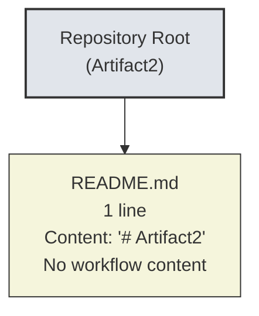

### 4.5.2 High-Level System Workflow Diagram

A high-level system workflow would ordinarily depict the principal end-to-end paths through the system, with swim lanes for the major actors and systems. Because no system, no actors, and no workflows are defined in the repository (cross-reference: Sections 1.2.2, 1.3.1, 2.2), the high-level workflow is empty.

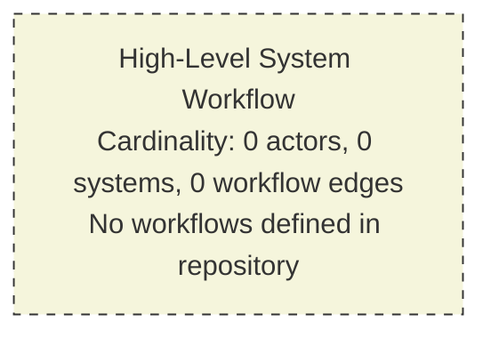

### 4.5.3 Detailed Process Flows for Core Features

Detailed process flows would ordinarily depict, for each feature in the Feature Catalog, the step-by-step procedural logic with decision diamonds, validation gates, and error branches. Because the Feature Catalog (Section 2.2) is empty, the set of detailed process flows is empty.

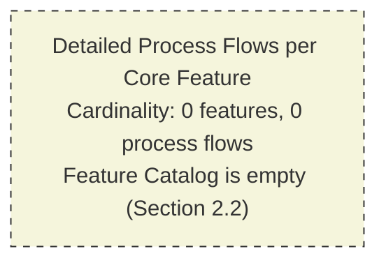

### 4.5.4 Error Handling Flowcharts

Error handling flowcharts would ordinarily depict retry loops, fallback branches, dead-letter routing, and operator notification paths. Because no error-handling code, no observability configuration, and no notification integrations are present in the repository (cross-reference: Sections 2.5.5, 3.5.2, 4.4.2), the error-handling flowchart space is empty.

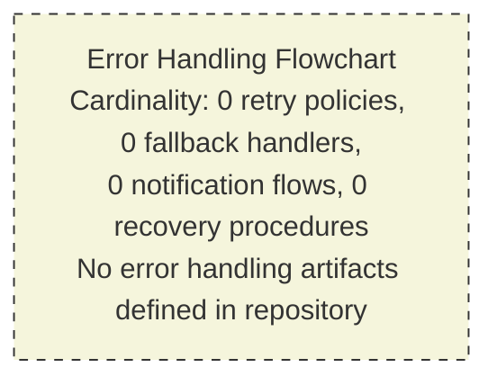

### 4.5.5 Integration Sequence Diagrams

Integration sequence diagrams would ordinarily depict the message-exchange patterns between participating systems — typically rendered as Mermaid `sequenceDiagram` charts with one swim lane per system. Because no integration endpoints are declared (cross-reference: Sections 1.2.1, 2.4.2, 3.5), no sequence diagrams can be authored. The empty state is rendered using the same `graph TD` convention used elsewhere in this Technical Specification for consistency.

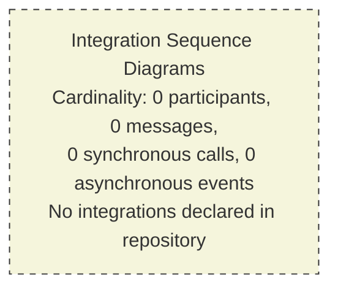

### 4.5.6 State Transition Diagrams

State transition diagrams would ordinarily depict the lifecycle states of each state-bearing domain entity, with edges representing the legal transitions. Because no domain entities, no persistence layer, and no state machine code are present in the repository (cross-reference: Sections 1.2.2, 3.6, 4.4.1), the state transition space is empty.

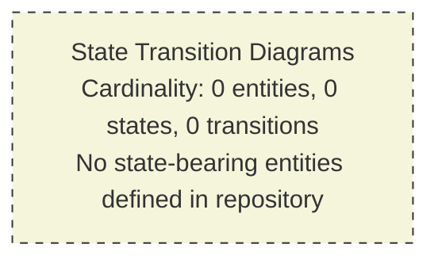

### 4.5.7 Composite Empty-Diagram Summary

The figure below consolidates the five empty-diagram findings into a single visualization, organized into a category subgraph to mirror the structure of the Section 4 prompt's "REQUIRED DIAGRAMS" enumeration.

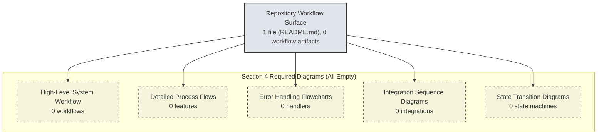

## 4.6 Negative Evidence Aggregation

In keeping with the convergent negative-evidence methodology exercised in Sections 2.6.3 and 3.8.1, the present section aggregates all search operations performed to verify the absence of workflow artifacts. All operations returned zero results.

### 4.6.1 Direct Section 4 Search Operations

| Query Phrase | Method | Result Count | What This Disproves |
|---|---|---|---|
| "workflow process business logic state machine" | File search | 0 results | No workflow, process, business-logic, or state-machine source code exists |
| "process flows API endpoints services workflows" | Folder search | 0 folders | No code-bearing or workflow-bearing folders exist |
| `find / -name ".blitzyignore"` | Filesystem check | No file found | Full repository visibility confirmed; no content is hidden by ignore rules |

### 4.6.2 Inherited Negative-Evidence Findings Relevant to Section 4

The following inherited findings from Sections 2.6.3 and 3.8.1 are reproduced here because each directly forecloses one or more categories of process flowchart content.

| Inherited Query | Section | Result | Section 4 Implication |
|---|---|---|---|
| "feature requirements functional specifications product capabilities" | 2.6.3 | 0 | No features → no detailed process flows (Section 4.5.3) |
| "application source code modules implementation" | 2.6.3 | 0 | No code → no system workflows (Section 4.2.1) |
| "user stories acceptance criteria business requirements" | 2.6.3 | 0 | No user journeys → no swim lanes (Section 4.3.1) |
| "API endpoints service definitions interfaces" | 2.6.3 | 0 | No APIs → no integration sequences (Section 4.5.5) |
| "configuration package dependencies manifest" | 2.6.3 | 0 | No platform conventions → no workflow patterns |
| "Dockerfile container build configuration" | 3.8.1 | 0 | No deployment topology → no deployment workflow |
| "hidden configuration environment variables" | 3.8.1 | 0 | No latent configuration → no hidden workflows |
| "package manifest dependency declaration files" | 3.8.1 | 0 | No frameworks → no framework-provided workflows |
| "GitHub Actions CI pipeline workflow" | 3.8.1 | 0 | No CI/CD workflows |
| "ORM / data configuration" inventory | 3.8.2 | None | No persistence transactions, no state machines |
| "Container / build descriptors" inventory | 3.8.2 | None | No batch/job orchestration descriptors |
| "CI/CD descriptors" inventory | 3.8.2 | None | No automated release workflows |

### 4.6.3 Convergence Statement

Across **3 direct Section 4 investigations** and **12 inherited investigation lines** from Sections 2.6.3 and 3.8.1, every search relevant to workflows, processes, integrations, state machines, error handling, or scheduled work has returned zero results. The cumulative finding — that **no workflow artifacts of any kind exist in the repository** — is therefore not the result of an isolated lookup but the convergent conclusion of an exhaustive, multi-modal investigation.

## 4.7 Assumptions, Constraints, and Revisability

In keeping with the precedent set by Sections 2.7 and 3.9, the present section concludes with its own Assumptions, Constraints, and Revisability statement.

### 4.7.1 Assumptions

| Assumption | Basis |
|---|---|
| The repository snapshot analyzed is the authoritative current state | No alternate branches, tags, or staging areas were excluded from analysis |
| No content was hidden from analysis by ignore rules | `.blitzyignore` filesystem check returned no such file (cross-reference: Section 1.4, Section 4.1.3) |
| The single-line `README.md` is intentional and not truncated or corrupted | File content is well-formed Markdown and contains a valid heading token |
| Future commits may introduce workflow-bearing artifacts | Pre-initialization repositories conventionally evolve to add content |
| The empty-state diagrams rendered in Section 4.5 are the only authentic visualization | Authoring populated diagrams would violate Section 1.3.3, Principles 1 and 2 |

### 4.7.2 Constraints

| Constraint | Source |
|---|---|
| No fabricated workflows may be authored | Section 1.3.3, Principle 1; Section 2.7.2 precedent |
| No imagined integration sequences may be authored | Section 1.3.3, Principle 1; Section 2.4.2 empty state |
| No speculative state machines may be authored | Section 1.3.3, Principle 2; Section 4.4.1 empty state |
| No speculative error-handling flows may be authored | Section 1.3.3, Principle 2; Section 4.4.2 empty state |
| No SLA / timing annotations may be inferred | Section 1.2.3 KPIs table; Section 2.5.2 Performance Requirements empty |
| Only repository-evident items may be included | Section 1.3.3, Principles 1–3 |
| Transparency markers must be used in lieu of speculation | Section 1.3.3, Principle 3 |
| The empty-state Mermaid convention from Sections 2.4.1 and 3.1.3 must be honored for visual consistency | Cross-section documentation convention |

### 4.7.3 Revisability Statement

This Section 4 represents a **point-in-time snapshot** of the Process Flowchart space, derived from the empirical state of the repository at the moment of analysis. In keeping with the revisability principle articulated in Section 1.3.3, Principle 4 and exercised in Sections 2.7.3 and 3.9.3, the introduction of any of the following triggering artifacts in subsequent commits would constitute a material change requiring this section to be re-authored against the new evidence base.

| Triggering Artifact | Required Section 4 Update |
|---|---|
| Application source files (`.py`, `.js`, `.ts`, `.java`, `.go`, `.rs`, etc.) implementing business logic | Populate Section 4.2.1 (Core Business Processes) with observable end-to-end flows; populate Section 4.5.2 (High-Level System Workflow) and Section 4.5.3 (Detailed Process Flows) |
| API client modules, SDK initializers, or HTTP route handlers | Populate Section 4.2.2 (Integration Workflows); populate Section 4.5.5 (Integration Sequence Diagrams) as `sequenceDiagram` charts |
| OpenAPI / Swagger / GraphQL / Protobuf contract files | Populate Section 4.2.2 with declared inbound/outbound integrations |
| Message broker / queue configuration (Kafka, RabbitMQ, SQS, Pub/Sub) | Populate Section 4.2.2 Integration Workflows with event processing flows |
| Scheduler / cron / job orchestrator descriptors (Airflow DAGs, cron entries, Temporal workflows) | Populate Section 4.2.2 Integration Workflows with batch processing sequences |
| State machine code (XState, Spring StateMachine, statechart libraries) or enum-driven workflow code | Populate Section 4.4.1 (State Management) and Section 4.5.6 (State Transition Diagrams) using `stateDiagram-v2` |
| Database schemas, migrations, ORM mappings (Alembic, Prisma, Knex, Sequelize, TypeORM) | Populate Section 4.4.1 (Data persistence points, Transaction boundaries) |
| Caching client configuration (Redis, Memcached, CDN) | Populate Section 4.4.1 (Caching requirements) |
| Error-handling middleware, retry/circuit-breaker libraries, fallback handlers | Populate Section 4.4.2 (Error Handling) and Section 4.5.4 (Error Handling Flowcharts) |
| Observability / alerting integrations (Sentry, Datadog, PagerDuty, OpsGenie, ELK) | Populate Section 4.4.2 with error notification flows |
| `/docs/runbooks/`, incident response procedures | Populate Section 4.4.2 with recovery procedures |
| Validation libraries / schema definitions (JSON Schema, Pydantic, Zod, Yup, Bean Validation) | Populate Section 4.3.2 (Validation Rules) data validation row |
| Authorization middleware, RBAC/ABAC policy files (OPA Rego, Casbin, Auth0 rules) | Populate Section 4.3.2 (Validation Rules) authorization checkpoints row |
| Compliance attestations or compliance-as-code artifacts (e.g., HIPAA/PCI/GDPR policy files) | Populate Section 4.3.2 (Validation Rules) regulatory compliance row |
| Performance / SLA documentation (SLI/SLO definitions, error budget configs) | Populate Section 4.3.1 (Flowchart Element Inventory) timing constraints row |

Until such artifacts are introduced, this section remains in its current empty-state form, with all subsections marked **"Not defined in repository"** and all five required diagrams rendered using the empty-state Mermaid convention established in Sections 2.4.1 and 3.1.3.

## 4.8 References

### 4.8.1 Files Examined

- `README.md` — The repository's single tracked artifact. A one-line Markdown file containing only the heading `# Artifact2`. Verified to contain no workflow descriptions, no process narratives, no integration specifications, and no state-machine documentation. Used as the sole evidentiary basis for the Repository Workflow Surface (Section 4.5.1).

### 4.8.2 Folders Explored

- Repository root (`""`) — Depth 0. Enumerated to contain exactly 1 file (`README.md`) and 0 subfolders. No deeper hierarchy exists; the empty-state finding is structural, not the result of incomplete traversal.

### 4.8.3 Search Operations Performed (Direct)

- `search_files("workflow process business logic state machine")` — 0 results. Confirmed absence of any workflow, process, business-logic, or state-machine source files.
- `search_folders("process flows API endpoints services workflows")` — 0 folders. Confirmed absence of any folders organized around workflow concerns.
- `bash: find / -name ".blitzyignore"` — No file found. Confirmed full repository visibility (matches Section 1.4 finding).

### 4.8.4 Technical Specification Sections Cross-Referenced

- **Section 1.1, Executive Summary** — Confirms pre-initialization repository state and the absence of any business problem, stakeholders, or value proposition from which workflows could be derived.
- **Section 1.2, System Overview** — Authoritative source for the Repository State and Structure diagram reproduced as Section 4.5.1; provides the empty Enterprise Integration Landscape, empty Primary System Capabilities, empty Major System Components tables.
- **Section 1.3, Scope** — Establishes the In-Scope / Out-of-Scope boundaries and the four binding principles of Section 1.3.3 ("Documentation Approach Under Empty-Repository Conditions") inherited by Section 4.
- **Section 1.4, References** — Documents the `.blitzyignore` filesystem check and prior search operations.
- **Section 2.1, Evidentiary Basis and Documentation Approach** — Provides the precedent for empty-state methodology applied here.
- **Section 2.2, Feature Catalog** — Confirms zero features, foreclosing Section 4.5.3 (Detailed Process Flows per Feature).
- **Section 2.3, Functional Requirements** — Confirms zero functional requirements and zero validation rules, foreclosing Section 4.3.2.
- **Section 2.4, Feature Relationships** — Provides the empty-state Mermaid diagram convention (Section 2.4.1) replicated throughout Section 4.5; provides the empty Integration Points table foreclosing Section 4.5.5.
- **Section 2.5, Implementation Considerations** — Provides the empty Performance Requirements (foreclosing timing/SLA annotations), empty Security Implications (foreclosing authorization checkpoints), and empty Maintenance Requirements (foreclosing observability flows).
- **Section 2.6, Traceability Matrix** — Provides the convergent negative-evidence methodology mirrored in Section 4.6.
- **Section 2.7, Assumptions, Constraints, and Revisability** — Provides the template structure replicated in Section 4.7, including the Triggering Artifact → Required Update pattern.
- **Section 3.1, Evidentiary Posture and Documentation Approach** — Reinforces the no-speculative-stack constraint and provides a second empty-state Mermaid pattern (Section 3.1.3).
- **Section 3.5, Third-Party Services** — Confirms zero external integrations across 7 categories, foreclosing Section 4.5.5.
- **Section 3.6, Databases and Storage** — Confirms zero persistence tiers and zero caching solutions, foreclosing Section 4.4.1.
- **Section 3.7, Development and Deployment** — Confirms zero CI/CD pipelines and zero IaC, foreclosing deployment workflows.
- **Section 3.8, Negative Evidence Aggregation** — Provides the inherited negative-evidence findings aggregated in Section 4.6.2.
- **Section 3.9, Assumptions, Constraints, and Revisability** — Provides the second template (with detailed Triggering Artifact pattern) replicated in Section 4.7.

# 5. System Architecture

## 5.1 EVIDENTIARY BASIS AND DOCUMENTATION APPROACH

This section documents the System Architecture of the repository under analysis, identified as **Artifact2**. As established in Sections 1.1.1 and 1.2.1, the repository is in a pre-initialization state, containing exactly one tracked artifact (`README.md`, one line, content `# Artifact2`) and zero subfolders. The architectural documentation that follows therefore records the **observable state of the repository as of analysis** rather than the architecture of a functioning system, in strict adherence to the four binding principles established in Section 1.3.3 and exercised across Sections 2.4, 3.1, and 4.1.

### 5.1.1 Inherited Authorship Constraints

The four binding principles of Section 1.3.3 govern this section directly, foreclosing the authoring of speculative architecture styles, fabricated component decompositions, or imagined integration topologies in the absence of repository evidence. These principles are reproduced below to anchor every empty-state declaration that follows.

| Inherited Principle | Source | Effect on Section 5 |
|---|---|---|
| No fabricated architecture | Section 1.3.3, Principle 1 | No component diagrams, sequence flows, or deployment topologies may be inferred where no code/configuration exists |
| No speculative technology stack | Section 1.3.3, Principle 2 | No framework, runtime, platform, or architectural style may be named unless its presence is verifiable in the repository |
| Transparency markers | Section 1.3.3, Principle 3 | All empty categories use the explicit marker "Not defined in repository" |
| Revisability | Section 1.3.3, Principle 4 | This section is a point-in-time snapshot subject to revision when implementation artifacts are introduced |

Additionally, Section 1.2.2 ("Core Technical Approach") explicitly establishes that "no technology stack, programming language, framework, or architectural style can be identified" in the repository. Section 3.1.2 has explicitly disqualified the Default Technology Stack — AWS, Docker, Terraform, GitHub Actions, Python, Flask, Auth0, MongoDB, LangChain, React/TypeScript, TailwindCSS, React Native, Swift, Kotlin, Objective-C, and ElectronJS — from being applied to this repository. None of those technologies may be named as architectural components in this section.

### 5.1.2 Convergent Findings from Prior Sections

The empty-state finding for Section 5 is not the result of an isolated local search; it is the cumulative conclusion of every prior section's empirical analysis. The table below summarizes the convergent prior findings that directly disqualify the construction of populated architectural diagrams, component tables, or decision records.

| Prior Section | Empirical Finding | Implication for Section 5 |
|---|---|---|
| Section 1.2.1, Repository State and Structure | 1 file (`README.md`), 0 subfolders | No source artifacts from which to derive architecture |
| Section 1.2.1, Enterprise Integration Landscape | All 5 integration surfaces "Not defined" | No external system boundaries to document |
| Section 1.2.2, Primary System Capabilities | No user-facing, data processing, API, background, or admin capabilities | No system behaviors to architect |
| Section 1.2.2, Major System Components | 0 files at all 5 architectural layers (Presentation, Application, Domain, Data, Infrastructure) | No components to enumerate or interconnect |
| Section 1.2.2, Core Technical Approach | "No technology stack, programming language, framework, or architectural style can be identified" | No architecture style determinable |
| Section 1.2.3, KPIs | No technical SLOs/SLAs documented | No performance targets to annotate |
| Section 1.3.2, Unsupported Use Cases | "The repository in its current state supports no end-user or programmatic use cases" | No flows, sequences, or interactions to depict |
| Section 2.2, Feature Catalog | Zero features identified | No feature-bearing components to design |
| Section 2.4.1, Feature Dependency Map | 0 nodes, 0 edges | No dependency topology |
| Section 2.4.2, Integration Points | All "Not defined" | No integration architecture |
| Section 2.4.3, Shared Components | All "Not defined" | No shared infrastructure components |
| Section 2.5.1, Technical Constraints | All 4 constraint categories "Not defined" | No architectural constraints to honor |
| Section 2.5.2, Performance Requirements | All 4 dimensions "Not defined" | No SLA-driven design decisions |
| Section 2.5.3, Scalability Considerations | All 4 dimensions "Not defined" | No scaling architecture |
| Section 2.5.4, Security Implications | All 4 postures "Not defined" | No security architecture |
| Section 2.5.5, Maintenance Requirements | All 4 dimensions "Not defined" | No observability or operational architecture |
| Section 3.1.2, Default Technology Stack | Explicitly disqualified | No vendor-specific architecture |
| Section 3.5, Third-Party Services | All 7 integration categories and 9 service categories "Not defined" | No third-party-mediated architecture |
| Section 3.6, Databases and Storage | All 6 database tiers, all 6 caching/storage categories "Not defined" | No data architecture |
| Section 3.7, Development and Deployment | No tooling, IaC, or CI/CD | No deployment architecture |
| Section 4.4.1, State Management | All 6 state concerns "Not defined" | No state machines to diagram |
| Section 4.4.2, Error Handling | All 6 error-handling concerns "Not defined" | No error-handling flows to diagram |

### 5.1.3 Empty-State Architecture Visualization

In the convention established by Section 2.4.1 (empty Feature Dependency Graph) and Section 3.1.3 (empty Technology Stack), the figure below visualizes the empty state of the architectural space. Each of the five canonical architectural layers — Presentation, Application, Domain, Data, and Infrastructure — is rendered as an empty-cardinality node.

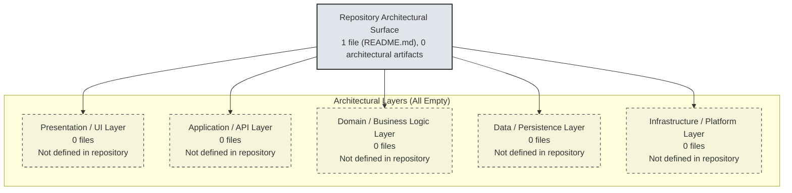

---

## 5.2 HIGH-LEVEL ARCHITECTURE

### 5.2.1 System Overview

#### Overall Architecture Style and Rationale

No overall architecture style can be identified for this repository. As established in Section 1.2.2, the file inventory contains only a single Markdown documentation file and zero implementation artifacts, providing no basis from which to infer a monolithic, microservices, event-driven, layered, hexagonal, serverless, or any other architectural style. Naming such a style here would constitute a fabrication in direct violation of Section 1.3.3, Principle 1 ("No fabricated architecture") and Principle 2 ("No speculative technology stack").

| Architecture Style Candidate | Repository Evidence | Status |
|---|---|---|
| Monolithic | None | Not defined in repository |
| Microservices | None | Not defined in repository |
| Event-driven | None | Not defined in repository |
| Layered / N-tier | None | Not defined in repository |
| Hexagonal / Ports-and-Adapters | None | Not defined in repository |
| Serverless / Functions-as-a-Service | None | Not defined in repository |
| Service-Oriented Architecture | None | Not defined in repository |
| Pipe-and-Filter / Data-flow | None | Not defined in repository |

#### Key Architectural Principles and Patterns

No architectural principles or patterns are documented or derivable. The repository contains no architecture decision records (ADRs), no design documents, no `/docs/architecture/` directory, and no inline code comments expressing design intent. Without such artifacts, no principles (e.g., separation of concerns, single responsibility, dependency inversion) and no patterns (e.g., MVC, MVVM, CQRS, event sourcing, repository pattern) may be claimed.

#### System Boundaries and Major Interfaces

No system boundaries can be drawn. As noted in Section 1.3.1 ("Implementation Boundaries"), the system boundary, user groups, geographic/market coverage, and data domains are all undefined. As confirmed by the Enterprise Integration Landscape (Section 1.2.1), all five potential interface categories — inbound APIs, outbound API clients, message brokers, databases, and identity providers — return "Not defined."

| Interface Category | Boundary Documented | Status |
|---|---|---|
| Inbound API surface | No | Not defined in repository |
| Outbound API surface | No | Not defined in repository |
| Asynchronous messaging surface | No | Not defined in repository |
| Persistence boundary | No | Not defined in repository |
| Identity / authentication boundary | No | Not defined in repository |
| User interface boundary | No | Not defined in repository |

### 5.2.2 Core Components Table

The Major System Components inventory in Section 1.2.2 records zero files at every architectural layer. The Shared Components and Common Services table in Section 2.4.3 records "Not defined in repository." The Core Components table for Section 5 is therefore empty, with a single row recording the empty state in accordance with the transparency-marker convention.

| Component Name | Primary Responsibility | Key Dependencies | Status |
|---|---|---|---|
| Not defined in repository | N/A | N/A | No components present |

### 5.2.3 Data Flow Description

#### Primary Data Flows Between Components

No data flows can be documented because no components exist between which data could flow. The repository contains no producer/consumer code, no message queues, no database connections, no API clients, and no event handlers. As confirmed by Section 4.2.1 (Core Business Processes) and Section 4.2.2 (Integration Workflows), the workflow space is empty.

#### Integration Patterns and Protocols

No integration patterns (e.g., request/response, publish/subscribe, request/reply, claim-check, content-based routing) and no protocols (e.g., HTTP/REST, gRPC, GraphQL, WebSocket, AMQP, MQTT, Kafka) are present. Section 3.5.3 ("Service Configuration Indicators Searched") confirms that environment files, configuration directories, SDK initializers, API client wrappers, webhook handlers, OpenAPI/Swagger documents, and service registry metadata are all absent.

#### Data Transformation Points

No data transformation points exist. The repository contains no serialization/deserialization code, no schema mappers, no ETL scripts, no validation pipelines, and no domain object factories. Section 4.3 ("Flowchart Requirements Catalog") confirms zero validation rules.

#### Key Data Stores and Caches

No data stores or caches exist. Section 3.6.1 confirms that all six database tiers (primary operational, secondary analytical, time-series, document/NoSQL, graph, search index) are "Not defined." Section 3.6.2 confirms that all six caching/storage categories (in-memory cache, distributed cache, object/blob storage, file/NAS storage, CDN, message/event store) are "Not defined."

| Data Flow Element | Repository Evidence | Status |
|---|---|---|
| Synchronous data flow | None | Not defined in repository |
| Asynchronous data flow | None | Not defined in repository |
| Batch / scheduled data flow | None | Not defined in repository |
| Transformation pipeline | None | Not defined in repository |
| Persistence boundary | None | Not defined in repository |
| Cache boundary | None | Not defined in repository |

### 5.2.4 External Integration Points

The repository declares no external integrations. This finding is convergent across Section 1.2.1 (Enterprise Integration Landscape), Section 2.4.2 (Integration Points), Section 3.5.1 (External APIs and Integrations), and Section 3.5.2 (Authentication, Monitoring, and Cloud Services). The External Integration Points table is therefore empty.

| System Name | Integration Type | Data Exchange Pattern | Status |
|---|---|---|---|
| Not defined in repository | N/A | N/A | No external integrations present |

---

## 5.3 COMPONENT DETAILS

### 5.3.1 Component Inventory

No major components exist to document. Each of the component-detail requirements specified by the Section 5 prompt — purpose and responsibilities, technologies and frameworks used, key interfaces and APIs, data persistence requirements, and scaling considerations — has no observable evidence in the repository. The table below records the empty state across each required dimension.

| Component Detail Dimension | Required Evidence | Repository Evidence | Status |
|---|---|---|---|
| Purpose and responsibilities | Module docstrings, README sections, architecture docs | None | Not defined in repository |
| Technologies and frameworks used | Dependency manifests, lockfiles, framework configs | None (cross-reference: Section 3.3) | Not defined in repository |
| Key interfaces and APIs | OpenAPI / GraphQL / gRPC contracts, interface code | None (cross-reference: Section 3.5.3) | Not defined in repository |
| Data persistence requirements | Schemas, migrations, ORM mappings | None (cross-reference: Section 3.6.3) | Not defined in repository |
| Scaling considerations | Autoscaling configs, load-test artifacts, capacity docs | None (cross-reference: Section 2.5.3) | Not defined in repository |

### 5.3.2 Component Interaction Diagram

A detailed component interaction diagram would ordinarily depict the runtime relationships among system components — service-to-service calls, library-to-library dependencies, and queue-mediated exchanges. Because zero components exist at any architectural layer (cross-reference: Section 1.2.2 Major System Components; Section 2.4.3 Shared Components), the component interaction space is empty and is rendered using the empty-state Mermaid convention established in Section 2.4.1 and replicated throughout Sections 3.1.3 and 4.5.

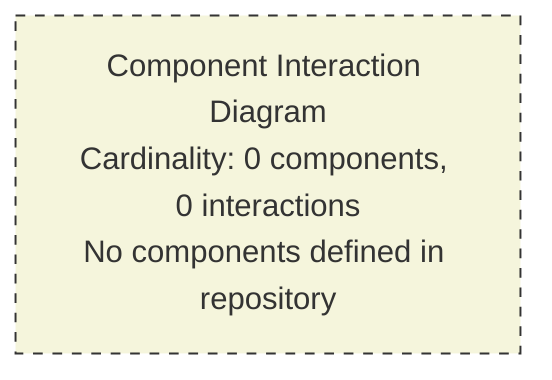

### 5.3.3 State Transition Diagram

A state transition diagram would ordinarily depict the lifecycle states of each state-bearing domain entity, with edges representing the legal transitions and decoration noting the events that trigger them. Because no domain entities exist (cross-reference: Section 1.2.2), no persistence layer exists (cross-reference: Section 3.6), and no state-machine code is present (cross-reference: Section 4.4.1, which records all six state-management concerns as "Not defined"), the state transition space is empty.

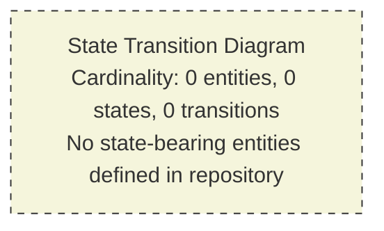

### 5.3.4 Sequence Diagram for Key Flows

A sequence diagram would ordinarily depict, for each key flow, the chronological message exchange among participating actors and systems — typically rendered as a Mermaid `sequenceDiagram` chart with one swim lane per participant. Because no flows are observable (cross-reference: Section 4.2.1 Core Business Processes; Section 4.2.2 Integration Workflows) and no participants are defined (cross-reference: Section 1.2.1 Enterprise Integration Landscape), no sequence diagrams can be authored. The empty state is rendered using the same `graph TD` convention adopted in Section 4.5.5 for consistency.

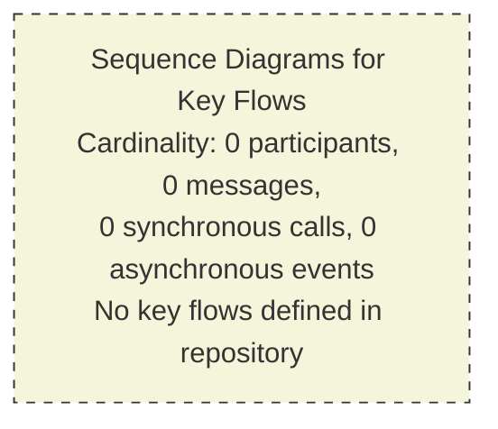

---

## 5.4 TECHNICAL DECISIONS

### 5.4.1 Architecture Style Decisions and Tradeoffs

No architecture style decisions are documented or derivable. There is no architecture decision record (ADR) directory, no design document set, and no `README` narrative that would reveal a chosen style or the tradeoffs evaluated. Each candidate decision dimension is recorded as "Not defined in repository" below.

| Decision Dimension | Documented Choice | Tradeoff Evaluation | Status |
|---|---|---|---|
| Monolith vs. microservices | None | None | Not defined in repository |
| Synchronous vs. asynchronous default | None | None | Not defined in repository |
| Stateless vs. stateful design | None | None | Not defined in repository |
| Self-hosted vs. managed services | None | None | Not defined in repository |

### 5.4.2 Communication Pattern Choices

No communication patterns are declared. The repository contains no HTTP server frameworks, no message broker clients, no gRPC service definitions, no GraphQL servers, no WebSocket handlers, and no event-streaming clients. This finding is convergent across Section 1.2.1 (Enterprise Integration Landscape), Section 2.4.2 (Integration Points), and Section 3.5 (Third-Party Services).

| Communication Pattern | Documented Choice | Status |
|---|---|---|
| Request/response (HTTP, REST, gRPC) | None | Not defined in repository |
| Publish/subscribe (Kafka, RabbitMQ, NATS, SNS) | None | Not defined in repository |
| Point-to-point queue (SQS, RabbitMQ direct) | None | Not defined in repository |
| Streaming (WebSocket, Server-Sent Events) | None | Not defined in repository |
| Polling / batch | None | Not defined in repository |

### 5.4.3 Data Storage Solution Rationale

No data storage solutions are declared. Section 3.6.1 confirms that all six database-tier categories (primary operational, secondary/analytical, time-series, document/NoSQL, graph, search index) are "Not defined in repository." Section 3.6.3 confirms that all persistence configuration indicators — database connection strings, schema definition files, migration directories, ORM configuration files, seed data, and backup scripts — are absent.

| Storage Concern | Selected Solution | Rationale | Status |
|---|---|---|---|
| OLTP / transactional store | None | N/A | Not defined in repository |
| OLAP / analytical store | None | N/A | Not defined in repository |
| Document / unstructured store | None | N/A | Not defined in repository |
| Blob / object storage | None | N/A | Not defined in repository |
| Search index | None | N/A | Not defined in repository |

### 5.4.4 Caching Strategy Justification

No caching strategy is declared. Section 3.6.2 confirms that all six caching/storage categories (in-memory cache, distributed cache, object/blob storage, file/NAS storage, CDN, message/event store) are "Not defined." Section 4.4.1 confirms that "Caching requirements" are likewise "Not defined." No cache invalidation policy, no TTL strategy, and no write-through/write-behind selection can therefore be documented.

| Cache Tier | Selected Solution | Invalidation Policy | Status |
|---|---|---|---|
| Browser / client cache | None | N/A | Not defined in repository |
| CDN / edge cache | None | N/A | Not defined in repository |
| Application in-process cache | None | N/A | Not defined in repository |
| Distributed shared cache | None | N/A | Not defined in repository |
| Database query cache | None | N/A | Not defined in repository |

### 5.4.5 Security Mechanism Selection

No security mechanisms are declared. Section 2.5.4 records all four security postures (Authentication, Authorization, Data protection/Encryption, Threat model/Compliance) as "Not defined in repository." Section 3.5.2 records all nine service-category dimensions including Identity provider, SSO/federation, and Secrets management as "Not defined." No `SECURITY.md`, no policy files, no IAM configurations, and no key material are present.

| Security Dimension | Selected Mechanism | Status |
|---|---|---|
| Authentication protocol (OIDC, SAML, JWT, mTLS) | None | Not defined in repository |
| Authorization model (RBAC, ABAC, ReBAC, policy engine) | None | Not defined in repository |
| Transport encryption (TLS termination point) | None | Not defined in repository |
| Data-at-rest encryption | None | Not defined in repository |
| Secrets management | None | Not defined in repository |
| Audit logging | None | Not defined in repository |

### 5.4.6 Architecture Decision Records

The Section 5 prompt requires decision-tree diagrams and architecture decision records (ADRs). Because no architectural decisions have been documented, neither a decision tree nor an ADR ledger can be authored. The empty state is rendered using the established convention.

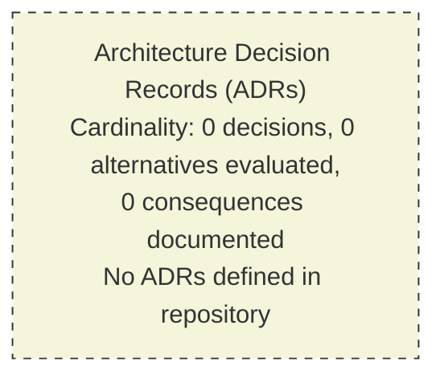

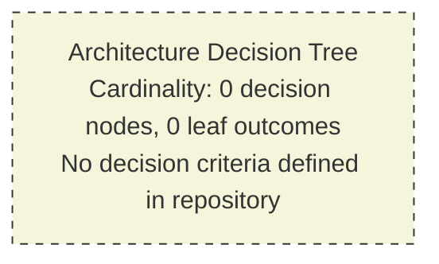

---

## 5.5 CROSS-CUTTING CONCERNS

Each cross-cutting concern enumerated by the Section 5 prompt is documented below in its empty-state form. Every finding is grounded in convergent prior-section evidence rather than fabricated to satisfy the prompt template.

### 5.5.1 Monitoring and Observability Approach

No monitoring or observability approach is declared. Section 2.5.5 ("Maintenance Requirements") records Monitoring/Observability as "Not defined in repository." Section 3.5.2 records APM/tracing, Logging/log aggregation, and Error tracking as "Not defined." There is no Prometheus configuration, no OpenTelemetry instrumentation, no Datadog/New Relic/Dynatrace integration, no health-check endpoint code, and no metrics emission.

| Observability Pillar | Tooling Configured | Status |
|---|---|---|
| Metrics (RED, USE, SLI) | None | Not defined in repository |
| Distributed tracing | None | Not defined in repository |
| Structured logging | None | Not defined in repository |
| Synthetic / RUM monitoring | None | Not defined in repository |
| Health checks / liveness probes | None | Not defined in repository |
| Alerting / on-call routing | None | Not defined in repository |

### 5.5.2 Logging and Tracing Strategy

No logging or tracing strategy is declared. Section 3.5.2 confirms that no log aggregation backend (ELK, Splunk, Datadog Logs, CloudWatch Logs, Loki) and no APM/tracing system (Jaeger, Zipkin, OpenTelemetry collector, Honeycomb) are present. Section 4.4.2 confirms that "Error logging" is "Not defined in repository." No log levels, no correlation/request-ID propagation, no sampling policy, and no retention policy can therefore be documented.

| Logging/Tracing Element | Strategy Documented | Status |
|---|---|---|
| Log format (JSON, key-value, plain text) | None | Not defined in repository |
| Log level taxonomy | None | Not defined in repository |
| Correlation / request-ID propagation | None | Not defined in repository |
| Trace sampling policy | None | Not defined in repository |
| Log retention / archival | None | Not defined in repository |

### 5.5.3 Error Handling Patterns

No error-handling patterns are declared. Section 4.4.2 records all six error-handling concerns — retry mechanisms, fallback processes, error notification flows, recovery procedures, error logging, and dead-letter queues — as "Not defined in repository." Per the Section 4.5.4 precedent, the empty error-handling space is rendered using the empty-state Mermaid convention.

| Error Handling Pattern | Implementation Documented | Status |
|---|---|---|
| Retry with exponential backoff | None | Not defined in repository |
| Circuit breaker | None | Not defined in repository |
| Bulkhead / partitioning | None | Not defined in repository |
| Fallback / graceful degradation | None | Not defined in repository |
| Dead-letter queue routing | None | Not defined in repository |
| Compensating transactions / saga | None | Not defined in repository |
| Idempotency / deduplication | None | Not defined in repository |

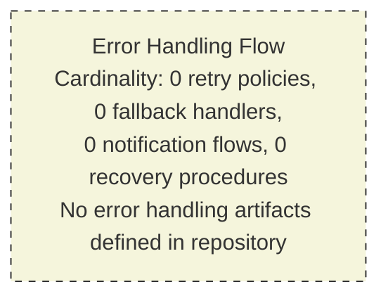

### 5.5.4 Authentication and Authorization Framework

No authentication or authorization framework is declared. Section 2.5.4 records both Authentication and Authorization as "Not defined." Section 3.5.2 records Identity provider, SSO/federation, and Secrets management as "Not defined." No middleware, no policy files, no JWT validation code, no session management, and no role/permission definitions are present.

| AuthN/AuthZ Concern | Implementation Documented | Status |
|---|---|---|
| Identity provider integration | None | Not defined in repository |
| Authentication protocol (OIDC, SAML, JWT) | None | Not defined in repository |
| Authorization model (RBAC, ABAC, policy engine) | None | Not defined in repository |
| Session / token lifecycle management | None | Not defined in repository |
| Multi-factor authentication | None | Not defined in repository |
| Service-to-service authentication (mTLS, service accounts) | None | Not defined in repository |

### 5.5.5 Performance Requirements and SLAs

No performance requirements or service-level agreements are declared. Section 1.2.3 records all four KPI categories (Business KPIs, Product/usage KPIs, Technical SLOs/SLAs, Operational KPIs) as undefined. Section 2.5.2 records all four performance dimensions (Throughput, Latency, Resource utilization, Availability/Uptime) as "Not defined."

| SLA / Performance Element | Target Documented | Status |
|---|---|---|
| Availability target (e.g., 99.9% uptime) | None | Not defined in repository |
| Latency target (p50/p95/p99) | None | Not defined in repository |
| Throughput target (RPS / TPS) | None | Not defined in repository |
| Recovery Time Objective (RTO) | None | Not defined in repository |
| Recovery Point Objective (RPO) | None | Not defined in repository |
| Error budget | None | Not defined in repository |

### 5.5.6 Disaster Recovery Procedures

No disaster recovery procedures are declared. Section 1.3.2 confirms that runbooks, design notes, and `/docs/` directories are absent. Section 3.6.3 confirms that backup/restore scripts are absent. Section 4.4.2 confirms that recovery procedures are "Not defined in repository." No backup schedule, no restore drill, no multi-region failover, and no incident-response playbook can therefore be documented.

| DR Element | Procedure Documented | Status |
|---|---|---|
| Backup schedule and retention | None | Not defined in repository |
| Restore procedure | None | Not defined in repository |
| Failover / multi-region strategy | None | Not defined in repository |
| Runbooks / incident playbooks | None | Not defined in repository |
| Chaos engineering / DR drills | None | Not defined in repository |
| Business continuity planning | None | Not defined in repository |

### 5.5.7 Composite Empty-Diagram Summary

In keeping with the consolidated visualization precedent set by Section 4.5.7, the figure below consolidates the six Section 5 required-diagram findings into a single visualization, organized into a category subgraph that mirrors the structure of the Section 5 prompt's required-diagram enumeration.

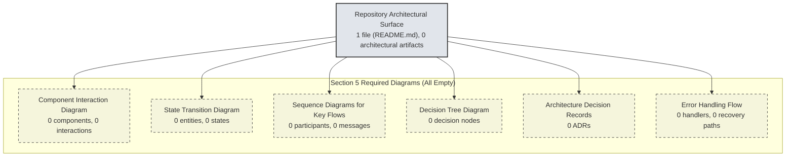

---

## 5.6 NEGATIVE EVIDENCE AGGREGATION

In keeping with the convergent negative-evidence methodology exercised in Sections 2.6.3, 3.8.1, and 4.6, the present subsection aggregates the search operations performed to verify the absence of architecture-bearing artifacts. All operations returned zero results.

### 5.6.1 Direct Section 5 Search Operations

| Query Phrase | Method | Result Count | What This Disproves |
|---|---|---|---|
| "application source code or architecture components" | File search | 0 results | No application or architectural source artifacts exist |
| "architecture or system component folders" | Folder search | 0 folders | No architectural folder hierarchy exists |
| "configuration deployment infrastructure files" | File search | 0 results | No deployment or infrastructure descriptors exist |
| "authentication authorization security framework" | File search | 0 results | No security framework files exist |
| "monitoring logging tracing observability" | File search | 0 results | No observability artifacts exist |
| Repository root enumeration | Directory listing | 1 file, 0 folders | Repository contains only `README.md` |
| `find / -name ".blitzyignore"` | Filesystem check | No file found | Full repository visibility confirmed |

### 5.6.2 Inherited Negative-Evidence Findings Relevant to Section 5

The following inherited findings from Sections 2.6.3, 3.8.1, and 4.6.1 are reproduced here because each directly forecloses one or more categories of architectural content.

| Inherited Query | Section | Result | Section 5 Implication |
|---|---|---|---|
| "feature requirements functional specifications product capabilities" | 2.6.3 | 0 | No feature-bearing components → no component table population |
| "application source code modules implementation" | 2.6.3 | 0 | No code → no architectural style identifiable |
| "API endpoints service definitions interfaces" | 2.6.3 | 0 | No APIs → no external integration points |
| "configuration package dependencies manifest" | 2.6.3 | 0 | No technology choices → no technical decisions |
| "Dockerfile container build configuration" | 3.8.1 | 0 | No deployment topology → no deployment architecture |
| "package manifest dependency declaration files" | 3.8.1 | 0 | No framework selection → no framework-defined patterns |
| "hidden configuration environment variables" | 3.8.1 | 0 | No latent integrations → no hidden architecture |
| "Python Flask backend service API" | 3.8.1 | 0 | Default Tech Stack disqualified (Section 3.1.2) |
| "React TypeScript frontend application" | 3.8.1 | 0 | Default Tech Stack disqualified (Section 3.1.2) |
| "GitHub Actions CI pipeline workflow" | 3.8.1 | 0 | No CI/CD architecture |
| "workflow process business logic state machine" | 4.6.1 | 0 | No workflows → no sequence diagrams |
| "process flows API endpoints services workflows" | 4.6.1 | 0 | No process flows → no interaction diagrams |
| ORM/data configuration inventory | 3.8.2 | None | No data architecture |
| Container/build descriptors inventory | 3.8.2 | None | No deployment architecture |
| IaC descriptors inventory | 3.8.2 | None | No infrastructure architecture |
| CI/CD descriptors inventory | 3.8.2 | None | No release architecture |

### 5.6.3 Convergence Statement

Across **7 direct Section 5 investigations** and **16 inherited investigation lines** from Sections 2.6.3, 3.8.1, 3.8.2, and 4.6.1, every search relevant to architectural style, components, interactions, decisions, or cross-cutting concerns has returned zero results. The cumulative finding — that **no architectural artifacts of any kind exist in the repository** — is the convergent conclusion of an exhaustive, multi-modal investigation rather than the result of an isolated lookup.

---

## 5.7 ASSUMPTIONS, CONSTRAINTS, AND REVISABILITY

In keeping with the closing-subsection precedent set by Sections 2.7, 3.9, and 4.7, the present section concludes with its own Assumptions, Constraints, and Revisability statement.

### 5.7.1 Assumptions

| Assumption | Basis |
|---|---|
| The repository snapshot analyzed is the authoritative current state | No alternate branches, tags, or staging areas were excluded from analysis |
| No content was hidden from analysis by ignore rules | `.blitzyignore` filesystem check returned no such file (cross-reference: Section 1.4) |
| The single-line `README.md` is intentional and not truncated or corrupted | File content is well-formed Markdown and contains a valid heading token |
| Future commits may introduce architecture-bearing artifacts | Pre-initialization repositories conventionally evolve to add content |
| The empty-state diagrams rendered in this section are the only authentic visualization | Authoring populated architecture diagrams would violate Section 1.3.3, Principles 1 and 2 |
| The Default Technology Stack is disqualified from architectural attribution | Section 3.1.2 explicit disqualification |

### 5.7.2 Constraints

| Constraint | Source |
|---|---|
| No fabricated architecture style may be authored | Section 1.3.3, Principle 1 |
| No fabricated component decomposition may be authored | Section 1.3.3, Principle 1; Section 2.4.3 empty Shared Components |
| No imagined sequence diagrams may be authored | Section 1.3.3, Principle 1; Section 4.5.5 precedent |
| No speculative state machines may be authored | Section 1.3.3, Principle 2; Section 4.4.1 empty State Management |
| No speculative error-handling flows may be authored | Section 1.3.3, Principle 2; Section 4.4.2 empty Error Handling |
| No speculative SLA, KPI, or performance target may be inferred | Section 1.2.3 KPIs empty; Section 2.5.2 Performance Requirements empty |
| No Default Technology Stack components may be named as architecture | Section 3.1.2 explicit disqualification |
| Only repository-evident items may be included | Section 5 prompt: "Don't add any items that aren't clearly applicable"; Section 1.3.3, Principles 1–3 |
| Transparency markers must be used in lieu of speculation | Section 1.3.3, Principle 3 |
| The empty-state Mermaid convention from Sections 2.4.1 and 3.1.3 must be honored | Cross-section documentation convention |

### 5.7.3 Revisability Statement

This Section 5 represents a **point-in-time snapshot** of the System Architecture space, derived from the empirical state of the repository at the moment of analysis. In keeping with the revisability principle articulated in Section 1.3.3, Principle 4 and exercised in Sections 2.7.3, 3.9.3, and 4.7.3, the introduction of any of the following triggering artifacts in subsequent commits would constitute a material change requiring this section to be re-authored against the new evidence base.

| Triggering Artifact | Required Section 5 Update |
|---|---|
| Application source files (`.py`, `.js`, `.ts`, `.java`, `.go`, `.rs`, `.swift`, `.kt`, etc.) | Populate Section 5.2 (High-Level Architecture) with observed architectural style; populate Section 5.3 (Component Details) with discovered components |
| Module/package layout signaling architectural boundaries (e.g., `/api/`, `/domain/`, `/infrastructure/`) | Populate Section 5.2.2 (Core Components Table) and Section 5.3.2 (Component Interaction Diagram) |
| Dependency manifests (`package.json`, `pyproject.toml`, `Cargo.toml`, `pom.xml`, `go.mod`) | Populate Section 5.3.1 (technologies and frameworks used) and Section 5.4 (Technical Decisions) |
| API contract files (OpenAPI/Swagger, GraphQL SDL, Protobuf IDL, AsyncAPI) | Populate Section 5.2.4 (External Integration Points) and Section 5.3.4 (Sequence Diagrams) |
| Message broker/queue configuration (Kafka, RabbitMQ, SQS, Pub/Sub clients) | Populate Section 5.2.3 (Data Flow Description) and Section 5.4.2 (Communication Pattern Choices) |
| Database schemas, migrations, ORM mappings (Alembic, Prisma, Knex, Sequelize, TypeORM, Flyway, Liquibase) | Populate Section 5.4.3 (Data Storage Solution Rationale) and Section 5.3.3 (State Transition Diagram) |
| Caching client configuration (Redis, Memcached, CDN, in-process cache libs) | Populate Section 5.4.4 (Caching Strategy Justification) |
| Authentication/authorization middleware, RBAC/ABAC policy files (OPA Rego, Casbin, Auth0/Okta SDKs) | Populate Section 5.4.5 (Security Mechanism Selection) and Section 5.5.4 (Authentication and Authorization Framework) |
| Observability instrumentation (OpenTelemetry, Prometheus, Datadog, Sentry, New Relic SDKs) | Populate Section 5.5.1 (Monitoring and Observability Approach) and Section 5.5.2 (Logging and Tracing Strategy) |
| Error-handling middleware, retry/circuit-breaker libraries (Resilience4j, Polly, tenacity, Hystrix) | Populate Section 5.5.3 (Error Handling Patterns) |
| `Dockerfile`, `docker-compose.yml`, Kubernetes manifests, Helm charts | Populate Section 5.2 (High-Level Architecture) with deployment topology |
| IaC files (`*.tf`, `Pulumi.yaml`, CloudFormation, CDK constructs) | Populate Section 5.4.1 (Architecture Style Decisions) with platform topology |
| CI/CD descriptors (`.github/workflows/`, `.gitlab-ci.yml`, `Jenkinsfile`) | Populate Section 5.5.6 (Disaster Recovery Procedures) with release/rollback procedures |
| `/docs/architecture/`, ADR directory, design notes, RFCs | Populate Section 5.4 (Technical Decisions) and Section 5.4.6 (ADRs) with explicit decision records |
| Runbooks (`/docs/runbooks/`), incident response procedures | Populate Section 5.5.6 (Disaster Recovery Procedures) |
| SLO/SLI/error-budget definitions, performance test artifacts | Populate Section 5.5.5 (Performance Requirements and SLAs) |
| `SECURITY.md`, threat model documents, compliance attestations | Populate Section 5.4.5 (Security Mechanism Selection) and Section 5.5.4 (Authentication and Authorization Framework) |

Until such artifacts are introduced, this section remains in its current empty-state form, with all subsections marked **"Not defined in repository"** and all required diagrams rendered using the empty-state Mermaid convention established in Sections 2.4.1 and 3.1.3 and replicated throughout Section 4.5.

---

## 5.8 References

### 5.8.1 Files Examined

- `README.md` — The sole repository artifact (1 line, content `# Artifact2`). Confirms the absence of architectural source code, configuration, or documentation. Verified via repository root enumeration and direct file read.

### 5.8.2 Folders Explored

- Repository root (depth 0) — Contains exactly 1 file (`README.md`) and 0 subfolders. No deeper architectural hierarchy exists for further exploration.

### 5.8.3 Technical Specification Cross-References

- **Section 1.1.1 (Project Overview)** — Establishes the pre-initialization repository state and the empty-state documentation methodology.
- **Section 1.2.1 (Repository State and Structure; Enterprise Integration Landscape)** — Provides the canonical repository-structure diagram and confirms all five integration surfaces are "Not defined."
- **Section 1.2.2 (Primary System Capabilities; Major System Components; Core Technical Approach)** — Confirms zero files at all five architectural layers and disqualifies identification of any architectural style.
- **Section 1.2.3 (KPIs)** — Confirms no technical SLOs/SLAs documented, foreclosing Section 5.5.5 population.
- **Section 1.3.1 (In-Scope Elements; Implementation Boundaries)** — Confirms no system boundaries are defined.
- **Section 1.3.2 (Out-of-Scope Elements; Unsupported Use Cases)** — Enumerates out-of-scope categories that include all architectural artifact classes.
- **Section 1.3.3 (Documentation Approach Under Empty-Repository Conditions)** — Source of the four binding authorship principles inherited by Section 5.
- **Section 1.4 (References)** — Documents the `.blitzyignore` filesystem check confirming full repository visibility.
- **Section 2.2 (Feature Catalog)** — Confirms zero features, foreclosing component-table population.
- **Section 2.4.1 (Feature Dependency Map)** — Establishes the empty-state Mermaid convention replicated in Section 5.
- **Section 2.4.2 (Integration Points)** — Confirms no integration points, foreclosing Section 5.2.4 population.
- **Section 2.4.3 (Shared Components and Common Services)** — Confirms no shared components, foreclosing Section 5.2.2 population.
- **Section 2.5.1 (Technical Constraints)** — Confirms all four constraint categories "Not defined."
- **Section 2.5.2 (Performance Requirements)** — Confirms all four performance dimensions "Not defined," foreclosing Section 5.5.5 population.
- **Section 2.5.3 (Scalability Considerations)** — Confirms all four scalability dimensions "Not defined."
- **Section 2.5.4 (Security Implications)** — Confirms all four security postures "Not defined," foreclosing Section 5.4.5 and Section 5.5.4 population.
- **Section 2.5.5 (Maintenance Requirements)** — Confirms Monitoring/Observability "Not defined," foreclosing Section 5.5.1 population.
- **Section 2.6.3 (Negative Evidence Summary)** — Provides the negative-evidence aggregation template replicated in Section 5.6.
- **Section 2.7 (Assumptions, Constraints, and Revisability)** — Provides the closing-subsection template replicated in Section 5.7.
- **Section 3.1.2 (Inapplicability of the Default Technology Stack)** — Disqualifies the Default Technology Stack from being named as architectural components.
- **Section 3.1.3 (Empty-State Technology Stack Visualization)** — Provides the visual convention replicated in Section 5.1.3.
- **Section 3.5.1 (External APIs and Integrations)** — Confirms all seven third-party service categories "Not defined," foreclosing Section 5.2.4 population.
- **Section 3.5.2 (Authentication, Monitoring, and Cloud Services)** — Confirms all nine service categories including identity provider and APM/tracing "Not defined."
- **Section 3.5.3 (Service Configuration Indicators Searched)** — Provides the searched-indicator inventory referenced in Section 5.2.3.
- **Section 3.6.1 (Primary and Secondary Databases)** — Confirms all six database tiers "Not defined," foreclosing Section 5.4.3 population.
- **Section 3.6.2 (Caching Solutions and Storage Services)** — Confirms all six caching/storage categories "Not defined," foreclosing Section 5.4.4 population.
- **Section 3.6.3 (Persistence Configuration Indicators Searched)** — Provides the persistence-indicator inventory referenced in Section 5.4.3.
- **Section 3.7 (Development and Deployment)** — Confirms no tooling, IaC, or CI/CD, foreclosing deployment-architecture population.
- **Section 3.8.1 (Convergent Search Findings)** — Provides the search-query inventory format replicated in Section 5.6.1.
- **Section 3.8.2 (Manifest, Lockfile, and Configuration Inventory)** — Confirms all manifest/lockfile/configuration categories absent.
- **Section 3.9 (Assumptions, Constraints, and Revisability)** — Second instance of the closing-subsection template replicated in Section 5.7.
- **Section 4.1.2 (Convergent Findings from Prior Sections)** — Provides the convergent-findings table template replicated in Section 5.1.2.
- **Section 4.2.1 (Core Business Processes)** — Confirms zero business processes, foreclosing Section 5.3.4 sequence-diagram population.
- **Section 4.2.2 (Integration Workflows)** — Confirms zero integration workflows.
- **Section 4.4.1 (State Management)** — Confirms all six state-management concerns "Not defined," foreclosing Section 5.3.3 population.
- **Section 4.4.2 (Error Handling)** — Confirms all six error-handling concerns "Not defined," foreclosing Section 5.5.3 population.
- **Section 4.5 (Required Diagrams)** — Provides the per-required-diagram empty-state visualization pattern replicated in Sections 5.3.2, 5.3.3, 5.3.4, 5.4.6, 5.5.3, and 5.5.7.
- **Section 4.6 (Negative Evidence Aggregation)** — Provides the inherited-negative-evidence table format replicated in Section 5.6.2.
- **Section 4.7 (Assumptions, Constraints, and Revisability)** — Most fully developed instance of the closing-subsection template, replicated in Section 5.7.

### 5.8.4 Verification Searches Performed in Support of Section 5

| Search Type | Query | Result |
|---|---|---|
| File search | "application source code or architecture components" | 0 results |
| Folder search | "architecture or system component folders" | 0 folders |
| File search | "configuration deployment infrastructure files" | 0 results |
| File search | "README markdown documentation" | 0 results (no files beyond `README.md`) |
| File search | "authentication authorization security framework" | 0 results |
| File search | "monitoring logging tracing observability" | 0 results |
| Directory enumeration | Repository root | 1 file (`README.md`), 0 folders |
| File content read | `README.md` | Single line: `# Artifact2` |
| Filesystem check | `find / -name ".blitzyignore"` | No file found (full visibility) |

# 6. SYSTEM COMPONENTS DESIGN

## 6.1 Core Services Architecture

### 6.1.1 Applicability Determination

**Core Services Architecture is not applicable for this system.**

The repository under analysis (identified as `Artifact2` in Section 1.1.1) is in a pre-initialization or placeholder state and contains no service-bearing artifacts from which a Core Services Architecture could be documented. As established in Section 1.2.1 ("Repository State and Structure"), the complete structural footprint of the repository consists of a single tracked artifact — a `README.md` file containing only a top-level Markdown heading (`# Artifact2`) — with zero subfolders, zero source files, zero configuration manifests, zero build descriptors, zero dependency declarations, zero test assets, and zero infrastructure definitions at any level of the directory hierarchy.

#### 6.1.1.1 Convergent Evidence Foreclosing Applicability

The non-applicability finding is grounded in convergent empirical evidence from prior sections of this Technical Specification. Each row of the table below represents an independent investigation line that returned zero results, jointly disqualifying every category of artifact required to document a populated Core Services Architecture.

| Investigation Line | Prior Section | Result |
|---|---|---|
| Architecture style determination | Section 5.2.1 | "Microservices: None — Not defined in repository" |
| Monolith vs. microservices decision | Section 5.4.1 | "Not defined in repository" |
| Inter-service communication patterns | Section 5.4.2 | All 5 patterns "Not defined in repository" |
| Major system components inventory | Section 1.2.2 | Zero files at all 5 architectural layers |
| Enterprise integration landscape | Section 1.2.1 | All 5 integration surfaces "Not defined" |
| Scalability dimensions | Section 2.5.3 | All 4 scaling strategies "Not defined" |
| Disaster recovery procedures | Section 5.5.6 | All 6 DR elements "Not defined" |
| Error handling and resilience patterns | Section 5.5.3 | All 7 patterns including circuit breaker "None" |
| Containerization and IaC artifacts | Section 3.7.2 | All 9 IaC artifact categories "Not defined" |
| Third-party service integrations | Section 3.5 | All 7 integration categories "Not defined" |
| Database and storage tiers | Section 3.6.1 | All 6 database tiers "Not defined" |
| State management concerns | Section 4.4.1 | All 6 state concerns "Not defined" |

#### 6.1.1.2 Binding Authorship Constraints

The decision to document Section 6.1 in its empty-state form rather than fabricating a service architecture is required by the four binding authorship principles inherited from Section 1.3.3 ("Documentation Approach Under Empty-Repository Conditions"). The table below restates each principle and identifies its direct effect on Section 6.1.

| Inherited Principle | Source | Effect on Section 6.1 |
|---|---|---|
| No fabricated architecture | Section 1.3.3, Principle 1 | No service components, communication patterns, or service topologies may be inferred |
| No speculative technology stack | Section 1.3.3, Principle 2 | No framework, load balancer, circuit breaker library, or platform may be named |
| Transparency markers | Section 1.3.3, Principle 3 | All empty categories use the explicit marker "Not defined in repository" |
| Revisability | Section 1.3.3, Principle 4 | Section is a point-in-time snapshot subject to revision when service artifacts are introduced |

Additionally, Section 3.1.2 explicitly **disqualifies** the Default Technology Stack — comprising AWS, Docker, Terraform, GitHub Actions, Python, Flask, Auth0, MongoDB, LangChain, React with TypeScript, TailwindCSS, React Native, Swift, Kotlin, Objective-C, and ElectronJS — from being named as architectural attribution in this Technical Specification. No service runtime, no orchestration platform, no service mesh, no load balancer technology, and no resilience library from any default stack may be cited as part of the present system's Core Services Architecture.

---

### 6.1.2 Service Components

#### 6.1.2.1 Service Boundaries and Responsibilities

No service boundaries or responsibilities are derivable. As recorded in Section 5.3.1 ("Component Inventory"), each of the five component-detail dimensions required by the Section 5 prompt — purpose and responsibilities, technologies and frameworks used, key interfaces and APIs, data persistence requirements, and scaling considerations — has zero observable evidence in the repository. Without component-level evidence there can be no service-level boundary.

| Service Boundary Dimension | Required Evidence | Repository Evidence | Status |
|---|---|---|---|
| Service purpose / responsibility statement | Module documentation, service README | None | Not defined in repository |
| Service-owned domain entities | Domain models, schemas, ORM mappings | None | Not defined in repository |
| Service-owned data stores | Database connection configuration | None | Not defined in repository |
| Public service contract / API surface | OpenAPI, gRPC IDL, GraphQL SDL, AsyncAPI | None | Not defined in repository |

#### 6.1.2.2 Inter-Service Communication Patterns

No inter-service communication patterns are declared. Section 5.4.2 ("Communication Pattern Choices") records all five candidate patterns as "Not defined in repository," and Section 1.2.1 ("Enterprise Integration Landscape") records all five integration surfaces — inbound APIs, outbound API clients, message brokers/queues, databases/data stores, and identity providers — as "Not defined." No HTTP server frameworks, no message broker clients, no gRPC service definitions, no GraphQL servers, no WebSocket handlers, and no event-streaming clients are present in the repository.

| Communication Pattern | Candidate Implementations | Repository Evidence | Status |
|---|---|---|---|
| Request/response (synchronous) | HTTP, REST, gRPC | None | Not defined in repository |
| Publish/subscribe (asynchronous) | Kafka, RabbitMQ, NATS, SNS | None | Not defined in repository |
| Point-to-point queue | SQS, RabbitMQ direct | None | Not defined in repository |
| Streaming | WebSocket, Server-Sent Events | None | Not defined in repository |
| Polling / batch | Scheduled pulls, batch jobs | None | Not defined in repository |

#### 6.1.2.3 Service Discovery Mechanisms

No service discovery mechanisms are declared. Section 3.5.3 ("Service Configuration Indicators Searched") confirms that the typical configuration artifacts indicating service discovery — service registry/discovery configuration, SDK initialization files, API client wrapper modules, webhook handler modules, and OpenAPI/Swagger documents — were searched for and confirmed absent. No service mesh control plane, no service registry client, and no discovery sidecar configuration is present.

| Discovery Indicator | Typical Purpose | Repository Evidence | Status |
|---|---|---|---|
| Service registry / discovery configuration | Service mesh metadata | None (cross-reference: Section 3.5.3) | Not defined in repository |
| API client wrapper modules | Outbound service-to-service calls | None | Not defined in repository |
| Webhook handler modules | Inbound event delivery | None | Not defined in repository |
| OpenAPI / Swagger documents | API contract publication | None | Not defined in repository |

#### 6.1.2.4 Load Balancing Strategy

No load balancing strategy is declared. Section 3.7.2 ("Containerization and Infrastructure as Code") confirms that all nine IaC and container artifact categories — `Dockerfile`, `.dockerignore`, `docker-compose.yml`, Terraform configurations, Pulumi configurations, CloudFormation templates, Helm charts, Kubernetes manifests, and Ansible/Chef/Puppet artifacts — are absent. Without deployment topology or service mesh configuration, no load balancing tier (L4/L7, client-side, server-side, sidecar-based) can be documented.

| Load Balancing Concern | Required Artifact | Repository Evidence | Status |
|---|---|---|---|
| L4 load balancer configuration | Network load balancer config / IaC | None | Not defined in repository |
| L7 load balancer / reverse proxy | Ingress controller, API gateway config | None | Not defined in repository |
| Client-side load balancing | Service registry client, gRPC name resolver | None | Not defined in repository |
| Service mesh data plane | Envoy/Istio/Linkerd sidecar manifests | None | Not defined in repository |

#### 6.1.2.5 Circuit Breaker Patterns

No circuit breaker patterns are implemented. Section 5.5.3 ("Error Handling Patterns") explicitly records "Circuit breaker — None — Not defined in repository" alongside the six other resilience patterns. No resilience library — for example, those families typically used to provide circuit-breaker semantics across language ecosystems — is referenced anywhere in the repository.

| Circuit Breaker Concern | Required Artifact | Repository Evidence | Status |
|---|---|---|---|
| Failure threshold / window configuration | Circuit breaker policy code | None | Not defined in repository |
| Half-open / probe state logic | State-machine code | None | Not defined in repository |
| Library / framework reference | Resilience library dependency | None (cross-reference: Section 3.4) | Not defined in repository |
| Per-route / per-dependency policies | Policy declarations | None | Not defined in repository |

#### 6.1.2.6 Retry and Fallback Mechanisms

No retry or fallback mechanisms are implemented. Section 4.4.2 ("Error Handling") records all six error-handling concerns — retry mechanisms, fallback processes, error notification flows, recovery procedures, error logging, and dead-letter queues — as "Not defined in repository." Section 5.5.3 reaffirms this finding across the broader resilience-pattern inventory.

| Retry / Fallback Concern | Required Artifact | Repository Evidence | Status |
|---|---|---|---|
| Retry with exponential backoff | Retry middleware / decorator | None | Not defined in repository |
| Jitter and budget enforcement | Retry policy with jitter config | None | Not defined in repository |
| Graceful degradation / fallback handlers | Fallback handlers, feature flags | None | Not defined in repository |
| Dead-letter queue routing | DLQ configuration in broker setup | None | Not defined in repository |

---

### 6.1.3 Scalability Design

#### 6.1.3.1 Horizontal and Vertical Scaling Approach

No horizontal or vertical scaling approach is declared. Section 2.5.3 ("Scalability Considerations") records all four scalability dimensions — horizontal scaling, vertical scaling, data volume scaling, and user concurrency scaling — as "Not defined in repository." No deployable units exist to scale, no replica count is configured, and no instance-sizing target is documented.

| Scaling Dimension | Strategy Documented | Repository Evidence | Status |
|---|---|---|---|
| Horizontal scaling (replica fan-out) | No | None (cross-reference: Section 2.5.3) | Not defined in repository |
| Vertical scaling (instance resizing) | No | None (cross-reference: Section 2.5.3) | Not defined in repository |
| Data volume scaling (sharding, partitioning) | No | None (cross-reference: Section 3.6) | Not defined in repository |
| User concurrency scaling (connection pooling) | No | None (cross-reference: Section 2.5.3) | Not defined in repository |

#### 6.1.3.2 Auto-Scaling Triggers and Rules

No auto-scaling triggers or rules are declared. As confirmed by Section 3.7.2, there are no Kubernetes Horizontal Pod Autoscaler (HPA) manifests, no auto-scaling group definitions in Terraform/Pulumi/CloudFormation, and no platform-managed scaling policies. Without IaC or platform manifests, no scaling rule (CPU-based, memory-based, custom-metric-based, schedule-based, or queue-depth-based) can be documented.

| Auto-Scaling Element | Required Artifact | Repository Evidence | Status |
|---|---|---|---|
| Metric-driven trigger (CPU, memory, RPS) | HPA / autoscaling-group spec | None | Not defined in repository |
| Schedule-driven trigger | Cron-driven scaling rule | None | Not defined in repository |
| Queue-depth trigger | KEDA / event-driven scaler | None | Not defined in repository |
| Min / max replica bounds | HPA `minReplicas` / `maxReplicas` | None | Not defined in repository |

#### 6.1.3.3 Resource Allocation Strategy

No resource allocation strategy is declared. Section 2.5.2 ("Performance Requirements") records all four performance dimensions — throughput, latency, resource utilization, and availability/uptime — as "Not defined in repository." No CPU request/limit, no memory request/limit, no QoS class, no node selector, no priority class, and no resource quota is observable.

| Resource Concern | Required Artifact | Repository Evidence | Status |
|---|---|---|---|
| CPU / memory requests and limits | Container resource spec | None | Not defined in repository |
| Quality-of-Service class | Pod QoS configuration | None | Not defined in repository |
| Node / zone placement constraints | Affinity / anti-affinity rules | None | Not defined in repository |
| Namespace / tenant resource quotas | ResourceQuota manifests | None | Not defined in repository |

#### 6.1.3.4 Performance Optimization Techniques

No performance optimization techniques are declared. Section 5.4.4 ("Caching Strategy Justification") records all five cache tiers as "Not defined in repository," and Section 4.4.1 confirms that "Caching requirements" are "Not defined." No content delivery network, no edge cache, no in-process cache, no distributed cache, no database query cache, and no precomputation/materialized-view strategy is present.

| Optimization Technique | Required Artifact | Repository Evidence | Status |
|---|---|---|---|
| Caching (multi-tier) | Cache client configuration | None (cross-reference: Section 5.4.4) | Not defined in repository |
| Connection pooling | Pool configuration | None | Not defined in repository |
| Asynchronous / batched I/O | Async handler code, batch jobs | None | Not defined in repository |
| Precomputation / materialized views | Background workers, view definitions | None | Not defined in repository |

#### 6.1.3.5 Capacity Planning Guidelines

No capacity planning guidelines are documented. Section 1.2.3 ("Key Performance Indicators") records all four KPI categories — Business KPIs, Product/usage KPIs, Technical SLOs/SLAs, and Operational KPIs — as undefined. Section 5.5.5 ("Performance Requirements and SLAs") reaffirms that all six SLA/performance elements — availability target, latency targets (p50/p95/p99), throughput target (RPS/TPS), RTO, RPO, and error budget — are "Not defined in repository." Without baseline performance targets there is no quantitative basis from which a capacity plan could be authored.

| Capacity Planning Input | Required Artifact | Repository Evidence | Status |
|---|---|---|---|
| Workload baseline (RPS, TPS, concurrent users) | Load-test artifacts, traffic models | None | Not defined in repository |
| Headroom / saturation thresholds | SLO / error-budget docs | None (cross-reference: Section 5.5.5) | Not defined in repository |
| Growth assumptions | Capacity planning docs | None | Not defined in repository |
| Cost / budget envelope | Cloud cost model | None | Not defined in repository |

---

### 6.1.4 Resilience Patterns

#### 6.1.4.1 Fault Tolerance Mechanisms

No fault tolerance mechanisms are implemented. Section 5.5.3 ("Error Handling Patterns") records all seven resilience patterns — retry with exponential backoff, circuit breaker, bulkhead/partitioning, fallback/graceful degradation, dead-letter queue routing, compensating transactions/saga, and idempotency/deduplication — as "Not defined in repository." No middleware, no policy declarations, no resilience library reference, and no fault-injection harness is present in the repository.

| Fault Tolerance Mechanism | Required Artifact | Repository Evidence | Status |
|---|---|---|---|
| Retry with exponential backoff | Retry middleware / decorator | None | Not defined in repository |
| Circuit breaker | Circuit-breaker policy code | None | Not defined in repository |
| Bulkhead / partitioning | Thread/connection pool partitioning | None | Not defined in repository |
| Idempotency / deduplication | Idempotency middleware, key store | None (cross-reference: Section 4.4.1) | Not defined in repository |

#### 6.1.4.2 Disaster Recovery Procedures

No disaster recovery procedures are documented. Section 5.5.6 ("Disaster Recovery Procedures") records all six DR elements as "Not defined in repository." Section 1.3.2 ("Out-of-Scope Elements") explicitly enumerates the absence of supplementary documentation directories (`/docs/`, runbooks, design notes), and Section 3.6.3 confirms that backup/restore scripts are absent.

| DR Element | Required Artifact | Repository Evidence | Status |
|---|---|---|---|
| Backup schedule and retention | Backup configuration, cron specs | None (cross-reference: Section 3.6.3) | Not defined in repository |
| Restore procedure | Restore scripts, drill records | None | Not defined in repository |
| Failover / multi-region strategy | DNS failover, replica promotion | None | Not defined in repository |
| Runbooks / incident playbooks | `/docs/runbooks/` directory | None (cross-reference: Section 1.3.2) | Not defined in repository |
| Chaos engineering / DR drills | Chaos tooling configuration | None | Not defined in repository |
| Business continuity planning | BCP documentation | None | Not defined in repository |

Recovery Time Objective (RTO) and Recovery Point Objective (RPO) targets are also undefined, as recorded in Section 5.5.5.

#### 6.1.4.3 Data Redundancy Approach

No data redundancy approach is declared. Section 3.6.1 confirms that all six database tiers — primary operational, secondary/analytical, time-series, document/NoSQL, graph, and search index — are "Not defined in repository." Section 3.6.2 confirms that all six caching/storage categories — in-memory cache, distributed cache, object/blob storage, file/NAS storage, CDN, and message/event store — are "Not defined." Without a persistence layer there is no data to replicate, snapshot, or back up.

| Redundancy Concern | Required Artifact | Repository Evidence | Status |
|---|---|---|---|
| Primary / replica replication | Database replica configuration | None (cross-reference: Section 3.6.1) | Not defined in repository |
| Multi-AZ / multi-region storage | Cross-region replication policy | None | Not defined in repository |
| Snapshot / point-in-time recovery | Snapshot schedule, PITR config | None | Not defined in repository |
| Object storage versioning | Versioning policy on object store | None (cross-reference: Section 3.6.2) | Not defined in repository |

#### 6.1.4.4 Failover Configurations

No failover configurations are present. Section 5.4.1 ("Architecture Style Decisions and Tradeoffs") records the "Self-hosted vs. managed services" decision as "Not defined in repository," and Section 3.7.2 confirms the absence of all IaC and orchestration artifacts that would ordinarily encode failover topology (DNS failover policies, health-check-driven traffic shifting, leader-election configuration, active/passive replica promotion).

| Failover Configuration | Required Artifact | Repository Evidence | Status |
|---|---|---|---|
| Active/passive replica promotion | Replica config with promotion rules | None | Not defined in repository |
| Active/active multi-region | Geo-distributed deployment manifests | None | Not defined in repository |
| DNS / traffic-shifting failover | Route 53 / Traffic Manager rules | None | Not defined in repository |
| Health-check-driven cutover | Health probe and traffic policy | None | Not defined in repository |

#### 6.1.4.5 Service Degradation Policies

No service degradation policies are documented. Section 5.5.3 explicitly records "Bulkhead / partitioning — None," "Fallback / graceful degradation — None," and "Idempotency / deduplication — None." Section 4.4.2 reaffirms that "Fallback processes" are "Not defined in repository." No feature-flag service, no degraded-mode toggle, no read-only-mode gate, and no shedding/admission-control middleware is present.

| Degradation Policy | Required Artifact | Repository Evidence | Status |
|---|---|---|---|
| Feature flag / kill switch | Feature flag service / client | None | Not defined in repository |
| Read-only / degraded-mode toggle | Mode-aware middleware | None | Not defined in repository |
| Load shedding / admission control | Rate limiter, shedding middleware | None | Not defined in repository |
| Compensating transactions / saga | Saga orchestrator code | None (cross-reference: Section 5.5.3) | Not defined in repository |

---

### 6.1.5 Required Diagrams

The Section 6.1 prompt enumerates three required diagram types: a Service Interaction Diagram, a Scalability Architecture diagram, and a Resilience Pattern Implementations diagram. Each is rendered below using the **empty-state Mermaid convention** established in Section 2.4.1 (Feature Dependency Graph), Section 3.1.3 (Empty-State Technology Stack Visualization), and replicated throughout Sections 4.5, 5.3, 5.4.6, and 5.5. The single-node visualization is the authentic representation of the empty service-architecture space; any other rendering would constitute fabrication in violation of Section 1.3.3, Principles 1 and 2.

#### 6.1.5.1 Service Interaction Diagram

A service interaction diagram would ordinarily depict the runtime relationships among services — request/response edges, publish/subscribe topics, queue-mediated exchanges, and discovery dependencies. Because zero services exist (cross-reference: Section 1.2.2 Major System Components; Section 5.2.1 Architecture Style; Section 5.4.2 Communication Pattern Choices), the service interaction space is empty.

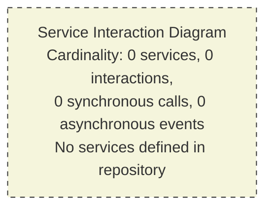

#### 6.1.5.2 Scalability Architecture Diagram

A scalability architecture diagram would ordinarily depict the horizontal-scaling fan-out, replica topology, auto-scaler control loops, load-balancer tiers, and capacity headroom envelopes. Because all four scalability dimensions are "Not defined in repository" (cross-reference: Section 2.5.3) and no IaC, container, or orchestration artifacts are present (cross-reference: Section 3.7.2), the scalability architecture space is empty.

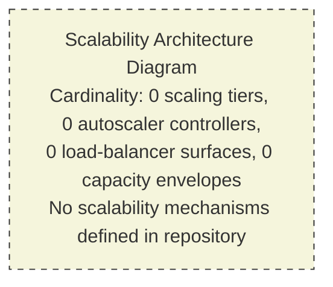

#### 6.1.5.3 Resilience Pattern Implementations Diagram

A resilience pattern implementations diagram would ordinarily depict the deployment positions of circuit breakers, retry middleware, bulkheads, fallback handlers, dead-letter routing, failover edges, and chaos-injection points. Because all seven resilience patterns are "Not defined in repository" (cross-reference: Section 5.5.3) and all six disaster recovery elements are likewise "Not defined" (cross-reference: Section 5.5.6), the resilience pattern space is empty.

```mermaid
graph TD
    Empty["Resilience Pattern Implementations Diagram<br/>Cardinality: 0 circuit breakers, 0 retry policies,<br/>0 bulkheads, 0 fallback handlers,<br/>0 failover edges, 0 DR procedures<br/>No resilience patterns defined in repository"]

    style Empty fill:#f5f5dc,stroke:#333,stroke-width:1px,stroke-dasharray: 5 5
```

#### 6.1.5.4 Composite Empty-Diagram Summary

In keeping with the consolidated visualization precedent set by Sections 4.5.7 and 5.5.7, the figure below consolidates the three Section 6.1 required-diagram findings into a single visualization, organized into a category subgraph that mirrors the structure of the Section 6.1 prompt's required-diagram enumeration.

```mermaid
graph TD
    Surface["Repository Service Surface<br/>1 file (README.md), 0 service artifacts"]

    subgraph RequiredDiagrams["Section 6.1 Required Diagrams (All Empty)"]
        D1["Service Interaction Diagram<br/>0 services, 0 interactions"]
        D2["Scalability Architecture<br/>0 scaling mechanisms"]
        D3["Resilience Pattern Implementations<br/>0 patterns"]
    end

    Surface --> D1
    Surface --> D2
    Surface --> D3

    style Surface fill:#e1e5eb,stroke:#333,stroke-width:2px
    style D1 fill:#f5f5dc,stroke:#333,stroke-width:1px,stroke-dasharray: 5 5
    style D2 fill:#f5f5dc,stroke:#333,stroke-width:1px,stroke-dasharray: 5 5
    style D3 fill:#f5f5dc,stroke:#333,stroke-width:1px,stroke-dasharray: 5 5
```

---

### 6.1.6 Cross-Section Foreclosure Summary

The non-applicability of Core Services Architecture is supported by convergent prior findings across this Technical Specification. The table below consolidates the cross-section foreclosure chain, with each row linking a specific Core Services Architecture subdomain to the prior section(s) that empirically foreclose it.

| Section 6.1 Subdomain | Foreclosing Prior Section | Empirical Finding |
|---|---|---|
| Service boundaries | Section 1.2.2; Section 5.3.1 | Zero components at all 5 architectural layers |
| Inter-service communication | Section 5.4.2; Section 1.2.1 | All 5 communication patterns and 5 integration surfaces "Not defined" |
| Service discovery | Section 3.5.3 | All service-discovery configuration indicators absent |
| Load balancing | Section 3.7.2 | All 9 IaC and orchestration artifact categories absent |
| Circuit breakers | Section 5.5.3 | Circuit breaker pattern explicitly "Not defined" |
| Retry and fallback | Section 4.4.2; Section 5.5.3 | All retry, fallback, and DLQ concerns "Not defined" |
| Horizontal / vertical scaling | Section 2.5.3 | All 4 scaling dimensions "Not defined" |
| Auto-scaling triggers | Section 3.7.2 | No HPA, no auto-scaling group, no platform manifests |
| Resource allocation | Section 2.5.2 | All 4 performance dimensions "Not defined" |
| Performance optimization | Section 5.4.4; Section 4.4.1 | All 5 cache tiers "Not defined"; caching requirements "Not defined" |
| Capacity planning | Section 1.2.3; Section 5.5.5 | All KPI/SLA elements undefined |
| Fault tolerance | Section 5.5.3 | All 7 resilience patterns "None" |
| Disaster recovery | Section 5.5.6 | All 6 DR elements "Not defined" |
| Data redundancy | Section 3.6.1; Section 3.6.2 | All 6 database tiers and 6 storage/caching categories "Not defined" |
| Failover configuration | Section 5.4.1; Section 3.7.2 | "Self-hosted vs. managed" decision "Not defined"; no IaC |
| Service degradation | Section 5.5.3; Section 4.4.2 | Bulkhead, fallback, idempotency all "None" |

---

### 6.1.7 Assumptions, Constraints, and Revisability

In keeping with the closing-subsection precedent set by Sections 2.7, 3.9, 4.7, and 5.7, the present section concludes with its own Assumptions, Constraints, and Revisability statement.

#### 6.1.7.1 Assumptions

| Assumption | Basis |
|---|---|
| The repository snapshot analyzed is the authoritative current state | No alternate branches, tags, or staging areas were excluded from analysis |
| No content was hidden from analysis by ignore rules | `.blitzyignore` filesystem check returned no such file (cross-reference: Section 1.4) |
| The single-line `README.md` is intentional and not truncated or corrupted | File content is well-formed Markdown and contains a valid heading token |
| Future commits may introduce service-bearing artifacts | Pre-initialization repositories conventionally evolve to add content |
| The empty-state diagrams rendered in this section are the only authentic visualization | Authoring populated service-architecture diagrams would violate Section 1.3.3, Principles 1 and 2 |
| The Default Technology Stack is disqualified from service-architectural attribution | Section 3.1.2 explicit disqualification |

#### 6.1.7.2 Constraints

| Constraint | Source |
|---|---|
| No fabricated service architecture may be authored | Section 1.3.3, Principle 1 |
| No fabricated inter-service communication topology may be authored | Section 1.3.3, Principle 1; Section 5.4.2 empty Communication Patterns |
| No speculative scaling strategy may be inferred | Section 1.3.3, Principle 2; Section 2.5.3 empty Scalability Considerations |
| No speculative circuit-breaker or retry library may be named | Section 1.3.3, Principle 2; Section 5.5.3 empty Error Handling Patterns |
| No speculative DR procedure may be authored | Section 1.3.3, Principle 2; Section 5.5.6 empty Disaster Recovery |
| No Default Technology Stack components may be named as service-architecture elements | Section 3.1.2 explicit disqualification |
| Only repository-evident items may be included | Section 1.3.3, Principles 1–3 |
| Transparency markers must be used in lieu of speculation | Section 1.3.3, Principle 3 |
| The empty-state Mermaid convention from Sections 2.4.1 and 3.1.3 must be honored | Cross-section documentation convention |

#### 6.1.7.3 Revisability Statement

This Section 6.1 represents a **point-in-time snapshot** of the Core Services Architecture space, derived from the empirical state of the repository at the moment of analysis. In keeping with the revisability principle articulated in Section 1.3.3, Principle 4 and exercised in Sections 2.7.3, 3.9.3, 4.7.3, and 5.7.3, the introduction of any of the following triggering artifacts in subsequent commits would constitute a material change requiring this section to be re-authored against the new evidence base.

| Triggering Artifact | Required Section 6.1 Update |
|---|---|
| Multiple deployable units (separate `Dockerfile`s, multi-service `docker-compose.yml`, multi-module monorepo) | Populate Section 6.1.2.1 (Service Boundaries) and Section 6.1.5.1 (Service Interaction Diagram) |
| HTTP server / REST framework code, gRPC service definitions, GraphQL servers | Populate Section 6.1.2.2 (Inter-Service Communication Patterns) |
| Message broker / queue clients (Kafka, RabbitMQ, SQS, Pub/Sub) | Populate Section 6.1.2.2 (asynchronous communication) and Section 6.1.4.5 (Service Degradation: DLQ) |
| Service mesh manifests (Istio, Linkerd, Consul Connect, Envoy configs) | Populate Section 6.1.2.3 (Service Discovery) and Section 6.1.2.4 (Load Balancing) |
| Service registry configuration (Eureka, Consul, Zookeeper, etcd, Kubernetes Services) | Populate Section 6.1.2.3 (Service Discovery Mechanisms) |
| Load balancer / API gateway configuration (Nginx, HAProxy, Envoy, AWS ALB, Kong, Apigee) | Populate Section 6.1.2.4 (Load Balancing Strategy) |
| Resilience library imports (Resilience4j, Polly, tenacity, Hystrix, Failsafe, opossum) | Populate Section 6.1.2.5 (Circuit Breaker) and Section 6.1.2.6 (Retry and Fallback) |
| Kubernetes manifests (Deployments, StatefulSets, HPAs, PodDisruptionBudgets) | Populate Section 6.1.3.1 (Scaling Approach) and Section 6.1.3.2 (Auto-Scaling Triggers) |
| IaC files (`*.tf`, `Pulumi.yaml`, CloudFormation, CDK) defining auto-scaling groups | Populate Section 6.1.3.2 (Auto-Scaling Triggers) and Section 6.1.4.4 (Failover Configurations) |
| Container resource specifications (CPU/memory requests and limits) | Populate Section 6.1.3.3 (Resource Allocation Strategy) |
| Caching client configuration (Redis, Memcached, CDN edge caches, in-process libs) | Populate Section 6.1.3.4 (Performance Optimization) |
| SLO / SLI / error-budget definitions, load-test artifacts | Populate Section 6.1.3.5 (Capacity Planning) |
| Backup / restore scripts, snapshot policies | Populate Section 6.1.4.2 (Disaster Recovery) and Section 6.1.4.3 (Data Redundancy) |
| Multi-region or multi-AZ deployment topology | Populate Section 6.1.4.4 (Failover Configurations) |
| Feature flag service / client (LaunchDarkly, Unleash, Flagsmith, OpenFeature) | Populate Section 6.1.4.5 (Service Degradation Policies) |
| Runbook directory (`/docs/runbooks/`), incident response procedures | Populate Section 6.1.4.2 (Disaster Recovery: runbooks / playbooks) |
| Chaos engineering tooling (Chaos Mesh, Litmus, Gremlin, Chaos Monkey) | Populate Section 6.1.4.2 (Disaster Recovery: chaos drills) |

Until such artifacts are introduced, this section remains in its current empty-state form, with all subsections marked **"Not defined in repository"** and all required diagrams rendered using the empty-state Mermaid convention established in Sections 2.4.1 and 3.1.3 and replicated throughout Sections 4.5, 5.3, 5.4.6, and 5.5. At such time as service-bearing artifacts are committed, this section should be re-authored to document the observed service components, scalability design, and resilience patterns with the same fidelity to repository evidence required of all sections of this Technical Specification.

---

### 6.1.8 References

#### 6.1.8.1 Repository Artifacts Examined

- `README.md` — The sole tracked artifact in the repository, containing a single line of content (`# Artifact2`). Examined to confirm absence of any service-architecture content (service definitions, communication-pattern declarations, scalability or resilience documentation).
- Repository root directory (`/`) — Enumerated to confirm zero subfolders and exactly one file. Provides the empirical basis for the "Not applicable" determination across every Section 6.1 subdomain.

#### 6.1.8.2 Technical Specification Sections Cross-Referenced

- **Section 1.1 Executive Summary** — Established the `Artifact2` project identifier and the pre-initialization repository state foundational to this section's non-applicability determination.
- **Section 1.2 System Overview** — Provided the canonical empty Enterprise Integration Landscape (Section 1.2.1), Major System Components inventory (Section 1.2.2), and Core Technical Approach finding ("no technology stack, programming language, framework, or architectural style can be identified").
- **Section 1.3 Scope** — Documented the four binding authorship principles (Section 1.3.3) and the Out-of-Scope Elements enumeration (Section 1.3.2) governing this section's authorship.
- **Section 2.5 Implementation Considerations** — Established that all four scalability dimensions (Section 2.5.3), all four performance dimensions (Section 2.5.2), and all four security postures (Section 2.5.4) are "Not defined in repository."
- **Section 3.1 Evidentiary Posture and Documentation Approach** — Provided the explicit Default Technology Stack disqualification (Section 3.1.2) that prevents naming any default technologies as service-architecture elements.
- **Section 3.5 Third-Party Services** — Confirmed all seven integration categories, all nine service categories, and all seven service-configuration indicators (Section 3.5.3) are "Not defined."
- **Section 3.6 Databases and Storage** — Confirmed all six database tiers (Section 3.6.1) and all six caching/storage categories (Section 3.6.2) are "Not defined," foreclosing any data redundancy documentation.
- **Section 3.7 Development and Deployment** — Confirmed absence of all containerization artifacts, IaC artifacts, and CI/CD pipeline descriptors (Section 3.7.2 and Section 3.7.3), foreclosing any load-balancing or auto-scaling topology documentation.
- **Section 4.4 Technical Implementation** — Confirmed all six state-management concerns (Section 4.4.1) and all six error-handling concerns (Section 4.4.2) are "Not defined in repository," foreclosing any retry/fallback or DLQ documentation.
- **Section 4.5 Required Diagrams** — Established the empty-state Mermaid convention and composite-diagram consolidation pattern (Section 4.5.7) replicated in Section 6.1.5.
- **Section 5.2 High-Level Architecture** — Confirmed that microservices and all seven other architecture styles are "Not defined" (Section 5.2.1), and that all six interface boundary categories are likewise "Not defined."
- **Section 5.3 Component Details** — Confirmed all five component-detail dimensions (Section 5.3.1) and the empty Component Interaction Diagram (Section 5.3.2) foreclose any service-boundary documentation.
- **Section 5.4 Technical Decisions** — Confirmed the "Monolith vs. microservices" decision (Section 5.4.1) and all five communication-pattern choices (Section 5.4.2) are "Not defined," and that the empty-state Mermaid convention applies to Architecture Decision Records (Section 5.4.6).
- **Section 5.5 Cross-Cutting Concerns** — Confirmed all seven resilience patterns including circuit breaker (Section 5.5.3), all six SLA/performance elements (Section 5.5.5), all six disaster recovery elements (Section 5.5.6), and the composite empty-diagram summary pattern (Section 5.5.7) replicated in Section 6.1.5.4.
- **Section 5.7 Assumptions, Constraints, and Revisability** — Provided the structural template for Section 6.1.7, including the triggering-artifact revisability table format.

## 6.2 Database Design

### 6.2.1 Applicability Determination

**Database Design is not applicable to this system.**

The repository under analysis (identified as `Artifact2` in Section 1.1.1) is in a pre-initialization or placeholder state and contains no database-bearing artifacts from which a Database Design could be documented. As established in Section 1.2.1 ("Repository State and Structure"), the complete structural footprint of the repository consists of a single tracked artifact — a `README.md` file containing only a top-level Markdown heading (`# Artifact2`) — with zero subfolders, zero schema definition files, zero migration scripts, zero ORM configurations, zero seed data files, zero backup or restore scripts, zero caching client configurations, and zero database connection strings at any level of the directory hierarchy.

This non-applicability finding is the convergent conclusion of multiple independent investigations across this Technical Specification, most directly Section 3.6 ("Databases and Storage"), which records all six database tiers and all six caching/storage categories as "Not defined in repository," and Section 3.6.3, which documents the absence of all eight persistence configuration indicators searched.

#### 6.2.1.1 Convergent Evidence Foreclosing Applicability

The non-applicability finding is grounded in convergent empirical evidence from prior sections of this Technical Specification. Each row of the table below represents an independent investigation line that returned zero results, jointly disqualifying every category of artifact required to document a populated Database Design.

| Investigation Line | Prior Section | Result |
|---|---|---|
| Primary and secondary databases | Section 3.6.1 | All 6 database tiers "Not defined in repository" |
| Caching solutions and storage services | Section 3.6.2 | All 6 caching/storage categories "Not defined in repository" |
| Persistence configuration indicators | Section 3.6.3 | All 8 indicators (connection strings, schema files, migrations, ORM configs, seed data, backup scripts, cache configs, bucket policies) absent |
| Data storage solution rationale | Section 5.4.3 | All 5 storage solutions (OLTP, OLAP, document, blob, search) "Not defined" |
| Caching strategy justification | Section 5.4.4 | All 5 cache tiers (browser, CDN, in-process, distributed, query) "Not defined" |
| State management concerns | Section 4.4.1 | All 6 state-management concerns including persistence points "Not defined" |
| Data redundancy approach | Section 6.1.4.3 | All 4 redundancy concerns (primary/replica, multi-AZ, snapshot, versioning) "Not defined" |
| Disaster recovery procedures | Section 5.5.6 | All 6 DR elements including backup schedule and restore procedure "Not defined" |
| Major system components — Data/Persistence layer | Section 1.2.2 | Zero files at the Data/Persistence component layer |
| Enterprise integration landscape — Databases/data stores | Section 1.2.1 | "Databases / data stores — None — Not defined" |
| Out-of-scope elements — Data layer | Section 1.3.2 | Database schemas, migrations, seed data, ORM mappings explicitly out-of-scope |

#### 6.2.1.2 Binding Authorship Constraints

The decision to document Section 6.2 in its empty-state form rather than fabricating a database design is required by the four binding authorship principles inherited from Section 1.3.3 ("Documentation Approach Under Empty-Repository Conditions"). The table below restates each principle and identifies its direct effect on Section 6.2.

| Inherited Principle | Source | Effect on Section 6.2 |
|---|---|---|
| No fabricated architecture | Section 1.3.3, Principle 1 | No schema, ERD, replication topology, partitioning approach, or backup architecture may be inferred |
| No speculative technology stack | Section 1.3.3, Principle 2 | No database product, ORM, caching technology, or storage platform may be named |
| Transparency markers | Section 1.3.3, Principle 3 | All empty categories use the explicit marker "Not defined in repository" |
| Revisability | Section 1.3.3, Principle 4 | Section is a point-in-time snapshot subject to revision when database artifacts are introduced |

Additionally, Section 3.1.2 explicitly **disqualifies** the Default Technology Stack — comprising AWS, Docker, Terraform, GitHub Actions, Python, Flask, Auth0, MongoDB, LangChain, React with TypeScript, TailwindCSS, React Native, Swift, Kotlin, Objective-C, and ElectronJS — from being named as database-architectural attribution in this Technical Specification. **No relational database, no document store, no key-value store, no graph database, no search index, no time-series database, no caching product, and no object storage service from any default stack may be cited as part of the present system's Database Design.** The disqualification applies with particular force to the document/NoSQL store category, where the default stack's nominee cannot be referenced as an inferred technology.

---

### 6.2.2 Schema Design

#### 6.2.2.1 Entity Relationships

No entity relationships are derivable. As recorded in Section 1.2.2 ("Major System Components"), the Data/Persistence component layer contains zero files. As recorded in Section 1.2.1 ("Enterprise Integration Landscape"), the "Databases / data stores" integration surface is "Not defined." Without domain models, ORM mappings, or schema declarations there is no entity-relationship space to depict.

| Entity Relationship Dimension | Required Evidence | Repository Evidence | Status |
|---|---|---|---|
| Entity definitions (tables, collections, documents) | DDL files, schema declarations, model classes | None (cross-reference: Section 1.2.2) | Not defined in repository |
| Cardinality declarations (1:1, 1:N, M:N) | Foreign keys, association mappings | None | Not defined in repository |
| Inheritance / polymorphism mappings | Single-table or class-table inheritance configs | None | Not defined in repository |
| Aggregate / bounded-context boundaries | Domain-driven design documentation | None (cross-reference: Section 5.3.1) | Not defined in repository |

#### 6.2.2.2 Data Models and Structures

No data models or structures are declared. Section 3.6.3 confirms the absence of schema definition files (DDL/migrations), ORM configuration files (`alembic.ini`, `prisma/schema.prisma`, `knexfile.js`, `sequelize.config.js`, `typeorm.config.ts`), and seed data files. Section 4.4.1 confirms that all six state-management concerns — including data persistence points and state-bearing entities — are "Not defined in repository." No relational schema, no document schema, no graph schema, no time-series schema, no key-value schema, and no columnar schema is observable.

| Data Model Dimension | Required Evidence | Repository Evidence | Status |
|---|---|---|---|
| Relational schema (DDL) | `*.sql`, `schema.rb`, `models.py` | None (cross-reference: Section 3.6.3) | Not defined in repository |
| Document schema | JSON Schema, Mongoose models, Pydantic models | None | Not defined in repository |
| Graph schema | Cypher schema, GraphQL SDL, RDF ontology | None | Not defined in repository |
| Type definitions for stored data | DTO classes, Protobuf, Avro, Thrift IDL | None | Not defined in repository |

#### 6.2.2.3 Indexing Strategy

No indexing strategy is declared. Without any database tier defined (cross-reference: Section 3.6.1) and without any DDL or migration files (cross-reference: Section 3.6.3), there is no surface on which to declare indexes. No B-tree indexes, no hash indexes, no GIN/GiST indexes, no covering indexes, no partial indexes, no composite indexes, no full-text indexes, no spatial indexes, and no vector indexes can be documented.

| Index Type | Required Artifact | Repository Evidence | Status |
|---|---|---|---|
| Primary key / clustered index | `PRIMARY KEY` DDL, `_id` field declarations | None | Not defined in repository |
| Secondary / non-clustered indexes | `CREATE INDEX` statements, ORM index decorators | None | Not defined in repository |
| Composite / multi-column indexes | Compound index declarations | None | Not defined in repository |
| Specialized indexes (full-text, geospatial, vector) | GIN/GIST/2dsphere/HNSW declarations | None | Not defined in repository |

#### 6.2.2.4 Partitioning Approach

No partitioning approach is declared. Section 2.5.3 ("Scalability Considerations") records "Data volume scaling (sharding, partitioning)" as "Not defined in repository." Section 5.4.3 ("Data Storage Solution Rationale") records all five storage decisions as "Not defined." Without database surfaces or scaling targets, no horizontal partitioning (sharding), vertical partitioning (column splitting), range partitioning, list partitioning, or hash partitioning strategy can be documented.

| Partitioning Concern | Required Artifact | Repository Evidence | Status |
|---|---|---|---|
| Horizontal partitioning / sharding | Shard-key declarations, routing config | None (cross-reference: Section 2.5.3) | Not defined in repository |
| Vertical partitioning | Column-family splits, table decomposition | None | Not defined in repository |
| Range / list / hash partitioning | `PARTITION BY` DDL clauses | None | Not defined in repository |
| Tenant isolation strategy | Schema-per-tenant or row-level discriminators | None | Not defined in repository |

#### 6.2.2.5 Replication Configuration

No replication configuration is declared. Section 6.1.4.3 ("Data Redundancy Approach") records all four redundancy concerns — primary/replica replication, multi-AZ/multi-region storage, snapshot/point-in-time recovery, and object storage versioning — as "Not defined in repository." Section 3.6.1 confirms that no primary database exists from which replicas could be derived, and Section 6.1.4.4 ("Failover Configurations") confirms that no failover topology exists.

| Replication Concern | Required Artifact | Repository Evidence | Status |
|---|---|---|---|
| Synchronous vs. asynchronous replication | Replica configuration files | None (cross-reference: Section 6.1.4.3) | Not defined in repository |
| Primary / replica topology | Replica set / cluster manifests | None (cross-reference: Section 3.6.1) | Not defined in repository |
| Multi-region replication | Cross-region replication policy | None (cross-reference: Section 6.1.4.4) | Not defined in repository |
| Conflict resolution / consistency tier | CRDT configuration, quorum settings | None | Not defined in repository |

#### 6.2.2.6 Backup Architecture

No backup architecture is declared. Section 3.6.3 confirms that "Backup / restore scripts" are absent from the repository. Section 5.5.6 ("Disaster Recovery Procedures") records all six DR elements — including backup schedule and retention, restore procedure, failover/multi-region strategy, runbooks/playbooks, chaos drills, and business continuity planning — as "Not defined in repository." Section 6.1.4.2 reaffirms this finding.

| Backup Architecture Concern | Required Artifact | Repository Evidence | Status |
|---|---|---|---|
| Full / incremental / differential backup schedule | Cron schedules, backup orchestration scripts | None (cross-reference: Section 3.6.3) | Not defined in repository |
| Snapshot / point-in-time recovery | PITR configuration | None (cross-reference: Section 6.1.4.3) | Not defined in repository |
| Backup destination and geo-redundancy | Backup storage bucket policies | None | Not defined in repository |
| Restore drill cadence and validation | Restore runbooks, drill records | None (cross-reference: Section 5.5.6) | Not defined in repository |

---

### 6.2.3 Data Management

#### 6.2.3.1 Migration Procedures

No migration procedures are declared. Section 3.6.3 confirms that `migrations/` and `db/migrate/` directories are absent. Section 3.8 ("Negative Evidence Aggregation") confirms that the standard ORM/migration configuration files — `alembic.ini`, `prisma/schema.prisma`, `knexfile.js`, `sequelize.config.js`, `typeorm.config.ts` — are all absent. No forward migration scripts, no rollback scripts, no migration runner configuration, and no migration history tracking is observable.

| Migration Procedure Concern | Required Artifact | Repository Evidence | Status |
|---|---|---|---|
| Forward migration scripts | Versioned migration files | None (cross-reference: Section 3.6.3) | Not defined in repository |
| Rollback / down-migration scripts | Reversible migration definitions | None | Not defined in repository |
| Migration runner configuration | Alembic, Flyway, Liquibase, ORM CLI config | None (cross-reference: Section 3.8) | Not defined in repository |
| Migration execution policy | Pre-deploy / post-deploy hooks, CI gates | None | Not defined in repository |

#### 6.2.3.2 Versioning Strategy

No data versioning strategy is declared. Section 2.5.5 ("Maintenance Requirements") records "Versioning / release management" as "Not defined in repository." Without schema versioning conventions, migration version sequencing, or data-contract version registries, no versioning strategy can be documented.

| Versioning Concern | Required Artifact | Repository Evidence | Status |
|---|---|---|---|
| Schema version tracking | Version tables, migration ledgers | None (cross-reference: Section 2.5.5) | Not defined in repository |
| Data contract / schema registry | Avro Schema Registry, JSON Schema versioning | None | Not defined in repository |
| Backward / forward compatibility policy | Compatibility rules, deprecation policies | None | Not defined in repository |
| Document / record schema evolution | Versioned document discriminators | None | Not defined in repository |

#### 6.2.3.3 Archival Policies

No archival policies are declared. Section 5.5.2 ("Logging and Tracing Strategy") records "Log retention / archival" as "Not defined in repository." With no data stores and no defined retention horizons, no hot/warm/cold tiering, no time-based archival rules, and no archival storage destination can be documented.

| Archival Policy Concern | Required Artifact | Repository Evidence | Status |
|---|---|---|---|
| Hot / warm / cold data tiering | Storage class transition rules | None | Not defined in repository |
| Time-based archival triggers | TTL fields, lifecycle rules | None (cross-reference: Section 5.5.2) | Not defined in repository |
| Archival storage destination | Cold storage configuration | None | Not defined in repository |
| Restore-from-archive procedure | Glacier/archive restore runbooks | None | Not defined in repository |

#### 6.2.3.4 Data Storage and Retrieval Mechanisms

No data storage or retrieval mechanisms are declared. Section 5.4.3 ("Data Storage Solution Rationale") records all five storage concerns — OLTP/transactional, OLAP/analytical, document/unstructured, blob/object, and search index — as "Not defined in repository." Section 3.6.2 confirms that all six caching/storage categories are likewise absent. No query interfaces, no driver libraries, no data access objects (DAOs), no repository pattern implementations, and no API-to-storage adapters are present.

| Storage / Retrieval Concern | Required Artifact | Repository Evidence | Status |
|---|---|---|---|
| OLTP / transactional retrieval | Database driver, repository code | None (cross-reference: Section 5.4.3) | Not defined in repository |
| OLAP / analytical retrieval | Warehouse client, BI connectors | None | Not defined in repository |
| Blob / object retrieval | Object storage SDK, signed-URL handlers | None (cross-reference: Section 3.6.2) | Not defined in repository |
| Search-index query interface | Search client library, query DSL adapters | None | Not defined in repository |

#### 6.2.3.5 Caching Policies

No caching policies are declared. Section 3.6.2 confirms that all six caching/storage categories are "Not defined." Section 5.4.4 confirms that all five cache tiers — browser/client cache, CDN/edge cache, application in-process cache, distributed shared cache, and database query cache — are "Not defined in repository." Section 4.4.1 confirms that "Caching requirements" are likewise "Not defined." No cache invalidation policy, no TTL strategy, no write-through/write-behind selection, and no cache key namespacing can therefore be documented.

| Caching Policy Concern | Required Artifact | Repository Evidence | Status |
|---|---|---|---|
| Cache invalidation policy (TTL, event-driven) | Cache client configuration | None (cross-reference: Section 5.4.4) | Not defined in repository |
| Write strategy (write-through, write-behind, cache-aside) | Cache wrapper code, repository patterns | None | Not defined in repository |
| Cache key design / namespacing | Cache key conventions, prefix rules | None | Not defined in repository |
| Cache eviction policy (LRU, LFU, FIFO) | Cache backend configuration | None (cross-reference: Section 3.6.2) | Not defined in repository |

---

### 6.2.4 Compliance Considerations

#### 6.2.4.1 Data Retention Rules

No data retention rules are declared. Section 5.5.2 records "Log retention / archival" as "Not defined in repository." Section 1.3.2 ("Out-of-Scope Elements") confirms that governance documents (including `SECURITY.md`, `LICENSE`, and `CODE_OF_CONDUCT.md`) are absent, and there are no compliance attestations, no GDPR/HIPAA/PCI documentation, and no regulatory schedules from which retention horizons could be derived.

| Data Retention Concern | Required Artifact | Repository Evidence | Status |
|---|---|---|---|
| Retention duration by data category | Retention policy documentation | None (cross-reference: Section 5.5.2) | Not defined in repository |
| Right-to-erasure / deletion workflow | Deletion handlers, GDPR compliance code | None (cross-reference: Section 1.3.2) | Not defined in repository |
| Regulatory-mandated retention | Compliance attestation documents | None | Not defined in repository |
| Soft-delete vs. hard-delete strategy | `deleted_at` fields, tombstone records | None | Not defined in repository |

#### 6.2.4.2 Backup and Fault Tolerance Policies

No backup or fault tolerance policies are declared. Section 5.5.6 ("Disaster Recovery Procedures") records all six DR elements as "Not defined in repository." Section 3.6.3 confirms the absence of backup/restore scripts. Section 6.1.4.1 ("Fault Tolerance Mechanisms") records all four fault tolerance mechanisms — retry with exponential backoff, circuit breaker, bulkhead/partitioning, idempotency/deduplication — as "Not defined."

| Backup / Fault Tolerance Concern | Required Artifact | Repository Evidence | Status |
|---|---|---|---|
| Backup retention horizon (days/months/years) | Backup retention policy | None (cross-reference: Section 5.5.6) | Not defined in repository |
| Geo-distributed backup redundancy | Multi-region backup configuration | None (cross-reference: Section 6.1.4.3) | Not defined in repository |
| Database-level fault tolerance (replicas, quorum) | Replica set / cluster configuration | None (cross-reference: Section 6.1.4.1) | Not defined in repository |
| Restore validation cadence | Restore drill records, test logs | None (cross-reference: Section 3.6.3) | Not defined in repository |

#### 6.2.4.3 Privacy Controls

No privacy controls are declared. Section 2.5.4 ("Security Considerations") records all four security postures — Authentication, Authorization, Data protection/Encryption, Threat model/Compliance — as "Not defined in repository." Section 5.4.5 ("Security Mechanism Selection") records all six security dimensions including Data-at-rest encryption, Transport encryption, and Secrets management as "Not defined." No field-level encryption, no PII tokenization, no data masking, and no pseudonymization mechanisms are present.

| Privacy Control Concern | Required Artifact | Repository Evidence | Status |
|---|---|---|---|
| Data-at-rest encryption | KMS configuration, encrypted columns | None (cross-reference: Section 5.4.5) | Not defined in repository |
| Field-level encryption / tokenization | Encrypted field handlers, vault clients | None (cross-reference: Section 2.5.4) | Not defined in repository |
| PII identification and masking | Data classification annotations | None | Not defined in repository |
| Pseudonymization / anonymization | Hashing/anonymization pipelines | None | Not defined in repository |

#### 6.2.4.4 Audit Mechanisms

No audit mechanisms are declared. Section 5.4.5 ("Security Mechanism Selection") records "Audit logging" as "Not defined in repository." Section 5.5.2 ("Logging and Tracing Strategy") records all five logging concerns as "Not defined." No audit trail tables, no change-data-capture streams, no immutable append-only ledgers, and no compliance audit middleware are present.

| Audit Mechanism Concern | Required Artifact | Repository Evidence | Status |
|---|---|---|---|
| Audit trail / history tables | Audit log schema, trigger definitions | None (cross-reference: Section 5.4.5) | Not defined in repository |
| Change data capture (CDC) | Debezium configuration, logical replication | None | Not defined in repository |
| Append-only / immutable record stores | Event sourcing infrastructure | None (cross-reference: Section 5.5.2) | Not defined in repository |
| Access audit logs (who-read-what) | Query audit configuration | None | Not defined in repository |

#### 6.2.4.5 Access Controls

No access controls are declared. Section 5.5.4 ("Authentication and Authorization Framework") records all six AuthN/AuthZ concerns as "Not defined in repository." Section 2.5.4 records both Authentication and Authorization as "Not defined." No database roles, no row-level security policies, no column-level access controls, no schema-level grants, and no application-tier authorization middleware are present.

| Access Control Concern | Required Artifact | Repository Evidence | Status |
|---|---|---|---|
| Database role / grant definitions | `CREATE ROLE` / `GRANT` DDL | None (cross-reference: Section 5.5.4) | Not defined in repository |
| Row-level security (RLS) policies | RLS policy declarations | None | Not defined in repository |
| Column-level access controls | View-based or grant-based column protection | None (cross-reference: Section 2.5.4) | Not defined in repository |
| Application-tier authorization middleware | RBAC/ABAC code, policy engine config | None | Not defined in repository |

---

### 6.2.5 Performance Optimization

#### 6.2.5.1 Query Optimization Patterns

No query optimization patterns are declared. Section 3.6.1 confirms that no databases exist on which queries could be authored or optimized. Section 2.5.2 ("Performance Requirements") records all four performance dimensions — Throughput, Latency, Resource utilization, Availability/Uptime — as "Not defined in repository," foreclosing the existence of any performance target against which queries could be tuned.

| Query Optimization Concern | Required Artifact | Repository Evidence | Status |
|---|---|---|---|
| Query plan analysis / `EXPLAIN` review | Performance test artifacts, query logs | None (cross-reference: Section 3.6.1) | Not defined in repository |
| N+1 query prevention | Eager-loading configuration, batch fetchers | None | Not defined in repository |
| Materialized views / precomputed aggregates | View DDL, refresh schedules | None (cross-reference: Section 6.1.3.4) | Not defined in repository |
| Query rewriting / hint usage | Query hints, optimizer directives | None (cross-reference: Section 2.5.2) | Not defined in repository |

#### 6.2.5.2 Caching Strategy

No caching strategy is declared. Section 5.4.4 ("Caching Strategy Justification") records all five cache tiers as "Not defined in repository." Section 6.1.3.4 ("Performance Optimization Techniques") records all four optimization techniques including caching (multi-tier) as "Not defined." No cache topology, no cache hit-rate targets, no warming strategy, and no cache-coherence protocol is observable.

| Caching Strategy Concern | Required Artifact | Repository Evidence | Status |
|---|---|---|---|
| Multi-tier cache topology | Cache tier configuration | None (cross-reference: Section 5.4.4) | Not defined in repository |
| Cache hit-rate SLO / monitoring | Cache metrics emission | None (cross-reference: Section 6.1.3.4) | Not defined in repository |
| Cache warming / preloading procedure | Warm-up scripts, hydration jobs | None | Not defined in repository |
| Cache coherence / invalidation protocol | Pub/sub invalidation, version stamps | None | Not defined in repository |

#### 6.2.5.3 Connection Pooling

No connection pooling configuration is declared. Section 6.1.3.4 ("Performance Optimization Techniques") records "Connection pooling — None — Not defined in repository." Section 2.5.3 ("Scalability Considerations") records "User concurrency scaling (connection pooling)" as "Not defined." Without any database client library configuration or driver settings, no pool size, no acquisition timeout, no idle-connection eviction policy, and no pool tier (e.g., application-side vs. proxy-side) can be documented.

| Connection Pooling Concern | Required Artifact | Repository Evidence | Status |
|---|---|---|---|
| Pool size (min / max connections) | Driver pool configuration | None (cross-reference: Section 6.1.3.4) | Not defined in repository |
| Connection acquisition timeout | Pool timeout settings | None | Not defined in repository |
| Idle-connection eviction policy | Idle timeout / lifetime configuration | None (cross-reference: Section 2.5.3) | Not defined in repository |
| Proxy-side pooling tier | Connection pooler (e.g., pgbouncer-class) | None | Not defined in repository |

#### 6.2.5.4 Read/Write Splitting

No read/write splitting strategy is declared. Section 3.6.1 confirms that no primary or secondary databases exist between which traffic could be split. Section 6.1.4.3 ("Data Redundancy Approach") confirms that no primary/replica replication is configured. Section 5.4.2 ("Communication Pattern Choices") records all five communication patterns as "Not defined," foreclosing any CQRS or read-path/write-path separation pattern.

| Read/Write Splitting Concern | Required Artifact | Repository Evidence | Status |
|---|---|---|---|
| Reader/writer endpoint configuration | Driver-level endpoint splits | None (cross-reference: Section 3.6.1) | Not defined in repository |
| Read replica routing logic | Routing middleware, query annotations | None (cross-reference: Section 6.1.4.3) | Not defined in repository |
| CQRS command/query separation | Command bus / query handler code | None (cross-reference: Section 5.4.2) | Not defined in repository |
| Read-after-write consistency strategy | Read-your-writes guardrails, stale-read controls | None | Not defined in repository |

#### 6.2.5.5 Batch Processing Approach

No batch processing approach is declared. Section 4.2.1 ("System Workflows") confirms that no business processes are documented. Section 5.4.2 records "Polling / batch — None — Not defined in repository." No batch job schedulers, no ETL pipelines, no scheduled task definitions, and no batch I/O optimizations are observable.

| Batch Processing Concern | Required Artifact | Repository Evidence | Status |
|---|---|---|---|
| Batch job orchestration | Workflow scheduler manifests (DAGs, cron) | None (cross-reference: Section 4.2.1) | Not defined in repository |
| ETL / ELT pipeline definitions | Pipeline code, transformation scripts | None (cross-reference: Section 5.4.2) | Not defined in repository |
| Bulk-insert / bulk-update strategy | Batch DML code, COPY/LOAD scripts | None | Not defined in repository |
| Batch window scheduling / SLOs | Batch SLO definitions, processing windows | None | Not defined in repository |

---

### 6.2.6 Required Diagrams

The Section 6.2 prompt enumerates three required diagram types: database schema diagrams (ERDs), data flow diagrams, and a replication architecture diagram. Each is rendered below using the **empty-state Mermaid convention** established in Section 2.4.1 (Feature Dependency Graph), Section 3.1.3 (Empty-State Technology Stack Visualization), and replicated throughout Sections 4.5, 5.3, 5.4.6, 5.5.7, and 6.1.5. The single-node visualization is the authentic representation of the empty database design space; any other rendering would constitute fabrication in violation of Section 1.3.3, Principles 1 and 2.

#### 6.2.6.1 Database Schema Diagram (ERD)

An entity-relationship diagram would ordinarily depict the entities, their attributes, primary and foreign keys, cardinality declarations, and inheritance/composition mappings of a relational or document schema. Because zero database tiers exist (cross-reference: Section 3.6.1), zero schema definition files are present (cross-reference: Section 3.6.3), and zero entities are observable in the Data/Persistence component layer (cross-reference: Section 1.2.2), the entity-relationship space is empty.

```mermaid
graph TD
    Empty["Database Schema Diagram (ERD)<br/>Cardinality: 0 entities, 0 attributes,<br/>0 primary keys, 0 foreign keys,<br/>0 relationships<br/>No database schema defined in repository"]

    style Empty fill:#f5f5dc,stroke:#333,stroke-width:1px,stroke-dasharray: 5 5
```

#### 6.2.6.2 Data Flow Diagram

A data flow diagram would ordinarily depict the sources, sinks, processing nodes, and intermediate stores through which data transits — including ingestion paths, transformation stages, cache hydration paths, archival paths, and downstream analytics fan-out. Because no integration surfaces are declared (cross-reference: Section 1.2.1), no business processes are documented (cross-reference: Section 4.2), and no data stores or caches exist (cross-reference: Sections 3.6.1 and 3.6.2), the data flow space is empty.

```mermaid
graph TD
    Empty["Data Flow Diagram<br/>Cardinality: 0 data sources, 0 data sinks,<br/>0 processing nodes, 0 intermediate stores,<br/>0 transformation stages<br/>No data flows defined in repository"]

    style Empty fill:#f5f5dc,stroke:#333,stroke-width:1px,stroke-dasharray: 5 5
```

#### 6.2.6.3 Replication Architecture Diagram

A replication architecture diagram would ordinarily depict the primary and replica nodes, their replication topology (synchronous/asynchronous, single-leader/multi-leader/leaderless), inter-region links, failover edges, and quorum/consensus relationships. Because all six database tiers are "Not defined in repository" (cross-reference: Section 3.6.1), all four data redundancy concerns are "Not defined" (cross-reference: Section 6.1.4.3), and all six DR elements are "Not defined" (cross-reference: Section 5.5.6), the replication architecture space is empty.

```mermaid
graph TD
    Empty["Replication Architecture Diagram<br/>Cardinality: 0 primary nodes, 0 replica nodes,<br/>0 replication links, 0 failover edges,<br/>0 quorum/consensus relationships<br/>No replication topology defined in repository"]

    style Empty fill:#f5f5dc,stroke:#333,stroke-width:1px,stroke-dasharray: 5 5
```

#### 6.2.6.4 Composite Empty-Diagram Summary

In keeping with the consolidated visualization precedent set by Sections 4.5.7, 5.5.7, and 6.1.5.4, the figure below consolidates the three Section 6.2 required-diagram findings into a single visualization, organized into a category subgraph that mirrors the structure of the Section 6.2 prompt's required-diagram enumeration.

```mermaid
graph TD
    Surface["Repository Persistence Surface<br/>1 file (README.md), 0 database artifacts"]

    subgraph RequiredDiagrams["Section 6.2 Required Diagrams (All Empty)"]
        D1["Database Schema Diagram (ERD)<br/>0 entities, 0 relationships"]
        D2["Data Flow Diagram<br/>0 sources, 0 sinks, 0 processing nodes"]
        D3["Replication Architecture<br/>0 primary nodes, 0 replicas, 0 links"]
    end

    Surface --> D1
    Surface --> D2
    Surface --> D3

    style Surface fill:#e1e5eb,stroke:#333,stroke-width:2px
    style D1 fill:#f5f5dc,stroke:#333,stroke-width:1px,stroke-dasharray: 5 5
    style D2 fill:#f5f5dc,stroke:#333,stroke-width:1px,stroke-dasharray: 5 5
    style D3 fill:#f5f5dc,stroke:#333,stroke-width:1px,stroke-dasharray: 5 5
```

---

### 6.2.7 Cross-Section Foreclosure Summary

The non-applicability of Database Design is supported by convergent prior findings across this Technical Specification. The table below consolidates the cross-section foreclosure chain, with each row linking a specific Database Design subdomain to the prior section(s) that empirically foreclose it.

#### 6.2.7.1 Schema Design Foreclosure

| Schema Design Subdomain | Foreclosing Prior Section | Empirical Finding |
|---|---|---|
| Entity relationships | Sections 1.2.2; 3.6.1 | Zero files at Data/Persistence layer; all 6 database tiers "Not defined" |
| Data models and structures | Sections 3.6.3; 4.4.1 | No schema definition files; all state-management concerns "Not defined" |
| Indexing strategy | Sections 3.6.1; 5.4.3 | No databases; all 5 storage solutions "Not defined" |
| Partitioning approach | Sections 2.5.3; 5.4.3 | Data volume scaling "Not defined"; no storage rationale |
| Replication configuration | Sections 3.6.1; 6.1.4.3 | No databases; all 4 redundancy concerns "Not defined" |
| Backup architecture | Sections 3.6.3; 5.5.6; 6.1.4.2 | No backup scripts; no backup schedule; no DR procedures |

#### 6.2.7.2 Data Management Foreclosure

| Data Management Subdomain | Foreclosing Prior Section | Empirical Finding |
|---|---|---|
| Migration procedures | Sections 3.6.3; 3.8 | No migrations directories; standard ORM configs absent |
| Versioning strategy | Section 2.5.5 | Versioning/release management "Not defined" |
| Archival policies | Section 5.5.2 | Log retention/archival "Not defined" |
| Data storage and retrieval | Sections 5.4.3; 3.6.2 | All 5 storage solutions and 6 caching/storage categories "Not defined" |
| Caching policies | Sections 3.6.2; 5.4.4; 4.4.1 | All caching tiers and requirements "Not defined" |

#### 6.2.7.3 Compliance Considerations Foreclosure

| Compliance Subdomain | Foreclosing Prior Section | Empirical Finding |
|---|---|---|
| Data retention rules | Sections 5.5.2; 1.3.2 | Log retention "Not defined"; governance documents absent |
| Backup and fault tolerance policies | Sections 5.5.6; 3.6.3; 6.1.4.1 | All 6 DR elements and 4 fault tolerance mechanisms "Not defined" |
| Privacy controls | Sections 2.5.4; 5.4.5 | All 4 security postures and 6 security mechanisms "Not defined" |
| Audit mechanisms | Sections 5.4.5; 5.5.2 | Audit logging and logging strategy "Not defined" |
| Access controls | Sections 5.5.4; 2.5.4 | No AuthN/AuthZ framework; authentication/authorization "Not defined" |

#### 6.2.7.4 Performance Optimization Foreclosure

| Performance Optimization Subdomain | Foreclosing Prior Section | Empirical Finding |
|---|---|---|
| Query optimization patterns | Sections 3.6.1; 2.5.2 | No databases; all 4 performance dimensions "Not defined" |
| Caching strategy | Sections 5.4.4; 6.1.3.4 | All 5 cache tiers "Not defined"; no performance optimization |
| Connection pooling | Sections 6.1.3.4; 2.5.3 | Connection pooling explicitly "Not defined"; user concurrency scaling "Not defined" |
| Read/write splitting | Sections 3.6.1; 6.1.4.3; 5.4.2 | No databases; no data redundancy; no communication patterns |
| Batch processing approach | Sections 4.2.1; 5.4.2 | No business processes; polling/batch "Not defined" |

---

### 6.2.8 Assumptions, Constraints, and Revisability

In keeping with the closing-subsection precedent set by Sections 2.7, 3.9, 4.7, 5.7, and 6.1.7, the present section concludes with its own Assumptions, Constraints, and Revisability statement.

#### 6.2.8.1 Assumptions

| Assumption | Basis |
|---|---|
| The repository snapshot analyzed is the authoritative current state | No alternate branches, tags, or staging areas were excluded from analysis |
| No content was hidden from analysis by ignore rules | `.blitzyignore` filesystem check returned no such file (cross-reference: Section 1.4) |
| The single-line `README.md` is intentional and not truncated or corrupted | File content is well-formed Markdown and contains a valid heading token |
| Future commits may introduce data-bearing artifacts | Pre-initialization repositories conventionally evolve to add content |
| The empty-state diagrams rendered in this section are the only authentic visualization | Authoring populated ERDs, data flow diagrams, or replication topologies would violate Section 1.3.3, Principles 1 and 2 |
| The Default Technology Stack is disqualified from database-architectural attribution | Section 3.1.2 explicit disqualification, including the default document/NoSQL store |

#### 6.2.8.2 Constraints

| Constraint | Source |
|---|---|
| No fabricated schema, ERD, or data model may be authored | Section 1.3.3, Principle 1 |
| No fabricated replication topology, sharding scheme, or partitioning strategy may be inferred | Section 1.3.3, Principle 1; Section 6.1.4.3 empty Data Redundancy |
| No speculative database product, ORM, or migration tool may be named | Section 1.3.3, Principle 2; Section 3.6 empty Databases and Storage |
| No speculative caching technology or storage service may be named | Section 1.3.3, Principle 2; Section 5.4.4 empty Caching Strategy |
| No speculative backup or disaster recovery procedure may be authored | Section 1.3.3, Principle 2; Section 5.5.6 empty Disaster Recovery |
| No Default Technology Stack components may be named as database-design elements | Section 3.1.2 explicit disqualification |
| Only repository-evident items may be included | Section 1.3.3, Principles 1–3 |
| Transparency markers must be used in lieu of speculation | Section 1.3.3, Principle 3 |
| The empty-state Mermaid convention from Sections 2.4.1 and 3.1.3 must be honored | Cross-section documentation convention |
| Tables must contain no more than four columns | Section 6.2 prompt formatting constraint |

#### 6.2.8.3 Revisability Statement

This Section 6.2 represents a **point-in-time snapshot** of the Database Design space, derived from the empirical state of the repository at the moment of analysis. In keeping with the revisability principle articulated in Section 1.3.3, Principle 4 and exercised in Sections 2.7.3, 3.9.3, 4.7.3, 5.7.3, and 6.1.7.3, the introduction of any of the following triggering artifacts in subsequent commits would constitute a material change requiring this section to be re-authored against the new evidence base.

| Triggering Artifact | Required Section 6.2 Update |
|---|---|
| Database schema files (DDL, `*.sql`, schema definition files, model class definitions) | Populate Section 6.2.2.1 (Entity Relationships) and Section 6.2.2.2 (Data Models and Structures) |
| Migration scripts and directories (`migrations/`, `db/migrate/`, Flyway, Liquibase) | Populate Section 6.2.3.1 (Migration Procedures) |
| ORM configuration files (`alembic.ini`, `prisma/schema.prisma`, `knexfile.js`, `sequelize.config.js`, `typeorm.config.ts`) | Populate Section 6.2.3.4 (Data Storage and Retrieval Mechanisms) |
| Database connection strings or `.env` credentials | Populate Section 6.2.5.3 (Connection Pooling) and Section 6.2.6.1 (Schema ERD) |
| Index definitions in DDL or migration files | Populate Section 6.2.2.3 (Indexing Strategy) |
| Partitioning declarations (table partitioning DDL, sharding configuration) | Populate Section 6.2.2.4 (Partitioning Approach) |
| Replication configuration (primary/replica config, multi-region settings) | Populate Section 6.2.2.5 (Replication Configuration) and Section 6.2.6.3 (Replication Architecture) |
| Backup scripts or snapshot policies | Populate Section 6.2.2.6 (Backup Architecture) and Section 6.2.4.1 (Data Retention Rules) |
| Caching client configuration (in-process libraries, distributed cache clients) | Populate Section 6.2.3.5 (Caching Policies) and Section 6.2.5.2 (Caching Strategy) |
| Connection pool configuration (driver-level pools, proxy poolers) | Populate Section 6.2.5.3 (Connection Pooling) |
| Audit logging code, change-data-capture configuration, or compliance attestations | Populate Section 6.2.4.4 (Audit Mechanisms) |
| Authorization middleware/policies (RBAC/ABAC for data access, row-level security) | Populate Section 6.2.4.5 (Access Controls) and Section 6.2.4.3 (Privacy Controls) |
| Read replica routing code or CQRS implementation | Populate Section 6.2.5.4 (Read/Write Splitting) |
| Batch job orchestration (DAGs, scheduled tasks, ETL/ELT scripts) | Populate Section 6.2.5.5 (Batch Processing Approach) |
| SLO/SLI definitions for database performance | Populate Section 6.2.5.1 (Query Optimization Patterns) |
| `SECURITY.md`, compliance documents (GDPR/HIPAA/PCI policy files) | Populate Section 6.2.4.3 (Privacy Controls) and Section 6.2.4.1 (Data Retention Rules) |

Until such artifacts are introduced, this section remains in its current empty-state form, with all subsections marked **"Not defined in repository"** and all required diagrams rendered using the empty-state Mermaid convention established in Sections 2.4.1 and 3.1.3 and replicated throughout Sections 4.5, 5.3, 5.4.6, 5.5.7, and 6.1.5. At such time as data-bearing artifacts are committed, this section should be re-authored to document the observed schema design, data management practices, compliance posture, and performance optimization strategies with the same fidelity to repository evidence required of all sections of this Technical Specification.

---

### 6.2.9 References

#### 6.2.9.1 Repository Artifacts Examined

- `README.md` — The sole tracked artifact in the repository, containing a single line of content (`# Artifact2`). Examined to confirm absence of any database-design content (schema declarations, migration scripts, ORM configuration, cache configuration, backup/restore documentation).
- Repository root directory (`/`) — Enumerated to confirm zero subfolders and exactly one file. Provides the empirical basis for the "Not applicable" determination across every Section 6.2 subdomain.

#### 6.2.9.2 Repository Searches Performed

- File search: "database schema migrations ORM persistence layer data models" — 0 results
- File search: "database configuration connection strings storage backup" — 0 results
- File search: "SQL data definition language tables columns indexes" — 0 results
- Folder search: "database persistence data storage migrations" — 0 results
- Filesystem check: `.blitzyignore` — No such file (full repository visibility confirmed)

#### 6.2.9.3 Technical Specification Sections Cross-Referenced

- **Section 1.1 Executive Summary** — Established the `Artifact2` project identifier and the pre-initialization repository state foundational to this section's non-applicability determination.
- **Section 1.2 System Overview** — Provided the canonical empty Enterprise Integration Landscape (Section 1.2.1) recording "Databases / data stores — None — Not defined," the Major System Components inventory (Section 1.2.2) recording zero files at the Data/Persistence layer, and the Core Technical Approach finding that no technology stack can be identified.
- **Section 1.3 Scope** — Documented the four binding authorship principles (Section 1.3.3) and the Out-of-Scope Elements enumeration (Section 1.3.2), which explicitly excludes "Database schemas, migrations, seed data, ORM mappings" from the in-scope set.
- **Section 2.5 Implementation Considerations** — Established that all four scalability dimensions (Section 2.5.3, including data volume scaling and user concurrency), all four performance dimensions (Section 2.5.2), all four security postures (Section 2.5.4), and all maintenance dimensions including versioning (Section 2.5.5) are "Not defined in repository."
- **Section 3.1 Evidentiary Posture and Documentation Approach** — Provided the explicit Default Technology Stack disqualification (Section 3.1.2) that prevents naming any default database, ORM, or caching technology as database-design elements, including but not limited to the default document/NoSQL store.
- **Section 3.6 Databases and Storage** — The most directly relevant prior section. Confirmed all six database tiers (Section 3.6.1) — primary operational, secondary/analytical, time-series, document/NoSQL, graph, and search index — are "Not defined in repository." Confirmed all six caching/storage categories (Section 3.6.2) — in-memory cache, distributed cache, object/blob storage, file/NAS storage, CDN, message/event store — are "Not defined." Confirmed all eight persistence configuration indicators (Section 3.6.3) — connection strings, schema files, migration directories, ORM configuration files (`alembic.ini`, `prisma/schema.prisma`, `knexfile.js`, `sequelize.config.js`, `typeorm.config.ts`), seed data, backup scripts, caching configuration, storage bucket policies — are absent.
- **Section 3.8 Negative Evidence Aggregation** — Confirmed the ORM/data configuration inventory returned no results across the canonical file-name patterns searched.
- **Section 4.2 System Workflows** — Confirmed no business processes are documented, foreclosing batch processing approach documentation.
- **Section 4.4 Technical Implementation** — Confirmed all six state-management concerns (Section 4.4.1) including data persistence points, caching requirements, transaction boundaries, idempotency, and session management are "Not defined in repository."
- **Section 4.5 Required Diagrams** — Established the empty-state Mermaid convention and composite-diagram consolidation pattern (Section 4.5.7) replicated in Section 6.2.6.
- **Section 5.4 Technical Decisions** — Confirmed the Data Storage Solution Rationale (Section 5.4.3) records all five storage concerns (OLTP, OLAP, document, blob, search index) as "Not defined"; the Caching Strategy Justification (Section 5.4.4) records all five cache tiers as "Not defined"; and the Security Mechanism Selection (Section 5.4.5) records audit logging, secrets management, and data-at-rest encryption as "Not defined."
- **Section 5.5 Cross-Cutting Concerns** — Confirmed the Logging and Tracing Strategy (Section 5.5.2) records log retention/archival as "Not defined"; the Authentication and Authorization Framework (Section 5.5.4) records all six AuthN/AuthZ concerns as "Not defined"; the Performance Requirements and SLAs (Section 5.5.5) records all six SLA elements as "Not defined"; and the Disaster Recovery Procedures (Section 5.5.6) records all six DR elements as "Not defined."
- **Section 5.7 Assumptions, Constraints, and Revisability** — Provided the structural template for Section 6.2.8.
- **Section 6.1 Core Services Architecture** — The primary structural precedent for Section 6.2. Authored under identical evidentiary conditions as "Not applicable," provides the direct template for Section 6.2's applicability determination, sub-section enumeration, required diagram empty-state convention, cross-section foreclosure summary, and assumptions/constraints/revisability statement. Section 6.1.3.4 (Performance Optimization Techniques) explicitly records "Connection pooling — None — Not defined in repository." Section 6.1.4.2 (Disaster Recovery Procedures) reaffirms the absence of backup architecture. Section 6.1.4.3 (Data Redundancy Approach) records all four redundancy concerns as "Not defined."

## 6.3 Integration Architecture

### 6.3.1 Applicability Determination

**Integration Architecture is not applicable for this system.**

The repository under analysis (identified as `Artifact2` in Section 1.1.1) is in a pre-initialization or placeholder state and contains no integration-bearing artifacts from which an Integration Architecture could be documented. As established in Section 1.2.1 ("Repository State and Structure"), the complete structural footprint of the repository consists of a single tracked artifact — a `README.md` file containing only a top-level Markdown heading (`# Artifact2`) — with zero subfolders, zero API contract files, zero HTTP server or client code, zero message broker configurations, zero authentication middleware, zero rate-limiter or API gateway configurations, zero webhook handler modules, and zero third-party SDK initializers at any level of the directory hierarchy.

This non-applicability finding is the convergent conclusion of multiple independent investigations across this Technical Specification, most directly Section 3.5 ("Third-Party Services"), which records all seven external integration categories, all nine authentication/monitoring/cloud service categories, and all seven service-configuration indicators as absent, and Section 5.4.2 ("Communication Pattern Choices"), which records all five candidate communication patterns as "Not defined in repository."

#### 6.3.1.1 Convergent Evidence Foreclosing Applicability

The non-applicability finding is grounded in convergent empirical evidence from prior sections of this Technical Specification. Each row of the table below represents an independent investigation line that returned zero results, jointly disqualifying every category of artifact required to document a populated Integration Architecture.

| Investigation Line | Prior Section | Result |
|---|---|---|
| Enterprise integration landscape | Section 1.2.1 | All 5 integration surfaces "Not defined" |
| Out-of-scope: API contracts | Section 1.3.2 | OpenAPI/Swagger, GraphQL, Protobuf/gRPC, AsyncAPI explicitly out-of-scope |
| External APIs and integrations | Section 3.5.1 | All 7 integration categories "Not defined in repository" |
| Authentication, monitoring, cloud services | Section 3.5.2 | All 9 service categories "Not defined" |
| Service configuration indicators searched | Section 3.5.3 | All 7 indicators absent (`.env`, `config/`, SDK init, API clients, webhooks, OpenAPI, service registry) |
| Integration workflows | Section 4.2.2 | All 5 integration workflow elements "Not defined" |
| Error handling | Section 4.4.2 | All 6 concerns "Not defined" including dead-letter queues |
| Communication pattern choices | Section 5.4.2 | All 5 patterns "Not defined" (Request/response, Pub/sub, Point-to-point, Streaming, Polling/batch) |
| Security mechanism selection | Section 5.4.5 | All 6 security dimensions "Not defined" including AuthN, AuthZ, transport encryption |
| Error handling patterns | Section 5.5.3 | All 7 resilience patterns "Not defined" |
| Authentication and authorization framework | Section 5.5.4 | All 6 AuthN/AuthZ concerns "Not defined" |
| Inter-service communication patterns | Section 6.1.2.2 | All 5 patterns "Not defined" |
| L7 load balancer / API gateway | Section 6.1.2.4 | "Not defined in repository" |

#### 6.3.1.2 Binding Authorship Constraints

The decision to document Section 6.3 in its empty-state form rather than fabricating an integration architecture is required by the four binding authorship principles inherited from Section 1.3.3 ("Documentation Approach Under Empty-Repository Conditions"). The table below restates each principle and identifies its direct effect on Section 6.3.

| Inherited Principle | Source | Effect on Section 6.3 |
|---|---|---|
| No fabricated architecture | Section 1.3.3, Principle 1 | No API design, message broker topology, or integration endpoint may be inferred |
| No speculative technology stack | Section 1.3.3, Principle 2 | No protocol, framework, gateway, identity provider, or messaging platform may be named |
| Transparency markers | Section 1.3.3, Principle 3 | All empty categories use the explicit marker "Not defined in repository" |
| Revisability | Section 1.3.3, Principle 4 | Section is a point-in-time snapshot subject to revision when integration artifacts are introduced |

Additionally, Section 3.1.2 explicitly **disqualifies** the Default Technology Stack — comprising AWS, Docker, Terraform, GitHub Actions, Python, Flask, Auth0, MongoDB, LangChain, React with TypeScript, TailwindCSS, React Native, Swift, Kotlin, Objective-C, and ElectronJS — from being named as integration-architectural attribution in this Technical Specification. **No identity provider, no API framework, no LLM API client, no message broker product, no API gateway technology, and no cloud integration service from any default stack may be cited as part of the present system's Integration Architecture.** The disqualification applies with particular force to identity-provider, API-framework, and LLM-client categories, where default-stack nominees cannot be referenced as inferred integration technologies.

---

### 6.3.2 API Design

The API Design subdomain is empty in every dimension required by the Section 6.3 prompt. The repository contains no HTTP server framework code, no REST controller code, no gRPC service definitions, no GraphQL schemas, no WebSocket handlers, no API contract files (OpenAPI/Swagger, GraphQL SDL, Protobuf IDL, AsyncAPI), no authentication middleware, no authorization policy declarations, no rate-limiter configuration, and no API versioning conventions. Each subsection below documents the empty state of one prompt-required API Design concern, grounded in convergent prior-section evidence.

#### 6.3.2.1 Protocol Specifications

No API protocol specifications are declared. Section 5.4.2 ("Communication Pattern Choices") records "Request/response (HTTP, REST, gRPC) — None — Not defined in repository," and Section 3.5.3 confirms that "OpenAPI / Swagger documents" were searched for and confirmed absent. Section 1.2.1 ("Enterprise Integration Landscape") records both inbound APIs and outbound API clients as "None — Not defined."

| Protocol Dimension | Required Evidence | Repository Evidence | Status |
|---|---|---|---|
| REST / HTTP API surface | OpenAPI/Swagger spec, route handlers | None (cross-reference: Section 3.5.3) | Not defined in repository |
| gRPC service contracts | `.proto` IDL files, generated stubs | None (cross-reference: Section 5.4.2) | Not defined in repository |
| GraphQL schema | `.graphql`/SDL files, resolver code | None | Not defined in repository |
| AsyncAPI / event contracts | AsyncAPI YAML, schema registry entries | None (cross-reference: Section 1.3.2) | Not defined in repository |

#### 6.3.2.2 Authentication Methods

No authentication methods are declared. Section 5.5.4 ("Authentication and Authorization Framework") records "Authentication protocol (OIDC, SAML, JWT) — None — Not defined in repository" alongside the five other AuthN concerns. Section 5.4.5 ("Security Mechanism Selection") records all six security dimensions as "Not defined" and confirms that no `SECURITY.md`, no policy files, no IAM configurations, and no key material are present. Section 3.5.2 records "Identity provider — None — Not defined in repository."

| Authentication Concern | Required Artifact | Repository Evidence | Status |
|---|---|---|---|
| Identity provider integration | OIDC/SAML client configuration | None (cross-reference: Section 3.5.2) | Not defined in repository |
| Token-based authentication (JWT, OAuth2) | JWT validation middleware, token issuer config | None (cross-reference: Section 5.5.4) | Not defined in repository |
| API key / HMAC signature schemes | API key store, signature verifier | None | Not defined in repository |
| Mutual TLS (mTLS) for service-to-service | mTLS certificate material, IAM trust config | None (cross-reference: Section 5.4.5) | Not defined in repository |

#### 6.3.2.3 Authorization Framework

No authorization framework is declared. Section 5.5.4 records "Authorization model (RBAC, ABAC, policy engine) — None — Not defined in repository." Section 2.5.4 ("Security Considerations") records Authorization as "Not defined." No policy declarations, no role definitions, no permission catalogs, no policy-engine bindings (OPA/Cedar/Casbin-class), and no scope/claim mappings are present in the repository.

| Authorization Concern | Required Artifact | Repository Evidence | Status |
|---|---|---|---|
| Role definitions / role catalog | Role manifests, RBAC tables | None (cross-reference: Section 5.5.4) | Not defined in repository |
| Attribute-based policies (ABAC) | Policy files, attribute resolvers | None | Not defined in repository |
| Policy engine integration | Policy decision point configuration | None (cross-reference: Section 5.4.5) | Not defined in repository |
| Scope / claim-to-permission mapping | OAuth2 scope-to-permission tables | None | Not defined in repository |

#### 6.3.2.4 Rate Limiting Strategy

No rate limiting strategy is declared. The repository contains no middleware libraries, no rate-limiter configuration, and no token-bucket/leaky-bucket policies. Section 5.5.3 ("Error Handling Patterns") records "Bulkhead / partitioning — None — Not defined in repository," foreclosing any partitioning-based admission control. Section 6.1.4.5 ("Service Degradation Policies") records "Load shedding / admission control — None — Not defined in repository."

| Rate Limiting Concern | Required Artifact | Repository Evidence | Status |
|---|---|---|---|
| Global rate limit policy | Rate limiter middleware, gateway policy | None (cross-reference: Section 6.1.4.5) | Not defined in repository |
| Per-tenant / per-key quotas | Quota store, key-to-quota mapping | None | Not defined in repository |
| Token bucket / leaky bucket rules | Algorithm parameters in code/config | None (cross-reference: Section 5.5.3) | Not defined in repository |
| 429 response handling / Retry-After | Throttling response handlers | None | Not defined in repository |

#### 6.3.2.5 Versioning Approach

No API versioning approach is declared. Section 2.5.5 ("Maintenance Requirements") records "Versioning / Release management — Not defined in repository." Without API surfaces (cross-reference: Section 6.3.2.1) and without versioning conventions (cross-reference: Section 6.2.3.2), no URI-based, header-based, content-negotiation, or schema-evolution versioning strategy can be documented.

| Versioning Concern | Required Artifact | Repository Evidence | Status |
|---|---|---|---|
| URI-based versioning (`/v1/`, `/v2/`) | Route prefixing in server code | None (cross-reference: Section 2.5.5) | Not defined in repository |
| Header-based versioning | `Accept-Version` header handlers | None | Not defined in repository |
| Schema evolution / deprecation policy | Deprecation notices, compatibility rules | None (cross-reference: Section 6.2.3.2) | Not defined in repository |
| Contract registry versioning | Schema/contract registry entries | None | Not defined in repository |

#### 6.3.2.6 Documentation Standards

No API documentation standards are declared. Section 3.5.3 records "OpenAPI / Swagger documents — None" as one of the seven service-configuration indicators searched and confirmed absent. Section 1.3.2 explicitly enumerates "API contracts (OpenAPI/Swagger, GraphQL, Protobuf/gRPC, AsyncAPI)" as out-of-scope of the current Technical Specification snapshot. No interactive documentation portal, no contract-derived reference, and no published API style guide is present.

| Documentation Concern | Required Artifact | Repository Evidence | Status |
|---|---|---|---|
| OpenAPI / Swagger documents | `openapi.yaml`, `swagger.json` | None (cross-reference: Section 3.5.3) | Not defined in repository |
| GraphQL schema (SDL) publication | `schema.graphql` | None (cross-reference: Section 1.3.2) | Not defined in repository |
| API reference site / portal | Static-site generator output, README appendix | None | Not defined in repository |
| API style guide / governance | Style guide doc in `/docs/` | None (cross-reference: Section 1.3.2) | Not defined in repository |

---

### 6.3.3 Message Processing

The Message Processing subdomain is empty in every dimension required by the Section 6.3 prompt. The repository contains no message broker client libraries, no queue declarations, no topic/subscription configurations, no stream processing topologies, no batch job descriptors, and no dead-letter queue routing. Each subsection below documents the empty state of one prompt-required Message Processing concern, grounded in convergent prior-section evidence.

#### 6.3.3.1 Event Processing Patterns

No event processing patterns are declared. Section 1.2.1 records "Message brokers / queues — None — Not defined." Section 5.2.1 records the event-driven architecture style as "Not defined" alongside the seven other candidate styles. Section 4.2.2 records "Event processing flows — Not defined in repository," confirming the absence of event-bus configurations and event-driven workflow definitions.

| Event Processing Concern | Required Artifact | Repository Evidence | Status |
|---|---|---|---|
| Event-driven architecture adoption | Event bus configuration, domain events | None (cross-reference: Section 1.2.1) | Not defined in repository |
| Event sourcing / event store | Event store schema, append-only ledger | None | Not defined in repository |
| Event handlers / subscribers | Subscriber modules, handler registration | None (cross-reference: Section 4.2.2) | Not defined in repository |
| Schema/contract for events | AsyncAPI, Avro/Protobuf event schemas | None (cross-reference: Section 1.3.2) | Not defined in repository |

#### 6.3.3.2 Message Queue Architecture

No message queue architecture is declared. Section 5.4.2 ("Communication Pattern Choices") records both "Publish/subscribe (Kafka, RabbitMQ, NATS, SNS) — None — Not defined in repository" and "Point-to-point queue (SQS, RabbitMQ direct) — None — Not defined in repository." Section 6.1.2.2 ("Inter-Service Communication Patterns") reaffirms that no message broker clients are present. Section 3.6.2 records "Message/event store" as "Not defined in repository."

| Message Queue Concern | Required Artifact | Repository Evidence | Status |
|---|---|---|---|
| Publish/subscribe topic topology | Broker client configuration, topic manifests | None (cross-reference: Section 5.4.2) | Not defined in repository |
| Point-to-point queue topology | Queue declarations, consumer code | None (cross-reference: Section 6.1.2.2) | Not defined in repository |
| Consumer group / partition strategy | Partition keys, consumer-group identifiers | None | Not defined in repository |
| Message ordering / delivery guarantees | At-least-once/exactly-once configuration | None | Not defined in repository |

#### 6.3.3.3 Stream Processing Design

No stream processing design is declared. Section 5.4.2 records "Streaming (WebSocket, Server-Sent Events) — None — Not defined in repository." The repository contains no stream processing framework code, no streaming SQL definitions, no windowing/aggregation operators, and no state-store configurations.

| Stream Processing Concern | Required Artifact | Repository Evidence | Status |
|---|---|---|---|
| Streaming framework adoption | Stream processor application code | None (cross-reference: Section 5.4.2) | Not defined in repository |
| Windowing / aggregation operators | Tumbling/sliding/session window code | None | Not defined in repository |
| Stateful stream processing | Local state stores, changelog topics | None | Not defined in repository |
| Real-time streaming endpoints (WS/SSE) | WebSocket handlers, SSE controllers | None (cross-reference: Section 5.4.2) | Not defined in repository |

#### 6.3.3.4 Batch Processing Flows

No batch processing flows are declared. Section 5.4.2 records "Polling / batch — None — Not defined in repository." Section 4.2.2 records "Batch processing sequences — Not defined in repository." Section 6.2.5.5 ("Batch Processing Approach") records all four batch processing concerns including job orchestration, ETL/ELT pipelines, bulk-insert strategy, and batch window scheduling as "Not defined."

| Batch Processing Concern | Required Artifact | Repository Evidence | Status |
|---|---|---|---|
| Scheduled job descriptors (cron, DAGs) | Cron specs, workflow DAGs | None (cross-reference: Section 4.2.2) | Not defined in repository |
| ETL / ELT pipeline code | Pipeline definitions, transformation scripts | None (cross-reference: Section 6.2.5.5) | Not defined in repository |
| Batch window scheduling / SLOs | Batch SLO definitions, processing windows | None | Not defined in repository |
| Reprocessing / replay procedures | Replay job code, reprocess scripts | None | Not defined in repository |

#### 6.3.3.5 Error Handling Strategy

No message-processing error handling strategy is declared. Section 4.4.2 ("Error Handling") records all six error-handling concerns — retry mechanisms, fallback processes, error notification flows, recovery procedures, error logging, and dead-letter queues — as "Not defined in repository." Section 5.5.3 ("Error Handling Patterns") records all seven resilience patterns including "Dead-letter queue routing — None — Not defined in repository" and "Idempotency / deduplication — None — Not defined in repository."

| Error Handling Concern | Required Artifact | Repository Evidence | Status |
|---|---|---|---|
| Dead-letter queue (DLQ) routing | DLQ destination config in broker setup | None (cross-reference: Section 4.4.2) | Not defined in repository |
| Retry with exponential backoff | Retry middleware/policy in consumer code | None (cross-reference: Section 5.5.3) | Not defined in repository |
| Idempotency / deduplication keys | Idempotency-key store, dedup middleware | None (cross-reference: Section 4.4.1) | Not defined in repository |
| Poison-message quarantine procedures | Quarantine queue, manual-review tooling | None | Not defined in repository |

---

### 6.3.4 External Systems

The External Systems subdomain is empty in every dimension required by the Section 6.3 prompt. The repository contains no third-party SDK initializers, no legacy system adapters, no API gateway configuration, and no external service contracts. Each subsection below documents the empty state of one prompt-required External Systems concern, grounded in convergent prior-section evidence.

#### 6.3.4.1 Third-Party Integration Patterns

No third-party integration patterns are declared. Section 3.5.1 ("External APIs and Integrations") records all seven third-party integration categories — payment processing, email/messaging, analytics/telemetry, geolocation/mapping, file/document services, AI/ML/LLM APIs, and search/indexing — as "Not defined in repository." Section 3.5.2 records all nine authentication/monitoring/cloud service categories as likewise "Not defined." Section 3.5.3 confirms that SDK initialization files and API client wrapper modules were searched for and confirmed absent.

| Third-Party Integration Concern | Required Artifact | Repository Evidence | Status |
|---|---|---|---|
| SDK initialization code | Vendor SDK bootstrap modules | None (cross-reference: Section 3.5.3) | Not defined in repository |
| API client wrapper modules | Outbound HTTP/gRPC client libraries | None (cross-reference: Section 3.5.1) | Not defined in repository |
| Webhook receivers (inbound) | Webhook handler modules, signature verifiers | None (cross-reference: Section 3.5.3) | Not defined in repository |
| Service credential management | `.env`, secrets vault clients | None (cross-reference: Section 3.5.3) | Not defined in repository |

#### 6.3.4.2 Legacy System Interfaces

No legacy system interfaces are declared. Section 1.2.1 ("Existing System and Legacy Integration") notes that "the repository does not document a predecessor system, a system being replaced, or a system being upgraded" and confirms that no integration manifests, API client configurations, or interface definitions are present that would indicate participation in an existing enterprise landscape.

| Legacy System Concern | Required Artifact | Repository Evidence | Status |
|---|---|---|---|
| Predecessor system identification | Migration documentation, retirement plans | None (cross-reference: Section 1.2.1) | Not defined in repository |
| Legacy protocol adapters (SOAP, EDI, fixed-width) | Protocol bridge / adapter code | None | Not defined in repository |
| File-drop / SFTP-based integration | SFTP client config, file watchers | None | Not defined in repository |
| Database-level legacy integration | Cross-database link config, ETL bridges | None (cross-reference: Section 1.2.1) | Not defined in repository |

#### 6.3.4.3 API Gateway Configuration

No API gateway configuration is declared. Section 6.1.2.4 ("Load Balancing Strategy") records "L7 load balancer / reverse proxy (Ingress controller, API gateway config) — None — Not defined in repository." Section 3.7.2 confirms that all nine IaC and container artifact categories — including Kubernetes manifests, Helm charts, and Terraform configurations — are absent, foreclosing any gateway deployment topology.

| API Gateway Concern | Required Artifact | Repository Evidence | Status |
|---|---|---|---|
| Gateway deployment manifest | Gateway IaC, Helm chart, Ingress | None (cross-reference: Section 6.1.2.4) | Not defined in repository |
| Route / path / host rules | Route declarations, host headers | None | Not defined in repository |
| Plugin / policy chain (auth, rate-limit, transform) | Plugin configuration manifests | None (cross-reference: Section 6.3.2.4) | Not defined in repository |
| TLS termination configuration | Certificate material, listener config | None (cross-reference: Section 5.4.5) | Not defined in repository |

#### 6.3.4.4 External Service Contracts

No external service contracts are declared. Section 3.5.3 records "OpenAPI / Swagger documents — None" alongside the six other service-configuration indicators that would ordinarily indicate the presence of formalized external service contracts. Section 1.3.2 enumerates API contracts (OpenAPI/Swagger, GraphQL, Protobuf/gRPC, AsyncAPI) as out-of-scope of the current Technical Specification snapshot.

| External Service Contract Concern | Required Artifact | Repository Evidence | Status |
|---|---|---|---|
| Vendor-published API contracts (consumed) | Vendor OpenAPI / SDK contracts | None (cross-reference: Section 3.5.3) | Not defined in repository |
| Service-level objectives (SLOs) with vendors | Vendor SLA documentation | None (cross-reference: Section 5.5.5) | Not defined in repository |
| Consumer-driven contract tests | Pact / contract-test artifacts | None | Not defined in repository |
| Data-exchange schemas (Avro, JSON Schema) | Schema registry entries | None (cross-reference: Section 1.3.2) | Not defined in repository |

---

### 6.3.5 Required Diagrams

The Section 6.3 prompt enumerates three required diagram types — integration flow diagrams, API architecture diagrams, and message flow diagrams — and additionally specifies that sequence diagrams for key flows must be included. Each is rendered below using the **empty-state Mermaid convention** established in Section 2.4.1 (Feature Dependency Graph), Section 3.1.3 (Empty-State Technology Stack Visualization), and replicated throughout Sections 4.5, 5.3, 5.4.6, 5.5.7, 6.1.5, and 6.2.6. The single-node visualization is the authentic representation of the empty integration architecture space; any other rendering would constitute fabrication in violation of Section 1.3.3, Principles 1 and 2.

#### 6.3.5.1 Integration Flow Diagram

An integration flow diagram would ordinarily depict the inbound and outbound integration surfaces of the system — third-party API calls, webhook receivers, message broker producers/consumers, identity provider exchanges, and data-exchange flows. Because all five integration surfaces are "Not defined" (cross-reference: Section 1.2.1), all seven integration categories are absent (cross-reference: Section 3.5.1), and all five integration workflow elements are "Not defined" (cross-reference: Section 4.2.2), the integration flow space is empty.

```mermaid
graph TD
    Empty["Integration Flow Diagram<br/>Cardinality: 0 integration endpoints,<br/>0 inbound flows, 0 outbound flows,<br/>0 webhooks, 0 SDK clients<br/>No integration flows defined in repository"]

    style Empty fill:#f5f5dc,stroke:#333,stroke-width:1px,stroke-dasharray: 5 5
```

#### 6.3.5.2 API Architecture Diagram

An API architecture diagram would ordinarily depict the API tiers — edge/gateway tier, application/service tier, downstream-service tier — together with the authentication/authorization filter chain, rate-limiting policies, versioning conventions, and contract surfaces (OpenAPI/Swagger, GraphQL SDL, gRPC IDL). Because no protocols are declared (cross-reference: Section 5.4.2), no authentication framework is declared (cross-reference: Section 5.5.4), no API gateway configuration is present (cross-reference: Section 6.1.2.4), and no API contracts are present (cross-reference: Section 3.5.3), the API architecture space is empty.

```mermaid
graph TD
    Empty["API Architecture Diagram<br/>Cardinality: 0 APIs, 0 endpoints,<br/>0 gateways, 0 authentication tiers,<br/>0 rate-limiting policies, 0 contracts<br/>No API architecture defined in repository"]

    style Empty fill:#f5f5dc,stroke:#333,stroke-width:1px,stroke-dasharray: 5 5
```

#### 6.3.5.3 Message Flow Diagram

A message flow diagram would ordinarily depict the producer-to-broker-to-consumer paths, the topic/queue topology, the partition/consumer-group layout, the dead-letter-queue routing, and the stream-processing topology. Because all five communication patterns including publish/subscribe and point-to-point queue are "Not defined" (cross-reference: Section 5.4.2), no message brokers/queues are declared (cross-reference: Section 1.2.1), and no error-handling strategy including DLQ routing is declared (cross-reference: Section 4.4.2), the message flow space is empty.

```mermaid
graph TD
    Empty["Message Flow Diagram<br/>Cardinality: 0 producers, 0 brokers,<br/>0 topics, 0 queues, 0 consumers,<br/>0 DLQs, 0 stream processors<br/>No message flows defined in repository"]

    style Empty fill:#f5f5dc,stroke:#333,stroke-width:1px,stroke-dasharray: 5 5
```

#### 6.3.5.4 Sequence Diagrams for Key Integration Flows

A sequence diagram would ordinarily depict the time-ordered exchange of messages between participants — for example, a client-to-gateway-to-service-to-broker-to-consumer chain, an OIDC authorization-code exchange, a webhook delivery acknowledgement, or a saga compensation flow. Because no integration flows, no API endpoints, no message brokers, and no authentication exchanges are declared, the sequence-diagram participant space is empty. The empty-state Mermaid convention is honored using the `graph TD` form rather than `sequenceDiagram` because there are no participants or messages to declare.

```mermaid
graph TD
    Empty["Sequence Diagrams for Key Integration Flows<br/>Cardinality: 0 participants, 0 messages,<br/>0 synchronous exchanges, 0 asynchronous exchanges<br/>No integration sequences defined in repository"]

    style Empty fill:#f5f5dc,stroke:#333,stroke-width:1px,stroke-dasharray: 5 5
```

#### 6.3.5.5 Composite Empty-Diagram Summary

In keeping with the consolidated visualization precedent set by Sections 4.5.7, 5.5.7, 6.1.5.4, and 6.2.6.4, the figure below consolidates the four Section 6.3 required-diagram findings into a single visualization, organized into a category subgraph that mirrors the structure of the Section 6.3 prompt's required-diagram enumeration.

```mermaid
graph TD
    Surface["Repository Integration Surface<br/>1 file (README.md), 0 integration artifacts"]

    subgraph RequiredDiagrams["Section 6.3 Required Diagrams (All Empty)"]
        D1["Integration Flow Diagram<br/>0 integration endpoints, 0 flows"]
        D2["API Architecture Diagram<br/>0 APIs, 0 endpoints, 0 gateways"]
        D3["Message Flow Diagram<br/>0 brokers, 0 queues, 0 messages"]
        D4["Sequence Diagrams for Key Flows<br/>0 participants, 0 messages"]
    end

    Surface --> D1
    Surface --> D2
    Surface --> D3
    Surface --> D4

    style Surface fill:#e1e5eb,stroke:#333,stroke-width:2px
    style D1 fill:#f5f5dc,stroke:#333,stroke-width:1px,stroke-dasharray: 5 5
    style D2 fill:#f5f5dc,stroke:#333,stroke-width:1px,stroke-dasharray: 5 5
    style D3 fill:#f5f5dc,stroke:#333,stroke-width:1px,stroke-dasharray: 5 5
    style D4 fill:#f5f5dc,stroke:#333,stroke-width:1px,stroke-dasharray: 5 5
```

---

### 6.3.6 Cross-Section Foreclosure Summary

The non-applicability of Integration Architecture is supported by convergent prior findings across this Technical Specification. The tables below consolidate the cross-section foreclosure chain, with each row linking a specific Integration Architecture subdomain to the prior section(s) that empirically foreclose it.

#### 6.3.6.1 API Design Foreclosure

| API Design Subdomain | Foreclosing Prior Section | Empirical Finding |
|---|---|---|
| Protocol specifications | Sections 5.4.2; 3.5.3 | All 5 communication patterns "Not defined"; OpenAPI/Swagger absent |
| Authentication methods | Sections 5.5.4; 3.5.2; 5.4.5 | All 6 AuthN/AuthZ concerns "Not defined"; identity provider "Not defined" |
| Authorization framework | Sections 5.5.4; 2.5.4 | Authorization model "Not defined"; security postures "Not defined" |
| Rate limiting strategy | Sections 5.5.3; 6.1.4.5 | Bulkhead "None"; load shedding/admission control "Not defined" |
| Versioning approach | Sections 2.5.5; 6.2.3.2 | Versioning/release management "Not defined"; no schema versioning |
| Documentation standards | Sections 3.5.3; 1.3.2 | OpenAPI/Swagger absent; API contracts out-of-scope |

#### 6.3.6.2 Message Processing Foreclosure

| Message Processing Subdomain | Foreclosing Prior Section | Empirical Finding |
|---|---|---|
| Event processing patterns | Sections 1.2.1; 5.2.1; 4.2.2 | Message brokers/queues "Not defined"; event-driven style "Not defined" |
| Message queue architecture | Sections 5.4.2; 6.1.2.2; 3.6.2 | Pub/sub and point-to-point queue "None"; no message/event store |
| Stream processing design | Section 5.4.2 | Streaming "Not defined" |
| Batch processing flows | Sections 5.4.2; 4.2.2; 6.2.5.5 | Polling/batch "Not defined"; no batch processing approach |
| Error handling strategy | Sections 4.4.2; 5.5.3 | All 6 error handling concerns "Not defined"; DLQ explicitly "None" |

#### 6.3.6.3 External Systems Foreclosure

| External Systems Subdomain | Foreclosing Prior Section | Empirical Finding |
|---|---|---|
| Third-party integration patterns | Sections 3.5.1; 3.5.2; 3.5.3 | All 7 integration categories "Not defined"; all 9 service categories "Not defined" |
| Legacy system interfaces | Section 1.2.1 | No predecessor or legacy system documented |
| API gateway configuration | Sections 6.1.2.4; 3.7.2 | L7 load balancer/API gateway "Not defined"; no IaC artifacts |
| External service contracts | Sections 3.5.3; 1.3.2 | OpenAPI/Swagger absent; API contracts out-of-scope |

---

### 6.3.7 Assumptions, Constraints, and Revisability

In keeping with the closing-subsection precedent set by Sections 2.7, 3.9, 4.7, 5.7, 6.1.7, and 6.2.8, the present section concludes with its own Assumptions, Constraints, and Revisability statement.

#### 6.3.7.1 Assumptions

| Assumption | Basis |
|---|---|
| The repository snapshot analyzed is the authoritative current state | No alternate branches, tags, or staging areas were excluded from analysis |
| No content was hidden from analysis by ignore rules | `.blitzyignore` filesystem check returned no such file (cross-reference: Section 1.4) |
| The single-line `README.md` is intentional and not truncated or corrupted | File content is well-formed Markdown and contains a valid heading token |
| Future commits may introduce integration-bearing artifacts | Pre-initialization repositories conventionally evolve to add content |
| The empty-state diagrams rendered in this section are the only authentic visualization | Authoring populated integration flows, API architectures, or message topologies would violate Section 1.3.3, Principles 1 and 2 |
| The Default Technology Stack is disqualified from integration-architectural attribution | Section 3.1.2 explicit disqualification |

#### 6.3.7.2 Constraints

| Constraint | Source |
|---|---|
| No fabricated API design, protocol, or endpoint catalog may be authored | Section 1.3.3, Principle 1 |
| No fabricated message broker, queue, or topic topology may be inferred | Section 1.3.3, Principle 1; Section 5.4.2 empty Communication Patterns |
| No speculative authentication or authorization framework may be named | Section 1.3.3, Principle 2; Section 5.5.4 empty AuthN/AuthZ Framework |
| No speculative rate limiter, gateway, or middleware library may be named | Section 1.3.3, Principle 2; Section 6.1.2.4 empty L7 Gateway |
| No speculative third-party SDK or vendor integration may be authored | Section 1.3.3, Principle 2; Section 3.5.1 empty External APIs |
| No Default Technology Stack components may be named as integration elements | Section 3.1.2 explicit disqualification |
| Only repository-evident items may be included | Section 1.3.3, Principles 1–3 |
| Transparency markers must be used in lieu of speculation | Section 1.3.3, Principle 3 |
| The empty-state Mermaid convention from Sections 2.4.1 and 3.1.3 must be honored | Cross-section documentation convention |
| Tables must contain no more than four columns | Section 6.3 prompt formatting constraint |

#### 6.3.7.3 Revisability Statement

This Section 6.3 represents a **point-in-time snapshot** of the Integration Architecture space, derived from the empirical state of the repository at the moment of analysis. In keeping with the revisability principle articulated in Section 1.3.3, Principle 4 and exercised in Sections 2.7.3, 3.9.3, 4.7.3, 5.7.3, 6.1.7.3, and 6.2.8.3, the introduction of any of the following triggering artifacts in subsequent commits would constitute a material change requiring this section to be re-authored against the new evidence base.

| Triggering Artifact | Required Section 6.3 Update |
|---|---|
| API contract files (OpenAPI/Swagger, GraphQL SDL, Protobuf/gRPC IDL, AsyncAPI) | Populate Section 6.3.2.1 (Protocol Specifications), Section 6.3.2.6 (Documentation Standards), Section 6.3.4.4 (External Service Contracts), and Section 6.3.5.2 (API Architecture Diagram) |
| HTTP server frameworks, REST controllers, gRPC service definitions, GraphQL servers | Populate Section 6.3.2.1 (Protocol Specifications) and Section 6.3.5.2 (API Architecture Diagram) |
| Authentication middleware (OIDC libraries, JWT libraries, API key validators) | Populate Section 6.3.2.2 (Authentication Methods) |
| Authorization policy declarations (RBAC tables, ABAC policy files, policy engine bindings) | Populate Section 6.3.2.3 (Authorization Framework) |
| Rate limiting libraries or configuration (token bucket, leaky bucket, quota stores) | Populate Section 6.3.2.4 (Rate Limiting Strategy) |
| API versioning conventions in code/configuration (URI prefixes, header negotiation, schema registry) | Populate Section 6.3.2.5 (Versioning Approach) |
| Message broker clients (Kafka, RabbitMQ, NATS, SQS, SNS, Pub/Sub, ActiveMQ) | Populate Section 6.3.3.1 (Event Processing Patterns), Section 6.3.3.2 (Message Queue Architecture), and Section 6.3.5.3 (Message Flow Diagram) |
| Stream processing frameworks (Kafka Streams, Flink, Spark Streaming, Beam, KsqlDB) | Populate Section 6.3.3.3 (Stream Processing Design) |
| WebSocket / Server-Sent Events handlers | Populate Section 6.3.3.3 (Stream Processing Design) |
| Batch job descriptors (cron schedules, DAGs, scheduled task definitions, workflow orchestrators) | Populate Section 6.3.3.4 (Batch Processing Flows) |
| Dead-letter queue configuration, retry middleware, idempotency-key stores | Populate Section 6.3.3.5 (Error Handling Strategy) |
| Third-party SDK initializers (payment, email, analytics, geolocation, file/document, AI/ML, search) | Populate Section 6.3.4.1 (Third-Party Integration Patterns) |
| Legacy protocol adapters (SOAP, EDI, fixed-width, SFTP, mainframe bridges) | Populate Section 6.3.4.2 (Legacy System Interfaces) |
| API gateway configuration (Nginx, Kong, Apigee, AWS API Gateway, Envoy, Tyk, Ambassador) | Populate Section 6.3.4.3 (API Gateway Configuration) and Section 6.3.5.2 (API Architecture Diagram) |
| Webhook handler modules with signature verification | Populate Section 6.3.4.1 (Third-Party Integration Patterns) and Section 6.3.4.4 (External Service Contracts) |
| Consumer-driven contract tests (Pact, Spring Cloud Contract) | Populate Section 6.3.4.4 (External Service Contracts) |
| Identity provider integration code (OIDC client config, SAML metadata, SSO federation manifests) | Populate Section 6.3.2.2 (Authentication Methods) |
| Service mesh control plane manifests (Istio, Linkerd, Consul Connect) | Populate Section 6.3.4.3 (API Gateway Configuration) |

Until such artifacts are introduced, this section remains in its current empty-state form, with all subsections marked **"Not defined in repository"** and all required diagrams rendered using the empty-state Mermaid convention established in Sections 2.4.1 and 3.1.3 and replicated throughout Sections 4.5, 5.3, 5.4.6, 5.5.7, 6.1.5, and 6.2.6. At such time as integration-bearing artifacts are committed, this section should be re-authored to document the observed API design, message processing patterns, and external systems integrations with the same fidelity to repository evidence required of all sections of this Technical Specification.

---

### 6.3.8 References

#### 6.3.8.1 Repository Artifacts Examined

- `README.md` — The sole tracked artifact in the repository, containing a single line of content (`# Artifact2`). Examined to confirm absence of any integration-architecture content (API contracts, authentication middleware, message broker configuration, third-party SDK initializers, webhook handlers, API gateway configuration).
- Repository root directory (`/`) — Enumerated to confirm zero subfolders and exactly one file. Provides the empirical basis for the "Not applicable" determination across every Section 6.3 subdomain.

#### 6.3.8.2 Repository Searches Performed

- File search: "API integration message queue webhook event broker authentication" — 0 results
- File search: "REST GraphQL gRPC OpenAPI swagger API gateway endpoint" — 0 results
- Folder search: "integration API services external systems messaging" — 0 results
- Filesystem check: `.blitzyignore` — No such file (full repository visibility confirmed)

#### 6.3.8.3 Technical Specification Sections Cross-Referenced

- **Section 1.1 Executive Summary** — Established the `Artifact2` project identifier and the pre-initialization repository state foundational to this section's non-applicability determination.
- **Section 1.2 System Overview** — Provided the canonical empty Enterprise Integration Landscape (Section 1.2.1) recording all five integration surfaces ("Inbound APIs," "Outbound API clients," "Message brokers/queues," "Databases/data stores," "Identity providers") as "Not defined"; the Major System Components inventory (Section 1.2.2) recording zero files at the Application/API component layer; and the Existing System and Legacy Integration finding that no predecessor or legacy system is documented.
- **Section 1.3 Scope** — Documented the four binding authorship principles (Section 1.3.3) governing this section's authorship, and the Out-of-Scope Elements enumeration (Section 1.3.2) which explicitly excludes "API contracts (OpenAPI/Swagger, GraphQL, Protobuf/gRPC, AsyncAPI)" and confirms that all potential integration points are uncovered.
- **Section 1.4 References** — Confirmed `.blitzyignore` absence and full repository visibility, supporting the assumption that no content was hidden from analysis.
- **Section 2.4 Feature Relationships** — Confirmed Integration Points are empty, foreclosing any integration topology documentation.
- **Section 2.5 Implementation Considerations** — Established that all four security postures (Section 2.5.4: Authentication, Authorization, Data protection, Threat model) are "Not defined" and that Versioning/Release management (Section 2.5.5) is "Not defined."
- **Section 3.1 Evidentiary Posture and Documentation Approach** — Provided the explicit Default Technology Stack disqualification (Section 3.1.2) preventing the naming of any default identity provider, API framework, LLM client, or cloud service as integration elements, and the empty-state Mermaid visualization convention (Section 3.1.3) honored throughout Section 6.3.5.
- **Section 3.5 Third-Party Services** — The most directly relevant prior section. Confirmed all seven external integration categories (Section 3.5.1: payment, email/messaging, analytics, geolocation, file/document, AI/ML/LLM, search/indexing) are "Not defined in repository"; all nine authentication/monitoring/cloud service categories (Section 3.5.2: identity provider, SSO/federation, APM/tracing, logging, error tracking, cloud compute/storage/networking, secrets management) are "Not defined"; and all seven service-configuration indicators (Section 3.5.3: `.env`, `config/`, SDK init files, API client wrappers, webhook handlers, OpenAPI/Swagger, service registry) are absent.
- **Section 3.6 Databases and Storage** — Confirmed "Message/event store" (Section 3.6.2) is "Not defined," foreclosing any event-broker or event-store integration.
- **Section 3.7 Development and Deployment** — Confirmed absence of all containerization, IaC, and orchestration artifacts (Section 3.7.2), foreclosing any API gateway or service mesh deployment topology.
- **Section 4.2 System Workflows** — Confirmed Integration Workflows (Section 4.2.2) are empty, with all five workflow elements ("Data flow between systems," "API interactions," "Event processing flows," "Batch processing sequences," "Webhook handlers") recorded as "Not defined."
- **Section 4.4 Technical Implementation** — Confirmed all six state-management concerns (Section 4.4.1) and all six error-handling concerns (Section 4.4.2 — including "Dead-letter queues," "Retry mechanisms," "Fallback processes," "Error notification flows," "Recovery procedures," "Error logging") are "Not defined."
- **Section 4.5 Required Diagrams** — Established the empty-state Mermaid convention and composite-diagram consolidation pattern replicated in Section 6.3.5.
- **Section 5.2 High-Level Architecture** — Confirmed event-driven architecture style (Section 5.2.1) is "Not defined" alongside the seven other candidate styles, and no external integration points are present.
- **Section 5.4 Technical Decisions** — Confirmed the Communication Pattern Choices (Section 5.4.2) record all five patterns ("Request/response (HTTP, REST, gRPC)," "Publish/subscribe (Kafka, RabbitMQ, NATS, SNS)," "Point-to-point queue (SQS, RabbitMQ direct)," "Streaming (WebSocket, Server-Sent Events)," "Polling/batch") as "Not defined"; and the Security Mechanism Selection (Section 5.4.5) records all six security dimensions ("Authentication protocol (OIDC, SAML, JWT, mTLS)," "Authorization model (RBAC, ABAC, ReBAC, policy engine)," "Transport encryption," "Data-at-rest encryption," "Secrets management," "Audit logging") as "Not defined."
- **Section 5.5 Cross-Cutting Concerns** — Confirmed the Error Handling Patterns (Section 5.5.3) records all seven resilience patterns as "Not defined" including "Dead-letter queue routing — None," "Idempotency / deduplication — None," and "Bulkhead / partitioning — None"; and the Authentication and Authorization Framework (Section 5.5.4) records all six AuthN/AuthZ concerns as "Not defined" including "Identity provider integration — None," "Authentication protocol — None," and "Service-to-service authentication (mTLS, service accounts) — None."
- **Section 5.7 Assumptions, Constraints, and Revisability** — Provided the structural template for Section 6.3.7.
- **Section 6.1 Core Services Architecture** — The primary structural precedent for Section 6.3. Authored under identical evidentiary conditions as "Not applicable," provides the direct template for Section 6.3's applicability determination, sub-section enumeration, required diagram empty-state convention, cross-section foreclosure summary, and assumptions/constraints/revisability statement. Section 6.1.2.2 (Inter-Service Communication Patterns) explicitly reaffirms that all five patterns are "Not defined." Section 6.1.2.4 (Load Balancing Strategy) records "L7 load balancer / reverse proxy (Ingress controller, API gateway config) — None — Not defined in repository." Section 6.1.4.5 (Service Degradation Policies) records "Load shedding / admission control — None — Not defined in repository," foreclosing rate-limiting attribution.
- **Section 6.2 Database Design** — The secondary structural precedent for Section 6.3. Provides the refined template including the four-column table constraint reference (Section 6.2.8.2) and the cross-section foreclosure pattern subdivided by subdomain (Section 6.2.7) replicated in Section 6.3.6.

## 6.4 Security Architecture

### 6.4.1 Applicability Determination

**Detailed Security Architecture is not applicable for this system.**

The repository under analysis (identified as `Artifact2` in Section 1.1.1) is in a pre-initialization or placeholder state and contains no security-bearing artifacts from which a Security Architecture could be documented. As established in Section 1.2.1 ("Repository State and Structure") and reaffirmed in Section 1.1.1 ("Project Overview"), the complete structural footprint of the repository consists of a single tracked artifact — a `README.md` file containing only a top-level Markdown heading (`# Artifact2`) — with zero subfolders, zero authentication middleware, zero authorization policy files, zero identity provider configurations, zero token validators, zero session management code, zero password policy enforcement, zero key management integrations, zero encryption library configurations, zero TLS/HTTPS certificate material, zero secrets vaults, zero `.env` files, zero `SECURITY.md` documents, zero compliance attestations, and zero audit logging configurations at any level of the directory hierarchy.

This non-applicability finding is the convergent conclusion of multiple independent investigations across this Technical Specification, most directly Section 5.5.4 ("Authentication and Authorization Framework"), which records all six AuthN/AuthZ concerns as "Not defined in repository," and Section 5.4.5 ("Security Mechanism Selection"), which records all six security dimensions — authentication protocol, authorization model, transport encryption, data-at-rest encryption, secrets management, and audit logging — as "Not defined in repository."

#### 6.4.1.1 Convergent Evidence Foreclosing Applicability

The non-applicability finding is grounded in convergent empirical evidence from prior sections of this Technical Specification. Each row of the table below represents an independent investigation line that returned zero results, jointly disqualifying every category of artifact required to document a populated Security Architecture.

| Investigation Line | Prior Section | Result |
|---|---|---|
| Authentication and authorization framework | Section 5.5.4 | All 6 AuthN/AuthZ concerns "Not defined in repository" |
| Security mechanism selection | Section 5.4.5 | All 6 security dimensions "Not defined in repository" |
| Identity provider integration | Section 3.5.2 | "Identity provider — None — Not defined in repository" |
| SSO / federation | Section 3.5.2 | "SSO / federation — None — Not defined in repository" |
| Secrets management | Section 3.5.2 | "Secrets management — None — Not defined in repository" |
| Security postures (general) | Section 2.5.4 | All 4 postures (Authentication, Authorization, Data protection, Threat model) "Not defined" |
| Privacy controls (data tier) | Section 6.2.4.3 | All 4 privacy controls "Not defined in repository" |
| Audit mechanisms (data tier) | Section 6.2.4.4 | All 4 audit mechanisms "Not defined in repository" |
| Access controls (data tier) | Section 6.2.4.5 | All 4 access control concerns "Not defined in repository" |
| Authentication methods (integration tier) | Section 6.3.2.2 | All 4 authentication concerns "Not defined in repository" |
| Authorization framework (integration tier) | Section 6.3.2.3 | All 4 authorization concerns "Not defined in repository" |
| Service configuration indicators | Section 3.5.3 | All 7 indicators (`.env`, `config/`, SDK init, API clients, webhooks, OpenAPI, registry) absent |
| Out-of-scope: Security artifacts | Section 1.3.2 | "Secrets management, key material, security policies" explicitly out-of-scope |
| Out-of-scope: Governance documents | Section 1.3.2 | `SECURITY.md`, `LICENSE`, `CODE_OF_CONDUCT.md`, `CODEOWNERS` explicitly out-of-scope |
| Logging and tracing strategy | Section 5.5.2 | All 5 logging/tracing concerns "Not defined in repository" |
| Enterprise integration landscape — Identity providers | Section 1.2.1 | "Identity providers — None — Not defined" |
| `.blitzyignore` filesystem check | Section 1.4 | No such file (full repository visibility confirmed) |

#### 6.4.1.2 Binding Authorship Constraints

The decision to document Section 6.4 in its empty-state form rather than fabricating a security architecture is required by the four binding authorship principles inherited from Section 1.3.3 ("Documentation Approach Under Empty-Repository Conditions"). The table below restates each principle and identifies its direct effect on Section 6.4.

| Inherited Principle | Source | Effect on Section 6.4 |
|---|---|---|
| No fabricated architecture | Section 1.3.3, Principle 1 | No authentication flows, authorization policies, security zones, trust boundaries, or compliance controls may be inferred |
| No speculative technology stack | Section 1.3.3, Principle 2 | No identity provider, MFA service, KMS, secrets vault, policy engine, or compliance framework may be named |
| Transparency markers | Section 1.3.3, Principle 3 | All empty categories use the explicit marker "Not defined in repository" |
| Revisability | Section 1.3.3, Principle 4 | Section is a point-in-time snapshot subject to revision when security artifacts are introduced |

Additionally, Section 3.1.2 explicitly **disqualifies** the Default Technology Stack — comprising AWS, Docker, Terraform, GitHub Actions, Python, Flask, Auth0, MongoDB, LangChain, React with TypeScript, TailwindCSS, React Native, Swift, Kotlin, Objective-C, and ElectronJS — from being named as security-architectural attribution in this Technical Specification. **No identity provider, no authentication framework, no authorization engine, no encryption library, no key management service, no secrets vault, no MFA provider, no password policy enforcer, no audit logging backend, and no compliance certification service from any default stack may be cited as part of the present system's Security Architecture.** The disqualification applies with particular force to the identity-provider category, where the default stack's Auth0 nominee cannot be referenced as an inferred technology.

---

### 6.4.2 Authentication Framework

The Authentication Framework subdomain is empty in every dimension required by the Section 6.4 prompt. The repository contains no identity provider integration code, no multi-factor authentication configuration, no session management middleware, no token validation logic, and no password policy enforcement. Each subsection below documents the empty state of one prompt-required Authentication Framework concern, grounded in convergent prior-section evidence.

#### 6.4.2.1 Identity Management

No identity management approach is declared. Section 5.5.4 ("Authentication and Authorization Framework") records "Identity provider integration — None — Not defined in repository" alongside the five other AuthN/AuthZ concerns. Section 3.5.2 ("Authentication, Monitoring, and Cloud Services") records "Identity provider — None — Not defined in repository" and "SSO / federation — None — Not defined in repository." Section 1.2.1 ("Enterprise Integration Landscape") records "Identity providers — None — Not defined" as one of the five integration surfaces foreclosing any identity-management topology.

| Identity Management Concern | Required Artifact | Repository Evidence | Status |
|---|---|---|---|
| Identity provider integration (OIDC, SAML) | OIDC/SAML client configuration | None (cross-reference: Section 5.5.4) | Not defined in repository |
| User directory / identity store | LDAP/Active Directory/SCIM client | None (cross-reference: Section 3.5.2) | Not defined in repository |
| Single Sign-On (SSO) / federation | SSO metadata, federation manifests | None (cross-reference: Section 3.5.2) | Not defined in repository |
| User registration / lifecycle workflows | Sign-up handlers, account lifecycle code | None (cross-reference: Section 4.2.1) | Not defined in repository |

#### 6.4.2.2 Multi-Factor Authentication

No multi-factor authentication mechanisms are declared. Section 5.5.4 records "Multi-factor authentication — None — Not defined in repository" as one of the six AuthN/AuthZ concerns. No TOTP enrollment code, no WebAuthn/FIDO2 registration handlers, no SMS/email OTP delivery integration, and no MFA challenge middleware are present in the repository.

| Multi-Factor Authentication Concern | Required Artifact | Repository Evidence | Status |
|---|---|---|---|
| TOTP / authenticator app enrollment | TOTP secret store, QR code generator | None (cross-reference: Section 5.5.4) | Not defined in repository |
| WebAuthn / FIDO2 hardware keys | WebAuthn library, attestation handlers | None | Not defined in repository |
| SMS / email one-time password | OTP delivery integration | None (cross-reference: Section 3.5.1) | Not defined in repository |
| Step-up / risk-based MFA challenge | Risk-scoring middleware, MFA gate | None | Not defined in repository |

#### 6.4.2.3 Session Management

No session management approach is declared. Section 5.5.4 records "Session / token lifecycle management — None — Not defined in repository." Section 4.4.1 ("State Management") records all six state-management concerns — including session-management state — as "Not defined in repository." No session store, no session-cookie configuration, no idle/absolute timeout policy, and no session-revocation mechanism is observable.

| Session Management Concern | Required Artifact | Repository Evidence | Status |
|---|---|---|---|
| Session establishment / identifier issuance | Session middleware, session store config | None (cross-reference: Section 5.5.4) | Not defined in repository |
| Session timeout (idle, absolute) | Timeout configuration | None (cross-reference: Section 4.4.1) | Not defined in repository |
| Session revocation / forced logout | Revocation list, blacklist store | None | Not defined in repository |
| Concurrent session limits / device binding | Device fingerprint, session-count enforcement | None | Not defined in repository |

#### 6.4.2.4 Token Handling

No token handling implementation is declared. Section 5.5.4 records "Authentication protocol (OIDC, SAML, JWT) — None — Not defined in repository" and "Session / token lifecycle management — None — Not defined in repository." Section 5.4.5 records "Authentication protocol (OIDC, SAML, JWT, mTLS) — None — Not defined in repository." No JWT validation middleware, no token issuer configuration, no refresh-token rotation, no token revocation store, and no JWKS endpoint integration is present.

| Token Handling Concern | Required Artifact | Repository Evidence | Status |
|---|---|---|---|
| Access token issuance / signing | Token issuer config, signing keys | None (cross-reference: Section 5.5.4) | Not defined in repository |
| Refresh token rotation | Refresh token store, rotation handler | None (cross-reference: Section 5.4.5) | Not defined in repository |
| Token validation / introspection | JWT validator, JWKS endpoint client | None | Not defined in repository |
| Token revocation / blacklist | Revocation list, denylist store | None | Not defined in repository |

#### 6.4.2.5 Password Policies

No password policies are declared. Section 2.5.4 ("Security Considerations") records "Authentication — Not defined in repository" alongside the three other security postures. With no user registration workflows (cross-reference: Section 6.4.2.1) and no identity store (cross-reference: Section 3.5.2), no password complexity requirements, no rotation cadence, no breach-detection screening, and no account-lockout thresholds can be documented.

| Password Policy Concern | Required Artifact | Repository Evidence | Status |
|---|---|---|---|
| Minimum complexity (length, character classes) | Password policy configuration | None (cross-reference: Section 2.5.4) | Not defined in repository |
| Rotation / expiry policy | Expiration enforcement code | None | Not defined in repository |
| Breach detection (HIBP-style screening) | Compromised password screening client | None (cross-reference: Section 5.5.4) | Not defined in repository |
| Account lockout / brute-force protection | Lockout middleware, rate limiter | None (cross-reference: Section 6.3.2.4) | Not defined in repository |

---

### 6.4.3 Authorization System

The Authorization System subdomain is empty in every dimension required by the Section 6.4 prompt. The repository contains no role-based access control tables, no permission catalogs, no resource authorization middleware, no policy enforcement points, and no audit logging configurations. Each subsection below documents the empty state of one prompt-required Authorization System concern, grounded in convergent prior-section evidence.

#### 6.4.3.1 Role-Based Access Control

No role-based access control implementation is declared. Section 5.5.4 records "Authorization model (RBAC, ABAC, policy engine) — None — Not defined in repository." Section 5.4.5 records "Authorization model (RBAC, ABAC, ReBAC, policy engine) — None — Not defined in repository." Section 6.2.4.5 ("Access Controls") records all four database-level access control concerns including "Database role / grant definitions" and "Row-level security (RLS) policies" as "Not defined in repository."

| RBAC Concern | Required Artifact | Repository Evidence | Status |
|---|---|---|---|
| Role catalog / role definitions | Role manifests, RBAC tables | None (cross-reference: Section 5.5.4) | Not defined in repository |
| Role assignment / user-role mapping | Assignment tables, group membership | None (cross-reference: Section 6.2.4.5) | Not defined in repository |
| Role hierarchy / inheritance | Hierarchical role declarations | None | Not defined in repository |
| Database-level role grants | `CREATE ROLE` / `GRANT` DDL | None (cross-reference: Section 6.2.4.5) | Not defined in repository |

#### 6.4.3.2 Permission Management

No permission management approach is declared. Section 5.4.5 records all six security dimensions including authorization model as "Not defined in repository." Section 6.3.2.3 ("Authorization Framework") records all four authorization concerns including "Attribute-based policies (ABAC)" and "Policy engine integration" as "Not defined in repository." No policy declarations, no permission catalog, no scope/claim-to-permission mapping, and no attribute-based policy files are present.

| Permission Management Concern | Required Artifact | Repository Evidence | Status |
|---|---|---|---|
| Permission catalog / action enumeration | Permission registry, capability list | None (cross-reference: Section 5.4.5) | Not defined in repository |
| Attribute-based access (ABAC) policies | ABAC policy files, attribute resolvers | None (cross-reference: Section 6.3.2.3) | Not defined in repository |
| Policy engine integration | OPA / Cedar / Casbin-class bindings | None (cross-reference: Section 6.3.2.3) | Not defined in repository |
| Scope / claim to permission mapping | OAuth2 scope-to-permission tables | None | Not defined in repository |

#### 6.4.3.3 Resource Authorization

No resource authorization approach is declared. Section 2.5.4 records "Authorization — Not defined in repository." Section 6.2.4.5 ("Access Controls") records "Row-level security (RLS) policies" and "Column-level access controls" as "Not defined in repository." Without domain models (cross-reference: Section 6.2.2.1) and without API surfaces (cross-reference: Section 6.3.2.1), no resource ownership model, no per-resource access policy, and no relationship-based access control can be documented.

| Resource Authorization Concern | Required Artifact | Repository Evidence | Status |
|---|---|---|---|
| Resource ownership model | Owner field in domain models | None (cross-reference: Section 6.2.2.1) | Not defined in repository |
| Per-resource access policies | Resource-policy middleware | None (cross-reference: Section 2.5.4) | Not defined in repository |
| Row-level / column-level security | RLS policies, view-based projections | None (cross-reference: Section 6.2.4.5) | Not defined in repository |
| Relationship-based access (ReBAC) | Relation graph, Zanzibar-class store | None (cross-reference: Section 5.4.5) | Not defined in repository |

#### 6.4.3.4 Policy Enforcement Points

No policy enforcement points are declared. Section 6.2.4.5 records "Application-tier authorization middleware — None — Not defined in repository." Section 6.3.4.3 ("API Gateway Configuration") records all four gateway concerns as "Not defined in repository," foreclosing any gateway-tier enforcement. Section 6.1.2.4 ("Load Balancing Strategy") records "L7 load balancer / reverse proxy (Ingress controller, API gateway config) — None — Not defined in repository," foreclosing any edge-tier policy enforcement.

| Policy Enforcement Concern | Required Artifact | Repository Evidence | Status |
|---|---|---|---|
| Gateway / edge enforcement | API gateway authorization plugins | None (cross-reference: Section 6.3.4.3) | Not defined in repository |
| Application-tier middleware | Authorization middleware in service code | None (cross-reference: Section 6.2.4.5) | Not defined in repository |
| Database-tier enforcement | RLS, GRANT/REVOKE, column views | None (cross-reference: Section 6.2.4.5) | Not defined in repository |
| Sidecar / service mesh enforcement | Service mesh authorization policies | None (cross-reference: Section 6.1.2.4) | Not defined in repository |

#### 6.4.3.5 Audit Logging

No audit logging mechanisms are declared. Section 5.4.5 records "Audit logging — None — Not defined in repository." Section 5.5.2 ("Logging and Tracing Strategy") records all five logging/tracing concerns as "Not defined in repository." Section 6.2.4.4 ("Audit Mechanisms") records all four audit mechanism concerns including "Audit trail / history tables," "Change data capture (CDC)," "Append-only / immutable record stores," and "Access audit logs (who-read-what)" as "Not defined in repository." No audit trail tables, no CDC streams, no immutable append-only ledgers, and no compliance audit middleware are present.

| Audit Logging Concern | Required Artifact | Repository Evidence | Status |
|---|---|---|---|
| Audit trail / history tables | Audit log schema, trigger definitions | None (cross-reference: Section 5.4.5) | Not defined in repository |
| Authentication event logs | AuthN event emitters, sink configuration | None (cross-reference: Section 5.5.2) | Not defined in repository |
| Authorization decision logs | AuthZ decision logger | None (cross-reference: Section 6.2.4.4) | Not defined in repository |
| Tamper-evident / immutable storage | WORM storage, append-only ledger | None (cross-reference: Section 6.2.4.4) | Not defined in repository |

---

### 6.4.4 Data Protection

The Data Protection subdomain is empty in every dimension required by the Section 6.4 prompt. The repository contains no encryption library configuration, no key management service integration, no PII masking/tokenization code, no TLS certificate material, and no compliance attestations. Each subsection below documents the empty state of one prompt-required Data Protection concern, grounded in convergent prior-section evidence.

#### 6.4.4.1 Encryption Standards

No encryption standards are declared. Section 5.4.5 records "Transport encryption (TLS termination point) — None — Not defined in repository" and "Data-at-rest encryption — None — Not defined in repository." Section 2.5.4 records "Data protection — Not defined in repository" as one of the four security postures. Section 6.2.4.3 ("Privacy Controls") records all four privacy controls including "Data-at-rest encryption" and "Field-level encryption / tokenization" as "Not defined in repository." No cryptographic algorithm selection (AES-GCM, ChaCha20-Poly1305, RSA, ECDSA, Ed25519), no key length policy, no FIPS-mode requirement, and no algorithm-rotation procedure is observable.

| Encryption Standard Concern | Required Artifact | Repository Evidence | Status |
|---|---|---|---|
| Symmetric algorithm selection (AES-GCM, ChaCha20) | Cryptography library configuration | None (cross-reference: Section 5.4.5) | Not defined in repository |
| Asymmetric algorithm selection (RSA, ECDSA, Ed25519) | PKI configuration, keypair generation code | None (cross-reference: Section 6.2.4.3) | Not defined in repository |
| Hashing / KDF selection (SHA-256, Argon2, scrypt) | Password hashing configuration | None (cross-reference: Section 2.5.4) | Not defined in repository |
| FIPS / compliance-mode algorithm constraints | FIPS-140 module configuration | None | Not defined in repository |

#### 6.4.4.2 Key Management

No key management approach is declared. Section 3.5.2 records "Secrets management — None — Not defined in repository" as one of the nine service-category dimensions. Section 5.4.5 records "Secrets management — None — Not defined in repository" as one of the six security dimensions. Section 3.5.3 confirms that `.env`, `.env.example`, and `.env.local` files were searched and confirmed absent. No KMS integration, no Hardware Security Module (HSM) attachment, no secrets vault client, and no key-rotation procedure is present.

| Key Management Concern | Required Artifact | Repository Evidence | Status |
|---|---|---|---|
| Key Management Service (KMS) integration | KMS client SDK initialization | None (cross-reference: Section 3.5.2) | Not defined in repository |
| Secrets vault client | Vault SDK, secret retrieval code | None (cross-reference: Section 5.4.5) | Not defined in repository |
| Key rotation procedure | Rotation schedule, re-encryption code | None | Not defined in repository |
| Environment-variable secrets | `.env`, `.env.example` files | None (cross-reference: Section 3.5.3) | Not defined in repository |

#### 6.4.4.3 Data Masking Rules

No data masking rules are declared. Section 6.2.4.3 ("Privacy Controls") records all four privacy controls including "PII identification and masking" and "Pseudonymization / anonymization" as "Not defined in repository." Without domain models (cross-reference: Section 6.2.2.1), without data classification annotations, and without PII tokenization code, no field-level masking policy, no log-redaction filter, no display-layer masking, and no test-data anonymization procedure can be documented.

| Data Masking Concern | Required Artifact | Repository Evidence | Status |
|---|---|---|---|
| PII field classification / tagging | Data classification annotations | None (cross-reference: Section 6.2.4.3) | Not defined in repository |
| Field-level encryption / tokenization | Encrypted field handlers, tokenizer clients | None (cross-reference: Section 6.2.4.3) | Not defined in repository |
| Log redaction / sensitive-field filtering | Log redaction middleware | None (cross-reference: Section 5.5.2) | Not defined in repository |
| Test / lower-environment anonymization | Anonymization pipelines, masking jobs | None | Not defined in repository |

#### 6.4.4.4 Secure Communication

No secure communication configuration is declared. Section 5.4.5 records "Transport encryption (TLS termination point) — None — Not defined in repository." Section 5.5.4 records "Service-to-service authentication (mTLS, service accounts) — None — Not defined in repository." Section 6.3.4.3 records "TLS termination configuration — None — Not defined in repository." Section 1.3.2 explicitly enumerates "Security artifacts: Secrets management, key material, security policies" as out-of-scope, foreclosing the existence of any certificate, private key, or TLS configuration material.

| Secure Communication Concern | Required Artifact | Repository Evidence | Status |
|---|---|---|---|
| TLS / HTTPS configuration | TLS listener config, certificate material | None (cross-reference: Section 5.4.5) | Not defined in repository |
| Mutual TLS (mTLS) for service-to-service | mTLS certificate material, trust config | None (cross-reference: Section 5.5.4) | Not defined in repository |
| HSTS / Certificate Transparency policy | Header configuration, CT log monitoring | None | Not defined in repository |
| Cipher suite / TLS version policy | TLS protocol allowlist | None (cross-reference: Section 6.3.4.3) | Not defined in repository |

#### 6.4.4.5 Compliance Controls

No compliance controls are declared. Section 2.5.4 records "Threat model / Compliance — Not defined in repository" as one of the four security postures. Section 1.3.2 confirms that governance documents — including `SECURITY.md`, `LICENSE`, `CODE_OF_CONDUCT.md`, `CODEOWNERS`, and `CONTRIBUTING.md` — are absent. Section 6.2.4.1 ("Data Retention Rules") records all four data retention concerns including "Regulatory-mandated retention" as "Not defined in repository." No regulatory framework attestation (GDPR, HIPAA, PCI-DSS, SOC 2, ISO 27001, FedRAMP), no data-residency policy, no breach-notification procedure, and no audit-readiness documentation is present.

| Compliance Control Concern | Required Artifact | Repository Evidence | Status |
|---|---|---|---|
| Regulatory framework attestation | GDPR/HIPAA/PCI/SOC2/ISO27001 docs | None (cross-reference: Section 1.3.2) | Not defined in repository |
| Data residency / sovereignty policy | Region-pinning configuration | None (cross-reference: Section 2.5.4) | Not defined in repository |
| Right-to-erasure / deletion workflow | Deletion handlers, GDPR compliance code | None (cross-reference: Section 6.2.4.1) | Not defined in repository |
| Breach notification procedure | Incident response runbooks | None (cross-reference: Section 5.5.6) | Not defined in repository |

#### 6.4.4.6 Composite Security Control Matrix

The matrix below consolidates the empty state of every prompt-required Section 6.4 security control dimension into a single concise tabulation. Each row maps one control family to its prompt-listed concerns and confirms the absence of any repository evidence. This matrix functions as the section's authoritative security-control inventory and is referenced by Section 6.4.7 (Cross-Section Foreclosure Summary).

| Control Family | Prompt-Listed Concerns | Repository Evidence |
|---|---|---|
| Authentication Framework | Identity, MFA, sessions, tokens, passwords | Not defined in repository |
| Authorization System | RBAC, permissions, resource auth, PEPs, audit logging | Not defined in repository |
| Data Protection | Encryption, key management, masking, secure comm, compliance | Not defined in repository |

---

### 6.4.5 Standard Security Practices Statement

The Section 6.4 prompt directs that, where Detailed Security Architecture is not applicable, the section should "explain which standard security practices will be followed instead." This subsection addresses that directive subject to the binding authorship constraints established in Section 1.3.3.

#### 6.4.5.1 Tension Between Prompt Directive and Binding Authorship Principles

The Section 6.4 prompt's request for a statement of "standard security practices" is in direct tension with Section 1.3.3, Principle 2 ("No speculative technology stack"), which prohibits naming any framework, runtime, platform, or service whose presence is not verifiable in the repository. A statement of the form "the system follows OWASP ASVS Level 2," "passwords will be hashed with Argon2id," "TLS 1.3 will be enforced at the edge," "secrets will be stored in AWS KMS / HashiCorp Vault," or "the system will adhere to OAuth 2.1 best current practice" would inherently constitute speculative attribution because:

| Reason | Source |
|---|---|
| No security implementation exists on which any practice could be enforced | Section 1.1.1; Section 5.5.4; Section 5.4.5 |
| No runtime, framework, or platform has been identified | Section 3.1.2 (Default Technology Stack disqualification) |
| No `SECURITY.md`, threat model, or policy document is present | Section 1.3.2 (Out-of-Scope Elements) |
| Naming any specific practice would imply a chosen technology family | Section 1.3.3, Principle 2 |

#### 6.4.5.2 Resolution Under the Empty-Repository Regime

Consistent with the resolution adopted in prior Section 6.x subsections (6.1, 6.2, 6.3), no specific standard security practices are attributed to this system. The following statement governs:

> **No standard security practices can be presumed to apply to this system, because no implementation, runtime, framework, platform, or security policy exists in the repository against which any practice could be enforced, verified, or attributed. The introduction of triggering artifacts (enumerated in Section 6.4.8.3) would be required before any specific security practice — including but not limited to password hashing algorithms, TLS protocol versions, OAuth 2.x flows, secrets-management procedures, or compliance certifications — could be authoritatively documented.**

#### 6.4.5.3 Practices That Would Apply When Implementation Is Introduced

While no practices can be attributed at present, the table below enumerates the *categories* of standard security practice that would become documentable once a triggering artifact (per Section 6.4.8.3) is introduced. This table is presented as a forward-looking placeholder and **does not** constitute an attribution to the present repository.

| Practice Category | Activation Condition | Activation Authority |
|---|---|---|
| Password hashing standard | Authentication handler is committed | Section 6.4.2.5 update |
| Transport encryption standard | TLS configuration or framework is committed | Section 6.4.4.4 update |
| Token signing standard | JWT/OIDC integration is committed | Section 6.4.2.4 update |
| Secrets management standard | KMS or vault client is committed | Section 6.4.4.2 update |

---

### 6.4.6 Required Diagrams

The Section 6.4 prompt enumerates three required diagram types: an Authentication Flow Diagram, an Authorization Flow Diagram, and a Security Zone Diagram. Each is rendered below using the **empty-state Mermaid convention** established in Section 2.4.1 (Feature Dependency Graph), Section 3.1.3 (Empty-State Technology Stack Visualization), and replicated throughout Sections 4.5, 5.3, 5.4.6, 5.5.7, 6.1.5, 6.2.6, and 6.3.5. The single-node visualization is the authentic representation of the empty security-architecture space; any other rendering would constitute fabrication in violation of Section 1.3.3, Principles 1 and 2.

#### 6.4.6.1 Authentication Flow Diagram

An authentication flow diagram would ordinarily depict the time-ordered exchange of credentials and tokens between an end-user agent, an identity provider, a relying-party application, and any session/token store — for example, an OIDC authorization-code flow, a SAML SP-initiated flow, a JWT bearer-token exchange, or a WebAuthn assertion verification. Because no authentication framework is declared (cross-reference: Section 5.5.4), no identity provider is integrated (cross-reference: Section 3.5.2), no session management code is present (cross-reference: Section 4.4.1), and no token handling is present (cross-reference: Section 5.4.5), the authentication flow space is empty.

```mermaid
graph TD
    Empty["Authentication Flow Diagram<br/>Cardinality: 0 identity providers, 0 token exchanges,<br/>0 session establishments, 0 MFA challenges,<br/>0 credential validators<br/>No authentication flows defined in repository"]

    style Empty fill:#f5f5dc,stroke:#333,stroke-width:1px,stroke-dasharray: 5 5
```

#### 6.4.6.2 Authorization Flow Diagram

An authorization flow diagram would ordinarily depict the decision pipeline through which a subject's request is evaluated against role assignments, permission catalogs, attribute-based policies, and resource ownership — typically involving Policy Decision Points (PDPs), Policy Enforcement Points (PEPs), Policy Information Points (PIPs), and Policy Administration Points (PAPs). Because no authorization model is declared (cross-reference: Section 5.5.4), no RBAC tables are present (cross-reference: Section 6.4.3.1), no permission catalog exists (cross-reference: Section 6.4.3.2), and no enforcement points are present (cross-reference: Section 6.4.3.4), the authorization flow space is empty.

```mermaid
graph TD
    Empty["Authorization Flow Diagram<br/>Cardinality: 0 policies, 0 roles, 0 permissions,<br/>0 PDPs, 0 PEPs, 0 PIPs, 0 PAPs,<br/>0 authorization decisions<br/>No authorization flows defined in repository"]

    style Empty fill:#f5f5dc,stroke:#333,stroke-width:1px,stroke-dasharray: 5 5
```

#### 6.4.6.3 Security Zone Diagram

A security zone diagram would ordinarily depict the trust boundaries of the system — for example, the public edge zone, the DMZ, the application zone, the data-tier zone, and the management/administration zone — together with the network ACLs, firewall rules, mTLS-enforced service-to-service boundaries, and key-management isolation perimeters between them. Because no deployment topology is declared (cross-reference: Section 3.7.2 absence of IaC artifacts), no transport encryption is configured (cross-reference: Section 5.4.5), no service-to-service mTLS is present (cross-reference: Section 5.5.4), and no API gateway / L7 boundary is declared (cross-reference: Section 6.1.2.4), the security zone space is empty.

```mermaid
graph TD
    Empty["Security Zone Diagram<br/>Cardinality: 0 trust zones, 0 trust boundaries,<br/>0 network ACLs, 0 mTLS edges,<br/>0 key-management isolations<br/>No security zones defined in repository"]

    style Empty fill:#f5f5dc,stroke:#333,stroke-width:1px,stroke-dasharray: 5 5
```

#### 6.4.6.4 Composite Empty-Diagram Summary

In keeping with the consolidated visualization precedent set by Sections 4.5.7, 5.5.7, 6.1.5.4, 6.2.6.4, and 6.3.5.5, the figure below consolidates the three Section 6.4 required-diagram findings into a single visualization, organized into a category subgraph that mirrors the structure of the Section 6.4 prompt's required-diagram enumeration.

```mermaid
graph TD
    Surface["Repository Security Surface<br/>1 file (README.md), 0 security artifacts"]

    subgraph RequiredDiagrams["Section 6.4 Required Diagrams (All Empty)"]
        D1["Authentication Flow Diagram<br/>0 flows, 0 identity providers"]
        D2["Authorization Flow Diagram<br/>0 policies, 0 roles, 0 PEPs"]
        D3["Security Zone Diagram<br/>0 zones, 0 trust boundaries"]
    end

    Surface --> D1
    Surface --> D2
    Surface --> D3

    style Surface fill:#e1e5eb,stroke:#333,stroke-width:2px
    style D1 fill:#f5f5dc,stroke:#333,stroke-width:1px,stroke-dasharray: 5 5
    style D2 fill:#f5f5dc,stroke:#333,stroke-width:1px,stroke-dasharray: 5 5
    style D3 fill:#f5f5dc,stroke:#333,stroke-width:1px,stroke-dasharray: 5 5
```

---

### 6.4.7 Cross-Section Foreclosure Summary

The non-applicability of Security Architecture is supported by convergent prior findings across this Technical Specification. The tables below consolidate the cross-section foreclosure chain, with each row linking a specific Security Architecture subdomain to the prior section(s) that empirically foreclose it.

#### 6.4.7.1 Authentication Framework Foreclosure

| Authentication Subdomain | Foreclosing Prior Section | Empirical Finding |
|---|---|---|
| Identity management | Sections 5.5.4; 3.5.2; 1.2.1 | Identity provider integration "None"; SSO/federation "None"; identity providers integration surface "Not defined" |
| Multi-factor authentication | Section 5.5.4 | Multi-factor authentication explicitly "None — Not defined in repository" |
| Session management | Sections 5.5.4; 4.4.1 | Session/token lifecycle "None"; all 6 state-management concerns "Not defined" |
| Token handling | Sections 5.5.4; 5.4.5 | Authentication protocol (OIDC, SAML, JWT, mTLS) "None" in both sections |
| Password policies | Sections 2.5.4; 5.5.4 | Authentication posture "Not defined"; no identity store |

#### 6.4.7.2 Authorization System Foreclosure

| Authorization Subdomain | Foreclosing Prior Section | Empirical Finding |
|---|---|---|
| Role-based access control | Sections 5.5.4; 5.4.5; 6.2.4.5 | Authorization model "None"; database role/grant DDL "Not defined" |
| Permission management | Sections 5.4.5; 6.3.2.3 | All 6 security dimensions "Not defined"; all 4 authorization concerns "Not defined" |
| Resource authorization | Sections 2.5.4; 6.2.4.5; 6.2.2.1 | Authorization posture "Not defined"; RLS/column controls "Not defined"; no entity relationships |
| Policy enforcement points | Sections 6.2.4.5; 6.3.4.3; 6.1.2.4 | Application-tier middleware "None"; gateway "Not defined"; L7 reverse proxy "Not defined" |
| Audit logging | Sections 5.4.5; 5.5.2; 6.2.4.4 | Audit logging "None"; all 5 logging concerns "Not defined"; all 4 audit mechanisms "Not defined" |

#### 6.4.7.3 Data Protection Foreclosure

| Data Protection Subdomain | Foreclosing Prior Section | Empirical Finding |
|---|---|---|
| Encryption standards | Sections 5.4.5; 2.5.4; 6.2.4.3 | Transport and data-at-rest encryption "None"; data protection posture "Not defined" |
| Key management | Sections 3.5.2; 5.4.5; 3.5.3 | Secrets management "None" in both sections; `.env` files absent |
| Data masking rules | Sections 6.2.4.3; 5.5.2 | All 4 privacy controls "Not defined"; no log redaction |
| Secure communication | Sections 5.4.5; 5.5.4; 6.3.4.3; 1.3.2 | Transport encryption "None"; mTLS "None"; TLS termination "Not defined"; security artifacts out-of-scope |
| Compliance controls | Sections 2.5.4; 1.3.2; 6.2.4.1 | Threat model / Compliance "Not defined"; governance documents absent; regulatory retention "Not defined" |

---

### 6.4.8 Assumptions, Constraints, and Revisability

In keeping with the closing-subsection precedent set by Sections 2.7, 3.9, 4.7, 5.7, 6.1.7, 6.2.8, and 6.3.7, the present section concludes with its own Assumptions, Constraints, and Revisability statement.

#### 6.4.8.1 Assumptions

| Assumption | Basis |
|---|---|
| The repository snapshot analyzed is the authoritative current state | No alternate branches, tags, or staging areas were excluded from analysis |
| No content was hidden from analysis by ignore rules | `.blitzyignore` filesystem check returned no such file (cross-reference: Section 1.4) |
| The single-line `README.md` is intentional and not truncated or corrupted | File content is well-formed Markdown and contains a valid heading token |
| Future commits may introduce security-bearing artifacts | Pre-initialization repositories conventionally evolve to add content |
| The empty-state diagrams rendered in this section are the only authentic visualization | Authoring populated authentication flows, authorization decisions, or security zones would violate Section 1.3.3, Principles 1 and 2 |
| The Default Technology Stack is disqualified from security-architectural attribution | Section 3.1.2 explicit disqualification, including default identity provider |
| No specific "standard security practices" can be attributed | Section 1.3.3, Principle 2 prohibits framework/platform attribution without evidence |

#### 6.4.8.2 Constraints

| Constraint | Source |
|---|---|
| No fabricated authentication flow, authorization policy, or security zone may be authored | Section 1.3.3, Principle 1 |
| No speculative identity provider, MFA service, or token format may be named | Section 1.3.3, Principle 2; Section 5.5.4 empty AuthN/AuthZ Framework |
| No speculative authorization model (RBAC, ABAC, ReBAC, policy engine) may be named | Section 1.3.3, Principle 2; Section 5.4.5 empty Security Mechanism Selection |
| No speculative cryptographic algorithm, key management service, or vault may be named | Section 1.3.3, Principle 2; Section 3.5.2 empty Secrets Management |
| No speculative compliance certification or regulatory attestation may be authored | Section 1.3.3, Principle 2; Section 2.5.4 empty Threat Model / Compliance |
| No Default Technology Stack components may be named as security-architecture elements | Section 3.1.2 explicit disqualification |
| Only repository-evident items may be included | Section 1.3.3, Principles 1–3 |
| Transparency markers must be used in lieu of speculation | Section 1.3.3, Principle 3 |
| The empty-state Mermaid convention from Sections 2.4.1 and 3.1.3 must be honored | Cross-section documentation convention |
| Tables must contain no more than four columns | Section 6.4 prompt formatting constraint |

#### 6.4.8.3 Revisability Statement

This Section 6.4 represents a **point-in-time snapshot** of the Security Architecture space, derived from the empirical state of the repository at the moment of analysis. In keeping with the revisability principle articulated in Section 1.3.3, Principle 4 and exercised in Sections 2.7.3, 3.9.3, 4.7.3, 5.7.3, 6.1.7.3, 6.2.8.3, and 6.3.7.3, the introduction of any of the following triggering artifacts in subsequent commits would constitute a material change requiring this section to be re-authored against the new evidence base.

| Triggering Artifact | Required Section 6.4 Update |
|---|---|
| Identity provider integration code (OIDC client, SAML SP metadata, Auth0/Okta/Keycloak/Cognito SDK) | Populate Section 6.4.2.1 (Identity Management) and Section 6.4.6.1 (Authentication Flow Diagram) |
| Multi-factor authentication configuration (TOTP, WebAuthn/FIDO2, SMS/email OTP) | Populate Section 6.4.2.2 (Multi-Factor Authentication) |
| Session management middleware (cookie/session store, idle/absolute timeout, revocation) | Populate Section 6.4.2.3 (Session Management) |
| JWT validation middleware / OAuth2 token issuer configuration | Populate Section 6.4.2.4 (Token Handling) |
| Password policy enforcement code (complexity rules, rotation, lockout, HIBP screening) | Populate Section 6.4.2.5 (Password Policies) |
| RBAC tables, role definitions, role-assignment migrations | Populate Section 6.4.3.1 (Role-Based Access Control) |
| ABAC policy files (OPA Rego, Casbin policies, Cedar policies, AWS IAM JSON policies) | Populate Section 6.4.3.2 (Permission Management) |
| Resource-ownership models, row-level security policies, ReBAC relation stores | Populate Section 6.4.3.3 (Resource Authorization) |
| Authorization middleware (application-tier PEP), gateway authorization plugins, sidecar policies | Populate Section 6.4.3.4 (Policy Enforcement Points) and Section 6.4.6.2 (Authorization Flow Diagram) |
| Audit logging configuration (audit-trail tables, CDC streams, immutable ledger, decision logs) | Populate Section 6.4.3.5 (Audit Logging) |
| Encryption library configuration (cryptography, libsodium, BouncyCastle, OpenSSL wrappers) | Populate Section 6.4.4.1 (Encryption Standards) |
| Key management service integration (AWS KMS, GCP KMS, Azure Key Vault, HashiCorp Vault, HSM clients) | Populate Section 6.4.4.2 (Key Management) |
| PII tokenization / masking code, data classification annotations, log-redaction filters | Populate Section 6.4.4.3 (Data Masking Rules) |
| TLS/HTTPS configuration, mTLS certificate material, cipher suite policy | Populate Section 6.4.4.4 (Secure Communication) and Section 6.4.6.3 (Security Zone Diagram) |
| Compliance attestation documents (GDPR, HIPAA, PCI-DSS, SOC 2, ISO 27001, FedRAMP, NIST 800-53) | Populate Section 6.4.4.5 (Compliance Controls) |
| `SECURITY.md`, threat model documents, security policy files | Populate the entire Section 6.4 |
| `.env`, `.env.example`, `.env.local` files (with secrets management context) | Populate Section 6.4.4.2 (Key Management) |
| IaC artifacts encoding security zones (Terraform security groups, Kubernetes NetworkPolicies, VPC manifests) | Populate Section 6.4.6.3 (Security Zone Diagram) |
| Service mesh authorization manifests (Istio AuthorizationPolicy, Linkerd Server/ServerAuthorization) | Populate Section 6.4.3.4 (Policy Enforcement Points) |

Until such artifacts are introduced, this section remains in its current empty-state form, with all subsections marked **"Not defined in repository"** and all required diagrams rendered using the empty-state Mermaid convention established in Sections 2.4.1 and 3.1.3 and replicated throughout Sections 4.5, 5.3, 5.4.6, 5.5.7, 6.1.5, 6.2.6, and 6.3.5. At such time as security-bearing artifacts are committed, this section should be re-authored to document the observed authentication framework, authorization system, and data protection mechanisms with the same fidelity to repository evidence required of all sections of this Technical Specification.

---

### 6.4.9 References

#### 6.4.9.1 Repository Artifacts Examined

- `README.md` — The sole tracked artifact in the repository, containing a single line of content (`# Artifact2`). Examined to confirm absence of any security-architecture content (authentication middleware, authorization policies, identity provider configuration, encryption library configuration, key management integration, TLS certificate material, compliance attestations, audit logging configuration).
- Repository root directory (`/`) — Enumerated to confirm zero subfolders and exactly one file. Provides the empirical basis for the "Not applicable" determination across every Section 6.4 subdomain.

#### 6.4.9.2 Repository Searches Performed

- File search: "authentication authorization security policies access control" — 0 results
- File search: "SECURITY.md security documentation compliance policies" — 0 results
- File search: "JWT token OAuth OIDC SSO identity provider" — 0 results
- File search: "encryption keys secrets vault TLS HTTPS certificate" — 0 results
- Folder search: "security authentication middleware authorization roles permissions" — 0 results
- Filesystem check: `SECURITY*`, `*.crt`, `*.pem`, `*.key`, `auth*`, `.env*` — 0 matches
- Filesystem check: `.blitzyignore` — No such file (full repository visibility confirmed)

#### 6.4.9.3 Technical Specification Sections Cross-Referenced

- **Section 1.1 Executive Summary** — Established the `Artifact2` project identifier and the pre-initialization repository state foundational to this section's non-applicability determination.
- **Section 1.2 System Overview** — Provided the canonical empty Enterprise Integration Landscape (Section 1.2.1) recording "Identity providers — None — Not defined" as one of the five integration surfaces, foreclosing any identity-management topology.
- **Section 1.3 Scope** — Documented the four binding authorship principles (Section 1.3.3) and the Out-of-Scope Elements enumeration (Section 1.3.2), which explicitly excludes "Security artifacts: Secrets management, key material, security policies" and the governance documents including `SECURITY.md`, `LICENSE`, `CODE_OF_CONDUCT.md`, `CODEOWNERS`, and `CONTRIBUTING.md` from the in-scope set.
- **Section 1.4 References** — Confirmed `.blitzyignore` absence and full repository visibility, supporting the assumption that no content was hidden from analysis.
- **Section 2.5 Implementation Considerations** — Established that all four security postures (Section 2.5.4: Authentication, Authorization, Data protection/Encryption, Threat model/Compliance) are "Not defined in repository."
- **Section 3.1 Evidentiary Posture and Documentation Approach** — Provided the explicit Default Technology Stack disqualification (Section 3.1.2) preventing the naming of any default identity provider (Auth0), authentication framework, key management service, or compliance platform as security-architecture elements; and the empty-state Mermaid visualization convention (Section 3.1.3) honored throughout Section 6.4.6.
- **Section 3.5 Third-Party Services** — The most directly relevant prior section for Identity Management and Key Management subdomains. Confirmed "Identity provider — None — Not defined in repository," "SSO / federation — None — Not defined in repository," and "Secrets management — None — Not defined in repository" (Section 3.5.2). Confirmed all seven service-configuration indicators (Section 3.5.3) — including `.env`, `.env.example`, `.env.local`, SDK initialization files, API client wrappers, webhook handlers, OpenAPI/Swagger documents, and service registry configuration — are absent.
- **Section 3.7 Development and Deployment** — Confirmed absence of all containerization, IaC, and orchestration artifacts (Section 3.7.2), foreclosing any security zone deployment topology.
- **Section 4.4 Technical Implementation** — Confirmed all six state-management concerns (Section 4.4.1) — including session management state — are "Not defined in repository."
- **Section 4.5 Required Diagrams** — Established the empty-state Mermaid convention and composite-diagram consolidation pattern replicated in Section 6.4.6.
- **Section 5.4 Technical Decisions** — Confirmed the Security Mechanism Selection (Section 5.4.5) records all six security dimensions ("Authentication protocol (OIDC, SAML, JWT, mTLS)," "Authorization model (RBAC, ABAC, ReBAC, policy engine)," "Transport encryption (TLS termination point)," "Data-at-rest encryption," "Secrets management," "Audit logging") as "Not defined in repository," and confirmed that no `SECURITY.md`, no policy files, no IAM configurations, and no key material are present.
- **Section 5.5 Cross-Cutting Concerns** — The most directly relevant prior section for the Authentication Framework subdomain. Confirmed the Authentication and Authorization Framework (Section 5.5.4) records all six AuthN/AuthZ concerns — "Identity provider integration," "Authentication protocol (OIDC, SAML, JWT)," "Authorization model (RBAC, ABAC, policy engine)," "Session / token lifecycle management," "Multi-factor authentication," and "Service-to-service authentication (mTLS, service accounts)" — as "None — Not defined in repository." Also confirmed the Logging and Tracing Strategy (Section 5.5.2) records all five logging/tracing concerns as "Not defined in repository," foreclosing any authentication-event logging or audit logging documentation.
- **Section 5.7 Assumptions, Constraints, and Revisability** — Provided the structural template for Section 6.4.8.
- **Section 6.1 Core Services Architecture** — The primary "Not applicable" structural precedent for Section 6.4. Authored under identical evidentiary conditions, provides the direct template for Section 6.4's applicability determination, sub-section enumeration, required diagram empty-state convention, cross-section foreclosure summary, and assumptions/constraints/revisability statement. Section 6.1.2.4 (Load Balancing Strategy) records "L7 load balancer / reverse proxy (Ingress controller, API gateway config) — None — Not defined in repository," foreclosing any edge-tier policy enforcement attribution.
- **Section 6.2 Database Design** — The secondary "Not applicable" structural precedent for Section 6.4. Section 6.2.4.3 (Privacy Controls) records all four privacy controls including "Data-at-rest encryption," "Field-level encryption / tokenization," "PII identification and masking," and "Pseudonymization / anonymization" as "Not defined." Section 6.2.4.4 (Audit Mechanisms) records all four audit mechanisms as "Not defined." Section 6.2.4.5 (Access Controls) records all four access control concerns including "Database role / grant definitions," "Row-level security (RLS) policies," "Column-level access controls," and "Application-tier authorization middleware" as "Not defined in repository."
- **Section 6.3 Integration Architecture** — The tertiary "Not applicable" structural precedent for Section 6.4. Section 6.3.2.2 (Authentication Methods) records all four authentication concerns — "Identity provider integration," "Token-based authentication (JWT, OAuth2)," "API key / HMAC signature schemes," and "Mutual TLS (mTLS) for service-to-service" — as "Not defined in repository." Section 6.3.2.3 (Authorization Framework) records all four authorization concerns including "Role definitions / role catalog," "Attribute-based policies (ABAC)," "Policy engine integration," and "Scope / claim-to-permission mapping" as "Not defined in repository." Section 6.3.4.3 (API Gateway Configuration) records "TLS termination configuration — None — Not defined in repository," foreclosing any edge-tier secure-communication attribution.

## 6.5 Monitoring and Observability

### 6.5.1 Applicability Determination

**Detailed Monitoring Architecture is not applicable for this system.**

The repository under analysis (identified as `Artifact2` in Section 1.1.1) is in a pre-initialization or placeholder state and contains no monitoring-bearing or observability-bearing artifacts from which a Monitoring and Observability architecture could be documented. As established in Section 1.2.1 ("Repository State and Structure") and reaffirmed by direct inspection during the authoring of this section, the complete structural footprint of the repository consists of a single tracked artifact — a `README.md` file containing only a top-level Markdown heading (`# Artifact2`) — with zero subfolders, zero metrics-emission code, zero structured-logging configuration, zero distributed-tracing instrumentation, zero health-check endpoint definitions, zero alert manager configuration files, zero dashboard-as-code manifests, zero on-call rotation specifications, zero runbook directories, and zero post-mortem documentation at any level of the directory hierarchy.

This non-applicability finding is the convergent conclusion of multiple independent investigations across this Technical Specification, most directly Section 5.5.1 ("Monitoring and Observability Approach"), which records all six observability pillars — metrics (RED, USE, SLI), distributed tracing, structured logging, synthetic/RUM monitoring, health checks/liveness probes, and alerting/on-call routing — as "Not defined in repository"; Section 5.5.2 ("Logging and Tracing Strategy"), which records all five logging/tracing concerns as "Not defined in repository"; Section 5.5.5 ("Performance Requirements and SLAs"), which records all six SLA/performance elements as "Not defined in repository"; and Section 5.5.6 ("Disaster Recovery Procedures"), which records runbooks/incident playbooks and the five other DR elements as "Not defined in repository."

#### 6.5.1.1 Convergent Evidence Foreclosing Applicability

The non-applicability finding is grounded in convergent empirical evidence from prior sections of this Technical Specification. Each row of the table below represents an independent investigation line that returned zero results, jointly disqualifying every category of artifact required to document a populated Monitoring and Observability architecture.

| Investigation Line | Prior Section | Result |
|---|---|---|
| Monitoring and observability approach | Section 5.5.1 | All 6 observability pillars "Not defined in repository" |
| Logging and tracing strategy | Section 5.5.2 | All 5 logging/tracing concerns "Not defined in repository" |
| Performance requirements and SLAs | Section 5.5.5 | All 6 SLA/performance elements "Not defined in repository" |
| Disaster recovery procedures (runbooks) | Section 5.5.6 | All 6 DR elements including runbooks "Not defined in repository" |
| Maintenance — Monitoring/Observability | Section 2.5.5 | Monitoring/Observability "Not defined in repository" |
| Performance dimensions | Section 2.5.2 | All 4 performance dimensions "Not defined in repository" |
| Scalability dimensions (capacity inputs) | Section 2.5.3 | All 4 scaling strategies "Not defined in repository" |
| APM / tracing service | Section 3.5.2 | "APM / tracing — None — Not defined in repository" |
| Logging / log aggregation service | Section 3.5.2 | "Logging / log aggregation — None — Not defined in repository" |
| Error tracking service | Section 3.5.2 | "Error tracking — None — Not defined in repository" |
| Service configuration indicators searched | Section 3.5.3 | All 7 indicators (`.env`, `config/`, SDK init, API clients, webhooks, OpenAPI, registry) absent |
| Key Performance Indicators (KPIs) | Section 1.2.3 | All 4 KPI categories (Business, Product, Technical SLO/SLA, Operational) undefined |
| Out-of-scope: Runbooks and supplementary docs | Section 1.3.2 | `/docs/`, ADRs, design notes, runbooks explicitly out-of-scope |
| Out-of-scope: Runtime configuration | Section 1.3.2 | `.env`, `.yaml`, `.yml`, `.toml`, `.ini`, `.json` explicitly out-of-scope |
| Capacity planning inputs | Section 6.1.3.5 | All 4 capacity planning inputs "Not defined in repository" |
| Time-series / metrics store | Section 3.6.1 | All 6 database tiers including time-series "Not defined" |
| Message / event store (for log/event pipelines) | Section 3.6.2 | "Message/event store — Not defined in repository" |
| `.blitzyignore` filesystem check | Section 1.4 | No such file (full repository visibility confirmed) |

#### 6.5.1.2 Binding Authorship Constraints

The decision to document Section 6.5 in its empty-state form rather than fabricating a monitoring architecture is required by the four binding authorship principles inherited from Section 1.3.3 ("Documentation Approach Under Empty-Repository Conditions"). The table below restates each principle and identifies its direct effect on Section 6.5.

| Inherited Principle | Source | Effect on Section 6.5 |
|---|---|---|
| No fabricated architecture | Section 1.3.3, Principle 1 | No monitoring topology, alert flow, dashboard layout, or incident-response chain may be inferred |
| No speculative technology stack | Section 1.3.3, Principle 2 | No metrics platform, log aggregator, tracing backend, alerting service, or on-call tool may be named |
| Transparency markers | Section 1.3.3, Principle 3 | All empty categories use the explicit marker "Not defined in repository" |
| Revisability | Section 1.3.3, Principle 4 | Section is a point-in-time snapshot subject to revision when monitoring artifacts are introduced |

Additionally, Section 3.1.2 explicitly **disqualifies** the Default Technology Stack — comprising AWS, Docker, Terraform, GitHub Actions, Python, Flask, Auth0, MongoDB, LangChain, React with TypeScript, TailwindCSS, React Native, Swift, Kotlin, Objective-C, and ElectronJS — from being named as monitoring-architectural attribution in this Technical Specification. **No metrics collection platform, no log aggregation backend, no distributed tracing system, no alert manager, no dashboard platform, no on-call rotation service, no incident management tool, and no synthetic monitoring provider from any default stack may be cited as part of the present system's Monitoring and Observability architecture.** The disqualification applies with particular force to the APM/tracing, log aggregation, and cloud-native monitoring categories, where default-stack nominees (such as AWS CloudWatch, AWS X-Ray, or any GitHub Actions-driven monitoring workflow) cannot be referenced as inferred observability technologies.

---

### 6.5.2 Monitoring Infrastructure

The Monitoring Infrastructure subdomain is empty in every dimension required by the Section 6.5 prompt. The repository contains no metrics collection libraries, no log aggregation client configuration, no distributed tracing instrumentation, no alert management rules, and no dashboard-as-code manifests. Each subsection below documents the empty state of one prompt-required Monitoring Infrastructure concern, grounded in convergent prior-section evidence. Each metrics definition table below is formatted with four columns to comply with the Section 6.5 prompt's tabular constraint.

#### 6.5.2.1 Metrics Collection

No metrics collection approach is declared. Section 5.5.1 ("Monitoring and Observability Approach") records "Metrics (RED, USE, SLI) — None — Not defined in repository" as the first of six observability pillars. Section 3.5.2 ("Authentication, Monitoring, and Cloud Services") records "APM / tracing — None — Not defined in repository," and Section 3.5.3 confirms that SDK initialization files and configuration directories that would ordinarily host metrics-emission bootstrap are absent. Section 3.6.1 records all six database tiers as "Not defined in repository," foreclosing any time-series metrics store. Without instrumentation code, scraping endpoints, push-gateway configuration, or a metrics backend, the four canonical metrics categories (counters, gauges, histograms, summaries) and the canonical metrics methodologies (RED — Rate/Errors/Duration; USE — Utilization/Saturation/Errors; the Four Golden Signals — latency/traffic/errors/saturation) have no surface against which to be defined.

| Metric Family | Canonical Examples | Repository Evidence | Status |
|---|---|---|---|
| Counters (monotonically increasing) | Request count, error count, bytes processed | None (cross-reference: Section 5.5.1) | Not defined in repository |
| Gauges (point-in-time values) | Active connections, queue depth, memory in use | None (cross-reference: Section 5.5.1) | Not defined in repository |
| Histograms / summaries (distributions) | Request duration, payload size, time-to-first-byte | None (cross-reference: Section 5.5.5) | Not defined in repository |
| Service-Level Indicators (SLIs) | Availability ratio, success rate, latency percentile | None (cross-reference: Section 5.5.5) | Not defined in repository |

| Metrics Pipeline Element | Required Artifact | Repository Evidence | Status |
|---|---|---|---|
| Instrumentation library / SDK | Client library import, init code | None (cross-reference: Section 3.5.3) | Not defined in repository |
| Scrape / pull endpoint (e.g., `/metrics`) | HTTP route exposing metrics | None (cross-reference: Section 5.5.1) | Not defined in repository |
| Push gateway / agent | Push-gateway configuration | None (cross-reference: Section 3.5.2) | Not defined in repository |
| Time-series storage backend | Metrics database configuration | None (cross-reference: Section 3.6.1) | Not defined in repository |

#### 6.5.2.2 Log Aggregation

No log aggregation approach is declared. Section 5.5.2 ("Logging and Tracing Strategy") records all five logging/tracing concerns — log format (JSON, key-value, plain text), log level taxonomy, correlation/request-ID propagation, trace sampling policy, and log retention/archival — as "Not defined in repository." Section 3.5.2 records "Logging / log aggregation — None — Not defined in repository" as one of the nine third-party service categories. Section 4.4.2 ("Error Handling") records "Error logging — Not defined in repository" as one of the six error-handling concerns. Without log emission code, log format conventions, shipping agents, or a centralized log backend, no aggregation pipeline can be documented.

| Log Pipeline Stage | Required Artifact | Repository Evidence | Status |
|---|---|---|---|
| Application-side log emission | Logger initialization, formatter config | None (cross-reference: Section 5.5.2) | Not defined in repository |
| Log shipping agent / collector | Forwarder configuration, sidecar manifests | None (cross-reference: Section 3.5.3) | Not defined in repository |
| Centralized log store | Log backend configuration | None (cross-reference: Section 3.5.2) | Not defined in repository |
| Index / retention policy | Index lifecycle, retention rules | None (cross-reference: Section 5.5.2) | Not defined in repository |

| Log Quality Dimension | Convention Documented | Repository Evidence | Status |
|---|---|---|---|
| Structured format (JSON, key-value) | None | None (cross-reference: Section 5.5.2) | Not defined in repository |
| Log level taxonomy (DEBUG, INFO, WARN, ERROR) | None | None | Not defined in repository |
| Correlation / request-ID propagation | None | None (cross-reference: Section 5.5.2) | Not defined in repository |
| Sensitive-data redaction policy | None | None (cross-reference: Section 6.4.4.3) | Not defined in repository |

#### 6.5.2.3 Distributed Tracing

No distributed tracing approach is declared. Section 5.5.1 records "Distributed tracing — None — Not defined in repository" as the second of six observability pillars. Section 5.5.2 records "Trace sampling policy — None — Not defined in repository." Section 3.5.2 confirms the absence of any APM/tracing third-party service. Section 6.1.2.2 ("Inter-Service Communication Patterns") records all five communication patterns as "Not defined," foreclosing the existence of any inter-service spans that distributed tracing would ordinarily capture.

| Tracing Element | Required Artifact | Repository Evidence | Status |
|---|---|---|---|
| Tracer / SDK initialization | Tracer client bootstrap code | None (cross-reference: Section 5.5.1) | Not defined in repository |
| Context propagation (W3C Trace Context, B3) | Propagator configuration | None (cross-reference: Section 5.5.2) | Not defined in repository |
| Span exporter / collector | Exporter / collector config | None (cross-reference: Section 3.5.2) | Not defined in repository |
| Sampling policy (head-based, tail-based) | Sampler configuration | None (cross-reference: Section 5.5.2) | Not defined in repository |

#### 6.5.2.4 Alert Management

No alert management approach is declared. Section 5.5.1 records "Alerting / on-call routing — None — Not defined in repository" as the sixth observability pillar. Section 5.5.6 records "Runbooks / incident playbooks — None — Not defined in repository." Section 3.5.2 records "Error tracking — None — Not defined in repository," foreclosing any error-driven alert source. Without metrics emission (cross-reference: Section 6.5.2.1), log aggregation (cross-reference: Section 6.5.2.2), or health-check endpoints (cross-reference: Section 6.5.3.1), no alert condition can be evaluated and no alert routing topology can be documented.

| Alert Management Concern | Required Artifact | Repository Evidence | Status |
|---|---|---|---|
| Alert rule definitions | PromQL/Datadog/CloudWatch alert manifests | None (cross-reference: Section 5.5.1) | Not defined in repository |
| Notification channel configuration | Slack/PagerDuty/Opsgenie webhook config | None | Not defined in repository |
| Alert silencing / inhibition rules | Maintenance window, silence config | None | Not defined in repository |
| Alert deduplication / grouping | Alertmanager-class routing config | None | Not defined in repository |

The alert threshold matrix below documents the empty state of the four canonical threshold severity tiers. No thresholds are populated because no metrics, SLIs, or alert sources exist.

| Severity Tier | Trigger Condition | Target Audience | Status |
|---|---|---|---|
| P1 / Critical | None defined | None defined | Not defined in repository |
| P2 / High | None defined | None defined | Not defined in repository |
| P3 / Medium | None defined | None defined | Not defined in repository |
| P4 / Low / Informational | None defined | None defined | Not defined in repository |

#### 6.5.2.5 Dashboard Design

No dashboard design is declared. Section 5.5.1 records all six observability pillars as "Not defined in repository," and Section 1.2.3 records all four KPI categories — including Operational KPIs ("No runbooks, dashboards, or monitoring config") — as undefined. Section 3.7.2 confirms the absence of all IaC artifacts that would ordinarily encode dashboard-as-code manifests (Grafana JSON dashboards, Datadog YAML, CloudWatch dashboard JSON). Without metrics, logs, traces, or operational KPIs, no panel can be authored and no dashboard layout can be documented.

| Dashboard Concern | Required Artifact | Repository Evidence | Status |
|---|---|---|---|
| Dashboard-as-code manifests | Grafana/Datadog/CloudWatch JSON or YAML | None (cross-reference: Section 3.7.2) | Not defined in repository |
| Panel / visualization definitions | Panel-level queries, chart configs | None (cross-reference: Section 1.2.3) | Not defined in repository |
| Data source bindings | Metrics/logs/traces backend references | None (cross-reference: Section 5.5.1) | Not defined in repository |
| Audience-segmented layouts (exec, ops, dev) | Folder-level dashboard organization | None | Not defined in repository |

---

### 6.5.3 Observability Patterns

The Observability Patterns subdomain is empty in every dimension required by the Section 6.5 prompt. The repository contains no health-check endpoints, no performance metrics emission, no business metrics instrumentation, no SLA/SLO definitions, and no capacity tracking artifacts. Each subsection below documents the empty state of one prompt-required Observability Pattern concern, grounded in convergent prior-section evidence.

#### 6.5.3.1 Health Checks

No health check approach is declared. Section 5.5.1 records "Health checks / liveness probes — None — Not defined in repository" as the fifth of six observability pillars. Section 3.7.2 confirms the absence of all containerization and orchestration manifests (Kubernetes liveness/readiness probes, Docker `HEALTHCHECK` directives, container orchestrator health policies). Section 6.1.2.1 ("Service Boundaries and Responsibilities") records all four service-boundary dimensions as "Not defined," foreclosing the existence of any service that could expose a health endpoint. Without HTTP server frameworks (cross-reference: Section 6.3.2.1) or containerized workloads (cross-reference: Section 3.7.2), no liveness, readiness, startup, or dependency-health probe can be defined.

| Health Check Type | Canonical Endpoint | Repository Evidence | Status |
|---|---|---|---|
| Liveness probe | `/livez`, `/healthz` | None (cross-reference: Section 5.5.1) | Not defined in repository |
| Readiness probe | `/readyz`, `/ready` | None (cross-reference: Section 6.3.2.1) | Not defined in repository |
| Startup probe | `/startupz` | None (cross-reference: Section 3.7.2) | Not defined in repository |
| Dependency / deep health probe | `/health/deep`, dependency checks | None | Not defined in repository |

#### 6.5.3.2 Performance Metrics

No performance metrics are declared. Section 2.5.2 ("Performance Requirements") records all four performance dimensions — throughput, latency, resource utilization, and availability/uptime — as "Not defined in repository." Section 5.5.5 ("Performance Requirements and SLAs") reaffirms that latency targets (p50/p95/p99) and throughput targets (RPS/TPS) are "Not defined." Without metrics collection (cross-reference: Section 6.5.2.1) and without performance targets, no RED/USE/Four-Golden-Signals dimension can be populated.

| Performance Metric Dimension | Canonical Indicator | Repository Evidence | Status |
|---|---|---|---|
| Latency (request duration) | p50 / p95 / p99 latency | None (cross-reference: Section 5.5.5) | Not defined in repository |
| Throughput (traffic rate) | Requests per second, transactions per second | None (cross-reference: Section 2.5.2) | Not defined in repository |
| Error rate (failure ratio) | 5xx rate, exception count, error budget burn | None (cross-reference: Section 5.5.5) | Not defined in repository |
| Saturation (resource pressure) | CPU/memory/disk utilization, queue depth | None (cross-reference: Section 2.5.2) | Not defined in repository |

#### 6.5.3.3 Business Metrics

No business metrics are declared. Section 1.2.3 ("Key Performance Indicators") records all four KPI categories — Business KPIs, Product/usage KPIs, Technical SLOs/SLAs, and Operational KPIs — as undefined, with the explicit notes "No business documentation present," "No analytics or metrics configuration," "No service-level documentation," and "No runbooks, dashboards, or monitoring config." Section 1.2.1 ("Business and Market Context") records all four business-context dimensions (industry/domain, target market segment, competitive positioning, regulatory environment) as "None present." Without domain models, user flows, transactional code, or business event emission, no business-level metric can be authored.

| Business Metric Category | Canonical Examples | Repository Evidence | Status |
|---|---|---|---|
| Acquisition / activation funnel | Sign-ups, activations, conversion rate | None (cross-reference: Section 1.2.3) | Not defined in repository |
| Engagement / retention | DAU/MAU, session length, retention cohorts | None (cross-reference: Section 1.2.3) | Not defined in repository |
| Monetization / revenue | Transactions, ARPU, churn rate | None (cross-reference: Section 1.2.1) | Not defined in repository |
| Customer satisfaction | NPS, CSAT, support ticket rate | None | Not defined in repository |

#### 6.5.3.4 SLA Monitoring

No SLA monitoring approach is declared. Section 5.5.5 ("Performance Requirements and SLAs") records all six SLA/performance elements — availability target (e.g., 99.9% uptime), latency target (p50/p95/p99), throughput target (RPS/TPS), Recovery Time Objective (RTO), Recovery Point Objective (RPO), and error budget — as "Not defined in repository." Section 1.2.3 records "Technical SLOs/SLAs — No — No service-level documentation." Without quantitative service-level objectives, no SLO burn-rate alerting, error-budget consumption tracking, or compliance reporting can be documented.

The SLA requirements documentation below records the empty state of the four canonical service-level constructs. No targets are populated because no service exists against which they could be measured.

| SLA Construct | Definition | Repository Evidence | Status |
|---|---|---|---|
| Service Level Indicator (SLI) | Quantitative measure of service quality | None defined (cross-reference: Section 5.5.5) | Not defined in repository |
| Service Level Objective (SLO) | Target value or range for an SLI | None defined (cross-reference: Section 5.5.5) | Not defined in repository |
| Service Level Agreement (SLA) | Contract with consequences for SLO violation | None defined (cross-reference: Section 1.2.3) | Not defined in repository |
| Error Budget | Tolerated unreliability over a window | None defined (cross-reference: Section 5.5.5) | Not defined in repository |

| Availability / Recovery Target | Canonical Range | Repository Evidence | Status |
|---|---|---|---|
| Availability target (uptime %) | 99.0% – 99.999% | None (cross-reference: Section 5.5.5) | Not defined in repository |
| Latency target (p95 / p99) | Domain-specific (e.g., < 200 ms p95) | None (cross-reference: Section 5.5.5) | Not defined in repository |
| Recovery Time Objective (RTO) | Minutes / hours / days | None (cross-reference: Section 5.5.6) | Not defined in repository |
| Recovery Point Objective (RPO) | Seconds / minutes / hours | None (cross-reference: Section 5.5.6) | Not defined in repository |

#### 6.5.3.5 Capacity Tracking

No capacity tracking approach is declared. Section 6.1.3.5 ("Capacity Planning Guidelines") records all four capacity planning inputs — workload baseline (RPS, TPS, concurrent users), headroom/saturation thresholds, growth assumptions, and cost/budget envelope — as "Not defined in repository." Section 2.5.3 ("Scalability Considerations") records all four scalability dimensions (horizontal, vertical, data-volume, user-concurrency) as "Not defined in repository." Without performance metrics (cross-reference: Section 6.5.3.2), without resource utilization data (cross-reference: Section 2.5.2), and without scaling topology (cross-reference: Section 6.1.3.1), no capacity-saturation indicator, no forecast model, and no cost-per-transaction analysis can be documented.

| Capacity Tracking Concern | Required Artifact | Repository Evidence | Status |
|---|---|---|---|
| Workload baseline measurement | Load test artifacts, traffic models | None (cross-reference: Section 6.1.3.5) | Not defined in repository |
| Resource saturation indicators | Utilization metrics, headroom dashboards | None (cross-reference: Section 6.5.3.2) | Not defined in repository |
| Forecast / growth model | Capacity planning documents | None (cross-reference: Section 6.1.3.5) | Not defined in repository |
| Cost / budget envelope | Cloud cost model, cost-allocation tags | None (cross-reference: Section 2.5.3) | Not defined in repository |

---

### 6.5.4 Incident Response

The Incident Response subdomain is empty in every dimension required by the Section 6.5 prompt. The repository contains no alert routing rules, no escalation procedures, no runbook directory, no post-mortem documentation, and no continuous-improvement tracking. Each subsection below documents the empty state of one prompt-required Incident Response concern, grounded in convergent prior-section evidence.

#### 6.5.4.1 Alert Routing

No alert routing approach is declared. Section 5.5.1 records "Alerting / on-call routing — None — Not defined in repository." Section 3.5.2 records "Error tracking — None" and the eight other authentication/monitoring/cloud service categories as "Not defined in repository." Section 3.5.3 confirms that webhook handler modules — which would typically receive alert notifications from third-party services — are absent. Without alert sources (cross-reference: Section 6.5.2.4) and without notification channels, no severity-based, schedule-based, or team-based routing can be documented.

| Alert Routing Concern | Required Artifact | Repository Evidence | Status |
|---|---|---|---|
| Severity-based routing rules | Severity-to-channel mapping config | None (cross-reference: Section 5.5.1) | Not defined in repository |
| Team-based routing (ownership) | Team / service ownership manifests | None (cross-reference: Section 1.3.2) | Not defined in repository |
| Schedule-based routing (follow-the-sun) | On-call schedule configuration | None | Not defined in repository |
| Notification channel bindings | Slack/PagerDuty/Opsgenie webhook receivers | None (cross-reference: Section 3.5.3) | Not defined in repository |

#### 6.5.4.2 Escalation Procedures

No escalation procedures are declared. Section 5.5.6 ("Disaster Recovery Procedures") records "Runbooks / incident playbooks — None — Not defined in repository" alongside the five other DR elements. Section 1.3.2 confirms that supplementary documentation directories — including `/docs/`, ADRs, design notes, and runbooks — are explicitly out-of-scope of the current Technical Specification snapshot. Without on-call rotation specifications, paging policies, or escalation timeouts, no time-bounded escalation chain can be documented.

| Escalation Procedure Concern | Required Artifact | Repository Evidence | Status |
|---|---|---|---|
| On-call rotation schedule | Rotation calendar configuration | None (cross-reference: Section 5.5.6) | Not defined in repository |
| Escalation timeout / tier definitions | Tiered escalation policy | None (cross-reference: Section 1.3.2) | Not defined in repository |
| Paging / acknowledgement workflow | Page-acknowledge workflow config | None | Not defined in repository |
| Major-incident commander designation | Incident commander role definition | None (cross-reference: Section 5.5.6) | Not defined in repository |

#### 6.5.4.3 Runbooks

No runbooks are declared. Section 5.5.6 records "Runbooks / incident playbooks — None — Not defined in repository." Section 1.3.2 explicitly enumerates "Supplementary documentation: `/docs` directory, ADRs, design notes, runbooks" as out-of-scope of the current Technical Specification snapshot. The repository contains no `/docs/runbooks/` directory, no Markdown playbooks, no diagnostic scripts, and no recovery automation. Without service operations to runbook against, no symptom-cause-recovery procedure can be documented.

| Runbook Concern | Required Artifact | Repository Evidence | Status |
|---|---|---|---|
| Runbook directory / catalog | `/docs/runbooks/`, playbook index | None (cross-reference: Section 1.3.2) | Not defined in repository |
| Symptom-to-procedure mapping | Symptom-indexed playbook entries | None (cross-reference: Section 5.5.6) | Not defined in repository |
| Diagnostic / triage scripts | Triage scripts, diagnostic CLI tools | None | Not defined in repository |
| Recovery automation | Self-healing scripts, remediation workflows | None (cross-reference: Section 5.5.6) | Not defined in repository |

#### 6.5.4.4 Post-Mortem Processes

No post-mortem process is declared. Section 5.5.6 records all six DR elements including incident playbooks and chaos engineering/DR drills as "Not defined in repository." Section 1.3.2 confirms that supplementary documentation including ADRs and design notes is absent. The repository contains no post-mortem template, no incident retrospective archive, and no blameless-review policy. Without an incident record (cross-reference: Section 6.5.4.1) and without a documentation surface (cross-reference: Section 1.3.2), no five-whys, timeline reconstruction, or contributing-factor analysis can be authored.

| Post-Mortem Concern | Required Artifact | Repository Evidence | Status |
|---|---|---|---|
| Post-mortem template / format | `postmortem.md` template | None (cross-reference: Section 1.3.2) | Not defined in repository |
| Incident retrospective archive | `/docs/postmortems/` directory | None (cross-reference: Section 1.3.2) | Not defined in repository |
| Blameless review policy | Policy doc in `/docs/` | None | Not defined in repository |
| Contributing-factor / root-cause analysis | Five-whys / fishbone analysis | None (cross-reference: Section 5.5.6) | Not defined in repository |

#### 6.5.4.5 Improvement Tracking

No improvement tracking process is declared. Section 1.2.3 records "Operational KPIs — No — No runbooks, dashboards, or monitoring config." Section 5.5.5 records "Error budget — None — Not defined in repository," foreclosing any error-budget-driven improvement loop. Section 2.5.5 ("Maintenance Requirements") records Monitoring/Observability as "Not defined." Without a post-mortem archive (cross-reference: Section 6.5.4.4), without operational KPIs (cross-reference: Section 1.2.3), and without an issue tracker integration, no action-item closure rate, MTTR/MTBF trend, or reliability-improvement program can be documented.

| Improvement Tracking Concern | Required Artifact | Repository Evidence | Status |
|---|---|---|---|
| Action item registry / closure tracking | Issue tracker integration, action-item list | None (cross-reference: Section 1.2.3) | Not defined in repository |
| Reliability metrics (MTTR, MTBF, MTTD) | Incident-derived reliability metrics | None (cross-reference: Section 5.5.5) | Not defined in repository |
| Error budget consumption trend | Error budget burn dashboard | None (cross-reference: Section 5.5.5) | Not defined in repository |
| Chaos engineering / game-day cadence | DR drill schedule, chaos tooling | None (cross-reference: Section 5.5.6) | Not defined in repository |

#### 6.5.4.6 Composite Incident Response Matrix

The matrix below consolidates the empty state of every prompt-required Section 6.5 incident-response dimension into a single concise tabulation. This matrix functions as the section's authoritative incident-response inventory and is referenced by Section 6.5.7 (Cross-Section Foreclosure Summary).

| Incident Response Family | Prompt-Listed Concerns | Repository Evidence |
|---|---|---|
| Alert Routing | Severity, team, schedule, channel | Not defined in repository |
| Escalation Procedures | Rotation, timeouts, paging, IC | Not defined in repository |
| Runbooks | Catalog, symptom-procedure, diagnostics, recovery | Not defined in repository |
| Post-Mortem Processes | Template, archive, blamelessness, RCA | Not defined in repository |
| Improvement Tracking | Action items, MTTR/MTBF, error budget, drills | Not defined in repository |

---

### 6.5.5 Standard Monitoring Practices Statement

The Section 6.5 prompt directs that, where Detailed Monitoring Architecture is not applicable, the section should "explain which basic monitoring practices will be followed instead." This subsection addresses that directive subject to the binding authorship constraints established in Section 1.3.3, mirroring the resolution adopted in Section 6.4.5 for the equivalent prompt directive on "standard security practices."

#### 6.5.5.1 Tension Between Prompt Directive and Binding Authorship Principles

The Section 6.5 prompt's request for a statement of "basic monitoring practices" is in direct tension with Section 1.3.3, Principle 2 ("No speculative technology stack"), which prohibits naming any framework, runtime, platform, or service whose presence is not verifiable in the repository. A statement of the form "the system follows the Four Golden Signals," "logs will be emitted in JSON format," "traces will be sampled at 10% with head-based sampling," "Prometheus will be used for metrics scraping," "alerts will be routed via PagerDuty," or "the system will adopt OpenTelemetry semantic conventions" would inherently constitute speculative attribution because:

| Reason | Source |
|---|---|
| No service implementation exists on which any monitoring practice could be applied | Section 1.1.1; Section 5.5.1; Section 1.2.2 |
| No runtime, framework, or platform has been identified | Section 3.1.2 (Default Technology Stack disqualification) |
| No `/docs/`, runbooks, or operational policy documents are present | Section 1.3.2 (Out-of-Scope Elements) |
| Naming any specific practice would imply a chosen telemetry stack or methodology | Section 1.3.3, Principle 2 |

#### 6.5.5.2 Resolution Under the Empty-Repository Regime

Consistent with the resolution adopted in Section 6.4.5.2 and applied across prior Section 6.x subsections (6.1, 6.2, 6.3), no specific standard monitoring practices are attributed to this system. The following statement governs:

> **No standard monitoring or observability practices can be presumed to apply to this system, because no implementation, runtime, framework, platform, telemetry pipeline, or operational policy exists in the repository against which any practice could be enforced, verified, or attributed. The introduction of triggering artifacts (enumerated in Section 6.5.8.3) would be required before any specific monitoring practice — including but not limited to RED/USE/Four-Golden-Signals methodology, structured-logging conventions, distributed-trace context propagation, SLO-based alerting, on-call rotation policy, or post-mortem cadence — could be authoritatively documented.**

#### 6.5.5.3 Practice Categories Activated by Triggering Artifacts

While no practices can be attributed at present, the table below enumerates the *categories* of standard monitoring/observability practice that would become documentable once a triggering artifact (per Section 6.5.8.3) is introduced. This table is presented as a forward-looking placeholder and **does not** constitute an attribution to the present repository.

| Practice Category | Activation Condition | Activation Authority |
|---|---|---|
| Metrics methodology (RED, USE, Four Golden Signals) | Metrics SDK instrumentation is committed | Section 6.5.2.1 update |
| Structured logging convention | Logger initialization with format config is committed | Section 6.5.2.2 update |
| Trace context propagation standard | Tracer SDK with propagator is committed | Section 6.5.2.3 update |
| SLO-based alerting / error-budget policy | SLO definition file is committed | Section 6.5.3.4 update |

---

### 6.5.6 Required Diagrams

The Section 6.5 prompt enumerates three required diagram types: a Monitoring Architecture diagram, an Alert Flow diagram, and a Dashboard Layouts diagram. Each is rendered below using the **empty-state Mermaid convention** established in Section 2.4.1 (Feature Dependency Graph), Section 3.1.3 (Empty-State Technology Stack Visualization), and replicated throughout Sections 4.5, 5.3, 5.4.6, 5.5.7, 6.1.5, 6.2.6, 6.3.5, and 6.4.6. The single-node visualization is the authentic representation of the empty monitoring-architecture space; any other rendering would constitute fabrication in violation of Section 1.3.3, Principles 1 and 2.

#### 6.5.6.1 Monitoring Architecture Diagram

A monitoring architecture diagram would ordinarily depict the end-to-end observability pipeline — instrumentation libraries embedded in services, telemetry agents/collectors aggregating signals, time-series databases and log/trace stores persisting telemetry, query layers serving dashboards, and alerting engines evaluating rule conditions. Because no metrics emission is declared (cross-reference: Section 5.5.1), no log aggregation backend is configured (cross-reference: Section 5.5.2), no APM/tracing system is integrated (cross-reference: Section 3.5.2), no health-check endpoints exist (cross-reference: Section 5.5.1), and no alert manager is configured (cross-reference: Section 5.5.1), the monitoring architecture space is empty.

```mermaid
graph TD
    Empty["Monitoring Architecture Diagram<br/>Cardinality: 0 instrumentation libraries,<br/>0 telemetry collectors, 0 time-series stores,<br/>0 log stores, 0 trace stores, 0 query layers,<br/>0 alert engines, 0 visualizers<br/>No monitoring architecture defined in repository"]

    style Empty fill:#f5f5dc,stroke:#333,stroke-width:1px,stroke-dasharray: 5 5
```

#### 6.5.6.2 Alert Flow Diagram

An alert flow diagram would ordinarily depict the time-ordered path of an alert from source signal (metric breach, log pattern match, trace anomaly, synthetic check failure, or health probe failure) through rule evaluation, deduplication and grouping, severity routing, channel delivery (paging, chat, email, ticketing), acknowledgement, escalation upon timeout, and ultimate resolution. Because no alert sources exist (cross-reference: Section 6.5.2.1, Section 6.5.2.2, Section 6.5.3.1), no alert rules are declared (cross-reference: Section 5.5.1), no notification channels are bound (cross-reference: Section 3.5.3), and no on-call schedules are present (cross-reference: Section 5.5.6), the alert flow space is empty.

```mermaid
graph TD
    Empty["Alert Flow Diagram<br/>Cardinality: 0 alert sources, 0 alert rules,<br/>0 deduplication / grouping policies,<br/>0 severity routes, 0 notification channels,<br/>0 escalation tiers, 0 acknowledgement workflows<br/>No alert flows defined in repository"]

    style Empty fill:#f5f5dc,stroke:#333,stroke-width:1px,stroke-dasharray: 5 5
```

#### 6.5.6.3 Dashboard Layouts Diagram

A dashboard layouts diagram would ordinarily depict the audience-segmented composition of operational dashboards — executive overview dashboards (business KPIs, top-level SLAs), service-owner dashboards (per-service RED metrics, dependency health), engineering troubleshooting dashboards (drill-down panels for metrics/logs/traces), and capacity/cost dashboards (utilization trends, headroom forecasts). Because no dashboard-as-code manifests are present (cross-reference: Section 3.7.2), no metrics data sources are configured (cross-reference: Section 5.5.1), no log/trace data sources are configured (cross-reference: Section 5.5.2), and no operational KPIs are defined (cross-reference: Section 1.2.3), the dashboard layouts space is empty.

```mermaid
graph TD
    Empty["Dashboard Layouts Diagram<br/>Cardinality: 0 dashboards, 0 panels,<br/>0 data sources, 0 audience segments,<br/>0 visualizations, 0 drill-down links<br/>No dashboard layouts defined in repository"]

    style Empty fill:#f5f5dc,stroke:#333,stroke-width:1px,stroke-dasharray: 5 5
```

#### 6.5.6.4 Composite Empty-Diagram Summary

In keeping with the consolidated visualization precedent set by Sections 4.5.7, 5.5.7, 6.1.5.4, 6.2.6.4, 6.3.5.5, and 6.4.6.4, the figure below consolidates the three Section 6.5 required-diagram findings into a single visualization, organized into a category subgraph that mirrors the structure of the Section 6.5 prompt's required-diagram enumeration.

```mermaid
graph TD
    Surface["Repository Observability Surface<br/>1 file (README.md), 0 observability artifacts"]

    subgraph RequiredDiagrams["Section 6.5 Required Diagrams (All Empty)"]
        D1["Monitoring Architecture Diagram<br/>0 collectors, 0 stores, 0 visualizers"]
        D2["Alert Flow Diagram<br/>0 sources, 0 routes, 0 receivers"]
        D3["Dashboard Layouts Diagram<br/>0 dashboards, 0 panels, 0 data sources"]
    end

    Surface --> D1
    Surface --> D2
    Surface --> D3

    style Surface fill:#e1e5eb,stroke:#333,stroke-width:2px
    style D1 fill:#f5f5dc,stroke:#333,stroke-width:1px,stroke-dasharray: 5 5
    style D2 fill:#f5f5dc,stroke:#333,stroke-width:1px,stroke-dasharray: 5 5
    style D3 fill:#f5f5dc,stroke:#333,stroke-width:1px,stroke-dasharray: 5 5
```

---

### 6.5.7 Cross-Section Foreclosure Summary

The non-applicability of Monitoring and Observability is supported by convergent prior findings across this Technical Specification. The tables below consolidate the cross-section foreclosure chain, with each row linking a specific Monitoring and Observability subdomain to the prior section(s) that empirically foreclose it.

#### 6.5.7.1 Monitoring Infrastructure Foreclosure

| Monitoring Infrastructure Subdomain | Foreclosing Prior Section | Empirical Finding |
|---|---|---|
| Metrics collection | Sections 5.5.1; 3.5.2; 3.6.1 | All 6 observability pillars "None"; APM/tracing "None"; no time-series database tier |
| Log aggregation | Sections 5.5.2; 3.5.2; 4.4.2 | All 5 logging/tracing concerns "None"; logging service "None"; error logging "Not defined" |
| Distributed tracing | Sections 5.5.1; 5.5.2; 3.5.2 | Distributed tracing "None"; trace sampling "None"; APM/tracing service "None" |
| Alert management | Sections 5.5.1; 3.5.2; 5.5.6 | Alerting/on-call routing "None"; error tracking "None"; runbooks "None" |
| Dashboard design | Sections 5.5.1; 1.2.3; 3.7.2 | All 6 observability pillars "None"; operational KPIs undefined; no IaC for dashboard-as-code |

#### 6.5.7.2 Observability Patterns Foreclosure

| Observability Pattern Subdomain | Foreclosing Prior Section | Empirical Finding |
|---|---|---|
| Health checks | Sections 5.5.1; 3.7.2; 6.1.2.1 | Health checks/liveness probes "None"; no orchestration manifests; no service boundaries |
| Performance metrics | Sections 2.5.2; 5.5.5; 6.5.2.1 | All 4 performance dimensions "Not defined"; latency/throughput targets "None" |
| Business metrics | Sections 1.2.3; 1.2.1 | All 4 KPI categories undefined; all 4 business-context dimensions "None present" |
| SLA monitoring | Sections 5.5.5; 1.2.3 | All 6 SLA/performance elements "None"; technical SLOs/SLAs undefined |
| Capacity tracking | Sections 6.1.3.5; 2.5.3; 2.5.2 | All 4 capacity inputs "Not defined"; all 4 scalability dimensions "Not defined" |

#### 6.5.7.3 Incident Response Foreclosure

| Incident Response Subdomain | Foreclosing Prior Section | Empirical Finding |
|---|---|---|
| Alert routing | Sections 5.5.1; 3.5.2; 3.5.3 | Alerting/on-call routing "None"; error tracking "None"; webhook handlers absent |
| Escalation procedures | Sections 5.5.6; 1.3.2 | Runbooks/incident playbooks "None"; supplementary docs out-of-scope |
| Runbooks | Sections 5.5.6; 1.3.2 | Runbooks/incident playbooks "None"; `/docs/` directory and runbooks out-of-scope |
| Post-mortem processes | Sections 5.5.6; 1.3.2 | DR procedures "None"; ADRs and design notes out-of-scope |
| Improvement tracking | Sections 1.2.3; 5.5.5; 2.5.5 | Operational KPIs undefined; error budget "None"; Monitoring/Observability "Not defined" |

---

### 6.5.8 Assumptions, Constraints, and Revisability

In keeping with the closing-subsection precedent set by Sections 2.7, 3.9, 4.7, 5.7, 6.1.7, 6.2.8, 6.3.7, and 6.4.8, the present section concludes with its own Assumptions, Constraints, and Revisability statement.

#### 6.5.8.1 Assumptions

| Assumption | Basis |
|---|---|
| The repository snapshot analyzed is the authoritative current state | No alternate branches, tags, or staging areas were excluded from analysis |
| No content was hidden from analysis by ignore rules | `.blitzyignore` filesystem check returned no such file (cross-reference: Section 1.4) |
| The single-line `README.md` is intentional and not truncated or corrupted | File content is well-formed Markdown and contains a valid heading token |
| Future commits may introduce monitoring-bearing artifacts | Pre-initialization repositories conventionally evolve to add content |
| The empty-state diagrams rendered in this section are the only authentic visualization | Authoring populated monitoring topologies, alert flows, or dashboard layouts would violate Section 1.3.3, Principles 1 and 2 |
| The Default Technology Stack is disqualified from monitoring-architectural attribution | Section 3.1.2 explicit disqualification |
| No specific "basic monitoring practices" can be attributed | Section 1.3.3, Principle 2 prohibits framework/platform attribution without evidence |

#### 6.5.8.2 Constraints

| Constraint | Source |
|---|---|
| No fabricated monitoring topology, alert flow, or dashboard layout may be authored | Section 1.3.3, Principle 1 |
| No speculative metrics platform, log aggregator, or tracing backend may be named | Section 1.3.3, Principle 2; Section 5.5.1 empty Observability Pillars |
| No speculative alert manager, paging service, or on-call tool may be named | Section 1.3.3, Principle 2; Section 5.5.1 empty Alerting/On-call Routing |
| No speculative SLI/SLO/SLA values may be authored | Section 1.3.3, Principle 2; Section 5.5.5 empty SLA Elements |
| No speculative runbook content or post-mortem procedure may be inferred | Section 1.3.3, Principle 2; Section 5.5.6 empty DR Procedures |
| No Default Technology Stack components may be named as monitoring elements | Section 3.1.2 explicit disqualification |
| Only repository-evident items may be included | Section 1.3.3, Principles 1–3 |
| Transparency markers must be used in lieu of speculation | Section 1.3.3, Principle 3 |
| The empty-state Mermaid convention from Sections 2.4.1 and 3.1.3 must be honored | Cross-section documentation convention |
| Tables must contain no more than four columns | Section 6.5 prompt formatting constraint |

#### 6.5.8.3 Revisability Statement

This Section 6.5 represents a **point-in-time snapshot** of the Monitoring and Observability space, derived from the empirical state of the repository at the moment of analysis. In keeping with the revisability principle articulated in Section 1.3.3, Principle 4 and exercised in Sections 2.7.3, 3.9.3, 4.7.3, 5.7.3, 6.1.7.3, 6.2.8.3, 6.3.7.3, and 6.4.8.3, the introduction of any of the following triggering artifacts in subsequent commits would constitute a material change requiring this section to be re-authored against the new evidence base.

| Triggering Artifact | Required Section 6.5 Update |
|---|---|
| Observability SDK instrumentation (OpenTelemetry, Prometheus client libraries, Datadog SDK, New Relic SDK, Sentry SDK, StatsD client) | Populate Section 6.5.2.1 (Metrics Collection) and Section 6.5.6.1 (Monitoring Architecture Diagram) |
| Structured logger initialization code (formatter config, level taxonomy, correlation-ID middleware) | Populate Section 6.5.2.2 (Log Aggregation) |
| Log shipping agent configuration (Fluent Bit, Fluentd, Logstash, Vector, Promtail, Filebeat) | Populate Section 6.5.2.2 (Log Aggregation) |
| Distributed tracing collector / exporter configuration (OpenTelemetry Collector, Jaeger, Zipkin, Honeycomb exporter) | Populate Section 6.5.2.3 (Distributed Tracing) |
| Alert manager configuration (Prometheus Alertmanager, Grafana alerting, Datadog monitors, CloudWatch alarms) | Populate Section 6.5.2.4 (Alert Management) and Section 6.5.6.2 (Alert Flow Diagram) |
| Notification channel integration (PagerDuty, Opsgenie, Slack webhook, Microsoft Teams webhook, email/SMTP) | Populate Section 6.5.4.1 (Alert Routing) |
| Dashboard-as-code manifests (Grafana JSON dashboards, Datadog dashboard YAML, CloudWatch dashboard JSON, New Relic dashboards) | Populate Section 6.5.2.5 (Dashboard Design) and Section 6.5.6.3 (Dashboard Layouts Diagram) |
| Health-check endpoint code (`/health`, `/healthz`, `/livez`, `/readyz`, `/startupz` HTTP routes) | Populate Section 6.5.3.1 (Health Checks) |
| Container/orchestrator health probe declarations (Kubernetes liveness/readiness/startup probes, Docker `HEALTHCHECK`) | Populate Section 6.5.3.1 (Health Checks) |
| SLO / SLI definition files (Sloth, OpenSLO YAML, Datadog SLO config, Nobl9 manifests) | Populate Section 6.5.3.4 (SLA Monitoring) |
| Performance budget / error budget policy documents | Populate Section 6.5.3.4 (SLA Monitoring) and Section 6.5.4.5 (Improvement Tracking) |
| Load testing artifacts (k6 scripts, JMeter plans, Locust scripts, Artillery scenarios) | Populate Section 6.5.3.5 (Capacity Tracking) |
| Capacity planning documents (workload models, growth forecasts, cost envelopes) | Populate Section 6.5.3.5 (Capacity Tracking) |
| On-call rotation configuration (PagerDuty schedules, Opsgenie schedules, Splunk On-Call rotations) | Populate Section 6.5.4.2 (Escalation Procedures) |
| Runbook directory (`/docs/runbooks/`, `/runbooks/`, Markdown playbooks) | Populate Section 6.5.4.3 (Runbooks) |
| Incident response policy documents, incident-commander role definitions | Populate Section 6.5.4.2 (Escalation Procedures) and Section 6.5.4.4 (Post-Mortem Processes) |
| Post-mortem template, incident retrospective archive directory | Populate Section 6.5.4.4 (Post-Mortem Processes) |
| Chaos engineering tooling (Chaos Mesh, Litmus, Gremlin, Chaos Monkey, Steadybit) | Populate Section 6.5.4.5 (Improvement Tracking) |
| Synthetic monitoring / RUM configuration (Datadog Synthetics, Pingdom, CheckMK, browser RUM beacons) | Populate Section 6.5.3.1 (Health Checks) and Section 6.5.3.2 (Performance Metrics) |
| Business metrics emission code (product analytics, event tracking, conversion-funnel instrumentation) | Populate Section 6.5.3.3 (Business Metrics) |
| Application source code (any language) | Populate the entire Section 6.5 (because instrumentation requires code to host it) |
| IaC artifacts encoding monitoring infrastructure (Terraform monitoring modules, Helm charts for observability stacks) | Populate Section 6.5.2 (entire Monitoring Infrastructure subsection) |

Until such artifacts are introduced, this section remains in its current empty-state form, with all subsections marked **"Not defined in repository"** and all required diagrams rendered using the empty-state Mermaid convention established in Sections 2.4.1 and 3.1.3 and replicated throughout Sections 4.5, 5.3, 5.4.6, 5.5.7, 6.1.5, 6.2.6, 6.3.5, and 6.4.6. At such time as monitoring-bearing artifacts are committed, this section should be re-authored to document the observed monitoring infrastructure, observability patterns, and incident response procedures with the same fidelity to repository evidence required of all sections of this Technical Specification.

---

### 6.5.9 References

#### 6.5.9.1 Repository Artifacts Examined

- `README.md` — The sole tracked artifact in the repository, containing a single line of content (`# Artifact2`). Examined to confirm absence of any monitoring or observability content (metrics emission, structured logging, distributed tracing, health-check endpoints, alert rules, dashboards, runbooks, post-mortem documentation).
- Repository root directory (`/`) — Enumerated to confirm zero subfolders and exactly one file. Provides the empirical basis for the "Not applicable" determination across every Section 6.5 subdomain.

#### 6.5.9.2 Repository Searches Performed

- File search: "monitoring observability metrics logs tracing alerts dashboards" — 0 results
- File search: "health checks Prometheus Grafana Datadog instrumentation OpenTelemetry" — 0 results
- File search: "monitoring logging tracing observability" (cross-reference: Section 3.8) — 0 results
- Filesystem check: `.blitzyignore` — No such file (full repository visibility confirmed)
- Folder enumeration: Repository root — confirmed 1 file, 0 subfolders

#### 6.5.9.3 Technical Specification Sections Cross-Referenced

- **Section 1.1 Executive Summary** — Established the `Artifact2` project identifier and the pre-initialization repository state foundational to this section's non-applicability determination.
- **Section 1.2 System Overview** — Provided the canonical empty Enterprise Integration Landscape (Section 1.2.1) recording all five integration surfaces "Not defined"; the Major System Components inventory (Section 1.2.2) recording zero files at all five architectural layers; and the Key Performance Indicators table (Section 1.2.3) recording all four KPI categories — including Operational KPIs with the explicit note "No runbooks, dashboards, or monitoring config" — as undefined.
- **Section 1.3 Scope** — Documented the four binding authorship principles (Section 1.3.3) governing this section's authorship, and the Out-of-Scope Elements enumeration (Section 1.3.2) which explicitly excludes "Supplementary documentation: `/docs` directory, ADRs, design notes, runbooks" and "Runtime configuration: `.env`, `.yaml`, `.yml`, `.toml`, `.ini`, `.json`" from the in-scope set.
- **Section 1.4 References** — Confirmed `.blitzyignore` absence and full repository visibility, supporting the assumption that no content was hidden from analysis.
- **Section 2.5 Implementation Considerations** — Established that all four performance dimensions (Section 2.5.2: Throughput, Latency, Resource utilization, Availability/Uptime), all four scalability dimensions (Section 2.5.3), and the Monitoring/Observability maintenance dimension (Section 2.5.5) are "Not defined in repository."
- **Section 3.1 Evidentiary Posture and Documentation Approach** — Provided the explicit Default Technology Stack disqualification (Section 3.1.2) preventing the naming of any default monitoring platform, log aggregator, tracing backend, or alert manager as observability elements; and the empty-state Mermaid visualization convention (Section 3.1.3) honored throughout Section 6.5.6.
- **Section 3.5 Third-Party Services** — A primary evidence source for Section 6.5. Confirmed "APM / tracing — None — Not defined in repository," "Logging / log aggregation — None — Not defined in repository," and "Error tracking — None — Not defined in repository" (Section 3.5.2). Confirmed all seven service-configuration indicators (Section 3.5.3) — including `.env`, `config/`, SDK initialization files, API client wrappers, webhook handlers, OpenAPI/Swagger documents, and service registry configuration — are absent.
- **Section 3.6 Databases and Storage** — Confirmed all six database tiers (Section 3.6.1) including time-series, and all six caching/storage categories (Section 3.6.2) including message/event store, are "Not defined in repository," foreclosing any telemetry storage backend.
- **Section 3.7 Development and Deployment** — Confirmed absence of all containerization, IaC, and orchestration artifacts (Section 3.7.2), foreclosing any monitoring deployment topology or dashboard-as-code manifests.
- **Section 3.8 Negative Evidence Aggregation** — Confirmed the direct search "monitoring logging tracing observability" returned 0 results, providing direct empirical verification of the absence of any monitoring artifacts.
- **Section 4.4 Technical Implementation** — Confirmed "Error logging" (Section 4.4.2) is "Not defined in repository" alongside the five other error-handling concerns.
- **Section 4.5 Required Diagrams** — Established the empty-state Mermaid convention and composite-diagram consolidation pattern replicated in Section 6.5.6.
- **Section 5.4 Technical Decisions** — Confirmed all five communication-pattern choices (Section 5.4.2) and all six security mechanism dimensions (Section 5.4.5) — including audit logging — are "Not defined in repository," foreclosing any inter-service trace propagation or audit-event telemetry.
- **Section 5.5 Cross-Cutting Concerns** — The most directly relevant prior section for Section 6.5. Section 5.5.1 ("Monitoring and Observability Approach") records all six observability pillars (Metrics RED/USE/SLI, Distributed tracing, Structured logging, Synthetic/RUM monitoring, Health checks/liveness probes, Alerting/on-call routing) as "None — Not defined in repository." Section 5.5.2 ("Logging and Tracing Strategy") records all five logging/tracing concerns (Log format, Log level taxonomy, Correlation/request-ID propagation, Trace sampling policy, Log retention/archival) as "None — Not defined in repository." Section 5.5.5 ("Performance Requirements and SLAs") records all six SLA/performance elements (Availability target, Latency target p50/p95/p99, Throughput target RPS/TPS, RTO, RPO, Error budget) as "None — Not defined in repository." Section 5.5.6 ("Disaster Recovery Procedures") records all six DR elements including "Runbooks / incident playbooks — None — Not defined in repository."
- **Section 5.6 Negative Evidence Aggregation** — Confirms convergent zero-results across all direct and inherited investigation lines pertaining to monitoring, logging, tracing, and observability.
- **Section 5.7 Assumptions, Constraints, and Revisability** — Provided the structural template for Section 6.5.8.
- **Section 6.1 Core Services Architecture** — The primary "Not applicable" structural precedent for Section 6.5. Section 6.1.3.5 ("Capacity Planning Guidelines") records all four capacity planning inputs (Workload baseline, Headroom/saturation thresholds, Growth assumptions, Cost/budget envelope) as "Not defined in repository," directly foreclosing Section 6.5.3.5 (Capacity Tracking). Section 6.1.4.2 ("Disaster Recovery Procedures") reaffirms that runbooks and incident playbooks are "Not defined in repository."
- **Section 6.2 Database Design** — A secondary "Not applicable" structural precedent for Section 6.5. Provides the refined template including the four-column table constraint reference and the cross-section foreclosure pattern subdivided by subdomain replicated in Section 6.5.7.
- **Section 6.3 Integration Architecture** — A tertiary "Not applicable" structural precedent for Section 6.5. Section 6.3.2.1 (Protocol Specifications) confirms no API surfaces exist against which a `/metrics`, `/health`, or `/readyz` endpoint could be hosted.
- **Section 6.4 Security Architecture** — The most direct structural precedent for Section 6.5's handling of the "basic monitoring practices" directive. Section 6.4.5 ("Standard Security Practices Statement") provides the canonical template for resolving the tension between the prompt's request for a statement of standard practices and the binding authorship constraints of Section 1.3.3, replicated in Section 6.5.5.

## 6.6 Testing Strategy

### 6.6.1 Applicability Determination

**Detailed Testing Strategy is not applicable for this system.**

The repository under analysis (identified as `Artifact2` in Section 1.1.1) is in a pre-initialization or placeholder state and contains no testing-bearing artifacts from which a Testing Strategy could be documented. As established in Section 1.2.1 ("Repository State and Structure") and reaffirmed by direct inspection during the authoring of this section, the complete structural footprint of the repository consists of a single tracked artifact — a `README.md` file containing only a top-level Markdown heading (`# Artifact2`) — with zero subfolders, zero unit-test files, zero integration-test files, zero end-to-end test files, zero test fixtures or factories, zero mocking-library configurations, zero coverage configurations, zero CI/CD pipeline definitions, zero test runner configurations, zero performance/load-test scripts, zero quality-gate manifests, and zero test-environment definitions at any level of the directory hierarchy.

This non-applicability finding is the convergent conclusion of multiple independent investigations across this Technical Specification. Most directly, Section 1.3.2 ("Out-of-Scope Elements") explicitly enumerates "Testing assets: Unit tests, integration tests, fixtures, test harnesses, coverage configuration" as a category absent from the repository and therefore out-of-scope of the current Technical Specification snapshot. Section 3.4 ("Open Source Dependencies") confirms that all eleven dependency-ecosystem manifests and lockfiles are absent, foreclosing the declaration of any testing framework. Section 3.7.3 ("CI/CD Pipelines") confirms that all ten CI/CD platforms searched (including GitHub Actions, GitLab CI, Jenkins, Azure Pipelines, Bitbucket Pipelines, CircleCI, Travis CI, Buildkite, Drone CI, and Concourse) are absent, foreclosing any automated test execution surface. Section 6.3.4.4 records "Consumer-driven contract tests (Pact / contract-test artifacts) — None — Not defined in repository," and Section 6.5.3.5 records "Workload baseline measurement (Load test artifacts, traffic models) — None," foreclosing performance and contract testing respectively.

#### 6.6.1.1 Convergent Evidence Foreclosing Applicability

The non-applicability finding is grounded in convergent empirical evidence from prior sections of this Technical Specification. Each row of the table below represents an independent investigation line that returned zero results, jointly disqualifying every category of artifact required to document a populated Testing Strategy.

| Investigation Line | Prior Section | Result |
|---|---|---|
| Testing assets out-of-scope | Section 1.3.2 | "Unit tests, integration tests, fixtures, test harnesses, coverage configuration" explicitly out-of-scope |
| Dependency manifests / lockfiles | Section 3.4.2 | All 11 ecosystem manifests absent — no test framework dependencies declared |
| Development tooling (linters, formatters, hooks) | Section 3.7.1 | All development-tooling categories "Not defined in repository" |
| Containerization / orchestration / IaC | Section 3.7.2 | All 9 IaC artifact categories absent — no test environment definitions |
| CI/CD pipeline descriptors | Section 3.7.3 | All 10 CI/CD platforms absent — no automated test triggers |
| Consumer-driven contract tests | Section 6.3.4.4 | "None — Not defined in repository" |
| Load test artifacts / workload baselines | Section 6.5.3.5 | "Workload baseline measurement (Load test artifacts, traffic models) — None" |
| Performance requirements / SLA thresholds | Section 5.5.5 | All 6 SLA/performance elements "Not defined in repository" |
| Performance dimensions | Section 2.5.2 | All 4 performance dimensions "Not defined in repository" |
| Major system components | Section 1.2.2 | Zero files at all 5 architectural layers — no code to test |
| Feature catalog | Section 2.2 | Empty catalog — no features to verify |
| Functional requirements | Section 2.3 | "Not defined in repository" — no requirements to validate |
| System workflows / business processes | Section 4.2.1 | Empty — no behaviors to exercise |
| API surfaces (integration tier) | Section 6.3.2.1 | "Not defined in repository" — no APIs to integration-test |
| Database tiers | Section 3.6.1 | All 6 database tiers "Not defined" — no DB integration to test |
| Service configuration indicators | Section 3.5.3 | All 7 indicators absent — no service surface to test |
| Negative evidence aggregation | Sections 2.6.3; 3.8.1; 4.6.1; 5.6 | Convergent zero results across all relevant search lines |
| `.blitzyignore` filesystem check | Section 1.4 | No such file (full repository visibility confirmed) |

#### 6.6.1.2 Binding Authorship Constraints

The decision to document Section 6.6 in its empty-state form rather than fabricating a testing strategy is required by the four binding authorship principles inherited from Section 1.3.3 ("Documentation Approach Under Empty-Repository Conditions"). The table below restates each principle and identifies its direct effect on Section 6.6.

| Inherited Principle | Source | Effect on Section 6.6 |
|---|---|---|
| No fabricated architecture | Section 1.3.3, Principle 1 | No test pyramid, test execution flow, test environment topology, or test data flow may be inferred |
| No speculative technology stack | Section 1.3.3, Principle 2 | No testing framework, test runner, mocking library, coverage tool, E2E automation platform, performance tool, or quality-gate service may be named |
| Transparency markers | Section 1.3.3, Principle 3 | All empty categories use the explicit marker "Not defined in repository" |
| Revisability | Section 1.3.3, Principle 4 | Section is a point-in-time snapshot subject to revision when test artifacts are introduced |

Additionally, Section 3.1.2 explicitly **disqualifies** the Default Technology Stack — comprising AWS, Docker, Terraform, GitHub Actions, Python, Flask, Auth0, MongoDB, LangChain, React with TypeScript, TailwindCSS, React Native, Swift, Kotlin, Objective-C, and ElectronJS — from being named as testing-strategy attribution in this Technical Specification. **No testing framework, no test runner, no mocking library, no coverage tool, no end-to-end automation platform, no performance/load testing tool, no CI/CD platform, no test reporting service, and no quality-gate service from any default stack may be cited as part of the present system's Testing Strategy.** The disqualification applies with particular force to the CI/CD category, where the default stack's GitHub Actions nominee cannot be referenced as an inferred test automation platform, and to the language-specific test framework category, where the default stack's Python nominee (and its conventional `pytest`/`unittest` ecosystem) cannot be referenced as an inferred testing technology.

---

### 6.6.2 Testing Approach

The Testing Approach subdomain is empty in every dimension required by the Section 6.6 prompt. The repository contains no unit-test files, no integration-test harnesses, no end-to-end automation scripts, no test fixtures, no mocking configuration, and no test data management code. Each subsection below documents the empty state of one prompt-required Testing Approach concern, grounded in convergent prior-section evidence. Each table below is formatted with four columns to comply with the Section 6.6 prompt's tabular constraint.

#### 6.6.2.1 Unit Testing

No unit testing approach is declared. Section 1.3.2 explicitly enumerates "Unit tests" as an out-of-scope category. Section 3.4.2 confirms that all dependency manifests and lockfiles across eleven language ecosystems are absent, foreclosing the declaration of any unit-test framework (such as pytest, unittest, jest, mocha, vitest, JUnit, NUnit, xUnit, Go's `testing` package, Cargo test, RSpec, or PHPUnit). Section 1.2.2 confirms that zero files exist at all five architectural layers, foreclosing the existence of any source code against which unit tests could be authored.

The unit testing framework matrix below documents the empty state of the canonical unit-testing frameworks across the ecosystems searched. No framework is attributed because no manifest or import statement declares one.

| Framework Family | Canonical Examples | Repository Evidence | Status |
|---|---|---|---|
| Python unit-test framework | pytest, unittest, nose2 | None (cross-reference: Section 3.4.2) | Not defined in repository |
| JavaScript / TypeScript unit-test framework | jest, mocha, vitest, jasmine | None (cross-reference: Section 3.4.2) | Not defined in repository |
| JVM unit-test framework | JUnit, TestNG, Spock | None (cross-reference: Section 3.4.2) | Not defined in repository |
| Other-language unit-test frameworks | go test, Cargo test, RSpec, PHPUnit, NUnit, xUnit | None (cross-reference: Section 3.4.2) | Not defined in repository |

The test organization matrix below documents the empty state of canonical test organization conventions. No convention is attributed because no test directory or co-located test file is present.

| Organization Convention | Canonical Layout | Repository Evidence | Status |
|---|---|---|---|
| Dedicated test directory | `tests/`, `test/`, `__tests__/`, `spec/` | None (cross-reference: Section 1.2.2) | Not defined in repository |
| Co-located test files | `*_test.py`, `*.test.js`, `*.spec.ts`, `*Test.java`, `*_test.go` | None (cross-reference: Section 1.3.2) | Not defined in repository |
| BDD specification layout | `features/`, `*.feature` files | None | Not defined in repository |
| Property-based test layout | `hypothesis/`, `proptest/` | None | Not defined in repository |

The mocking strategy matrix below documents the empty state of the canonical mocking approaches. No mocking library is attributed because no dependency declaration or import statement references one.

| Mocking Approach | Canonical Libraries | Repository Evidence | Status |
|---|---|---|---|
| Test-double / stub libraries | unittest.mock, sinon, mockito, gomock, RSpec-mocks | None (cross-reference: Section 3.4.2) | Not defined in repository |
| HTTP request mocking | responses, nock, MSW, pytest-httpx | None (cross-reference: Section 6.3.4.4) | Not defined in repository |
| Filesystem / IO mocking | pyfakefs, mock-fs, memfs | None | Not defined in repository |
| Time / clock mocking | freezegun, sinon clock, mockdate | None | Not defined in repository |

The coverage / quality tooling matrix below documents the empty state of the canonical coverage tools. No coverage tool is attributed because no configuration file (such as `.coveragerc`, `coverage.cfg`, `jest.config.coverage`, `nyc.config.js`, or `pyproject.toml [tool.coverage]`) is present.

| Coverage / Quality Tool | Canonical Tools | Repository Evidence | Status |
|---|---|---|---|
| Line / branch coverage | coverage.py, istanbul / nyc, JaCoCo, gcov, tarpaulin | None (cross-reference: Section 3.7.1) | Not defined in repository |
| Mutation testing | mutmut, Stryker, PIT, mutant | None | Not defined in repository |
| Test naming / style enforcement | pylint plugins, eslint-plugin-jest | None (cross-reference: Section 3.7.1) | Not defined in repository |
| Test data management | factory_bot, factory_boy, faker, autofixture | None | Not defined in repository |

#### 6.6.2.2 Integration Testing

No integration testing approach is declared. Section 1.3.2 enumerates "integration tests" as an out-of-scope category. Section 6.3.2.1 (Protocol Specifications) records all API surface declarations as "Not defined in repository," foreclosing any service-to-service integration test. Section 3.6.1 records all six database tiers as "Not defined in repository," foreclosing any database integration test. Section 3.6.2 records "Message/event store — Not defined in repository," foreclosing any messaging-pipeline integration test. Section 6.3.4.4 records "Consumer-driven contract tests (Pact / contract-test artifacts) — None — Not defined in repository," foreclosing any consumer-driven contract testing.

The integration test approach matrix below documents the empty state of canonical integration-test strategies. No approach is attributed because no integration test harness or composition file is present.

| Integration Concern | Canonical Approach | Repository Evidence | Status |
|---|---|---|---|
| Service integration approach | In-process composition, test containers | None (cross-reference: Section 6.3.2.1) | Not defined in repository |
| API testing strategy | REST Assured, supertest, pytest-httpx, newman | None (cross-reference: Section 6.3.2.1) | Not defined in repository |
| Database integration testing | Testcontainers, in-memory SQLite, ephemeral schemas | None (cross-reference: Section 3.6.1) | Not defined in repository |
| Consumer-driven contract testing | Pact, Spring Cloud Contract | None (cross-reference: Section 6.3.4.4) | Not defined in repository |

The external service mocking matrix below documents the empty state of canonical service-virtualization approaches. No mocking technology is attributed because no third-party service is declared (Section 3.5.2) and no webhook handler is present (Section 3.5.3).

| External Service Mocking Concern | Canonical Tools | Repository Evidence | Status |
|---|---|---|---|
| HTTP service virtualization | WireMock, Mountebank, MockServer | None (cross-reference: Section 3.5.2) | Not defined in repository |
| Browser / client-side request mocking | MSW (Mock Service Worker), nock | None | Not defined in repository |
| Cassette-based replay | VCR, Betamax, pytest-recording | None | Not defined in repository |
| Message broker / event mocking | testcontainers-kafka, embedded RabbitMQ | None (cross-reference: Section 3.6.2) | Not defined in repository |

The test environment management matrix below documents the empty state of canonical test-environment provisioning approaches. No approach is attributed because no containerization (Section 3.7.2) and no IaC artifact is present.

| Test Environment Concern | Canonical Approach | Repository Evidence | Status |
|---|---|---|---|
| Local / ephemeral environment composition | `docker-compose.test.yml`, devcontainers | None (cross-reference: Section 3.7.2) | Not defined in repository |
| Cloud-based ephemeral environments | Per-PR preview environments, namespaces | None (cross-reference: Section 3.7.3) | Not defined in repository |
| Environment teardown / cleanup | pytest fixtures, JUnit `@AfterAll`, teardown scripts | None | Not defined in repository |
| Environment configuration isolation | `.env.test`, profile-based config | None (cross-reference: Section 3.5.3) | Not defined in repository |

#### 6.6.2.3 End-to-End Testing

No end-to-end testing approach is declared. Section 1.2.2 confirms zero files at the Presentation layer, foreclosing the existence of any UI surface against which browser-driven E2E tests could be authored. Section 6.3.2.1 confirms no API surfaces exist, foreclosing any API-driven E2E scenarios. Section 5.5.5 records all six SLA/performance elements as "Not defined in repository," foreclosing any performance test threshold definition. Section 6.5.3.5 records "Workload baseline measurement (Load test artifacts, traffic models) — None," directly foreclosing any load or performance testing.

The E2E scenario matrix below documents the empty state of canonical E2E scenario definition approaches. No approach is attributed because no scenario, user journey, or behavior specification is present.

| E2E Scenario Concern | Canonical Approach | Repository Evidence | Status |
|---|---|---|---|
| BDD-style scenarios (Given/When/Then) | Cucumber, Behave, SpecFlow, Robot Framework | None (cross-reference: Section 4.2.1) | Not defined in repository |
| Imperative E2E test suites | Test classes / test scripts | None (cross-reference: Section 2.3) | Not defined in repository |
| Journey / smoke test catalog | Critical-path test inventory | None (cross-reference: Section 2.2) | Not defined in repository |
| API-driven E2E flows | Postman/newman collections, REST-assured suites | None (cross-reference: Section 6.3.2.1) | Not defined in repository |

The UI automation matrix below documents the empty state of canonical UI automation platforms. No platform is attributed because no UI source code or browser-automation dependency is present.

| UI Automation Concern | Canonical Tools | Repository Evidence | Status |
|---|---|---|---|
| Browser automation framework | Selenium, Playwright, Cypress, Puppeteer, WebDriverIO | None (cross-reference: Section 3.4.2) | Not defined in repository |
| Mobile UI automation | Appium, Espresso, XCUITest, Detox | None (cross-reference: Section 1.2.2) | Not defined in repository |
| Visual regression testing | Percy, Chromatic, Applitools, BackstopJS | None | Not defined in repository |
| Accessibility automation | axe-core, pa11y, Lighthouse CI | None | Not defined in repository |

The test data and performance / cross-browser matrix below documents the empty state of canonical test-data setup / teardown, performance testing, and cross-browser strategies. No approach is attributed because no setup scripts, performance tooling, or cross-browser configuration is present.

| E2E Support Concern | Canonical Tools | Repository Evidence | Status |
|---|---|---|---|
| Test data setup / teardown | Seeders, factory libraries, API-driven setup | None (cross-reference: Section 3.6.1) | Not defined in repository |
| Performance / load testing | k6, JMeter, Locust, Artillery, Gatling | None (cross-reference: Section 6.5.3.5) | Not defined in repository |
| Cross-browser cloud platforms | BrowserStack, Sauce Labs, LambdaTest, CrossBrowserTesting | None | Not defined in repository |
| Security / DAST scanning | OWASP ZAP, Burp Suite, Nikto | None (cross-reference: Section 6.4) | Not defined in repository |

---

### 6.6.3 Test Automation

The Test Automation subdomain is empty in every dimension required by the Section 6.6 prompt. The repository contains no CI/CD pipeline files, no automated-test trigger declarations, no parallel-execution configuration, no test reporting integration, no failed-test handling policy, and no flaky-test management policy. Each subsection below documents the empty state of one prompt-required Test Automation concern, grounded in convergent prior-section evidence.

#### 6.6.3.1 CI/CD Integration

No CI/CD test integration is declared. Section 3.7.3 ("CI/CD Pipelines") confirms that all ten CI/CD platforms searched (GitHub Actions, GitLab CI, Jenkins, Azure Pipelines, Bitbucket Pipelines, CircleCI, Travis CI, Buildkite, Drone CI, Concourse) are absent from the repository. Section 1.3.2 explicitly enumerates "CI/CD automation: GitHub Actions, GitLab CI, Jenkinsfile, or other pipeline definitions" as an out-of-scope category. Without any pipeline descriptor, no automated test stage can be defined, and the Default Technology Stack's GitHub Actions nominee is explicitly disqualified per Section 3.1.2.

| CI/CD Integration Concern | Required Artifact | Repository Evidence | Status |
|---|---|---|---|
| Pipeline orchestrator selection | `.github/workflows/`, `.gitlab-ci.yml`, `Jenkinsfile` | None (cross-reference: Section 3.7.3) | Not defined in repository |
| Test stage definition | Pipeline `test` job declarations | None (cross-reference: Section 3.7.3) | Not defined in repository |
| Build-and-test orchestration | Build matrix, container-based runners | None (cross-reference: Section 3.7.2) | Not defined in repository |
| Artifact / report publication | Pipeline artifact upload steps | None (cross-reference: Section 3.7.3) | Not defined in repository |

#### 6.6.3.2 Automated Test Triggers

No automated test triggers are declared. With no CI/CD pipeline present (cross-reference: Section 6.6.3.1) and no pre-commit hook configuration present (Section 3.7.1 records all pre-commit hook indicators as "Not defined in repository"), no event-driven test execution can be documented. Section 1.3.2 explicitly enumerates pre-commit / lint-staged hook configurations as part of the absent Development Tooling category.

| Trigger Concern | Canonical Mechanism | Repository Evidence | Status |
|---|---|---|---|
| On-push triggers | Pipeline `on: push` triggers | None (cross-reference: Section 3.7.3) | Not defined in repository |
| On-pull-request triggers | Pipeline `on: pull_request` triggers | None (cross-reference: Section 3.7.3) | Not defined in repository |
| Scheduled / cron triggers | Pipeline `on: schedule` declarations | None (cross-reference: Section 3.7.3) | Not defined in repository |
| Pre-commit / pre-push hooks | `.pre-commit-config.yaml`, `husky` config | None (cross-reference: Section 3.7.1) | Not defined in repository |

#### 6.6.3.3 Parallel Test Execution

No parallel test execution approach is declared. With no test framework declared (cross-reference: Section 6.6.2.1) and no CI/CD pipeline present (cross-reference: Section 6.6.3.1), no parallel-execution plugin (such as pytest-xdist, jest's `maxWorkers`, mocha's `--parallel`, or test-runner sharding) can be attributed. Section 6.1.3.1 records all four scaling-strategy dimensions as "Not defined," further foreclosing any parallel runner topology.

| Parallel Execution Concern | Canonical Mechanism | Repository Evidence | Status |
|---|---|---|---|
| In-process parallelism (workers / threads) | pytest-xdist, jest `--maxWorkers`, mocha `--parallel` | None (cross-reference: Section 6.6.2.1) | Not defined in repository |
| Pipeline-level sharding | Matrix builds, test sharding | None (cross-reference: Section 3.7.3) | Not defined in repository |
| Distributed test orchestration | Knapsack Pro, Buildkite test analytics | None | Not defined in repository |
| Test isolation / resource management | Test database per worker, namespace per shard | None (cross-reference: Section 3.6.1) | Not defined in repository |

#### 6.6.3.4 Test Reporting Requirements

No test reporting requirements are declared. With no test framework declared (cross-reference: Section 6.6.2.1) and no CI/CD pipeline present (cross-reference: Section 6.6.3.1), no test report producer or consumer can be attributed. Section 6.5.2.5 records all dashboard-as-code categories as "Not defined in repository," foreclosing any test-result dashboarding.

| Test Reporting Concern | Canonical Format / Tool | Repository Evidence | Status |
|---|---|---|---|
| Machine-readable report format | JUnit XML, TAP, NUnit XML, TRX | None (cross-reference: Section 6.6.3.1) | Not defined in repository |
| Human-readable report platform | Allure, ReportPortal, Cucumber HTML | None (cross-reference: Section 6.5.2.5) | Not defined in repository |
| Coverage report publication | Codecov, Coveralls, SonarQube | None (cross-reference: Section 6.6.4.1) | Not defined in repository |
| PR-comment / status check integration | GitHub Checks, GitLab MR widgets | None (cross-reference: Section 3.7.3) | Not defined in repository |

#### 6.6.3.5 Failed Test Handling

No failed test handling policy is declared. With no test framework declared and no CI/CD pipeline present, no failure-categorization, automatic-retry, or quarantine policy can be attributed. Section 4.4.2 ("Error Handling") records all six error-handling concerns as "Not defined in repository," foreclosing any general failure-handling pattern that could be inherited by a test stage.

| Failed Test Handling Concern | Canonical Mechanism | Repository Evidence | Status |
|---|---|---|---|
| Fail-fast vs. continue-on-error policy | Pipeline `fail-fast` flag, test runner config | None (cross-reference: Section 3.7.3) | Not defined in repository |
| Automatic retry of failed tests | pytest-rerunfailures, jest-circus retry | None (cross-reference: Section 6.6.2.1) | Not defined in repository |
| Failure triage / categorization | Test failure tagging, owner mapping | None | Not defined in repository |
| Failure notification routing | Slack, email, ticketing integration | None (cross-reference: Section 6.5.4.1) | Not defined in repository |

#### 6.6.3.6 Flaky Test Management

No flaky test management policy is declared. With no test framework declared (cross-reference: Section 6.6.2.1) and no test telemetry surface present (cross-reference: Section 6.5.2.1 records all metrics-collection categories as "Not defined"), no flake-detection, quarantine, or trend-analysis approach can be attributed.

| Flaky Test Management Concern | Canonical Mechanism | Repository Evidence | Status |
|---|---|---|---|
| Flake detection / trend tracking | Test history analytics, retry-rate dashboards | None (cross-reference: Section 6.5.2.1) | Not defined in repository |
| Flake quarantine / skip annotation | `@pytest.mark.flaky`, `xtest`, skip-list | None (cross-reference: Section 6.6.2.1) | Not defined in repository |
| Root-cause review cadence | Reliability review ritual, incident process | None (cross-reference: Section 6.5.4.4) | Not defined in repository |
| Flake budget / SLO | Acceptance threshold for flake rate | None (cross-reference: Section 5.5.5) | Not defined in repository |

#### 6.6.3.7 Composite Test Automation Matrix

The matrix below consolidates the empty state of every prompt-required Section 6.6.3 test-automation dimension into a single concise tabulation. This matrix functions as the section's authoritative test-automation inventory and is referenced by Section 6.6.7 (Cross-Section Foreclosure Summary).

| Test Automation Family | Prompt-Listed Concerns | Repository Evidence |
|---|---|---|
| CI/CD Integration | Pipeline, test stage, build orchestration, artifact publication | Not defined in repository |
| Automated Test Triggers | On-push, on-PR, scheduled, pre-commit | Not defined in repository |
| Parallel Test Execution | In-process workers, pipeline sharding, distributed orchestration | Not defined in repository |
| Test Reporting | JUnit XML, dashboards, coverage publication, PR widgets | Not defined in repository |
| Failed Test Handling | Fail-fast, retry, triage, notification | Not defined in repository |
| Flaky Test Management | Detection, quarantine, review cadence, flake budget | Not defined in repository |

---

### 6.6.4 Quality Metrics

The Quality Metrics subdomain is empty in every dimension required by the Section 6.6 prompt. The repository contains no code coverage configuration, no test success rate definitions, no performance test thresholds, no quality gate manifests, and no testing documentation requirements. Each subsection below documents the empty state of one prompt-required Quality Metrics concern, grounded in convergent prior-section evidence.

#### 6.6.4.1 Code Coverage Targets

No code coverage targets are declared. Section 1.2.2 confirms zero files at all five architectural layers, foreclosing the existence of any source code against which coverage could be measured. Section 1.3.2 explicitly enumerates "coverage configuration" as part of the absent Testing assets category. No `.coveragerc`, `coverage.cfg`, `pyproject.toml [tool.coverage]`, `jest.config.coverage`, `nyc.config.js`, `JaCoCo` configuration, or equivalent coverage manifest is present.

| Coverage Metric | Canonical Threshold Range | Repository Evidence | Status |
|---|---|---|---|
| Line coverage | 70%–95% (project-dependent) | None (cross-reference: Section 1.2.2) | Not defined in repository |
| Branch coverage | 60%–90% (project-dependent) | None (cross-reference: Section 1.3.2) | Not defined in repository |
| Function / method coverage | 80%–100% (project-dependent) | None | Not defined in repository |
| Mutation score | 60%–90% (project-dependent) | None | Not defined in repository |

#### 6.6.4.2 Test Success Rate Requirements

No test success rate requirements are declared. With no test framework declared (cross-reference: Section 6.6.2.1) and no test execution history available (cross-reference: Section 6.6.3.1), no pass-rate threshold can be specified or measured. Section 5.5.5 records all six SLA/performance elements as "Not defined in repository," foreclosing any reliability SLO that a test success-rate threshold would underwrite.

| Success Rate Concern | Canonical Target | Repository Evidence | Status |
|---|---|---|---|
| Unit test pass rate (per-run) | 100% required, 0 tolerance | None (cross-reference: Section 6.6.2.1) | Not defined in repository |
| Integration test pass rate | ≥ 99% acceptable | None (cross-reference: Section 6.6.2.2) | Not defined in repository |
| E2E test pass rate | ≥ 95% acceptable (E2E flake tolerance) | None (cross-reference: Section 6.6.2.3) | Not defined in repository |
| Flake rate ceiling | < 2% recommended | None (cross-reference: Section 6.6.3.6) | Not defined in repository |

#### 6.6.4.3 Performance Test Thresholds

No performance test thresholds are declared. Section 5.5.5 ("Performance Requirements and SLAs") records all six SLA/performance elements — availability target, latency target (p50/p95/p99), throughput target (RPS/TPS), RTO, RPO, and error budget — as "Not defined in repository." Section 2.5.2 records all four performance dimensions as "Not defined." Section 6.5.3.5 records "Workload baseline measurement (Load test artifacts, traffic models) — None." Without quantitative latency, throughput, or resource-utilization targets, no pass/fail performance threshold can be evaluated.

| Performance Threshold Concern | Canonical Indicator | Repository Evidence | Status |
|---|---|---|---|
| Latency threshold (p95 / p99) | Domain-specific (e.g., < 200 ms p95) | None (cross-reference: Section 5.5.5) | Not defined in repository |
| Throughput threshold (RPS / TPS) | Domain-specific sustained rate | None (cross-reference: Section 2.5.2) | Not defined in repository |
| Resource saturation ceiling | CPU / memory utilization limit | None (cross-reference: Section 6.5.3.5) | Not defined in repository |
| Error rate ceiling under load | 5xx rate, exception count | None (cross-reference: Section 5.5.5) | Not defined in repository |

#### 6.6.4.4 Quality Gates

No quality gates are declared. Section 3.7.3 confirms the absence of all ten CI/CD platforms, foreclosing the existence of a gate-enforcement surface. Section 3.7.1 records all development-tooling indicators (linters, formatters, type checkers, pre-commit hooks) as "Not defined in repository," foreclosing the existence of any static-analysis gate. No SonarQube configuration (`sonar-project.properties`), no Code Climate configuration (`.codeclimate.yml`), no Codacy configuration, and no other quality-gate manifest is present.

| Quality Gate Concern | Canonical Mechanism | Repository Evidence | Status |
|---|---|---|---|
| Coverage gate (threshold enforcement) | Fail build if coverage < target | None (cross-reference: Section 6.6.4.1) | Not defined in repository |
| Static analysis gate (lint, type, complexity) | SonarQube, Codacy, Code Climate | None (cross-reference: Section 3.7.1) | Not defined in repository |
| Security gate (SAST / SCA) | Snyk, Dependabot, OWASP Dependency-Check | None (cross-reference: Section 6.4) | Not defined in repository |
| Performance regression gate | Lighthouse CI, k6 thresholds, perf budgets | None (cross-reference: Section 6.6.4.3) | Not defined in repository |

#### 6.6.4.5 Documentation Requirements

No testing documentation requirements are declared. Section 1.3.2 explicitly enumerates "Supplementary documentation: `/docs` directory, ADRs, design notes, runbooks" as an out-of-scope category. No test plan, no test strategy document, no test case catalog, no QA process document, and no testing onboarding guide is present in the repository.

| Documentation Concern | Canonical Artifact | Repository Evidence | Status |
|---|---|---|---|
| Test plan / test strategy document | `TESTING.md`, `/docs/testing/` | None (cross-reference: Section 1.3.2) | Not defined in repository |
| Test case catalog / specification | Test inventory spreadsheet, traceability matrix | None (cross-reference: Section 2.6) | Not defined in repository |
| Contributor testing guide | "How to write tests" section in `CONTRIBUTING.md` | None (cross-reference: Section 1.3.2) | Not defined in repository |
| Test environment runbook | Local-setup and CI-setup docs | None (cross-reference: Section 6.6.2.2) | Not defined in repository |

---

### 6.6.5 Standard Testing Practices Statement

The Section 6.6 prompt directs that, where Detailed Testing Strategy is not applicable, the section should "document only the basic unit testing approach that will be used." This subsection addresses that directive subject to the binding authorship constraints established in Section 1.3.3, mirroring the resolution adopted in Section 6.4.5 (Security Architecture) and Section 6.5.5 (Monitoring and Observability) for equivalent prompt directives on "standard security practices" and "basic monitoring practices."

#### 6.6.5.1 Tension Between Prompt Directive and Binding Authorship Principles

The Section 6.6 prompt's request for a statement of a "basic unit testing approach" is in direct tension with Section 1.3.3, Principle 2 ("No speculative technology stack"), which prohibits naming any framework, runtime, platform, or service whose presence is not verifiable in the repository. A statement of the form "the system follows the test pyramid with 70/20/10 ratios," "unit tests will use pytest with a 90% line-coverage target," "integration tests will use Testcontainers," "E2E tests will use Playwright across Chromium, Firefox, and WebKit," "tests will run on GitHub Actions on every pull request," or "the system will adopt the AAA (Arrange-Act-Assert) pattern with `pytest` fixtures" would inherently constitute speculative attribution because:

| Reason | Source |
|---|---|
| No implementation exists against which any testing practice could be exercised | Section 1.1.1; Section 1.2.2; Section 1.3.2 |
| No runtime, framework, or platform has been identified | Section 3.1.2 (Default Technology Stack disqualification) |
| No `TESTING.md`, test plan, or QA policy document is present | Section 1.3.2 (Out-of-Scope Elements) |
| No CI/CD pipeline exists to host an automated testing workflow | Section 3.7.3 (all 10 CI/CD platforms absent) |
| Naming any specific practice would imply a chosen language ecosystem and toolchain | Section 1.3.3, Principle 2 |

#### 6.6.5.2 Resolution Under the Empty-Repository Regime

Consistent with the resolution adopted in Sections 6.4.5.2 and 6.5.5.2 and applied across prior Section 6.x subsections (6.1, 6.2, 6.3), no specific standard testing practices are attributed to this system. The following statement governs:

> **No standard testing practices can be presumed to apply to this system, because no implementation, runtime, framework, platform, or test policy exists in the repository against which any practice could be enforced, verified, or attributed. The introduction of triggering artifacts (enumerated in Section 6.6.8.3) would be required before any specific testing practice — including but not limited to test pyramid composition, unit test framework selection, mocking strategy, code coverage thresholds, CI/CD test triggers, performance test thresholds, or quality gate definitions — could be authoritatively documented.**

#### 6.6.5.3 Practice Categories Activated by Triggering Artifacts

While no practices can be attributed at present, the table below enumerates the *categories* of standard testing practice that would become documentable once a triggering artifact (per Section 6.6.8.3) is introduced. This table is presented as a forward-looking placeholder and **does not** constitute an attribution to the present repository.

| Practice Category | Activation Condition | Activation Authority |
|---|---|---|
| Unit testing framework selection | Test runner dependency is committed | Section 6.6.2.1 update |
| Integration test harness selection | Integration test code is committed | Section 6.6.2.2 update |
| E2E automation suite selection | UI / E2E automation code is committed | Section 6.6.2.3 update |
| CI/CD test integration | Pipeline descriptor is committed | Section 6.6.3.1 update |
| Code coverage targets | Coverage config + source code is committed | Section 6.6.4.1 update |
| Performance test thresholds | Load test artifacts + SLA definition is committed | Section 6.6.4.3 update |
| Quality gate enforcement | Quality-gate manifest is committed | Section 6.6.4.4 update |

---

### 6.6.6 Required Diagrams

The Section 6.6 prompt enumerates three required diagram types: a Test Execution Flow diagram, a Test Environment Architecture diagram, and a Test Data Flow diagram. Each is rendered below using the **empty-state Mermaid convention** established in Section 2.4.1 (Feature Dependency Graph), Section 3.1.3 (Empty-State Technology Stack Visualization), and replicated throughout Sections 4.5, 5.3, 5.4.6, 5.5.7, 6.1.5, 6.2.6, 6.3.5, 6.4.6, and 6.5.6. The single-node visualization is the authentic representation of the empty testing-strategy space; any other rendering would constitute fabrication in violation of Section 1.3.3, Principles 1 and 2.

#### 6.6.6.1 Test Execution Flow Diagram

A test execution flow diagram would ordinarily depict the time-ordered path of a test run from trigger (commit, PR, schedule, or manual dispatch) through test discovery, environment provisioning, parallel test execution across unit/integration/E2E tiers, result aggregation, report publication, and quality-gate evaluation that ultimately marks a build as passing or failing. Because no test triggers are declared (cross-reference: Section 6.6.3.2), no test framework is present (cross-reference: Section 6.6.2.1), no CI/CD pipeline exists (cross-reference: Section 3.7.3), no parallel execution configuration is present (cross-reference: Section 6.6.3.3), and no reporting integration is defined (cross-reference: Section 6.6.3.4), the test execution flow space is empty.

```mermaid
graph TD
    Empty["Test Execution Flow Diagram<br/>Cardinality: 0 triggers, 0 test discovery steps,<br/>0 unit test stages, 0 integration test stages,<br/>0 E2E test stages, 0 report aggregations,<br/>0 quality-gate evaluations<br/>No test execution flow defined in repository"]

    style Empty fill:#f5f5dc,stroke:#333,stroke-width:1px,stroke-dasharray: 5 5
```

#### 6.6.6.2 Test Environment Architecture Diagram

A test environment architecture diagram would ordinarily depict the topology of test-execution environments — local developer environments running unit tests, ephemeral CI runners executing integration tests against containerized dependencies (databases, message brokers, third-party stubs), and dedicated staging environments hosting E2E suites against deployed services. Because no containerization manifests are declared (cross-reference: Section 3.7.2), no CI runner configuration is present (cross-reference: Section 3.7.3), no database tier is declared (cross-reference: Section 3.6.1), no third-party service integration is present (cross-reference: Section 3.5.2), and no deployment topology exists (cross-reference: Section 5.2), the test environment architecture space is empty.

```mermaid
graph TD
    Empty["Test Environment Architecture Diagram<br/>Cardinality: 0 local environments, 0 CI runners,<br/>0 ephemeral containers, 0 test databases,<br/>0 service stubs, 0 staging environments,<br/>0 environment isolation boundaries<br/>No test environment architecture defined in repository"]

    style Empty fill:#f5f5dc,stroke:#333,stroke-width:1px,stroke-dasharray: 5 5
```

#### 6.6.6.3 Test Data Flow Diagram

A test data flow diagram would ordinarily depict the lifecycle of test data — fixture/factory definition, seed-data loading into test databases, anonymized production-data import for staging-grade E2E testing, in-test mutation, assertion against expected state, and teardown/cleanup. Because no test fixtures or factories are declared (cross-reference: Section 6.6.2.1), no database tier is present (cross-reference: Section 3.6.1), no data classification or PII masking is defined (cross-reference: Section 6.4.4.3), no domain models exist (cross-reference: Section 6.2.2.1), and no seed-data or anonymization scripts are present, the test data flow space is empty.

```mermaid
graph TD
    Empty["Test Data Flow Diagram<br/>Cardinality: 0 fixtures, 0 factories,<br/>0 seed scripts, 0 anonymization pipelines,<br/>0 test database loads, 0 assertions,<br/>0 teardown / cleanup steps<br/>No test data flow defined in repository"]

    style Empty fill:#f5f5dc,stroke:#333,stroke-width:1px,stroke-dasharray: 5 5
```

#### 6.6.6.4 Composite Empty-Diagram Summary

In keeping with the consolidated visualization precedent set by Sections 4.5.7, 5.5.7, 6.1.5.4, 6.2.6.4, 6.3.5.5, 6.4.6.4, and 6.5.6.4, the figure below consolidates the three Section 6.6 required-diagram findings into a single visualization, organized into a category subgraph that mirrors the structure of the Section 6.6 prompt's required-diagram enumeration.

```mermaid
graph TD
    Surface["Repository Testing Surface<br/>1 file (README.md), 0 testing artifacts"]

    subgraph RequiredDiagrams["Section 6.6 Required Diagrams (All Empty)"]
        D1["Test Execution Flow Diagram<br/>0 triggers, 0 stages, 0 gates"]
        D2["Test Environment Architecture Diagram<br/>0 runners, 0 containers, 0 environments"]
        D3["Test Data Flow Diagram<br/>0 fixtures, 0 seeds, 0 assertions"]
    end

    Surface --> D1
    Surface --> D2
    Surface --> D3

    style Surface fill:#e1e5eb,stroke:#333,stroke-width:2px
    style D1 fill:#f5f5dc,stroke:#333,stroke-width:1px,stroke-dasharray: 5 5
    style D2 fill:#f5f5dc,stroke:#333,stroke-width:1px,stroke-dasharray: 5 5
    style D3 fill:#f5f5dc,stroke:#333,stroke-width:1px,stroke-dasharray: 5 5
```

---

### 6.6.7 Cross-Section Foreclosure Summary

The non-applicability of Testing Strategy is supported by convergent prior findings across this Technical Specification. The tables below consolidate the cross-section foreclosure chain, with each row linking a specific Testing Strategy subdomain to the prior section(s) that empirically foreclose it.

#### 6.6.7.1 Testing Approach Foreclosure

| Testing Approach Subdomain | Foreclosing Prior Section | Empirical Finding |
|---|---|---|
| Unit testing frameworks | Sections 1.3.2; 3.4.2; 1.2.2 | "Unit tests" out-of-scope; all 11 dependency manifests absent; zero files at all 5 architectural layers |
| Test organization structure | Sections 1.2.2; 1.3.2 | No source layout, no `tests/`, `__tests__/`, `spec/` directories |
| Mocking strategy | Sections 3.4.2; 3.5.2 | No mocking library declared; no third-party service to mock |
| Code coverage tooling | Sections 1.2.2; 3.7.1 | No source code to measure; no development tooling declared |
| Integration test approach | Sections 6.3.2.1; 3.6.1; 6.3.4.4 | No API surfaces; no database tiers; no contract tests |
| External service mocking | Sections 3.5.2; 3.5.3 | No third-party services; no service-config indicators |
| Test environment management | Sections 3.7.2; 3.7.3 | No containerization manifests; no CI/CD runners |
| E2E test scenarios | Sections 2.2; 2.3; 4.2.1 | Empty feature catalog; no functional requirements; empty workflows |
| UI automation | Section 1.2.2 (Presentation layer) | Zero files at Presentation layer; no UI to automate |
| Performance testing | Sections 5.5.5; 6.5.3.5; 2.5.2 | All SLA elements "Not defined"; load test artifacts "None"; performance dimensions "Not defined" |
| Cross-browser testing | Section 1.2.2 (Presentation layer) | No browser surface; no UI source |

#### 6.6.7.2 Test Automation Foreclosure

| Test Automation Subdomain | Foreclosing Prior Section | Empirical Finding |
|---|---|---|
| CI/CD integration | Sections 3.7.3; 1.3.2 | All 10 CI/CD platforms absent; CI/CD automation out-of-scope |
| Automated test triggers | Sections 3.7.3; 3.7.1 | No pipeline triggers; no pre-commit hooks |
| Parallel test execution | Sections 6.6.2.1; 3.7.3; 6.1.3.1 | No test framework; no pipeline runners; no scaling strategy |
| Test reporting | Sections 6.6.3.1; 6.5.2.5 | No CI pipeline reporting surface; no dashboard manifests |
| Failed test handling | Sections 6.6.2.1; 4.4.2 | No test framework; all 6 error-handling concerns "Not defined" |
| Flaky test management | Sections 6.6.2.1; 6.5.2.1 | No test framework; no metrics-collection surface |

#### 6.6.7.3 Quality Metrics Foreclosure

| Quality Metrics Subdomain | Foreclosing Prior Section | Empirical Finding |
|---|---|---|
| Code coverage targets | Sections 1.2.2; 1.3.2 | No source code to cover; coverage configuration out-of-scope |
| Test success rate requirements | Sections 6.6.2.1; 5.5.5 | No test framework; no SLOs to underwrite a pass-rate threshold |
| Performance test thresholds | Sections 5.5.5; 2.5.2; 6.5.3.5 | All SLA elements "Not defined"; all performance dimensions "Not defined"; no load test artifacts |
| Quality gates | Sections 3.7.3; 3.7.1; 6.4 | No CI/CD platforms; no linters/formatters/type-checkers; no security tooling |
| Testing documentation | Sections 1.3.2; 2.6 | Supplementary documentation out-of-scope; no traceability matrix |

---

### 6.6.8 Assumptions, Constraints, and Revisability

In keeping with the closing-subsection precedent set by Sections 2.7, 3.9, 4.7, 5.7, 6.1.7, 6.2.8, 6.3.7, 6.4.8, and 6.5.8, the present section concludes with its own Assumptions, Constraints, and Revisability statement.

#### 6.6.8.1 Assumptions

| Assumption | Basis |
|---|---|
| The repository snapshot analyzed is the authoritative current state | No alternate branches, tags, or staging areas were excluded from analysis |
| No content was hidden from analysis by ignore rules | `.blitzyignore` filesystem check returned no such file (cross-reference: Section 1.4) |
| The single-line `README.md` is intentional and not truncated or corrupted | File content is well-formed Markdown and contains a valid heading token |
| Future commits may introduce testing-bearing artifacts | Pre-initialization repositories conventionally evolve to add content |
| The empty-state diagrams rendered in this section are the only authentic visualization | Authoring populated test execution flows, environment topologies, or data flows would violate Section 1.3.3, Principles 1 and 2 |
| The Default Technology Stack is disqualified from testing-strategy attribution | Section 3.1.2 explicit disqualification |
| No specific "basic unit testing approach" can be attributed | Section 1.3.3, Principle 2 prohibits framework/platform attribution without evidence |
| Test environment provisioning, parallelism, and reporting cannot be inferred | Section 3.7.2 (IaC absent); Section 3.7.3 (CI/CD absent) |

#### 6.6.8.2 Constraints

| Constraint | Source |
|---|---|
| No fabricated test pyramid, execution flow, environment topology, or data flow may be authored | Section 1.3.3, Principle 1 |
| No speculative unit test framework, integration harness, or E2E platform may be named | Section 1.3.3, Principle 2; Section 3.4.2 empty Dependency Manifests |
| No speculative CI/CD platform, runner type, or pipeline mechanism may be named | Section 1.3.3, Principle 2; Section 3.7.3 all 10 platforms absent |
| No speculative mocking library, coverage tool, or quality gate service may be named | Section 1.3.3, Principle 2; Section 3.7.1 empty Development Tooling |
| No speculative coverage targets, success-rate thresholds, or performance budgets may be authored | Section 1.3.3, Principle 2; Section 5.5.5 empty SLA Elements |
| No speculative test reporting format, retry policy, or flake-management policy may be authored | Section 1.3.3, Principle 2 |
| No Default Technology Stack components may be named as testing-strategy elements | Section 3.1.2 explicit disqualification |
| Only repository-evident items may be included | Section 1.3.3, Principles 1–3 |
| Transparency markers must be used in lieu of speculation | Section 1.3.3, Principle 3 |
| The empty-state Mermaid convention from Sections 2.4.1 and 3.1.3 must be honored | Cross-section documentation convention |
| Tables must contain no more than four columns | Section 6.6 prompt formatting constraint |
| Security testing requirements must also be marked as not applicable | Cross-reference: Section 6.4 (Security Architecture not applicable) |

#### 6.6.8.3 Revisability Statement

This Section 6.6 represents a **point-in-time snapshot** of the Testing Strategy space, derived from the empirical state of the repository at the moment of analysis. In keeping with the revisability principle articulated in Section 1.3.3, Principle 4 and exercised in Sections 2.7.3, 3.9.3, 4.7.3, 5.7.3, 6.1.7.3, 6.2.8.3, 6.3.7.3, 6.4.8.3, and 6.5.8.3, the introduction of any of the following triggering artifacts in subsequent commits would constitute a material change requiring this section to be re-authored against the new evidence base.

| Triggering Artifact | Required Section 6.6 Update |
|---|---|
| Unit test files (`test_*.py`, `*.test.js`, `*.spec.ts`, `*Test.java`, `_test.go`, `*_spec.rb`) | Populate Section 6.6.2.1 (Unit Testing) |
| Testing framework dependencies (pytest, unittest, jest, mocha, vitest, JUnit, TestNG, NUnit, xUnit, RSpec, PHPUnit, Cargo test) in manifests | Populate Section 6.6.2.1 (testing frameworks) |
| Test directory structure (`tests/`, `__tests__/`, `spec/`, `test/`) | Populate Section 6.6.2.1 (test organization) |
| Mocking library imports (unittest.mock, sinon, mockito, gomock, RSpec-mocks) | Populate Section 6.6.2.1 (mocking strategy) |
| Coverage configuration (`.coveragerc`, `pyproject.toml [tool.coverage]`, `jest.config.coverage`, `nyc.config.js`, JaCoCo manifests) | Populate Section 6.6.2.1 (coverage tooling) and Section 6.6.4.1 (code coverage targets) |
| Test fixtures / factories (factory_boy, factory_bot, faker, `fixtures/`, `conftest.py`) | Populate Section 6.6.2.1 (test data management) |
| Integration test harnesses (Testcontainers, supertest, REST Assured, pytest-httpx) | Populate Section 6.6.2.2 (Integration Testing) |
| API mocking / service virtualization (WireMock, Mountebank, MSW, VCR, Betamax) | Populate Section 6.6.2.2 (external service mocking) |
| Docker-based test environment definitions (`docker-compose.test.yml`, devcontainers) | Populate Section 6.6.2.2 (test environment management) and Section 6.6.6.2 (Test Environment Architecture Diagram) |
| Consumer-driven contract tests (Pact, Spring Cloud Contract artifacts) | Populate Section 6.6.2.2 (contract testing) |
| E2E test files (Cypress `*.cy.ts`, Playwright `*.spec.ts`, Selenium test classes, WebDriverIO suites) | Populate Section 6.6.2.3 (End-to-End Testing) |
| BDD specifications (`*.feature` files, Cucumber/Behave step definitions) | Populate Section 6.6.2.3 (E2E scenarios) |
| Performance test scripts (k6 `*.js`, JMeter `*.jmx`, Locust `locustfile.py`, Artillery `*.yml`, Gatling simulations) | Populate Section 6.6.2.3 (performance testing) and Section 6.6.4.3 (performance test thresholds) |
| Cross-browser cloud configuration (BrowserStack, Sauce Labs, LambdaTest configs) | Populate Section 6.6.2.3 (cross-browser strategy) |
| CI/CD pipeline files (`.github/workflows/*.yml`, `.gitlab-ci.yml`, `Jenkinsfile`, `azure-pipelines.yml`, `bitbucket-pipelines.yml`, `.circleci/config.yml`) | Populate Section 6.6.3.1 (CI/CD Integration) and Section 6.6.6.1 (Test Execution Flow Diagram) |
| Pre-commit hook configuration (`.pre-commit-config.yaml`, `husky` config, `lint-staged` config) | Populate Section 6.6.3.2 (Automated Test Triggers) |
| Parallel execution configuration (pytest-xdist, jest `maxWorkers`, mocha `--parallel`, matrix-build YAML) | Populate Section 6.6.3.3 (Parallel Test Execution) |
| Test reporting integration (JUnit XML publishers, Allure config, ReportPortal config, Codecov/Coveralls publisher) | Populate Section 6.6.3.4 (Test Reporting) |
| Failed-test retry / quarantine configuration (pytest-rerunfailures, jest-circus retries, `@Retry` annotations) | Populate Section 6.6.3.5 (Failed Test Handling) and Section 6.6.3.6 (Flaky Test Management) |
| Quality-gate manifests (`sonar-project.properties`, `.codeclimate.yml`, Codacy config, ESLint quality plugins) | Populate Section 6.6.4.4 (Quality Gates) |
| Security testing configuration (SAST/SCA configs — Snyk, Dependabot, OWASP Dependency-Check, ZAP, Bandit) | Populate Section 6.6.4.4 (Quality Gates: security gate) |
| Test plan / strategy documents (`TESTING.md`, `/docs/testing/`, contributor testing guides) | Populate Section 6.6.4.5 (Documentation Requirements) |
| Seed-data / anonymization scripts (database seeders, GDPR-anonymization pipelines) | Populate Section 6.6.6.3 (Test Data Flow Diagram) |
| Application source code (any language) | Populate the entire Section 6.6 (because testing requires implementation against which to verify behavior) |

Until such artifacts are introduced, this section remains in its current empty-state form, with all subsections marked **"Not defined in repository"** and all required diagrams rendered using the empty-state Mermaid convention established in Sections 2.4.1 and 3.1.3 and replicated throughout Sections 4.5, 5.3, 5.4.6, 5.5.7, 6.1.5, 6.2.6, 6.3.5, 6.4.6, and 6.5.6. At such time as testing-bearing artifacts are committed, this section should be re-authored to document the observed testing approach, test automation, and quality metrics with the same fidelity to repository evidence required of all sections of this Technical Specification.

---

### 6.6.9 References

#### 6.6.9.1 Repository Artifacts Examined

- `README.md` — The sole tracked artifact in the repository, containing a single line of content (`# Artifact2`). Examined to confirm absence of any testing content (unit tests, integration tests, E2E tests, test fixtures, mocking configuration, coverage configuration, CI/CD test stages, performance test scripts, quality-gate manifests, testing documentation).
- Repository root directory (`/`) — Enumerated to confirm zero subfolders and exactly one file. Provides the empirical basis for the "Not applicable" determination across every Section 6.6 subdomain.

#### 6.6.9.2 Repository Searches Performed

- File search: "unit tests integration tests test framework testing strategy" — 0 results
- File search: "test files coverage pytest jest mocha junit" — 0 results
- Folder search: "test directories test folders specs e2e" — 0 results
- Filesystem check: `test*`, `*spec*`, `jest.config*`, `pytest.ini`, `tox.ini`, `.coveragerc` — 0 matches in analyzed repository
- Filesystem check: `.blitzyignore` — No such file (full repository visibility confirmed)
- Folder enumeration: Repository root — confirmed 1 file (`README.md`), 0 subfolders

#### 6.6.9.3 Technical Specification Sections Cross-Referenced

- **Section 1.1 Executive Summary** — Established the `Artifact2` project identifier and the pre-initialization repository state foundational to this section's non-applicability determination.
- **Section 1.2 System Overview** — Provided the Major System Components inventory (Section 1.2.2) recording zero files at all five architectural layers, foreclosing the existence of any source code against which tests could be authored. Confirmed in Section 1.2.3 that all four KPI categories — including Operational KPIs ("No runbooks, dashboards, or monitoring config") — are undefined, foreclosing any quality-metric SLO underwriting.
- **Section 1.3 Scope** — Documented the four binding authorship principles (Section 1.3.3) governing this section's authorship, and the Out-of-Scope Elements enumeration (Section 1.3.2) which explicitly excludes "Testing assets: Unit tests, integration tests, fixtures, test harnesses, coverage configuration" and "CI/CD automation: GitHub Actions, GitLab CI, Jenkinsfile, or other pipeline definitions" from the in-scope set.
- **Section 1.4 References** — Confirmed `.blitzyignore` absence and full repository visibility, supporting the assumption that no content was hidden from analysis.
- **Section 2.2 Feature Catalog** — Confirmed empty feature catalog, foreclosing the existence of any feature against which acceptance criteria or test cases could be authored.
- **Section 2.3 Functional Requirements** — Confirmed "Not defined in repository," foreclosing the existence of any requirement against which verification tests could be written.
- **Section 2.5 Implementation Considerations** — Established that all four performance dimensions (Section 2.5.2: throughput, latency, resource utilization, availability/uptime) and all four scalability dimensions (Section 2.5.3) are "Not defined in repository," foreclosing performance test threshold authoring.
- **Section 2.6 Traceability Matrix** — Confirmed empty traceability matrix, foreclosing the existence of a requirement-to-test mapping.
- **Section 2.7 Assumptions, Constraints, and Revisability** — Provided the canonical template for the revisability statement and explicitly enumerates "Test assets (unit, integration, acceptance tests)" as a triggering artifact requiring Section 2 re-authoring, confirming current absence.
- **Section 3.1 Evidentiary Posture and Documentation Approach** — Provided the explicit Default Technology Stack disqualification (Section 3.1.2) preventing the naming of any default testing framework, CI/CD platform (notably the default-stack GitHub Actions nominee), or coverage tool as testing-strategy elements; and the empty-state Mermaid visualization convention (Section 3.1.3) honored throughout Section 6.6.6.
- **Section 3.4 Open Source Dependencies** — Confirmed all eleven ecosystem dependency manifests and lockfiles are absent (Section 3.4.2), foreclosing the declaration of any testing framework dependency.
- **Section 3.5 Third-Party Services** — Confirmed all nine third-party service categories (Section 3.5.2) and all seven service-configuration indicators (Section 3.5.3) are absent, foreclosing the existence of any external service against which integration tests would be authored.
- **Section 3.6 Databases and Storage** — Confirmed all six database tiers (Section 3.6.1) and all six caching/storage categories (Section 3.6.2) are "Not defined in repository," foreclosing any database integration testing topology.
- **Section 3.7 Development and Deployment** — A primary evidence source for Section 6.6. Confirmed all development-tooling indicators (linters, formatters, type checkers, pre-commit hooks) absent (Section 3.7.1); all nine IaC artifact categories absent (Section 3.7.2); and all ten CI/CD platforms (GitHub Actions, GitLab CI, Jenkins, Azure Pipelines, Bitbucket Pipelines, CircleCI, Travis CI, Buildkite, Drone CI, Concourse) absent (Section 3.7.3) — foreclosing any test automation surface.
- **Section 3.8 Negative Evidence Aggregation** — Confirmed convergent zero-result searches across all relevant testing-related queries.
- **Section 4.2 System Workflows** — Confirmed empty business processes (Section 4.2.1), foreclosing the existence of any workflow against which behavioral tests could be authored.
- **Section 4.4 Technical Implementation** — Confirmed all six error-handling concerns (Section 4.4.2) are "Not defined in repository," foreclosing any failure-handling pattern that could be inherited by a test stage.
- **Section 4.5 Required Diagrams** — Established the empty-state Mermaid convention and composite-diagram consolidation pattern replicated in Section 6.6.6.
- **Section 5.4 Technical Decisions** — Confirmed all communication patterns, storage solutions, caching strategies, and security mechanisms are "Not defined in repository," foreclosing the existence of any architectural decision against which integration or contract tests could be authored.
- **Section 5.5 Cross-Cutting Concerns** — The primary cross-cutting evidence source. Section 5.5.5 ("Performance Requirements and SLAs") records all six SLA/performance elements (availability, latency p50/p95/p99, throughput RPS/TPS, RTO, RPO, error budget) as "None — Not defined in repository," directly foreclosing Section 6.6.4.3 (Performance Test Thresholds).
- **Section 5.6 Negative Evidence Aggregation** — Confirms convergent zero-results across all direct and inherited investigation lines pertaining to testing, quality, and CI/CD.
- **Section 5.7 Assumptions, Constraints, and Revisability** — Provided the structural template for Section 6.6.8.
- **Section 6.1 Core Services Architecture** — The primary "Not applicable" structural precedent for Section 6.6. Authored under identical evidentiary conditions, provides the direct template for Section 6.6's applicability determination, sub-section enumeration, required diagram empty-state convention, cross-section foreclosure summary, and assumptions/constraints/revisability statement.
- **Section 6.2 Database Design** — The secondary "Not applicable" structural precedent for Section 6.6. Provides the refined template including the four-column table constraint reference and the cross-section foreclosure pattern subdivided by subdomain replicated in Section 6.6.7.
- **Section 6.3 Integration Architecture** — The tertiary "Not applicable" structural precedent for Section 6.6. Section 6.3.2.1 confirms no API surfaces are defined, foreclosing any API integration testing. Section 6.3.4.4 records "Consumer-driven contract tests (Pact / contract-test artifacts) — None — Not defined in repository," directly foreclosing Section 6.6.2.2's contract-testing concern.
- **Section 6.4 Security Architecture** — A direct structural precedent for Section 6.6's handling of the "basic testing practices" directive (mirrored from Section 6.4.5's "Standard Security Practices Statement"). Also foreclosed security testing requirements (SAST/DAST/SCA, dependency scanning, penetration testing) referenced in Section 6.6.4.4 (Quality Gates: security gate).
- **Section 6.5 Monitoring and Observability** — The most recent structural precedent for Section 6.6. Section 6.5.3.5 records "Workload baseline measurement (Load test artifacts, traffic models) — None," directly foreclosing Section 6.6.2.3 (Performance Testing) and Section 6.6.4.3 (Performance Test Thresholds). Section 6.5.5 ("Standard Monitoring Practices Statement") provides the directly applicable resolution template for Section 6.6.5. Section 6.5.8.3 explicitly lists "Load testing artifacts (k6 scripts, JMeter plans, Locust scripts, Artillery scenarios)" as a triggering artifact, confirming current absence in the testing domain.

# 7. User Interface Design

> **No user interface required.**

The repository under specification (`Artifact2`) does not define, implement, specify, or reference any user interface. This section is preserved in the Technical Specification as a transparency marker — documenting both the determination and the evidentiary basis on which it rests — in accordance with the documentation principles established in Section 1.3.3 ("No fabricated architecture," "No speculative technology stack," and "Transparency markers" for sections lacking evidentiary support).

The remainder of this section enumerates the negative evidence that supports this determination, identifies each UI-design template element that has been deliberately omitted (and why), and records the conditions under which this section would need to be revised in future revisions of the specification.

---

## 7.1 EVIDENTIARY BASIS FOR ABSENCE OF UI

### 7.1.1 Section Applicability Decision

The User Interface Design section of this specification template is conditional on the presence of a UI in the system under documentation. The section prompt establishes a binary directive:

> "If the project doesn't define a user interface (UI), leave the section empty with the note 'No user interface required'."

The determination of applicability has been performed against the full corpus of repository artifacts and against every adjacent Technical Specification section that could plausibly contradict the finding. The condition for inserting the "No user interface required" notice is unambiguously met.

### 7.1.2 Repository State and UI Artifact Inventory

The repository's complete structural footprint consists of a single Markdown documentation file at the repository root. The file inventory, verified through directory enumeration and semantic content searches, is depicted below.

```mermaid
graph TD
    Root["Repository Root<br/>(Artifact2)"]
    Root --> Readme["README.md<br/>1 line<br/>Content: '# Artifact2'"]
    Root --> UIArtifacts["UI Artifacts<br/>(none present)"]
    
    style Root fill:#e1e5eb,stroke:#333,stroke-width:2px
    style Readme fill:#f5f5dc,stroke:#333,stroke-width:1px
    style UIArtifacts fill:#fde8e8,stroke:#900,stroke-width:1px,stroke-dasharray: 5 5
```

The sole file content — the literal string `# Artifact2` — contains no UI specification, no screen description, no user-journey narrative, no design reference, no link to an external design system, and no indication that a UI is planned, in scope, or required.

#### UI Artifact Categories Verified Absent

The following table records every UI-related artifact category that has been verified absent from the repository. Each row corresponds to a search vector that returned zero matches.

| UI Artifact Category | Examples Searched For | Status |
|---|---|---|
| Markup files | `.html`, `.htm`, `.xhtml` | None present |
| Stylesheet files | `.css`, `.scss`, `.sass`, `.less`, `.styl` | None present |
| Script files | `.js`, `.jsx`, `.ts`, `.tsx`, `.mjs`, `.cjs` | None present |
| Component frameworks | React, Vue, Angular, Svelte, Solid, Lit, Preact | None present |
| Mobile UI source | `.swift`, `.kt`, `.dart`, React Native, Flutter | None present |
| Server-rendered templates | Jinja, Handlebars, EJS, Pug, ERB, Blade, Twig | None present |
| UI framework manifests | `package.json`, `pubspec.yaml`, `Podfile`, `build.gradle` | None present |
| UI build tooling | webpack, vite, parcel, rollup, esbuild, turbopack | None present |
| Framework configuration | `next.config.js`, `angular.json`, `nuxt.config.js`, `vite.config.ts`, `astro.config.mjs`, `remix.config.js` | None present |
| Framework directories | `pages/`, `app/`, `src/`, `components/`, `views/`, `controllers/`, `public/`, `static/`, `assets/` | None present |
| Design assets | `.png`, `.svg`, `.jpg`, `.webp`, `.ico` files; `/assets/`, `/images/` directories | None present |
| Design system artifacts | Storybook, Figma exports, design tokens, style guides | None present |
| UI documentation | Wireframes, mockups, screen specifications, user stories | None present |
| Accessibility artifacts | WCAG checklists, ARIA documentation, audit reports | None present |
| Internationalization assets | `.po`, `.pot`, `.json` locale files, i18n directories | None present |

### 7.1.3 Negative Evidence Summary

The "no UI" determination is corroborated by four converging lines of evidence drawn from elsewhere in this Technical Specification:

1. **Component-Layer Inventory (Section 1.2.2):** The Major System Components table records `0` files in the "Presentation / UI" layer, with the explanatory note "No HTML, CSS, JS, or framework assets." Every other architectural layer (Application/API, Domain/Business logic, Data/Persistence, Infrastructure/Platform) is likewise recorded as containing zero files.

2. **Capability Inventory (Section 1.2.2):** The Primary System Capabilities table records "User-facing functionality" as neither implemented nor documented, alongside identical "No / No" determinations for data processing, integration/API surface, background work, and administrative tooling.

3. **Framework Inventory (Section 3.3.1):** The Core Frameworks table records "Not defined in repository" for every category — most directly for **Frontend web framework**, **Mobile / cross-platform framework**, and **CSS / styling framework**. The accompanying narrative confirms the absence of framework configuration files and framework-specific directory conventions.

4. **Architecture Boundary (Section 5.2.1):** The System Boundaries and Major Interfaces table records "Not defined in repository" specifically for the **User interface boundary**, alongside identical determinations for all other interface categories. The Core Components table in Section 5.2.2 contains a single empty-state row.

5. **Feature Catalog (Section 2.2.1):** The Feature Catalog is empty. With no features defined, no UI features can exist.

---

## 7.2 EXCLUDED UI DOCUMENTATION ELEMENTS

The section prompt enumerates seven UI documentation elements that would be authored if a UI were present. Each is recorded below with the specific reason for its omission, ensuring traceability between the template's expectations and the repository's actual state.

### 7.2.1 Core UI Technologies (Not Applicable)

| Template Element | Documentation Status | Rationale |
|---|---|---|
| Frontend framework selection | Not documented | No frontend framework declared (Section 3.3.1) |
| Component library / design system | Not documented | No component library imports observable |
| State-management strategy | Not documented | No application code in which state would be managed |
| Routing approach | Not documented | No route definitions, no router configuration |
| Build / bundling toolchain | Not documented | No build tooling present (Section 3.7) |
| Rendering strategy (SSR/CSR/SSG/ISR) | Not documented | No rendering pipeline present |

No core UI technologies can be documented because none are declared. Authoring this subsection without evidence would violate Section 1.3.3, Principle 2 ("No speculative technology stack").

### 7.2.2 UI Use Cases and Screens (Not Applicable)

| Template Element | Documentation Status | Rationale |
|---|---|---|
| UI use-case catalog | Not documented | No use cases defined; Feature Catalog (Section 2.2) is empty |
| Screen inventory | Not documented | No screens implemented; no screen specifications present |
| Screen-flow diagrams | Not documented | No navigation hierarchy to depict |
| User-journey maps | Not documented | User groups are "Not defined" (Section 1.3.1) |
| Persona definitions | Not documented | No persona documentation present |

No UI screens exist in the repository. The repository contains no screen mockups, no Figma references, no wireframes, no implemented views, and no narrative description of any screen.

### 7.2.3 UI / Backend Interaction Boundaries (Not Applicable)

| Template Element | Documentation Status | Rationale |
|---|---|---|
| API contract for UI consumption | Not documented | No API surface defined (Section 5.2.4) |
| Authentication / session flow | Not documented | No identity provider integration (Section 1.2.1) |
| Real-time / WebSocket boundaries | Not documented | No asynchronous messaging surface (Section 5.2.1) |
| Error / loading state contracts | Not documented | No client/server code in which states would arise |
| Offline / sync behavior | Not documented | No client-side persistence present |

There is no UI/backend interaction boundary to document because neither a UI nor a backend exists. The "User interface boundary" row in Section 5.2.1's interface table records this directly.

### 7.2.4 UI Schemas, Interactions, and Visual Design (Not Applicable)

| Template Element | Documentation Status | Rationale |
|---|---|---|
| Form / input schemas | Not documented | No form definitions, no validation rules (Section 4.3) |
| View-model / DTO schemas | Not documented | No data models declared (Section 3.6) |
| Interaction patterns (drag/drop, keyboard, gestures) | Not documented | No interactive elements implemented |
| Accessibility requirements (WCAG level) | Not documented | No accessibility documentation present |
| Visual design tokens (color, typography, spacing) | Not documented | No design tokens or theme definitions present |
| Responsive / breakpoint strategy | Not documented | No CSS, no media queries, no layout code |
| Internationalization / localization | Not documented | No locale files, no translation infrastructure |
| Branding and identity guidelines | Not documented | No brand guidelines, logos, or identity assets |

No visual design considerations can be documented. The repository contains no color palette, no typography specification, no spacing scale, no iconography, no logo, and no reference to any external design language.

---

## 7.3 CROSS-REFERENCES AND CORROBORATING EVIDENCE

### 7.3.1 Corroborating Technical Specification Sections

The determination recorded in this section is consistent with — and is reinforced by — the following sections of the Technical Specification. Readers seeking additional evidence of the empty-state finding should consult:

| Section | Relevance to UI Determination |
|---|---|
| 1.1 Executive Summary | Establishes the repository's pre-initialization / placeholder state |
| 1.2 System Overview | Records `0` files in the Presentation/UI layer; "User-facing functionality" not implemented or documented |
| 1.3 Scope | Records "User groups" as Not defined; excludes all source-code file extensions from in-scope artifacts |
| 2.2 FEATURE CATALOG | Feature Catalog is empty; no UI features identified |
| 3.3 FRAMEWORKS AND LIBRARIES | Frontend, mobile, and CSS frameworks all "Not defined in repository" |
| 4.2 System Workflows | No workflows defined; no user-facing flow can be documented |
| 5.2 HIGH-LEVEL ARCHITECTURE | "User interface boundary" recorded as Not defined; Core Components table is empty |
| 6.4 Security Architecture | No authentication or session model defined that a UI would consume |

The cross-section consistency satisfies the documentation requirement of internal coherence: every section that discusses UI-adjacent concerns independently arrives at the same empty-state determination.

### 7.3.2 Implications for Future UI Definition

Because the UI design space is currently empty, the future introduction of a user interface would require — at minimum — the following preconditions to be satisfied before this section could be authored substantively:

```mermaid
flowchart TD
    Start([Future UI Definition<br/>Preconditions])
    
    Start --> P1{Programming language<br/>declared?}
    P1 -->|No| Blocked1[Section 3.2 must be<br/>populated first]
    P1 -->|Yes| P2{Frontend framework<br/>declared?}
    
    P2 -->|No| Blocked2[Section 3.3.1 must<br/>be populated first]
    P2 -->|Yes| P3{User groups /<br/>personas defined?}
    
    P3 -->|No| Blocked3[Section 1.3.1 must<br/>define user groups]
    P3 -->|Yes| P4{Feature catalog<br/>non-empty?}
    
    P4 -->|No| Blocked4[Section 2.2 must<br/>document features]
    P4 -->|Yes| P5{UI boundary<br/>defined in architecture?}
    
    P5 -->|No| Blocked5[Section 5.2.1 must<br/>define UI boundary]
    P5 -->|Yes| Ready([Section 7 can be<br/>substantively authored])
    
    style Start fill:#e1e5eb,stroke:#333,stroke-width:2px
    style Ready fill:#d4edda,stroke:#155724,stroke-width:2px
    style Blocked1 fill:#fde8e8,stroke:#900,stroke-width:1px
    style Blocked2 fill:#fde8e8,stroke:#900,stroke-width:1px
    style Blocked3 fill:#fde8e8,stroke:#900,stroke-width:1px
    style Blocked4 fill:#fde8e8,stroke:#900,stroke-width:1px
    style Blocked5 fill:#fde8e8,stroke:#900,stroke-width:1px
```

Each precondition in the chain above is currently unsatisfied, so the section's empty state cascades from upstream emptiness rather than from any isolated UI-specific deficiency.

---

## 7.4 ASSUMPTIONS, CONSTRAINTS, AND REVISABILITY

### 7.4.1 Assumptions Underlying This Determination

| # | Assumption | Justification |
|---|---|---|
| A-7.1 | The repository's observable state at the time of specification authorship is the complete artifact set under documentation | No `.blitzyignore` or equivalent exclusion file was found; repository enumeration returned a single file |
| A-7.2 | A UI not declared anywhere in the repository is not implicitly required | Section prompt explicitly directs the "No user interface required" notice in the absence of evidence |
| A-7.3 | The single-line content of `README.md` (`# Artifact2`) does not constitute UI specification | The line contains only the project name; no UI keywords, requirements, or descriptions are present |
| A-7.4 | External design artifacts (e.g., a Figma file hosted off-repository) are out of scope unless referenced | No external URLs, no design-tool links, no external-document references exist in the repository |

### 7.4.2 Conditions That Would Trigger Section Revision

This section MUST be revised — and its "No user interface required" notice retracted — under any of the following conditions:

1. **Addition of UI source files.** Introduction of any file with an HTML/CSS/JS/TS extension, or any framework-specific extension (e.g., `.vue`, `.svelte`, `.jsx`, `.tsx`, `.astro`), into the repository.
2. **Addition of a UI framework declaration.** Appearance of a `package.json`, `pubspec.yaml`, or equivalent manifest declaring a frontend framework dependency.
3. **Addition of UI specification content to README.** Expansion of `README.md` (or any newly added documentation file) to include screen specifications, user stories, wireframes, or persona definitions.
4. **Addition of design-asset directories.** Creation of `/assets/`, `/public/`, `/static/`, `/design/`, `/ui/`, `/wireframes/`, `/mockups/`, or `/storybook/` directories with relevant content.
5. **Cross-section change.** Any modification to Sections 1.2, 1.3, 2.2, 3.3, or 5.2 that introduces UI-relevant content; in that event the cross-references in Section 7.3.1 must be re-validated.
6. **External design reference.** Introduction of any link or path reference from repository content to an external design system, Figma file, or design-document URL.

Under any of these conditions, the section author MUST replace this section's content with substantive UI documentation covering the seven elements enumerated in the original section prompt: core UI technologies, UI use cases, UI/backend interaction boundaries, UI schemas, screens required, user interactions, and visual design considerations.

### 7.4.3 Revisability Status

| Aspect | Current Status | Revision Trigger |
|---|---|---|
| Section content | Empty-state notice | Any condition listed in Section 7.4.2 |
| Cross-references | Valid as of authorship | Any modification to Sections 1.2, 1.3, 2.2, 3.3, 5.2 |
| Negative evidence inventory | Comprehensive at single-file scale | Any file addition to the repository |
| Assumptions | Derived from current repository state | Repository structural change |

---

## 7.5 References

#### Files Examined

- `README.md` — The sole file in the repository; verified to contain only the single line `# Artifact2`, with no UI specification, design reference, screen description, or technology declaration.

#### Folders Explored

- `/` (repository root, depth 0) — Verified to contain only `README.md` as its single direct child. No `src/`, `ui/`, `frontend/`, `web/`, `app/`, `components/`, `views/`, `pages/`, `public/`, `static/`, `assets/`, `design/`, `wireframes/`, `mockups/`, or `storybook/` directory exists.

#### Technical Specification Sections Cross-Referenced

- **Section 1.1 Executive Summary** — Established the repository's pre-initialization/placeholder state baseline.
- **Section 1.2 System Overview** — Provided the Component-Layer inventory (`0` files in Presentation/UI) and the Primary System Capabilities table ("User-facing functionality" not implemented or documented).
- **Section 1.3 Scope** — Confirmed all UI-related items are out of scope; "User groups" recorded as not defined.
- **Section 2.2 FEATURE CATALOG** — Confirmed the empty Feature Catalog, ensuring no UI features exist to document.
- **Section 3.3 FRAMEWORKS AND LIBRARIES** — Confirmed no frontend framework, no mobile framework, and no CSS framework is declared; no framework configuration files exist.
- **Section 5.2 HIGH-LEVEL ARCHITECTURE** — Confirmed the "User interface boundary" interface category is recorded as "Not defined in repository"; the Core Components table is empty.

#### Search Vectors Executed

- Repository root folder enumeration (depth 0): single-file result.
- File content retrieval (`README.md`): single-line content (`# Artifact2`).
- Negative-search verification: zero matches for HTML/CSS/JS/TS extensions, framework configuration filenames, framework-convention directory names, design-asset extensions, and UI-documentation keywords.

# 8. Infrastructure

## 8.1 Applicability Determination

**Detailed Infrastructure Architecture is not applicable for this system.**

The repository under analysis (identified as `Artifact2` in Section 1.1.1) is in a pre-initialization or placeholder state and contains no infrastructure-bearing artifacts from which an Infrastructure Architecture could be documented. As established in Section 1.2.1 ("Repository State and Structure") and reaffirmed by direct inspection during the authoring of this section, the complete structural footprint of the repository consists of a single tracked artifact — a `README.md` file containing only a top-level Markdown heading (`# Artifact2`) — with zero subfolders, zero `Dockerfile`s, zero `docker-compose` manifests, zero Kubernetes manifests, zero Helm charts, zero Terraform configurations, zero Pulumi programs, zero CloudFormation templates, zero Ansible playbooks, zero CI/CD pipeline descriptors, zero environment configuration files, zero cloud SDK initializations, zero backup scripts, zero monitoring infrastructure manifests, and zero deployment runbooks at any level of the directory hierarchy.

This non-applicability finding is the convergent conclusion of multiple independent investigations across this Technical Specification. Most directly, Section 3.7.2 ("Containerization and Infrastructure as Code") confirms that all nine IaC artifact categories — `Dockerfile`, `.dockerignore`, `docker-compose.yml`, Terraform configurations, Pulumi configurations, CloudFormation templates, Helm charts, Kubernetes manifests, and Ansible/Chef/Puppet artifacts — are absent. Section 3.7.3 ("CI/CD Pipelines") confirms that all ten CI/CD platforms searched (GitHub Actions, GitLab CI, Jenkins, Azure Pipelines, Bitbucket Pipelines, CircleCI, Travis CI, Buildkite, Drone CI, and Concourse) are absent from the repository. Section 3.5.2 ("Authentication, Monitoring, and Cloud Services") confirms that cloud compute, cloud storage, cloud networking, and secrets management are each recorded as "Not defined in repository."

### 8.1.1 Inapplicability of the "Standalone Application or Library" Framing

The Section 8 prompt's first conditional ("If the system is a standalone application or library that does not require deployment infrastructure, clearly state 'Detailed Infrastructure Architecture is not applicable for this system'") accommodates two distinct scenarios:

1. A system that is *intentionally* a standalone application or library and therefore does not require deployment infrastructure.
2. A system whose repository state does not yet permit infrastructure characterization.

The present repository falls into **neither category cleanly**. As recorded in Section 1.1.1 ("Project Overview"), the repository contains "no source code, configuration manifests, build descriptors, dependency declarations, test assets, infrastructure definitions, or supplementary documentation present at any level of the directory hierarchy." It therefore cannot be characterized as a "standalone application," because no application exists; nor as a "library," because no library code, no package manifest, and no module structure exists. The non-applicability of Section 8 rests on the more fundamental finding that **no system exists in the repository at all** — a determination consistent with the equivalent non-applicability determinations made in Sections 6.1, 6.2, 6.3, 6.4, 6.5, and 6.6.

### 8.1.2 Convergent Evidence Foreclosing Applicability

The non-applicability finding is grounded in convergent empirical evidence from prior sections of this Technical Specification. Each row of the table below represents an independent investigation line that returned zero results, jointly disqualifying every category of artifact required to document a populated Infrastructure Architecture.

| Investigation Line | Prior Section | Result |
|---|---|---|
| Containerization and Infrastructure as Code | Section 3.7.2 | All 9 IaC artifact categories "Not defined in repository" |
| CI/CD pipeline descriptors | Section 3.7.3 | All 10 CI/CD platforms absent |
| Development tooling and build system | Section 3.7.1 | All development-tooling categories "Not defined in repository" |
| Cloud compute / storage / networking | Section 3.5.2 | All 9 service categories including cloud compute, cloud storage, cloud networking "None" |
| Secrets management | Section 3.5.2 | "Secrets management — None — Not defined in repository" |
| APM / tracing, logging, error tracking | Section 3.5.2 | All 3 observability service categories "None" |
| Service configuration indicators | Section 3.5.3 | All 7 indicators (`.env`, `config/`, SDK init, API clients, webhooks, OpenAPI, registry) absent |
| External APIs and integrations | Section 3.5.1 | All 7 integration categories "None — Not defined in repository" |
| Database tiers | Section 3.6.1 | All 6 database tiers "Not defined in repository" |
| Caching / storage categories | Section 3.6.2 | CDN, object/blob storage, file/NAS storage, message/event store all "Not defined" |
| Performance dimensions | Section 2.5.2 | All 4 dimensions (Throughput, Latency, Resource utilization, Availability) "Not defined" |
| Scalability considerations | Section 2.5.3 | All 4 scaling dimensions "Not defined in repository" |
| Security postures | Section 2.5.4 | All 4 postures including Threat model/Compliance "Not defined" |
| Maintenance requirements | Section 2.5.5 | Versioning/Release, Patching, Monitoring/Observability all "Not defined" |
| Observability pillars | Section 5.5.1 | All 6 pillars "Not defined in repository" |
| Disaster recovery procedures | Section 5.5.6 | All 6 DR elements "Not defined in repository" |
| Performance requirements and SLAs | Section 5.5.5 | All 6 SLA/performance elements including RTO, RPO, error budget "Not defined" |
| Capacity planning inputs | Section 6.1.3.5 | All 4 capacity inputs including cost/budget envelope "Not defined" |
| Auto-scaling triggers | Section 6.1.3.2 | All 4 auto-scaling concerns "Not defined in repository" |
| Resource allocation strategy | Section 6.1.3.3 | All 4 resource allocation concerns "Not defined in repository" |
| Compliance controls | Section 6.4.4.5 | All 4 compliance control concerns "Not defined in repository" |
| Negative evidence aggregation | Section 3.8.1 | "Dockerfile container build configuration" — 0; "GitHub Actions CI pipeline workflow" — 0 |
| Out-of-scope: Build and packaging | Section 1.3.2 | `Makefile`, `Dockerfile`, `docker-compose.yml`, package build scripts explicitly out-of-scope |
| Out-of-scope: CI/CD automation | Section 1.3.2 | GitHub Actions, GitLab CI, Jenkinsfile, other pipeline definitions explicitly out-of-scope |
| Out-of-scope: Infrastructure-as-Code | Section 1.3.2 | Terraform, Pulumi, CloudFormation, Helm, Kubernetes manifests explicitly out-of-scope |
| Out-of-scope: Runtime configuration | Section 1.3.2 | `.env`, `.yaml`, `.yml`, `.toml`, `.ini`, `.json` explicitly out-of-scope |
| `.blitzyignore` filesystem check | Section 1.4 | No such file (full repository visibility confirmed) |

### 8.1.3 Binding Authorship Constraints

The decision to document Section 8 in its empty-state form rather than fabricating an infrastructure architecture is required by the four binding authorship principles inherited from Section 1.3.3 ("Documentation Approach Under Empty-Repository Conditions"). The table below restates each principle and identifies its direct effect on Section 8.

| Inherited Principle | Source | Effect on Section 8 |
|---|---|---|
| No fabricated architecture | Section 1.3.3, Principle 1 | No infrastructure topology, deployment workflow, environment promotion flow, or network architecture may be inferred |
| No speculative technology stack | Section 1.3.3, Principle 2 | No cloud provider, container platform, orchestrator, IaC tool, CI/CD platform, or monitoring backend may be named |
| Transparency markers | Section 1.3.3, Principle 3 | All empty categories use the explicit marker "Not defined in repository" |
| Revisability | Section 1.3.3, Principle 4 | Section is a point-in-time snapshot subject to revision when infrastructure artifacts are introduced |

Additionally, Section 3.1.2 explicitly **disqualifies** the Default Technology Stack — comprising AWS, Docker, Terraform, GitHub Actions, Python, Flask, Auth0, MongoDB, LangChain, React with TypeScript, TailwindCSS, React Native, Swift, Kotlin, Objective-C, and ElectronJS — from being named as infrastructure attribution in this Technical Specification. **No cloud provider, no container runtime, no container orchestrator, no Infrastructure-as-Code tool, no CI/CD platform, no monitoring backend, no log aggregation service, no APM/tracing system, no secrets vault, no CDN, no object storage service, no DNS provider, and no certificate authority from any default stack may be cited as part of the present system's Infrastructure Architecture.**

The disqualification applies with particular force to Section 8 because four of the sixteen Default Technology Stack components correspond directly to infrastructure subdomains required by the Section 8 prompt:

| Default Stack Component | Section 8 Subdomain | Disqualification Source |
|---|---|---|
| AWS | Cloud Services | Section 3.1.2 explicit disqualification |
| Docker | Containerization | Section 3.1.2 explicit disqualification |
| Terraform | Infrastructure as Code (Environment Management) | Section 3.1.2 explicit disqualification |
| GitHub Actions | CI/CD Pipeline | Section 3.1.2 explicit disqualification |

No portion of Section 8 may be authored as if any of these technologies were present in the repository.

---

## 8.2 Deployment Environment

The Deployment Environment subdomain is empty in every dimension required by the Section 8 prompt. The repository contains no environment specifications, no geographic distribution policies, no resource sizing manifests, no compliance attestations, no Infrastructure-as-Code descriptors, no configuration management code, no environment promotion policies, and no backup/disaster recovery scripts. Each subsection below documents the empty state of one prompt-required Deployment Environment concern, grounded in convergent prior-section evidence. All tables below comply with the Section 8 prompt's four-column constraint.

### 8.2.1 Target Environment Assessment

#### 8.2.1.1 Environment Type

No deployment environment type is declared. Section 3.5.2 ("Authentication, Monitoring, and Cloud Services") records "Cloud compute — None — Not defined in repository," "Cloud storage — None — Not defined in repository," and "Cloud networking — None — Not defined in repository" as three of the nine service categories. Section 3.7.2 confirms the absence of all IaC artifacts that would ordinarily encode environment topology (Terraform, Pulumi, CloudFormation, Helm, Kubernetes). Without infrastructure manifests, no on-premises, cloud, hybrid, or multi-cloud topology can be characterized.

| Environment Type | Evidence Required | Repository Evidence | Status |
|---|---|---|---|
| Cloud (single-provider) | Cloud SDK initialization, IaC declaring cloud resources | None (cross-reference: Section 3.5.2) | Not defined in repository |
| Multi-cloud | IaC declaring resources in two or more providers | None (cross-reference: Section 3.7.2) | Not defined in repository |
| Hybrid (cloud + on-premises) | Connectivity manifests, cross-environment IaC | None (cross-reference: Section 3.7.2) | Not defined in repository |
| On-premises / self-hosted | Bare-metal provisioning, datacenter inventory | None (cross-reference: Section 3.5.2) | Not defined in repository |

#### 8.2.1.2 Geographic Distribution Requirements

No geographic distribution requirements are declared. Section 1.2.1 ("Business and Market Context") records all four context dimensions — industry/domain, target market segment, competitive positioning, regulatory environment — as "None present." Section 6.1.4.4 ("Failover Configurations") records "Active/active multi-region — Geo-distributed deployment manifests — None — Not defined in repository." Without market context, regulatory drivers, or deployment manifests, no region selection, no data-residency constraint, and no latency-driven geographic placement can be documented.

| Geographic Concern | Evidence Required | Repository Evidence | Status |
|---|---|---|---|
| Region selection | IaC region pinning, deployment manifests | None (cross-reference: Section 6.1.4.4) | Not defined in repository |
| Multi-region replication | Cross-region replication manifests | None (cross-reference: Section 6.1.4.3) | Not defined in repository |
| Data residency / sovereignty | Region-pinning policy, compliance docs | None (cross-reference: Section 6.4.4.5) | Not defined in repository |
| Edge / CDN distribution | CDN configuration, edge function code | None (cross-reference: Section 3.6.2) | Not defined in repository |

#### 8.2.1.3 Resource Requirements

No resource requirements are declared. Section 2.5.2 ("Performance Requirements") records all four performance dimensions — Throughput, Latency, Resource utilization, Availability/Uptime — as "Not defined in repository." Section 6.1.3.3 ("Resource Allocation Strategy") records all four resource allocation concerns (CPU/memory requests and limits, QoS class, node/zone placement, namespace quotas) as "Not defined in repository." Section 6.1.3.5 ("Capacity Planning Guidelines") records all four capacity planning inputs as "Not defined in repository." Without performance targets, allocation policies, or capacity baselines, no compute, memory, storage, or network sizing guideline can be documented.

| Resource Category | Sizing Guideline Required | Repository Evidence | Status |
|---|---|---|---|
| Compute (vCPU, instance class) | Container resource spec, IaC instance types | None (cross-reference: Section 6.1.3.3) | Not defined in repository |
| Memory (RAM allocation) | Container memory requests/limits, instance memory | None (cross-reference: Section 2.5.2) | Not defined in repository |
| Storage (volume size, IOPS, throughput) | PersistentVolumeClaim, EBS volume specs | None (cross-reference: Section 3.6.2) | Not defined in repository |
| Network (bandwidth, throughput) | Network interface specs, gateway sizing | None (cross-reference: Section 6.1.3.3) | Not defined in repository |

#### 8.2.1.4 Compliance and Regulatory Requirements

No compliance or regulatory requirements are declared. Section 2.5.4 records "Threat model / Compliance — Not defined in repository" as one of the four security postures. Section 6.4.4.5 ("Compliance Controls") records all four compliance control concerns — regulatory framework attestation (GDPR/HIPAA/PCI/SOC2/ISO27001), data residency policy, right-to-erasure workflow, breach notification procedure — as "Not defined in repository." Section 1.3.2 confirms governance documents (`SECURITY.md`, `LICENSE`, `CODE_OF_CONDUCT.md`, `CODEOWNERS`, `CONTRIBUTING.md`) are absent. Without an attestation document, a data-classification policy, or a regulatory framework declaration, no compliance scope can be authored for infrastructure deployment.

| Compliance Concern | Evidence Required | Repository Evidence | Status |
|---|---|---|---|
| Regulatory framework attestation | GDPR/HIPAA/PCI/SOC2/ISO27001 docs | None (cross-reference: Section 6.4.4.5) | Not defined in repository |
| Data residency / sovereignty | Region-pinning configuration | None (cross-reference: Section 8.2.1.2) | Not defined in repository |
| Audit-ready infrastructure controls | Audit logging, change-control records | None (cross-reference: Section 6.2.4.4) | Not defined in repository |
| Encryption-at-rest / in-transit mandates | TLS configuration, KMS integration | None (cross-reference: Section 6.4.4.1) | Not defined in repository |

### 8.2.2 Environment Management

#### 8.2.2.1 Infrastructure as Code (IaC) Approach

No Infrastructure as Code approach is declared. Section 3.7.2 confirms that all nine IaC artifact categories are absent: `Dockerfile`, `.dockerignore`, `docker-compose.yml`, `*.tf`/`*.tfvars` (Terraform), `Pulumi.yaml` (Pulumi), `*.template`/`*.cfn.yaml` (CloudFormation), `Chart.yaml`/`values.yaml` (Helm), Kubernetes manifests with `kind:` field, and Ansible/Chef/Puppet playbooks/recipes/manifests. Section 1.3.2 explicitly enumerates "Infrastructure-as-Code: Terraform, Pulumi, CloudFormation, Helm charts, Kubernetes manifests" as an out-of-scope category for the current Technical Specification snapshot. Section 3.1.2's Default Technology Stack disqualification forecloses any reference to Terraform — the default-stack IaC nominee — as inferred infrastructure tooling.

| IaC Tool Family | Canonical Files | Repository Evidence | Status |
|---|---|---|---|
| Declarative cloud IaC | `*.tf`, `*.tfvars`, `Pulumi.yaml`, `*.cfn.yaml` | None (cross-reference: Section 3.7.2) | Not defined in repository |
| Kubernetes-native manifests | `*.yaml` (with `kind:` field), `Chart.yaml`, `values.yaml` | None (cross-reference: Section 3.7.2) | Not defined in repository |
| Configuration management | Ansible playbooks, Chef recipes, Puppet manifests | None (cross-reference: Section 3.7.2) | Not defined in repository |
| Imperative provisioning | Cloud CLI scripts, custom provisioning code | None (cross-reference: Section 3.8.1) | Not defined in repository |

#### 8.2.2.2 Configuration Management Strategy

No configuration management strategy is declared. Section 3.5.3 ("Service Configuration Indicators Searched") confirms that all seven configuration-file conventions were searched and confirmed absent: `.env`/`.env.example`/`.env.local` files, `config/`/`conf/` directories, SDK initialization files, API client wrapper modules, webhook handler modules, OpenAPI/Swagger documents, and service registry/discovery configuration. Section 1.3.2 explicitly enumerates "Runtime configuration: `.env`, `.yaml`, `.yml`, `.toml`, `.ini`, `.json` configuration files" as an out-of-scope category. Without any configuration surface, no configuration distribution mechanism (parameter store, config service, env-var injection) can be documented.

| Configuration Concern | Required Artifact | Repository Evidence | Status |
|---|---|---|---|
| Environment variable convention | `.env`, `.env.example`, `.env.local` | None (cross-reference: Section 3.5.3) | Not defined in repository |
| Hierarchical configuration files | `config/`, `conf/` directories | None (cross-reference: Section 3.5.3) | Not defined in repository |
| Centralized configuration service | Consul KV, etcd, AWS SSM, Parameter Store | None (cross-reference: Section 6.1.2.3) | Not defined in repository |
| Secret distribution mechanism | KMS, Vault, sealed-secrets, SOPS | None (cross-reference: Section 6.4.4.2) | Not defined in repository |

#### 8.2.2.3 Environment Promotion Strategy

No environment promotion strategy (dev/staging/prod) is declared. Section 3.7.3 confirms the absence of all ten CI/CD platforms, foreclosing the existence of any pipeline that would orchestrate environment promotion. Section 1.3.2 explicitly enumerates "CI/CD automation: GitHub Actions, GitLab CI, Jenkinsfile, or other pipeline definitions" as an out-of-scope category. Section 3.7.2 confirms the absence of any environment-specific IaC variable file (`*.tfvars`, `Pulumi.<env>.yaml`, environment-scoped Helm values files) that would distinguish development, staging, or production environments.

| Promotion Stage | Required Artifact | Repository Evidence | Status |
|---|---|---|---|
| Development environment definition | Dev IaC manifests, `dev.tfvars`, `values-dev.yaml` | None (cross-reference: Section 3.7.2) | Not defined in repository |
| Staging environment definition | Staging IaC manifests, `staging.tfvars` | None (cross-reference: Section 3.7.2) | Not defined in repository |
| Production environment definition | Prod IaC manifests, `prod.tfvars`, `values-prod.yaml` | None (cross-reference: Section 3.7.2) | Not defined in repository |
| Promotion workflow orchestration | CI/CD pipeline with environment gates | None (cross-reference: Section 3.7.3) | Not defined in repository |

#### 8.2.2.4 Backup and Disaster Recovery Plans

No backup or disaster recovery plan is declared. Section 5.5.6 ("Disaster Recovery Procedures") records all six DR elements — Backup schedule and retention, Restore procedure, Failover/multi-region strategy, Runbooks/incident playbooks, Chaos engineering/DR drills, Business continuity planning — as "None — Not defined in repository." Section 6.1.4.2 reaffirms this finding across the broader fault-tolerance inventory. Section 6.1.4.3 records all four data-redundancy concerns as "Not defined in repository," foreclosing any backup or replication strategy. Section 1.3.2 confirms `/docs/runbooks/`, ADRs, and design notes are absent.

| DR / Backup Concern | Required Artifact | Repository Evidence | Status |
|---|---|---|---|
| Backup schedule and retention | Backup configuration, cron specs, retention policy | None (cross-reference: Section 5.5.6) | Not defined in repository |
| Restore procedure | Restore scripts, drill records, restore runbook | None (cross-reference: Section 5.5.6) | Not defined in repository |
| Failover / multi-region strategy | DNS failover, replica promotion, multi-region IaC | None (cross-reference: Section 6.1.4.4) | Not defined in repository |
| Recovery Time / Recovery Point Objectives | RTO/RPO target documents | None (cross-reference: Section 5.5.5) | Not defined in repository |

---

## 8.3 Cloud Services

### 8.3.1 Cloud Services Applicability Determination

**Cloud Services are not declared in this repository.**

Per the Section 8 prompt: *"If the system does not use cloud services, clearly state why and skip this section."* This subsection records the empirical basis for that determination and the rationale for proceeding no further into cloud provider selection, service inventory, high-availability design, cost optimization, or cloud-specific security/compliance considerations.

The absence of cloud services is directly attested by Section 3.5.2 ("Authentication, Monitoring, and Cloud Services"), which records the following three cloud-service categories as "None — Not defined in repository":

| Cloud Service Category | Repository Evidence | Status |
|---|---|---|
| Cloud compute | None | Not defined in repository |
| Cloud storage | None | Not defined in repository |
| Cloud networking | None | Not defined in repository |
| Secrets management | None | Not defined in repository |

In addition, Section 3.5.3 confirms that the seven canonical service-configuration indicators — `.env`/`.env.example`/`.env.local`, `config/`/`conf/` directories, SDK initialization files, API client wrapper modules, webhook handler modules, OpenAPI/Swagger documents, and service registry/discovery configuration — are absent. Without an SDK initialization, an environment variable convention, or an IaC declaration of cloud resources, no cloud provider can be identified.

### 8.3.2 Default Technology Stack Cloud Provider Disqualification

The Default Technology Stack referenced in Section 3.1.2 names AWS as its default cloud provider component. **The AWS nominee, and by extension any other cloud provider (Microsoft Azure, Google Cloud Platform, Oracle Cloud Infrastructure, IBM Cloud, Alibaba Cloud, DigitalOcean, Linode/Akamai, Cloudflare, Vercel, Fly.io, Render), is explicitly disqualified from attribution to this repository** by Section 3.1.2 and by Section 1.3.3, Principle 2 ("No speculative technology stack"). No statement of the form "the system will deploy to AWS," "the system uses GCP services," or "the system follows the Well-Architected Framework" may be authored under the present evidentiary regime.

### 8.3.3 Subsection Skip Notice

Per the Section 8 prompt directive, the Cloud Services subsection ordinarily covering cloud provider selection and justification, core services with versions, high availability design, cost optimization strategy, and security and compliance considerations **is intentionally not authored** because no cloud services are declared in the repository. Should cloud SDK initialization code, IaC declaring cloud resources, or cloud-platform configuration artifacts be introduced in subsequent commits (per Section 8.9.3), this subsection should be re-authored against the new evidence base.

---

## 8.4 Containerization

### 8.4.1 Containerization Applicability Determination

**Containerization is not declared in this repository.**

Per the Section 8 prompt: *"If the system does not use containers, clearly state why and skip this section."* This subsection records the empirical basis for that determination and the rationale for proceeding no further into container platform selection, base image strategy, image versioning, build optimization, or container security scanning.

The absence of containerization is directly attested by Section 3.7.2 ("Containerization and Infrastructure as Code"), which records the following three container-related artifact categories as "Not defined in repository":

| Container Artifact Category | Canonical File / Path | Status |
|---|---|---|
| Container build descriptor | `Dockerfile` | Not defined in repository |
| Container ignore rules | `.dockerignore` | Not defined in repository |
| Local orchestration | `docker-compose.yml` | Not defined in repository |
| Container resource specification | Pod / container spec with CPU/memory limits | Not defined in repository |

Section 3.8.1 ("Convergent Search Findings") records the explicit search "Dockerfile container build configuration" with a result count of 0, providing direct empirical verification of the absence of any container build artifact. Section 6.5.3.1 ("Health Checks") confirms that Docker `HEALTHCHECK` directives and Kubernetes liveness/readiness/startup probes are absent, foreclosing any container health-probe documentation.

### 8.4.2 Default Technology Stack Container Platform Disqualification

The Default Technology Stack referenced in Section 3.1.2 names Docker as its default container platform component. **The Docker nominee, and by extension any other container runtime (containerd, CRI-O, Podman, BuildKit, Buildah, Kaniko, Buildpacks), is explicitly disqualified from attribution to this repository** by Section 3.1.2 and by Section 1.3.3, Principle 2. No base image family (Alpine, Debian-slim, Distroless, Ubuntu, Red Hat UBI, scratch), no image registry (Docker Hub, Amazon ECR, Google Artifact Registry, Azure Container Registry, GitHub Container Registry, GitLab Container Registry, Quay), no image-signing standard (Cosign, Notary v2, Docker Content Trust), and no security-scanning tool (Trivy, Grype, Snyk Container, Anchore, Clair) may be cited as part of the present system's containerization approach.

### 8.4.3 Subsection Skip Notice

Per the Section 8 prompt directive, the Containerization subsection ordinarily covering container platform selection, base image strategy, image versioning approach, build optimization techniques, and security scanning requirements **is intentionally not authored** because no containerization artifacts are declared in the repository. Should `Dockerfile`, `.dockerignore`, `docker-compose.yml`, image build scripts, or registry configuration artifacts be introduced in subsequent commits (per Section 8.9.3), this subsection should be re-authored against the new evidence base.

---

## 8.5 Orchestration

### 8.5.1 Orchestration Applicability Determination

**Container orchestration is not declared in this repository.**

Per the Section 8 prompt: *"If the system does not require orchestration, clearly state why and skip this section."* This subsection records the empirical basis for that determination and the rationale for proceeding no further into orchestration platform selection, cluster architecture, service deployment strategy, auto-scaling configuration, or resource allocation policies.

The absence of orchestration is directly attested by Section 3.7.2, which records the following two orchestration-related artifact categories as "Not defined in repository":

| Orchestration Artifact Category | Canonical File / Path | Status |
|---|---|---|
| Kubernetes packaging | `Chart.yaml`, `values.yaml` (Helm) | Not defined in repository |
| Kubernetes resource declarations | `*.yaml` files containing a `kind:` field | Not defined in repository |
| Service mesh manifests | Istio/Linkerd/Consul Connect manifests | Not defined in repository |
| Container resource specifications | Pod/container resource requests and limits | Not defined in repository |

Section 6.1.3.1 ("Horizontal and Vertical Scaling Approach") records all four scalability dimensions — horizontal scaling, vertical scaling, data volume scaling, user concurrency scaling — as "Not defined in repository." Section 6.1.3.2 ("Auto-Scaling Triggers and Rules") records all four auto-scaling concerns (metric-driven triggers, schedule-driven triggers, queue-depth triggers, min/max replica bounds) as "Not defined in repository." Section 6.1.3.3 ("Resource Allocation Strategy") records all four resource allocation concerns as "Not defined in repository." Section 6.1.5.2 ("Scalability Architecture Diagram") is rendered in empty-state form.

### 8.5.2 Orchestration Platform Disqualification

No orchestration platform may be attributed to this repository. Specifically, the following platforms and patterns are disqualified from inferred attribution under Section 1.3.3, Principle 2:

| Orchestration Platform Family | Examples | Disqualification Source |
|---|---|---|
| Kubernetes distributions | Vanilla Kubernetes, EKS, GKE, AKS, OpenShift, Rancher | Section 1.3.3, Principle 2; Section 3.7.2 absence |
| Container-as-a-service platforms | AWS ECS, AWS Fargate, Azure Container Apps, Google Cloud Run | Section 1.3.3, Principle 2; Section 3.5.2 absence |
| Lightweight orchestrators | Nomad, Docker Swarm, K3s, Kind, Minikube | Section 1.3.3, Principle 2; Section 3.7.2 absence |
| Serverless / FaaS platforms | AWS Lambda, Azure Functions, Google Cloud Functions, Cloudflare Workers | Section 1.3.3, Principle 2; Section 3.5.2 absence |

### 8.5.3 Subsection Skip Notice

Per the Section 8 prompt directive, the Orchestration subsection ordinarily covering orchestration platform selection, cluster architecture, service deployment strategy, auto-scaling configuration, and resource allocation policies **is intentionally not authored** because no orchestration artifacts are declared in the repository. Should Kubernetes manifests, Helm charts, service mesh configurations, or container-as-a-service definitions be introduced in subsequent commits (per Section 8.9.3), this subsection should be re-authored against the new evidence base.

---

## 8.6 CI/CD Pipeline

The CI/CD Pipeline subdomain is empty in every dimension required by the Section 8 prompt. The repository contains no source-control trigger configuration, no build environment definitions, no dependency-management manifests, no artifact storage configuration, no quality gate manifests, no deployment strategy declarations, no rollback procedures, no post-deployment validation scripts, and no release management process documentation. Each subsection below documents the empty state of one prompt-required CI/CD Pipeline concern, grounded in convergent prior-section evidence.

### 8.6.1 Build Pipeline

#### 8.6.1.1 Source Control Triggers

No source control triggers are declared. Section 3.7.3 ("CI/CD Pipelines") confirms that all ten CI/CD platforms (GitHub Actions, GitLab CI, Jenkins, Azure Pipelines, Bitbucket Pipelines, CircleCI, Travis CI, Buildkite, Drone CI, Concourse) are absent from the repository. Section 3.7.1 records all pre-commit hook indicators as "Not defined in repository." Without any pipeline descriptor, no on-push, on-pull-request, scheduled, or manual-dispatch trigger can be documented. The Default Technology Stack's GitHub Actions nominee is explicitly disqualified per Section 3.1.2.

| Trigger Concern | Canonical Mechanism | Repository Evidence | Status |
|---|---|---|---|
| On-push triggers | Pipeline `on: push` declarations | None (cross-reference: Section 3.7.3) | Not defined in repository |
| On-pull-request triggers | Pipeline `on: pull_request` declarations | None (cross-reference: Section 3.7.3) | Not defined in repository |
| Scheduled / cron triggers | Pipeline `on: schedule` declarations | None (cross-reference: Section 3.7.3) | Not defined in repository |
| Manual / workflow-dispatch triggers | Pipeline `workflow_dispatch` declarations | None (cross-reference: Section 3.7.3) | Not defined in repository |

#### 8.6.1.2 Build Environment Requirements

No build environment requirements are declared. Section 3.7.2 confirms the absence of all containerization manifests that would ordinarily encode the build environment (Dockerfile, devcontainer.json, build-specific images). Section 3.7.1 confirms the absence of all development tooling (linters, formatters, type checkers, task runners, package build scripts). Without any pipeline descriptor (cross-reference: Section 8.6.1.1) and without any container image definition (cross-reference: Section 8.4), no runner OS, runner version, build-image specification, or build-cache configuration can be documented.

| Build Environment Concern | Required Artifact | Repository Evidence | Status |
|---|---|---|---|
| Runner OS / version (Ubuntu, macOS, Windows) | Pipeline `runs-on` declarations | None (cross-reference: Section 3.7.3) | Not defined in repository |
| Build container image | Pipeline `container:` declarations, build Dockerfile | None (cross-reference: Section 3.7.2) | Not defined in repository |
| Build toolchain (compilers, SDKs) | Pipeline setup steps, dev container config | None (cross-reference: Section 3.7.1) | Not defined in repository |
| Build cache strategy | Pipeline cache step, layer cache config | None (cross-reference: Section 3.7.3) | Not defined in repository |

#### 8.6.1.3 Dependency Management

No dependency management strategy is declared. Section 3.8.2 ("Manifest, Lockfile, and Configuration Inventory") aggregates the search across all dependency manifest categories — `package.json`, `requirements.txt`, `pyproject.toml`, `Pipfile`, `Cargo.toml`, `pom.xml`, `build.gradle`, `go.mod`, `Gemfile`, `composer.json`, `mix.exs`, `pubspec.yaml`, `Package.swift`, `Podfile`, `*.csproj` — and corresponding lockfiles, and confirms **none** are present. Without dependency manifests, no dependency resolution, vulnerability scanning, license compliance, or supply-chain attestation can be documented.

| Dependency Management Concern | Required Artifact | Repository Evidence | Status |
|---|---|---|---|
| Dependency manifest | `package.json`, `requirements.txt`, `Cargo.toml`, etc. | None (cross-reference: Section 3.8.2) | Not defined in repository |
| Lockfile / pinning | `package-lock.json`, `poetry.lock`, `Cargo.lock`, etc. | None (cross-reference: Section 3.8.2) | Not defined in repository |
| Private registry configuration | `.npmrc`, `pip.conf`, `settings.xml` | None (cross-reference: Section 3.8.2) | Not defined in repository |
| Supply-chain scanning | Snyk, Dependabot, Renovate, OWASP Dependency-Check | None (cross-reference: Section 6.6.4.4) | Not defined in repository |

#### 8.6.1.4 Artifact Generation and Storage

No artifact generation or storage approach is declared. Section 3.7.1 records all package-build-script categories as "Not defined in repository." Section 3.6.2 records "Object/blob storage — Not defined in repository," foreclosing any cloud artifact repository (S3, GCS, Azure Blob). Section 3.5.2 records "Cloud storage — None — Not defined in repository," foreclosing any cloud-native artifact storage. Without build scripts, container images (cross-reference: Section 8.4), or storage targets, no artifact format, immutability policy, retention rule, or signing standard can be documented.

| Artifact Concern | Required Artifact | Repository Evidence | Status |
|---|---|---|---|
| Artifact format (binary, container image, package) | Build output specification | None (cross-reference: Section 3.7.1) | Not defined in repository |
| Artifact registry / repository | Container registry, package registry, S3 bucket | None (cross-reference: Section 8.3) | Not defined in repository |
| Artifact retention policy | Lifecycle rules, retention TTL | None (cross-reference: Section 3.6.2) | Not defined in repository |
| Artifact signing / attestation | Cosign, in-toto, SLSA provenance | None (cross-reference: Section 6.4.4.4) | Not defined in repository |

#### 8.6.1.5 Quality Gates

No build-pipeline quality gates are declared. Section 6.6.4.4 ("Quality Gates") records all four quality-gate concerns — coverage gate, static analysis gate, security gate (SAST/SCA), performance regression gate — as "Not defined in repository." Section 3.7.1 confirms that all development-tooling indicators (linters, formatters, type checkers) are absent, foreclosing the existence of any static-analysis gate. Section 6.4 (Security Architecture) is "Not applicable," foreclosing any security-scanning gate.

| Quality Gate Concern | Canonical Mechanism | Repository Evidence | Status |
|---|---|---|---|
| Code coverage gate | Coverage threshold enforcement | None (cross-reference: Section 6.6.4.1) | Not defined in repository |
| Static analysis gate | SonarQube, Codacy, Code Climate | None (cross-reference: Section 3.7.1) | Not defined in repository |
| Security gate (SAST / SCA / DAST) | Snyk, Trivy, OWASP Dependency-Check, ZAP | None (cross-reference: Section 6.4) | Not defined in repository |
| Performance regression gate | Lighthouse CI, k6 thresholds, perf budgets | None (cross-reference: Section 6.6.4.3) | Not defined in repository |

### 8.6.2 Deployment Pipeline

#### 8.6.2.1 Deployment Strategy

No deployment strategy is declared. Section 6.1.4.4 ("Failover Configurations") records all four failover concerns as "Not defined in repository." Section 6.1.4.5 ("Service Degradation Policies") records all four degradation policies as "Not defined in repository." Without orchestration manifests (cross-reference: Section 8.5), without load balancer configuration (cross-reference: Section 6.1.2.4), and without feature-flag service integration (cross-reference: Section 6.1.4.5), no blue-green, canary, rolling, or progressive deployment strategy can be documented.

| Deployment Strategy | Required Artifact | Repository Evidence | Status |
|---|---|---|---|
| Blue-green deployment | Dual-environment IaC, traffic-switch configuration | None (cross-reference: Section 6.1.4.4) | Not defined in repository |
| Canary deployment | Traffic-split configuration, progressive rollout policy | None (cross-reference: Section 8.5) | Not defined in repository |
| Rolling deployment | Deployment strategy `RollingUpdate`, max-surge / max-unavailable | None (cross-reference: Section 3.7.2) | Not defined in repository |
| Recreate / downtime deployment | Deployment strategy `Recreate` | None (cross-reference: Section 3.7.2) | Not defined in repository |

#### 8.6.2.2 Environment Promotion Workflow

No environment promotion workflow is declared. Section 8.2.2.3 (above) records all four environment-stage definitions as "Not defined in repository." Section 3.7.3 confirms the absence of all CI/CD platforms that would orchestrate promotion. Without dev/staging/prod environment definitions (cross-reference: Section 8.2.2.3) and without pipeline orchestration (cross-reference: Section 8.6.1.1), no promotion gates, manual approval steps, or environment-specific deployment workflows can be documented.

| Promotion Workflow Concern | Required Artifact | Repository Evidence | Status |
|---|---|---|---|
| Promotion gate definition | Pipeline approval steps, environment protection rules | None (cross-reference: Section 8.6.1.1) | Not defined in repository |
| Manual approval / change-advisory checkpoint | Approval reviewer assignment, change ticket integration | None (cross-reference: Section 3.7.3) | Not defined in repository |
| Environment-specific configuration injection | `*.tfvars`, `values-<env>.yaml`, env secrets | None (cross-reference: Section 8.2.2.2) | Not defined in repository |
| Cross-stage data parity / database promotion | Schema migration pipelines, data sync jobs | None (cross-reference: Section 3.6.1) | Not defined in repository |

#### 8.6.2.3 Rollback Procedures

No rollback procedures are declared. Section 5.5.6 records all six DR elements including "Restore procedure — None — Not defined in repository." Section 5.5.3 ("Error Handling Patterns") records all seven resilience patterns including "Compensating transactions / saga — None — Not defined in repository." Section 4.4.2 records all six error-handling concerns as "Not defined in repository." Without deployment manifests, versioned artifacts (cross-reference: Section 8.6.1.4), or rollback runbooks, no rollback mechanism (automated or manual) can be documented.

| Rollback Concern | Required Artifact | Repository Evidence | Status |
|---|---|---|---|
| Automated rollback on failure | Pipeline rollback step, health-check-driven rollback | None (cross-reference: Section 8.6.2.4) | Not defined in repository |
| Manual rollback / revert procedure | Rollback runbook, version-pinning rollback script | None (cross-reference: Section 5.5.6) | Not defined in repository |
| Previous-version artifact retention | Artifact retention policy, image immutability | None (cross-reference: Section 8.6.1.4) | Not defined in repository |
| Database schema rollback strategy | Reversible migrations, schema versioning | None (cross-reference: Section 3.6.1) | Not defined in repository |

#### 8.6.2.4 Post-Deployment Validation

No post-deployment validation approach is declared. Section 6.5.3.1 ("Health Checks") records all four health-check types as "Not defined in repository." Section 6.5.6.2 ("Alert Flow Diagram") is rendered in empty-state form, foreclosing any post-deployment alert-driven validation. Section 6.6.2.3 ("End-to-End Testing") records all four E2E concerns including journey/smoke test catalog as "Not defined in repository." Without health probes, smoke tests, synthetic checks, or alerting infrastructure, no post-deployment validation step can be documented.

| Post-Deployment Validation Concern | Required Artifact | Repository Evidence | Status |
|---|---|---|---|
| Health-check verification | Health-endpoint probe in pipeline | None (cross-reference: Section 6.5.3.1) | Not defined in repository |
| Smoke / journey test execution | Smoke test suite, pipeline test stage | None (cross-reference: Section 6.6.2.3) | Not defined in repository |
| Synthetic monitoring verification | Synthetic check post-deploy trigger | None (cross-reference: Section 5.5.1) | Not defined in repository |
| Performance regression detection | Performance test gate post-deploy | None (cross-reference: Section 6.6.4.3) | Not defined in repository |

#### 8.6.2.5 Release Management Process

No release management process is declared. Section 2.5.5 ("Maintenance Requirements") records "Versioning / Release management — Not defined in repository" as one of the four maintenance dimensions. Section 1.3.2 confirms that supplementary documentation (`/docs/`, ADRs, design notes, runbooks) and governance documents (`LICENSE`, `CONTRIBUTING.md`, `CODE_OF_CONDUCT.md`, `CODEOWNERS`, `SECURITY.md`) are absent. Without versioning conventions, changelogs, release-notes templates, or release-cadence policies, no release management process can be documented.

| Release Management Concern | Required Artifact | Repository Evidence | Status |
|---|---|---|---|
| Versioning scheme (SemVer, CalVer, custom) | Version manifest, tagging convention | None (cross-reference: Section 2.5.5) | Not defined in repository |
| Changelog / release notes | `CHANGELOG.md`, conventional commits config | None (cross-reference: Section 1.3.2) | Not defined in repository |
| Release cadence policy | Release schedule documentation | None (cross-reference: Section 2.5.5) | Not defined in repository |
| Release approval / governance | `CODEOWNERS`, governance documents | None (cross-reference: Section 1.3.2) | Not defined in repository |

### 8.6.3 Composite CI/CD Pipeline Matrix

The matrix below consolidates the empty state of every prompt-required Section 8.6 CI/CD-pipeline dimension into a single concise tabulation. This matrix functions as the section's authoritative CI/CD-pipeline inventory and is referenced by Section 8.8 (Cross-Section Foreclosure Summary).

| CI/CD Pipeline Family | Prompt-Listed Concerns | Repository Evidence |
|---|---|---|
| Build Pipeline | Source-control triggers, build environment, dependencies, artifacts, quality gates | Not defined in repository |
| Deployment Pipeline | Deployment strategy, promotion workflow, rollback, post-deploy validation, release management | Not defined in repository |

---

## 8.7 Infrastructure Monitoring

The Infrastructure Monitoring subdomain is empty in every dimension required by the Section 8 prompt. The repository contains no resource-monitoring agent configuration, no performance-metrics collection code, no cost-monitoring or tag-allocation manifests, no security-monitoring tooling, and no compliance-auditing logs. Each subsection below documents the empty state of one prompt-required Infrastructure Monitoring concern, grounded in convergent prior-section evidence. The findings of this section are convergent with — and more specific than — those of Section 6.5 (Monitoring and Observability), which is independently determined to be "Not applicable."

### 8.7.1 Resource Monitoring Approach

No resource monitoring approach is declared. Section 5.5.1 ("Monitoring and Observability Approach") records all six observability pillars — Metrics (RED, USE, SLI), Distributed tracing, Structured logging, Synthetic/RUM monitoring, Health checks/liveness probes, Alerting/on-call routing — as "None — Not defined in repository." Section 6.5.2.1 ("Metrics Collection") records all four metrics-pipeline elements (instrumentation library, scrape endpoint, push gateway, time-series storage backend) as "Not defined in repository." Without infrastructure deployment topology (cross-reference: Section 8.2), no host-level metrics agent, no container-level cAdvisor-class instrumentation, no orchestrator-native metrics integration, and no cloud-platform-native monitoring service can be documented.

| Resource Monitoring Concern | Canonical Mechanism | Repository Evidence | Status |
|---|---|---|---|
| Host / VM resource metrics (CPU, memory, disk, network) | Node exporter, Telegraf, CloudWatch agent | None (cross-reference: Section 5.5.1) | Not defined in repository |
| Container resource metrics (per-container CPU, memory, restarts) | cAdvisor, kube-state-metrics | None (cross-reference: Section 8.4) | Not defined in repository |
| Cluster-level resource metrics (node count, pod count, capacity) | Kubernetes metrics-server, control-plane metrics | None (cross-reference: Section 8.5) | Not defined in repository |
| Cloud-platform-native monitoring | CloudWatch, Azure Monitor, Google Cloud Operations | None (cross-reference: Section 3.5.2) | Not defined in repository |

### 8.7.2 Performance Metrics Collection

No performance metrics collection approach is declared. Section 2.5.2 ("Performance Requirements") records all four performance dimensions — Throughput, Latency, Resource utilization, Availability/Uptime — as "Not defined in repository." Section 5.5.5 ("Performance Requirements and SLAs") records all six SLA/performance elements as "Not defined in repository." Section 6.5.3.2 ("Performance Metrics") records all four performance metric dimensions as "Not defined in repository." Without metrics emission (cross-reference: Section 6.5.2.1) and without performance targets, no infrastructure-level performance metric (request rate, error rate, latency percentile, saturation indicator) can be evaluated.

| Performance Metric Concern | Canonical Indicator | Repository Evidence | Status |
|---|---|---|---|
| Throughput (RPS, TPS, bytes/sec) | Per-service traffic rate | None (cross-reference: Section 5.5.5) | Not defined in repository |
| Latency (p50, p95, p99) | Request duration histogram | None (cross-reference: Section 6.5.3.2) | Not defined in repository |
| Error rate (5xx, exception count) | Per-service error counter | None (cross-reference: Section 5.5.5) | Not defined in repository |
| Saturation (CPU/memory/disk utilization, queue depth) | Resource-utilization gauge | None (cross-reference: Section 2.5.2) | Not defined in repository |

### 8.7.3 Cost Monitoring and Optimization

No cost monitoring or optimization approach is declared. Section 6.1.3.5 ("Capacity Planning Guidelines") records "Cost / budget envelope — Cloud cost model — None — Not defined in repository." Section 6.5.3.5 ("Capacity Tracking") records all four capacity tracking concerns including "Cost / budget envelope" as "Not defined in repository." Without cloud services (cross-reference: Section 8.3), without IaC encoding cost-allocation tags (cross-reference: Section 8.2.2.1), and without billing-export configuration, no cost-per-environment, cost-per-service, or cost-per-customer measurement can be documented.

| Cost Monitoring Concern | Canonical Mechanism | Repository Evidence | Status |
|---|---|---|---|
| Cloud cost / billing visibility | Cloud cost dashboard, billing export | None (cross-reference: Section 6.1.3.5) | Not defined in repository |
| Cost allocation tagging | IaC tagging conventions, allocation reports | None (cross-reference: Section 8.2.2.1) | Not defined in repository |
| Resource-rightsizing analysis | Utilization-vs-cost reports | None (cross-reference: Section 6.5.3.5) | Not defined in repository |
| Budget alert / spend-anomaly detection | Budget alerts, anomaly detection rules | None (cross-reference: Section 3.5.2) | Not defined in repository |

### 8.7.4 Security Monitoring

No security monitoring approach is declared. Section 6.4 (Security Architecture) is independently determined to be "Not applicable," with Section 6.4.3.5 ("Audit Logging") recording all four audit-logging concerns as "Not defined in repository." Section 5.5.2 records all five logging/tracing concerns as "Not defined in repository." Section 3.5.2 records "Error tracking — None — Not defined in repository." Without authentication event logs, authorization decision logs, audit-trail tables, or tamper-evident storage, no SIEM ingestion, no IDS/IPS configuration, no vulnerability scanning, and no security incident detection can be documented.

| Security Monitoring Concern | Canonical Mechanism | Repository Evidence | Status |
|---|---|---|---|
| Audit log ingestion / SIEM | Audit event sink, Splunk/ELK/Sentinel | None (cross-reference: Section 6.4.3.5) | Not defined in repository |
| Network IDS / IPS | IDS sensors, mirror-port configuration | None (cross-reference: Section 8.2.1.1) | Not defined in repository |
| Vulnerability scanning (infra-tier) | Cloud Security Posture Management, CIS benchmarks | None (cross-reference: Section 6.4.4.5) | Not defined in repository |
| Anomaly / threat detection | UEBA, behavioral analytics | None (cross-reference: Section 3.5.2) | Not defined in repository |

### 8.7.5 Compliance Auditing

No compliance auditing approach is declared. Section 6.4.4.5 ("Compliance Controls") records all four compliance control concerns — regulatory framework attestation, data residency/sovereignty policy, right-to-erasure workflow, breach notification procedure — as "Not defined in repository." Section 6.2.4.4 ("Audit Mechanisms") records all four audit mechanisms as "Not defined." Section 1.3.2 confirms that governance documents (`LICENSE`, `CONTRIBUTING.md`, `CODE_OF_CONDUCT.md`, `CODEOWNERS`, `SECURITY.md`) are absent. Without a compliance framework declaration, a control catalog, or an audit-evidence collection mechanism, no continuous compliance, drift detection, or audit-readiness reporting can be documented.

| Compliance Auditing Concern | Canonical Mechanism | Repository Evidence | Status |
|---|---|---|---|
| Compliance framework attestation | GDPR/HIPAA/PCI/SOC2/ISO27001 docs | None (cross-reference: Section 6.4.4.5) | Not defined in repository |
| Continuous compliance / drift detection | AWS Config, Azure Policy, Open Policy Agent | None (cross-reference: Section 6.2.4.4) | Not defined in repository |
| Audit evidence collection | Audit-log aggregation, evidence retention | None (cross-reference: Section 6.4.3.5) | Not defined in repository |
| Change control / approval audit trail | Change ticket integration, PR audit log | None (cross-reference: Section 8.6.2.5) | Not defined in repository |

### 8.7.6 Composite Infrastructure Monitoring Matrix

The matrix below consolidates the empty state of every prompt-required Section 8.7 infrastructure-monitoring dimension into a single concise tabulation.

| Infrastructure Monitoring Family | Prompt-Listed Concerns | Repository Evidence |
|---|---|---|
| Resource Monitoring | Host, container, cluster, cloud-platform metrics | Not defined in repository |
| Performance Metrics | Throughput, latency, error rate, saturation | Not defined in repository |
| Cost Monitoring | Cost visibility, allocation tagging, rightsizing, budget alerts | Not defined in repository |
| Security Monitoring | SIEM, IDS/IPS, vulnerability scanning, anomaly detection | Not defined in repository |
| Compliance Auditing | Framework attestation, drift detection, evidence collection, change control | Not defined in repository |

---

## 8.8 Standard Infrastructure Practices Statement

The Section 8 prompt directs the section to document infrastructure cost estimates, external dependencies, resource sizing guidelines, scalability requirements, maintenance procedures, monitoring requirements, and disaster recovery needs. This subsection addresses those directives subject to the binding authorship constraints established in Section 1.3.3, mirroring the resolutions adopted in Sections 6.4.5, 6.5.5, and 6.6.5 for equivalent prompt directives.

### 8.8.1 Tension Between Prompt Directive and Binding Authorship Principles

The Section 8 prompt's request for cost estimates, resource sizing guidelines, scalability requirements, monitoring requirements, and disaster recovery needs is in direct tension with Section 1.3.3, Principle 2 ("No speculative technology stack"), which prohibits naming any framework, runtime, platform, or service whose presence is not verifiable in the repository. A statement of the form "the system will deploy to AWS at an estimated monthly cost of $X," "production environments should use t3.medium instances with 4GB RAM," "the system targets 99.9% availability with a 15-minute RTO," "Prometheus will be used for metrics scraping," or "daily snapshots will be retained for 30 days" would inherently constitute speculative attribution because:

| Reason | Source |
|---|---|
| No infrastructure implementation exists on which any practice could be enforced | Section 1.1.1; Section 3.7.2; Section 3.7.3 |
| No cloud provider, runtime, framework, or platform has been identified | Section 3.1.2 (Default Technology Stack disqualification) |
| No `/docs/`, ADRs, runbooks, or operational policy documents are present | Section 1.3.2 (Out-of-Scope Elements) |
| No SLA/SLO/RTO/RPO targets are defined | Section 5.5.5 (all 6 SLA elements "Not defined") |
| No cost / budget envelope has been documented | Section 6.1.3.5 (capacity planning input "Not defined") |
| Naming any specific practice would imply a chosen infrastructure stack | Section 1.3.3, Principle 2 |

### 8.8.2 Resolution Under the Empty-Repository Regime

Consistent with the resolution adopted in Sections 6.4.5.2, 6.5.5.2, and 6.6.5.2, no specific standard infrastructure practices, cost estimates, sizing guidelines, scalability targets, or operational thresholds are attributed to this system. The following statement governs:

> **No standard infrastructure practices, cost estimates, resource sizing guidelines, scalability targets, monitoring thresholds, or disaster recovery objectives can be presumed to apply to this system, because no implementation, runtime, framework, platform, infrastructure manifest, deployment artifact, or operational policy exists in the repository against which any practice could be enforced, verified, or attributed. The introduction of triggering artifacts (enumerated in Section 8.9.3) would be required before any specific infrastructure practice — including but not limited to cloud provider selection, instance sizing, network topology, IaC tool selection, CI/CD platform selection, container runtime selection, orchestration platform selection, monitoring backend selection, SLO/RTO/RPO targets, backup retention policies, or compliance attestations — could be authoritatively documented.**

### 8.8.3 External Dependencies (Forward-Looking Categorization)

The Section 8 prompt requires that all external dependencies be documented. As established in Section 3.5.1 ("External APIs and Integrations") — which records all seven integration categories (payment processing, email/messaging, analytics/telemetry, geolocation/mapping, file/document services, AI/ML/LLM APIs, search/indexing) as "None — Not defined in repository" — and Section 3.5.2 (which records all nine service categories including identity provider, SSO/federation, APM/tracing, logging/log aggregation, error tracking, cloud compute, cloud storage, cloud networking, and secrets management as "None — Not defined in repository"), **the repository declares zero external dependencies**. The table below records this empty state.

| External Dependency Category | Repository Evidence | Status |
|---|---|---|
| Cloud platform dependencies | None | Not defined in repository |
| Third-party SaaS integrations | None | Not defined in repository |
| Identity / authentication providers | None | Not defined in repository |
| Observability backend providers | None | Not defined in repository |

### 8.8.4 Infrastructure Cost Estimates (Forward-Looking Categorization)

The Section 8 prompt requires that infrastructure cost estimates be included. Because no cloud services are declared (cross-reference: Section 8.3), no compute or storage resources are sized (cross-reference: Section 8.2.1.3), and no cost/budget envelope is documented (cross-reference: Section 6.1.3.5), **no infrastructure cost estimate can be authored under the present evidentiary regime**. The table below records this empty state and identifies the artifact categories whose introduction would activate cost estimation.

| Cost Estimate Category | Activation Condition | Activation Authority |
|---|---|---|
| Compute cost (vCPU-hours, container-hours) | IaC declaring compute resources committed | Section 8.2.1.3 update |
| Storage cost (GB-month, IOPS-hours) | IaC declaring storage resources committed | Section 8.2.1.3 update |
| Network cost (data-transfer GB, NAT-gateway hours) | IaC declaring networking resources committed | Section 8.2.1.3 update |
| Third-party service cost (SaaS subscriptions) | Third-party SDK/SaaS configuration committed | Section 3.5 update |

### 8.8.5 Resource Sizing Guidelines (Forward-Looking Categorization)

The Section 8 prompt requires that resource sizing guidelines be provided. Because all four performance dimensions are "Not defined" (cross-reference: Section 2.5.2), all four scalability dimensions are "Not defined" (cross-reference: Section 2.5.3), all four resource allocation concerns are "Not defined" (cross-reference: Section 6.1.3.3), and all four capacity planning inputs are "Not defined" (cross-reference: Section 6.1.3.5), **no resource sizing guideline can be authored under the present evidentiary regime**. The table below records this empty state and identifies the artifact categories whose introduction would activate sizing guideline authoring.

| Sizing Guideline Category | Activation Condition | Activation Authority |
|---|---|---|
| Compute sizing (instance class, container resources) | Container resource specs / IaC instance types committed | Section 8.2.1.3 update |
| Memory sizing | Container memory limits / instance memory committed | Section 8.2.1.3 update |
| Storage sizing | PVC specs / volume size declarations committed | Section 8.2.1.3 update |
| Auto-scaling bounds (min/max replicas, scale targets) | HPA / autoscaling-group bounds committed | Section 6.1.3.2 update |

### 8.8.6 Practice Categories Activated by Triggering Artifacts

While no specific practices can be attributed at present, the table below enumerates the *categories* of standard infrastructure practice that would become documentable once a triggering artifact (per Section 8.9.3) is introduced. This table is presented as a forward-looking placeholder and **does not** constitute an attribution to the present repository.

| Practice Category | Activation Condition | Activation Authority |
|---|---|---|
| Cloud provider selection and service catalog | Cloud SDK / IaC declaring cloud resources committed | Section 8.3 re-author |
| Container build and image strategy | `Dockerfile` and image build configuration committed | Section 8.4 re-author |
| Orchestration platform and cluster topology | Kubernetes manifests / Helm charts committed | Section 8.5 re-author |
| CI/CD pipeline architecture | Pipeline descriptor (`.github/workflows/`, etc.) committed | Section 8.6 re-author |
| Infrastructure monitoring stack | Monitoring SDK / agent configuration committed | Section 8.7 re-author |

---

## 8.9 Required Diagrams

The Section 8 prompt enumerates four required diagram types: an Infrastructure Architecture Diagram, a Deployment Workflow Diagram, an Environment Promotion Flow Diagram, and a Network Architecture Diagram. Each is rendered below using the **empty-state Mermaid convention** established in Section 2.4.1 (Feature Dependency Graph), Section 3.1.3 (Empty-State Technology Stack Visualization), and replicated throughout Sections 4.5, 5.3, 5.4.6, 5.5.7, 6.1.5, 6.2.6, 6.3.5, 6.4.6, 6.5.6, and 6.6.6. The single-node visualization is the authentic representation of the empty infrastructure space; any other rendering would constitute fabrication in violation of Section 1.3.3, Principles 1 and 2.

### 8.9.1 Infrastructure Architecture Diagram

An infrastructure architecture diagram would ordinarily depict the topology of compute, storage, and networking resources comprising a deployed system — for example, virtual machines or container instances grouped by tier (web/application/data), connected to managed services (databases, caches, queues, object stores), and bounded by network constructs (VPCs, subnets, security groups). Because no compute resources are declared (cross-reference: Section 3.5.2), no IaC manifests are present (cross-reference: Section 3.7.2), no orchestration topology exists (cross-reference: Section 8.5), no storage tier is declared (cross-reference: Section 3.6.1), and no networking artifacts are present (cross-reference: Section 8.2.1.1), the infrastructure architecture space is empty.

```mermaid
graph TD
    Empty["Infrastructure Architecture Diagram<br/>Cardinality: 0 compute resources, 0 storage resources,<br/>0 networking constructs, 0 managed services,<br/>0 trust boundaries, 0 IaC modules<br/>No infrastructure architecture defined in repository"]

    style Empty fill:#f5f5dc,stroke:#333,stroke-width:1px,stroke-dasharray: 5 5
```

### 8.9.2 Deployment Workflow Diagram

A deployment workflow diagram would ordinarily depict the time-ordered path of a software change from source-control commit through build, test, artifact storage, deployment to successive environments (development, staging, production), post-deployment validation, and release closure. Because no source-control triggers are declared (cross-reference: Section 8.6.1.1), no build environment is defined (cross-reference: Section 8.6.1.2), no artifact storage exists (cross-reference: Section 8.6.1.4), no deployment strategy is declared (cross-reference: Section 8.6.2.1), and no post-deployment validation is configured (cross-reference: Section 8.6.2.4), the deployment workflow space is empty.

```mermaid
graph TD
    Empty["Deployment Workflow Diagram<br/>Cardinality: 0 source triggers, 0 build stages,<br/>0 test stages, 0 artifact stores, 0 deployment targets,<br/>0 validation steps, 0 rollback paths<br/>No deployment workflow defined in repository"]

    style Empty fill:#f5f5dc,stroke:#333,stroke-width:1px,stroke-dasharray: 5 5
```

### 8.9.3 Environment Promotion Flow Diagram

An environment promotion flow diagram would ordinarily depict the staged advancement of an artifact from a lower-fidelity environment (development) through one or more intermediate environments (staging, QA, UAT, pre-production) to production, with quality gates, manual approvals, and environment-specific configuration injection between each stage. Because no environment definitions are declared (cross-reference: Section 8.2.2.3), no CI/CD pipeline orchestration exists (cross-reference: Section 8.6.1.1), no quality gates are configured (cross-reference: Section 8.6.1.5), and no approval workflows are present (cross-reference: Section 8.6.2.2), the environment promotion flow space is empty.

```mermaid
graph TD
    Empty["Environment Promotion Flow Diagram<br/>Cardinality: 0 development environments, 0 staging environments,<br/>0 production environments, 0 promotion gates,<br/>0 approval steps, 0 configuration boundaries<br/>No environment promotion flow defined in repository"]

    style Empty fill:#f5f5dc,stroke:#333,stroke-width:1px,stroke-dasharray: 5 5
```

### 8.9.4 Network Architecture Diagram

A network architecture diagram would ordinarily depict the topology of network constructs comprising a deployed system — for example, Virtual Private Clouds (VPCs), subnets (public, private, isolated), security groups / network ACLs, load balancers, NAT/internet gateways, VPN/Direct Connect attachments, and the trust boundaries between zones. Because no networking artifacts are declared (cross-reference: Section 3.5.2 "Cloud networking — None"), no IaC manifests encoding network topology are present (cross-reference: Section 3.7.2), no load balancer configuration exists (cross-reference: Section 6.1.2.4), and no security zones are defined (cross-reference: Section 6.4.6.3), the network architecture space is empty.

```mermaid
graph TD
    Empty["Network Architecture Diagram<br/>Cardinality: 0 VPCs / VNets, 0 subnets,<br/>0 security groups / NACLs, 0 load balancers,<br/>0 gateways, 0 trust boundaries,<br/>0 inter-zone connections<br/>No network architecture defined in repository"]

    style Empty fill:#f5f5dc,stroke:#333,stroke-width:1px,stroke-dasharray: 5 5
```

### 8.9.5 Composite Empty-Diagram Summary

In keeping with the consolidated visualization precedent set by Sections 4.5.7, 5.5.7, 6.1.5.4, 6.2.6.4, 6.3.5.5, 6.4.6.4, 6.5.6.4, and 6.6.6.4, the figure below consolidates the four Section 8 required-diagram findings into a single visualization, organized into a category subgraph that mirrors the structure of the Section 8 prompt's required-diagram enumeration.

```mermaid
graph TD
    Surface["Repository Infrastructure Surface<br/>1 file (README.md), 0 infrastructure artifacts"]

    subgraph RequiredDiagrams["Section 8 Required Diagrams (All Empty)"]
        D1["Infrastructure Architecture Diagram<br/>0 compute, 0 storage, 0 networking"]
        D2["Deployment Workflow Diagram<br/>0 triggers, 0 stages, 0 validations"]
        D3["Environment Promotion Flow Diagram<br/>0 environments, 0 gates, 0 approvals"]
        D4["Network Architecture Diagram<br/>0 VPCs, 0 subnets, 0 boundaries"]
    end

    Surface --> D1
    Surface --> D2
    Surface --> D3
    Surface --> D4

    style Surface fill:#e1e5eb,stroke:#333,stroke-width:2px
    style D1 fill:#f5f5dc,stroke:#333,stroke-width:1px,stroke-dasharray: 5 5
    style D2 fill:#f5f5dc,stroke:#333,stroke-width:1px,stroke-dasharray: 5 5
    style D3 fill:#f5f5dc,stroke:#333,stroke-width:1px,stroke-dasharray: 5 5
    style D4 fill:#f5f5dc,stroke:#333,stroke-width:1px,stroke-dasharray: 5 5
```

---

## 8.10 Cross-Section Foreclosure Summary

The non-applicability of Infrastructure Architecture is supported by convergent prior findings across this Technical Specification. The tables below consolidate the cross-section foreclosure chain, with each row linking a specific Infrastructure subdomain to the prior section(s) that empirically foreclose it.

### 8.10.1 Deployment Environment Foreclosure

| Deployment Environment Subdomain | Foreclosing Prior Section | Empirical Finding |
|---|---|---|
| Environment type | Sections 3.5.2; 3.7.2 | Cloud compute/storage/networking "None"; all 9 IaC categories absent |
| Geographic distribution | Sections 1.2.1; 6.1.4.4; 6.4.4.5 | Business/market context "None present"; geo-distributed manifests "None"; data residency policy "Not defined" |
| Resource requirements | Sections 2.5.2; 6.1.3.3; 6.1.3.5 | All 4 performance dimensions "Not defined"; all 4 resource allocation concerns "Not defined"; all 4 capacity inputs "Not defined" |
| Compliance / regulatory requirements | Sections 2.5.4; 6.4.4.5; 1.3.2 | Threat model/Compliance "Not defined"; all 4 compliance controls "Not defined"; governance documents absent |
| Infrastructure as Code approach | Sections 3.7.2; 1.3.2 | All 9 IaC categories absent; IaC explicitly out-of-scope |
| Configuration management | Sections 3.5.3; 1.3.2 | All 7 service-configuration indicators absent; runtime configuration out-of-scope |
| Environment promotion strategy | Sections 3.7.3; 3.7.2; 1.3.2 | All 10 CI/CD platforms absent; environment-specific IaC absent; CI/CD out-of-scope |
| Backup and disaster recovery | Sections 5.5.6; 6.1.4.2; 6.1.4.3 | All 6 DR elements "None"; all 4 data redundancy concerns "Not defined" |

### 8.10.2 Cloud Services / Containerization / Orchestration Foreclosure

| Subdomain | Foreclosing Prior Section | Empirical Finding |
|---|---|---|
| Cloud provider selection | Sections 3.5.2; 3.1.2 | Cloud compute/storage/networking "None"; AWS nominee disqualified |
| Cloud service inventory | Section 3.5.2 | All 9 service categories "None — Not defined in repository" |
| Containerization | Sections 3.7.2; 3.8.1 | `Dockerfile`/`docker-compose.yml`/`.dockerignore` absent; "Dockerfile container build configuration" search 0 results |
| Container platform | Section 3.1.2 | Docker nominee disqualified |
| Orchestration platform | Sections 3.7.2; 6.1.3 | Kubernetes manifests/Helm charts absent; all 4 scaling dimensions "Not defined" |
| Cluster architecture / service deployment | Sections 6.1.3.1; 6.1.2.4 | All scaling approaches "Not defined"; L7 load balancer "Not defined" |
| Auto-scaling / resource policies | Sections 6.1.3.2; 6.1.3.3 | All 4 auto-scaling concerns "Not defined"; all 4 resource allocation concerns "Not defined" |

### 8.10.3 CI/CD Pipeline Foreclosure

| CI/CD Pipeline Subdomain | Foreclosing Prior Section | Empirical Finding |
|---|---|---|
| Source control triggers | Sections 3.7.3; 1.3.2 | All 10 CI/CD platforms absent; CI/CD out-of-scope |
| Build environment | Sections 3.7.1; 3.7.2 | All development tooling absent; all containerization artifacts absent |
| Dependency management | Sections 3.8.2; 3.4 | All 11 ecosystem manifests/lockfiles absent |
| Artifact generation and storage | Sections 3.7.1; 3.6.2; 3.5.2 | Package build scripts absent; object storage "Not defined"; cloud storage "None" |
| Quality gates | Sections 6.6.4.4; 3.7.1; 6.4 | All 4 quality gate concerns "Not defined"; all dev tooling absent; Security Architecture not applicable |
| Deployment strategy | Sections 6.1.4.4; 6.1.4.5; 3.7.2 | All 4 failover concerns "Not defined"; all 4 degradation policies "Not defined"; IaC absent |
| Environment promotion workflow | Sections 8.2.2.3; 3.7.3 | All 4 environment-stage definitions "Not defined"; all CI/CD platforms absent |
| Rollback procedures | Sections 5.5.6; 5.5.3; 4.4.2 | All 6 DR elements "None"; all 7 resilience patterns "None"; all 6 error-handling concerns "Not defined" |
| Post-deployment validation | Sections 6.5.3.1; 6.6.2.3 | All 4 health check types "Not defined"; all 4 E2E test concerns "Not defined" |
| Release management | Sections 2.5.5; 1.3.2 | Versioning/Release management "Not defined"; supplementary docs out-of-scope |

### 8.10.4 Infrastructure Monitoring Foreclosure

| Infrastructure Monitoring Subdomain | Foreclosing Prior Section | Empirical Finding |
|---|---|---|
| Resource monitoring | Sections 5.5.1; 6.5.2.1; 3.5.2 | All 6 observability pillars "None"; all 4 metrics pipeline elements "Not defined"; APM/tracing service "None" |
| Performance metrics | Sections 2.5.2; 5.5.5; 6.5.3.2 | All 4 performance dimensions "Not defined"; all 6 SLA elements "None"; all 4 performance metric dimensions "Not defined" |
| Cost monitoring | Sections 6.1.3.5; 6.5.3.5; 8.3 | Cost/budget envelope "Not defined"; all 4 capacity tracking concerns "Not defined"; no cloud services declared |
| Security monitoring | Sections 6.4.3.5; 5.5.2; 3.5.2; 6.4 | All 4 audit logging concerns "Not defined"; all 5 logging concerns "Not defined"; error tracking "None"; Security Architecture not applicable |
| Compliance auditing | Sections 6.4.4.5; 6.2.4.4; 1.3.2 | All 4 compliance controls "Not defined"; all 4 audit mechanisms "Not defined"; governance documents absent |

---

## 8.11 Assumptions, Constraints, and Revisability

In keeping with the closing-subsection precedent set by Sections 2.7, 3.9, 4.7, 5.7, 6.1.7, 6.2.8, 6.3.7, 6.4.8, 6.5.8, and 6.6.8, the present section concludes with its own Assumptions, Constraints, and Revisability statement.

### 8.11.1 Assumptions

| Assumption | Basis |
|---|---|
| The repository snapshot analyzed is the authoritative current state | No alternate branches, tags, or staging areas were excluded from analysis |
| No content was hidden from analysis by ignore rules | `.blitzyignore` filesystem check returned no such file (cross-reference: Section 1.4) |
| The single-line `README.md` is intentional and not truncated or corrupted | File content is well-formed Markdown and contains a valid heading token |
| Future commits may introduce infrastructure-bearing artifacts | Pre-initialization repositories conventionally evolve to add content |
| The empty-state diagrams rendered in this section are the only authentic visualization | Authoring populated infrastructure topologies, deployment workflows, environment promotions, or network architectures would violate Section 1.3.3, Principles 1 and 2 |
| The Default Technology Stack is disqualified from infrastructure attribution | Section 3.1.2 explicit disqualification, with particular force on AWS, Docker, Terraform, and GitHub Actions nominees |
| No specific "standard infrastructure practices" can be attributed | Section 1.3.3, Principle 2 prohibits framework/platform attribution without evidence |
| No infrastructure cost estimate, sizing guideline, or scalability target can be authored | Sections 2.5.2, 2.5.3, 6.1.3.5 all empty |
| The "standalone application or library" framing does not apply | No application or library exists in the repository — only a `# Artifact2` heading |

### 8.11.2 Constraints

| Constraint | Source |
|---|---|
| No fabricated infrastructure topology, deployment workflow, environment promotion flow, or network architecture may be authored | Section 1.3.3, Principle 1 |
| No speculative cloud provider, region, or managed service may be named | Section 1.3.3, Principle 2; Section 3.5.2 empty Cloud Services |
| No speculative container runtime, image registry, or container-build technology may be named | Section 1.3.3, Principle 2; Section 3.7.2 empty Containerization |
| No speculative orchestration platform, cluster topology, or auto-scaling mechanism may be named | Section 1.3.3, Principle 2; Section 3.7.2 empty Orchestration manifests; Section 6.1.3 empty Scalability Design |
| No speculative IaC tool (Terraform, Pulumi, CloudFormation, Helm, Ansible) may be named | Section 1.3.3, Principle 2; Section 3.7.2 empty IaC artifacts |
| No speculative CI/CD platform may be named | Section 1.3.3, Principle 2; Section 3.7.3 empty CI/CD pipelines |
| No speculative monitoring backend, log aggregator, APM/tracing system, or alert manager may be named | Section 1.3.3, Principle 2; Section 5.5.1 empty Observability Pillars |
| No speculative SLO/RTO/RPO targets, availability percentages, or error budgets may be authored | Section 1.3.3, Principle 2; Section 5.5.5 empty SLA Elements |
| No speculative cost estimate, sizing guideline, or capacity baseline may be authored | Section 1.3.3, Principle 2; Section 6.1.3.5 empty Capacity Planning Inputs |
| No speculative compliance attestation (GDPR, HIPAA, PCI, SOC 2, ISO 27001) may be authored | Section 1.3.3, Principle 2; Section 6.4.4.5 empty Compliance Controls |
| No Default Technology Stack components (notably AWS, Docker, Terraform, GitHub Actions) may be named as infrastructure elements | Section 3.1.2 explicit disqualification |
| Only repository-evident items may be included | Section 1.3.3, Principles 1–3 |
| Transparency markers must be used in lieu of speculation | Section 1.3.3, Principle 3 |
| The empty-state Mermaid convention from Sections 2.4.1 and 3.1.3 must be honored | Cross-section documentation convention |
| Tables must contain no more than four columns | Section 8 prompt formatting constraint |

### 8.11.3 Revisability Statement

This Section 8 represents a **point-in-time snapshot** of the Infrastructure space, derived from the empirical state of the repository at the moment of analysis. In keeping with the revisability principle articulated in Section 1.3.3, Principle 4 and exercised in Sections 2.7.3, 3.9.3, 4.7.3, 5.7.3, 6.1.7.3, 6.2.8.3, 6.3.7.3, 6.4.8.3, 6.5.8.3, and 6.6.8.3, the introduction of any of the following triggering artifacts in subsequent commits would constitute a material change requiring this section to be re-authored against the new evidence base.

| Triggering Artifact | Required Section 8 Update |
|---|---|
| `Dockerfile`, `.dockerignore` | Populate Section 8.4 (Containerization) and Section 8.9.1 (Infrastructure Architecture Diagram) |
| `docker-compose.yml` (local orchestration) | Populate Section 8.4 (Containerization local stack) and Section 8.2.2.2 (Configuration Management) |
| Kubernetes manifests (`*.yaml` with `kind:` field) | Populate Section 8.5 (Orchestration) and Section 8.9.1 (Infrastructure Architecture Diagram) |
| Helm charts (`Chart.yaml`, `values.yaml`, `values-<env>.yaml`) | Populate Section 8.5 (Orchestration) and Section 8.2.2.3 (Environment Promotion Strategy) |
| Service mesh manifests (Istio, Linkerd, Consul Connect, Envoy configs) | Populate Section 8.5 (Orchestration) and Section 8.9.4 (Network Architecture Diagram) |
| Terraform configurations (`*.tf`, `*.tfvars`, `*.tfstate.backup`, `modules/`) | Populate Section 8.2.2.1 (IaC Approach) and Section 8.9.1 (Infrastructure Architecture Diagram) |
| Pulumi programs (`Pulumi.yaml`, `Pulumi.<env>.yaml`, `__main__.py`/`index.ts` with `@pulumi/*` imports) | Populate Section 8.2.2.1 (IaC Approach) |
| CloudFormation templates (`*.template`, `*.cfn.yaml`, `*.cfn.json`) | Populate Section 8.2.2.1 (IaC Approach) and Section 8.3 (Cloud Services) |
| AWS CDK / Azure Bicep / Google Cloud Deployment Manager configurations | Populate Section 8.2.2.1 (IaC Approach) and Section 8.3 (Cloud Services) |
| Ansible playbooks, Chef recipes, Puppet manifests, SaltStack states | Populate Section 8.2.2.2 (Configuration Management) |
| GitHub Actions workflow files (`.github/workflows/*.yml`) | Populate Section 8.6 (CI/CD Pipeline) and Section 8.9.2 (Deployment Workflow Diagram) |
| GitLab CI configuration (`.gitlab-ci.yml`, `.gitlab/ci/`) | Populate Section 8.6 (CI/CD Pipeline) |
| Jenkins pipeline files (`Jenkinsfile`, `jenkins/`) | Populate Section 8.6 (CI/CD Pipeline) |
| Azure Pipelines, Bitbucket Pipelines, CircleCI, Travis CI, Buildkite, Drone CI, Concourse descriptors | Populate Section 8.6 (CI/CD Pipeline) |
| ArgoCD / Flux / Spinnaker GitOps manifests | Populate Section 8.6.2.1 (Deployment Strategy) and Section 8.6.2.2 (Environment Promotion Workflow) |
| Environment configuration files (`.env`, `.env.example`, `.env.<env>`, profile-based configs) | Populate Section 8.2.2.2 (Configuration Management) |
| Cloud SDK initialization code (AWS SDK, Azure SDK, GCP SDK boto3/aws-sdk/azure-identity/google-cloud imports) | Populate Section 8.3 (Cloud Services) |
| Secrets management integration (Vault client, AWS Secrets Manager, Azure Key Vault, GCP Secret Manager clients) | Populate Section 8.2.2.2 (Configuration Management — secrets distribution) |
| KMS / HSM / sealed-secrets / SOPS configuration | Populate Section 8.2.2.2 (Configuration Management) and Section 8.7.4 (Security Monitoring) |
| Network topology artifacts (VPC manifests, subnet definitions, security groups, NACLs, NetworkPolicies, peering, transit gateways) | Populate Section 8.9.4 (Network Architecture Diagram) and Section 8.2.1.1 (Environment Type) |
| Load balancer / API gateway configuration (Nginx, HAProxy, Envoy, Traefik, AWS ALB/NLB, Cloud Load Balancing, Kong, Apigee, Cloudflare) | Populate Section 8.5 (Orchestration) and Section 8.9.4 (Network Architecture Diagram) |
| DNS / TLS configuration (Route 53, Cloudflare DNS, Let's Encrypt, ACM certificates, cert-manager) | Populate Section 8.9.4 (Network Architecture Diagram) and Section 8.2.2.4 (DR — failover) |
| CDN configuration (CloudFront, Cloudflare, Fastly, Akamai distributions) | Populate Section 8.2.1.2 (Geographic Distribution — edge/CDN) |
| Object / blob storage configuration (S3 buckets, GCS buckets, Azure Blob containers, lifecycle rules) | Populate Section 8.6.1.4 (Artifact Generation and Storage) and Section 8.2.1.3 (Storage sizing) |
| Container image registry configuration (ECR, GCR, ACR, GHCR, Docker Hub credentials) | Populate Section 8.4 (Containerization) and Section 8.6.1.4 (Artifact Storage) |
| Monitoring / observability infrastructure manifests (Prometheus, Grafana, Datadog Agent, New Relic, Splunk deployments) | Populate Section 8.7 (Infrastructure Monitoring) |
| Log shipping / aggregation infrastructure (Fluent Bit, Fluentd, Logstash, Vector, Promtail, Filebeat configurations) | Populate Section 8.7.1 (Resource Monitoring) |
| APM / tracing infrastructure (OpenTelemetry Collector, Jaeger, Zipkin deployments) | Populate Section 8.7.2 (Performance Metrics) |
| Alert manager configuration (Prometheus Alertmanager, Grafana Alerting, PagerDuty/Opsgenie integration) | Populate Section 8.7.4 (Security Monitoring) |
| Dashboard-as-code manifests (Grafana JSON, Datadog dashboard YAML, CloudWatch dashboard JSON) | Populate Section 8.7 (Infrastructure Monitoring) |
| Backup / restore scripts (cron-driven backup jobs, snapshot policies, restore runbooks) | Populate Section 8.2.2.4 (Backup and Disaster Recovery Plans) |
| Multi-region / multi-AZ topology declarations (region-pinning, replica policies, geo-replication) | Populate Section 8.2.1.2 (Geographic Distribution) and Section 8.9.1 (Infrastructure Architecture) |
| Cost monitoring / cost-allocation manifests (cost-allocation tags, billing-export configuration, budget alerts) | Populate Section 8.7.3 (Cost Monitoring and Optimization) |
| SLO / SLI / RTO / RPO / error-budget definitions | Populate Section 8.2.1.3 (Resource Requirements) and Section 8.8.5 (Resource Sizing Guidelines) |
| Compliance attestation documents (GDPR, HIPAA, PCI-DSS, SOC 2, ISO 27001, FedRAMP, NIST 800-53) | Populate Section 8.2.1.4 (Compliance Requirements) and Section 8.7.5 (Compliance Auditing) |
| Runbook directory (`/docs/runbooks/`, `/runbooks/`, Markdown playbooks) | Populate Section 8.2.2.4 (Backup and Disaster Recovery — runbooks) and Section 8.6.2.5 (Release Management) |
| `Makefile`, `Taskfile.yml`, `justfile`, or other build/automation scripts | Populate Section 8.6.1 (Build Pipeline) |
| Dependency manifests (`package.json`, `requirements.txt`, `Cargo.toml`, etc.) and lockfiles | Populate Section 8.6.1.3 (Dependency Management) |
| Quality gate manifests (`sonar-project.properties`, `.codeclimate.yml`, Codacy config) | Populate Section 8.6.1.5 (Quality Gates) |
| Supply-chain scanning configuration (Dependabot, Renovate, Snyk, Trivy configurations) | Populate Section 8.6.1.3 (Dependency Management — supply-chain scanning) |
| Feature flag / kill-switch service integration (LaunchDarkly, Unleash, Flagsmith, OpenFeature) | Populate Section 8.6.2.1 (Deployment Strategy — progressive rollout) |
| Chaos engineering tooling (Chaos Mesh, Litmus, Gremlin, Chaos Monkey, Steadybit) | Populate Section 8.2.2.4 (Backup and Disaster Recovery — chaos drills) |
| Application source code (any language) | Populate the entire Section 8 (because infrastructure exists to host applications) |

Until such artifacts are introduced, this section remains in its current empty-state form, with all subsections marked **"Not defined in repository"** and all required diagrams rendered using the empty-state Mermaid convention established in Sections 2.4.1 and 3.1.3 and replicated throughout Sections 4.5, 5.3, 5.4.6, 5.5.7, 6.1.5, 6.2.6, 6.3.5, 6.4.6, 6.5.6, and 6.6.6. At such time as infrastructure-bearing artifacts are committed, this section should be re-authored to document the observed deployment environment, cloud services, containerization, orchestration, CI/CD pipeline, and infrastructure monitoring with the same fidelity to repository evidence required of all sections of this Technical Specification.

---

## 8.12 References

### 8.12.1 Repository Artifacts Examined

- `README.md` — The sole tracked artifact in the repository, containing a single line of content (`# Artifact2`). Examined to confirm absence of any infrastructure content (Dockerfile, docker-compose, Kubernetes manifests, Helm charts, Terraform/Pulumi/CloudFormation IaC, CI/CD pipeline descriptors, cloud SDK initialization, environment configuration files, secrets management integration, monitoring agent configuration, backup/restore scripts, deployment runbooks, network topology declarations).
- Repository root directory (`/`) — Enumerated to confirm zero subfolders and exactly one file. Provides the empirical basis for the "Not applicable" determination across every Section 8 subdomain.

### 8.12.2 Repository Searches Performed

- File search (per Section 3.8.1): "Dockerfile container build configuration" — 0 results, confirming absence of containerization artifacts.
- File search (per Section 3.8.1): "GitHub Actions CI pipeline workflow" — 0 results, confirming absence of CI/CD descriptors.
- File search (per Section 3.8.1): "hidden configuration environment variables" — 0 results, confirming absence of `.env` or hidden configuration files.
- Folder search (per Section 3.8.1): "source code or configuration folders" — 0 folders, confirming absence of code-bearing or config-bearing directories.
- Filesystem inventory (per Section 3.8.2): All container/build descriptors (`Dockerfile`, `.dockerignore`, `docker-compose.yml`, `Makefile`, `Taskfile.yml`, `justfile`) — None.
- Filesystem inventory (per Section 3.8.2): All IaC descriptors (`*.tf`, `*.tfvars`, `Pulumi.yaml`, `*.cfn.yaml`, `Chart.yaml`, `values.yaml`, Kubernetes manifests) — None.
- Filesystem inventory (per Section 3.8.2): All CI/CD descriptors (`.github/workflows/`, `.gitlab-ci.yml`, `Jenkinsfile`, `azure-pipelines.yml`, `bitbucket-pipelines.yml`, `.circleci/config.yml`, `.travis.yml`, `.buildkite/`, `.drone.yml`) — None.
- Filesystem inventory (per Section 3.8.2): All runtime configuration files (`.env*`, `*.yaml`, `*.yml`, `*.toml`, `*.ini`, `*.json`) — None.
- Filesystem check (per Section 1.4): `.blitzyignore` — No such file (full repository visibility confirmed).
- Folder enumeration (per Section 1.4): Repository root — confirmed 1 file (`README.md`), 0 subfolders.

### 8.12.3 Technical Specification Sections Cross-Referenced

- **Section 1.1 Executive Summary** — Established the `Artifact2` project identifier and the pre-initialization repository state foundational to this section's non-applicability determination. Section 1.1.1 explicitly notes that the repository contains "no source code, configuration manifests, build descriptors, dependency declarations, test assets, infrastructure definitions, or supplementary documentation present at any level of the directory hierarchy."
- **Section 1.2 System Overview** — Provided the canonical empty Enterprise Integration Landscape (Section 1.2.1) and Major System Components inventory (Section 1.2.2) recording "Infrastructure / Platform: 0 — No IaC, Dockerfiles, or pipeline configs." Section 1.2.1 records all four business/market context dimensions as "None present," foreclosing geographic distribution and regulatory drivers.
- **Section 1.3 Scope** — Documented the four binding authorship principles (Section 1.3.3) governing this section's authorship and the Out-of-Scope Elements enumeration (Section 1.3.2) which explicitly excludes "Build and packaging: `Makefile`, `Dockerfile`, `docker-compose.yml`, package build scripts," "CI/CD automation: GitHub Actions, GitLab CI, Jenkinsfile, or other pipeline definitions," "Infrastructure-as-Code: Terraform, Pulumi, CloudFormation, Helm charts, Kubernetes manifests," "Security artifacts: Secrets management, key material, security policies," and "Runtime configuration: `.env`, `.yaml`, `.yml`, `.toml`, `.ini`, `.json` configuration files" from the in-scope set.
- **Section 1.4 References** — Confirmed `.blitzyignore` absence and full repository visibility, supporting the assumption that no content was hidden from analysis.
- **Section 2.5 Implementation Considerations** — Established that all four performance dimensions (Section 2.5.2), all four scalability dimensions (Section 2.5.3), all four security postures (Section 2.5.4), and all four maintenance dimensions (Section 2.5.5: Versioning/Release management, Patching/Update cadence, Monitoring/Observability, Documentation upkeep) are "Not defined in repository."
- **Section 3.1 Evidentiary Posture and Documentation Approach** — Provided the explicit Default Technology Stack disqualification (Section 3.1.2), with particular force on AWS (cloud), Docker (containerization), Terraform (IaC), and GitHub Actions (CI/CD) — all of which would otherwise be the "default" infrastructure picks. Also provided the empty-state Mermaid visualization convention (Section 3.1.3) honored throughout Section 8.9.
- **Section 3.4 Open Source Dependencies** — Confirmed all eleven ecosystem dependency manifests and lockfiles are absent, foreclosing the declaration of any dependency-driven infrastructure tooling.
- **Section 3.5 Third-Party Services** — A primary evidence source for Section 8. Confirmed "Cloud compute — None — Not defined in repository," "Cloud storage — None — Not defined in repository," "Cloud networking — None — Not defined in repository," "Secrets management — None — Not defined in repository," "APM/tracing — None," "Logging/log aggregation — None," and "Error tracking — None" (Section 3.5.2). Confirmed all seven service-configuration indicators (Section 3.5.3) absent. Confirmed all seven integration categories (Section 3.5.1) "None — Not defined in repository."
- **Section 3.6 Databases and Storage** — Confirmed all six database tiers (Section 3.6.1) and all six caching/storage categories (Section 3.6.2) including CDN, object/blob storage, file/NAS storage, and message/event store are "Not defined in repository," foreclosing any infrastructure storage tier documentation.
- **Section 3.7 Development and Deployment** — The most directly relevant prior section for Section 8. Section 3.7.1 confirmed all development tooling absent. Section 3.7.2 confirmed all nine IaC artifact categories (`Dockerfile`, `.dockerignore`, `docker-compose.yml`, Terraform, Pulumi, CloudFormation, Helm, Kubernetes manifests, Ansible/Chef/Puppet) absent. Section 3.7.3 confirmed all ten CI/CD platforms (GitHub Actions, GitLab CI, Jenkins, Azure Pipelines, Bitbucket Pipelines, CircleCI, Travis CI, Buildkite, Drone CI, Concourse) absent.
- **Section 3.8 Negative Evidence Aggregation** — Confirmed convergent zero-result searches for "Dockerfile container build configuration," "GitHub Actions CI pipeline workflow," and "hidden configuration environment variables." Section 3.8.2 provided the comprehensive manifest/lockfile/configuration inventory confirming all infrastructure-relevant file categories absent.
- **Section 4.5 Required Diagrams** — Established the empty-state Mermaid convention and composite-diagram consolidation pattern replicated in Section 8.9.5.
- **Section 5.5 Cross-Cutting Concerns** — Confirmed all six observability pillars (Section 5.5.1), all five logging/tracing concerns (Section 5.5.2), all seven error-handling/resilience patterns (Section 5.5.3), all six AuthN/AuthZ concerns (Section 5.5.4), all six SLA/performance elements (Section 5.5.5: availability, latency p50/p95/p99, throughput RPS/TPS, RTO, RPO, error budget), and all six DR elements (Section 5.5.6: backup schedule, restore procedure, failover/multi-region, runbooks, chaos engineering, BCP) are "Not defined in repository."
- **Section 6.1 Core Services Architecture** — The primary "Not applicable" structural precedent for Section 8. Section 6.1.3 confirmed all scalability dimensions, auto-scaling concerns, resource allocation concerns, and capacity planning inputs (including "Cost / budget envelope — None") are "Not defined." Section 6.1.4 confirmed all fault-tolerance, disaster-recovery, data-redundancy, failover, and service-degradation concerns are "Not defined."
- **Section 6.4 Security Architecture** — Provided the Standard Security Practices Statement template (Section 6.4.5) replicated as the Standard Infrastructure Practices Statement in Section 8.8. Section 6.4.4.5 confirmed all four compliance control concerns "Not defined."
- **Section 6.5 Monitoring and Observability** — Confirmed "Not applicable" determination across all monitoring infrastructure, observability patterns, and incident response subdomains, providing direct precedent and convergent evidence for Section 8.7 (Infrastructure Monitoring). Section 6.5.3.5 ("Capacity Tracking") explicitly records "Cost / budget envelope — Cloud cost model, cost-allocation tags — None" as a foreclosure for Section 8.7.3.
- **Section 6.6 Testing Strategy** — The most recent "Not applicable" structural precedent, providing the directly applicable template for Section 8's applicability determination, standard practices statement, required diagrams, cross-section foreclosure, and revisability statement.

# 9. Appendices

## 9.1 Evidentiary Basis and Authorship Approach

This Appendices section concludes the Technical Specification for the `Artifact2` repository. In keeping with the empty-state documentation pattern adopted throughout Sections 1 through 8, this section is authored under the **four binding authorship principles** established in Section 1.3.3 and the **Default Technology Stack disqualification** established in Section 3.1.2. Its function is to consolidate (a) any residual technical information referenced in prior sections but not exhaustively cataloged in a single place; (b) a glossary of domain terms used in this Technical Specification as concepts; and (c) an acronym reference for the abbreviations that appear across prior sections.

### 9.1.1 Repository State at Point of Authoring

The repository state foundational to this Appendices section is **unchanged** from the state established in Sections 1.1.1 (Executive Summary), 1.2.1 (Repository State and Structure), and reaffirmed in Sections 2.1, 3.1, 4.1, 5.1, 6.1.1, 6.2.1, 6.3.1, 6.4.1, 6.5.1, 6.6.1, 7.1, and 8.1. The repository contains exactly one tracked artifact — a `README.md` file containing a single Markdown heading (`# Artifact2`) — with zero subfolders and zero source, configuration, dependency, infrastructure, test, or documentation files at any level of the directory hierarchy.

```mermaid
graph TD
    Empty["Repository State at Point of Appendices Authoring<br/>Cardinality: 1 file (README.md), 0 subfolders,<br/>0 source files, 0 config files, 0 dependency manifests,<br/>0 IaC artifacts, 0 CI/CD descriptors, 0 documentation files<br/>State: Pre-initialization (UNCHANGED since Section 1)"]

    style Empty fill:#f5f5dc,stroke:#333,stroke-width:1px,stroke-dasharray: 5 5
```

### 9.1.2 Conceptual Reference vs. Attributional Statement

A critical distinction governs the contents of this Appendices section: the **terms, technologies, frameworks, and acronyms cataloged below appear in this Technical Specification exclusively as conceptual references** — most often as items enumerated in "candidate" lists, "searched-for-but-absent" inventories, "out-of-scope" enumerations, or "triggering artifact" tables. **None of these terms, technologies, frameworks, or acronyms is attributed to the `Artifact2` system itself**, because no implementation, configuration, manifest, dependency, or documentary artifact in the repository declares any of them.

The following table makes this distinction explicit and binding:

| Distinction | Permitted in This Section | Prohibited in This Section |
|---|---|---|
| Defining a term as a domain concept | Yes — neutral definition only | N/A |
| Expanding an acronym to its canonical form | Yes — canonical expansion only | N/A |
| Citing a term in a "searched-for" or "candidate" list | Yes — preserves the empty-state finding | N/A |
| Attributing a term/technology to the `Artifact2` system | N/A | No — violates Section 1.3.3, Principle 2 |

### 9.1.3 Binding Authorship Constraints Inherited from Section 1.3.3

The four binding authorship principles established in Section 1.3.3 ("Documentation Approach Under Empty-Repository Conditions") govern this Appendices section with the same force as every prior section. The table below restates each principle and identifies its direct effect on Section 9.

| Inherited Principle | Source | Effect on Section 9 |
|---|---|---|
| No fabricated architecture | Section 1.3.3, Principle 1 | No component, integration, or deployment topology may be invented within the Glossary or Acronyms |
| No speculative technology stack | Section 1.3.3, Principle 2 | No framework, runtime, platform, or service may be attributed to the system; definitions are conceptual only |
| Transparency markers | Section 1.3.3, Principle 3 | The explicit marker "Not defined in repository" continues to apply wherever an attributional claim would otherwise be made |
| Revisability | Section 1.3.3, Principle 4 | Section 9 is a point-in-time snapshot subject to revision when triggering artifacts (cross-reference: Section 9.5.3) are introduced |

### 9.1.4 Default Technology Stack Disqualification Reaffirmed

The Default Technology Stack disqualification established in Section 3.1.2 — applying to **AWS, Docker, Terraform, GitHub Actions, Python, Flask, Auth0, MongoDB, LangChain, React with TypeScript, TailwindCSS, React Native, Swift, Kotlin, Objective-C, and ElectronJS** — continues to apply in this Appendices section. Where any of these terms appears in Section 9.3 (Glossary) or Section 9.4 (Acronyms), it appears solely as a canonical definition or expansion; it is not attributed to the `Artifact2` system.

---

## 9.2 Additional Technical Information

The Section 9 prompt requests inclusion of any additional technical information mentioned in the document but not captured elsewhere. Because the repository contains no source code, no configuration, no dependency manifests, no infrastructure descriptors, and no documentation beyond the single-line `README.md`, **no additional system-level technical information exists to document**. The only "additional technical information" that arose from prior sections concerns the **documentation conventions** themselves — the structural and visualization rules that were adopted to honor the binding authorship constraints in the face of an empty repository. These conventions are consolidated below for reference and traceability.

### 9.2.1 Documentation Conventions Adopted Across Sections 1–8

#### 9.2.1.1 Empty-State Mermaid Visualization Convention

Established in Section 2.4.1 (Feature Dependency Graph) and Section 3.1.3 (Empty-State Technology Stack Visualization), and replicated throughout Sections 4.5, 5.3, 5.4.6, 5.5.7, 6.1.5, 6.2.6, 6.3.5, 6.4.6, 6.5.6, 6.6.6, and 8.9, this convention specifies the authentic visual representation of an empty subdomain.

| Convention Element | Specification | Rationale |
|---|---|---|
| Diagram type | Mermaid `graph TD` (top-down) | Avoids implying interactions where none exist |
| Node count | Exactly one node per diagram | Reflects the singular cardinality of an empty space |
| Node fill | `#f5f5dc` (beige) | Visually distinct from populated diagrams |
| Node stroke | `#333` (dark gray), width `1px`, `stroke-dasharray: 5 5` (dashed) | Connotes provisional / placeholder status |
| Node label | Subject title + cardinality declaration + "No X defined in repository" | Self-describing and self-foreclosing |

#### 9.2.1.2 Four-Column Table Formatting Constraint

Each Section prompt from Section 2 through Section 8 imposes the formatting constraint that "Tables should never have more than four columns." This constraint is honored across all tables in this Technical Specification, including the tables in this Section 9.

| Table Property | Rule | Source |
|---|---|---|
| Maximum columns | 4 | Each section prompt's formatting clause |
| Preferred row count | Bounded by enumerated concerns | Section authoring convention |
| Required cell style | Plain Markdown, no embedded markup beyond inline `code` | Section 1.3.3 plain-evidence preference |

#### 9.2.1.3 Cross-Section Foreclosure Pattern

Established in Section 3.8 (Negative Evidence Aggregation) and replicated as a closing-subsection or mid-section table throughout Sections 4.6, 5.6, 6.1.6, 6.2.7, 6.3.6, 6.4.7, 6.5.7, 6.6.7, and 8.10, the cross-section foreclosure pattern links each empty subdomain to one or more prior-section findings that empirically support the "Not defined in repository" conclusion. This pattern provides convergent evidence and forecloses speculative attribution.

#### 9.2.1.4 Triggering-Artifact Pattern

Established in Section 2.7.3 (Revisability Statement) and replicated in Sections 3.9.3, 4.7.3, 5.7.3, 6.1.7.3, 6.2.8.3, 6.3.7.3, 6.4.8.3, 6.5.8.3, 6.6.8.3, and 8.11.3, the triggering-artifact pattern enumerates the artifact categories whose introduction in subsequent commits would constitute a material change requiring the section to be re-authored. This pattern operationalizes Section 1.3.3, Principle 4 (Revisability).

#### 9.2.1.5 Closing-Subsection Pattern

Each major Section 2 through Section 8 closes with a uniform three-subsection sequence — Assumptions, Constraints, and Revisability — followed by a References subsection partitioned into Repository Artifacts Examined, Repository Searches Performed, and Technical Specification Sections Cross-Referenced. Section 9 replicates this pattern (cross-reference: Sections 9.5 and 9.6).

### 9.2.2 Composite Documentation-Convention Lineage

The figure below visualizes the lineage of documentation conventions adopted in this Technical Specification, originating in Section 1.3.3's four binding principles and propagating through visualization, formatting, foreclosure, and revisability conventions across all subsequent sections.

```mermaid
graph TD
    P["Section 1.3.3<br/>Four Binding Authorship Principles<br/>(No Fabrication, No Speculation,<br/>Transparency, Revisability)"]

    V["Empty-State Mermaid Convention<br/>(Section 2.4.1, Section 3.1.3)<br/>Beige-fill, dashed-border, single-node"]
    F["Four-Column Table Constraint<br/>(Section prompts 2 through 8)"]
    X["Cross-Section Foreclosure<br/>(Section 3.8 plus replicated)"]
    R["Triggering-Artifact Pattern<br/>(Section 2.7.3 plus replicated)"]
    C["Closing-Subsection Pattern<br/>(Assumptions / Constraints / Revisability / References)"]

    P --> V
    P --> F
    P --> X
    P --> R
    P --> C

    V --> S9["Section 9 (Appendices)<br/>Inherits all four conventions"]
    F --> S9
    X --> S9
    R --> S9
    C --> S9

    style P fill:#e1e5eb,stroke:#333,stroke-width:2px
    style V fill:#f5f5dc,stroke:#333,stroke-width:1px,stroke-dasharray: 5 5
    style F fill:#f5f5dc,stroke:#333,stroke-width:1px,stroke-dasharray: 5 5
    style X fill:#f5f5dc,stroke:#333,stroke-width:1px,stroke-dasharray: 5 5
    style R fill:#f5f5dc,stroke:#333,stroke-width:1px,stroke-dasharray: 5 5
    style C fill:#f5f5dc,stroke:#333,stroke-width:1px,stroke-dasharray: 5 5
    style S9 fill:#e1e5eb,stroke:#333,stroke-width:2px
```

### 9.2.3 No System-Level Additional Technical Information

Beyond the documentation conventions consolidated in Section 9.2.1, **no additional system-level technical information was identified in prior sections that has not already been captured in those sections**. This finding is convergent with:

| Finding | Source |
|---|---|
| Zero source code files at any depth | Section 1.1.1; Section 1.4 |
| Zero dependency manifests across all 11 ecosystems searched | Section 3.4; Section 3.8.2 |
| Zero infrastructure-as-code artifacts across all 9 IaC categories searched | Section 3.7.2; Section 8.2.2.1 |
| Zero CI/CD pipeline descriptors across all 10 platforms searched | Section 3.7.3; Section 8.6 |
| Zero documentation files beyond the single-line `README.md` | Section 1.3.2; Section 1.4 |
| Zero `.blitzyignore` rules excluding any path from analysis | Section 1.4; Section 8.12.2 |

In the absence of any committed artifact bearing technical content, no additional system-level technical information can be added to this section without violating Section 1.3.3, Principles 1 and 2.

---

## 9.3 Glossary

The Glossary below defines terms that appear across this Technical Specification. Each definition is provided as a **canonical domain concept**, not as an attribution to the `Artifact2` system. Per Section 9.1.2, the inclusion of a term in this Glossary does not imply that the term applies to or is present in the repository. Definitions are organized into thematic tables to keep each table within the four-column constraint.

### 9.3.1 Documentation and Methodology Terms

| Term | Definition | Section Reference |
|---|---|---|
| Empty-State Documentation | A documentation methodology that explicitly records absence of artifacts using structured tables, "Not defined in repository" markers, and single-node empty-state diagrams, rather than fabricating content | Sections 1.3.3; 2.1; 3.1; 4.1; 5.1; 6.1.1; 8.1 |
| Default Technology Stack | The candidate-of-last-resort technology selection (AWS, Docker, Terraform, GitHub Actions, Python, Flask, Auth0, MongoDB, LangChain, React with TypeScript, TailwindCSS, React Native, Swift, Kotlin, Objective-C, ElectronJS) explicitly disqualified from attribution by this Technical Specification | Section 3.1.2 |
| Triggering Artifact | A file or artifact category whose introduction in a subsequent commit would constitute a material change requiring a Technical Specification section to be re-authored against new evidence | Sections 2.7.3; 3.9.3; 4.7.3; 5.7.3; 6.1.7.3; 8.11.3 |
| Transparency Marker | The explicit textual marker "Not defined in repository" used in lieu of speculative content wherever a section lacks empirical support | Section 1.3.3, Principle 3 |
| Pre-Initialization Repository | A repository state in which no source code, configuration, dependency, infrastructure, or substantive documentation has been committed beyond a placeholder file | Section 1.1.1; Section 1.2.1 |
| Cross-Section Foreclosure | A documentation pattern that aggregates findings from multiple prior sections into a convergent evidentiary chain disqualifying a topic's applicability | Sections 3.8; 4.6; 5.6; 6.1.6; 6.2.7; 6.3.6; 8.10 |
| Empty-State Mermaid Convention | A visualization convention rendering empty subdomains as a single Mermaid node with beige fill (`#f5f5dc`), dashed border, and a cardinality-declaring label | Sections 2.4.1; 3.1.3 |
| Convergent Evidence | The methodological standard requiring multiple independent investigations to corroborate an empty-state finding before applicability is foreclosed | Sections 3.8.1; 5.1; 6.3.1.1 |
| Point-in-Time Snapshot | The framing that each section's content reflects the repository's state at the moment of analysis and is subject to revision as the repository evolves | Section 1.3.3, Principle 4 |
| Four Binding Authorship Principles | The four constraints (No Fabricated Architecture, No Speculative Technology Stack, Transparency Markers, Revisability) governing the authorship of every section of this Technical Specification | Section 1.3.3 |

### 9.3.2 Architectural Style and Pattern Terms (Conceptual Reference)

The following architectural styles are enumerated in Section 5.2.1 as candidate styles searched for and recorded as "Not defined in repository." Their definitions are provided here as conceptual reference only.

| Term | Definition | Section Reference |
|---|---|---|
| Monolithic Architecture | An architectural style in which all functionality is packaged and deployed as a single deployable unit | Section 5.2.1 |
| Microservices Architecture | An architectural style decomposing functionality into independently deployable services communicating over network protocols | Section 5.2.1 |
| Event-Driven Architecture | An architectural style in which components produce, detect, consume, and react to events asynchronously | Section 5.2.1 |
| Layered / N-tier Architecture | An architectural style organizing components into horizontal layers (e.g., presentation, application, domain, data) with strict directional dependencies | Section 5.2.1 |
| Hexagonal / Ports-and-Adapters | An architectural style isolating domain logic from external concerns via abstract ports and concrete adapters | Section 5.2.1 |
| Serverless / FaaS | An architectural style in which compute is provisioned and billed per function invocation by a managed platform | Section 5.2.1 |
| Service-Oriented Architecture (SOA) | An architectural style organizing capabilities as services exposed over standardized contracts and discovered via a registry | Section 5.2.1 |
| Pipe-and-Filter Architecture | An architectural style composing transformations as a chain of independent filters connected by pipes | Section 5.2.1 |
| Model-View-Controller (MVC) | A presentation-layer pattern separating data (Model), display (View), and input handling (Controller) | Section 5.2 |
| Model-View-ViewModel (MVVM) | A presentation-layer pattern in which a ViewModel mediates between the View and the Model with two-way data binding | Section 5.2 |
| Command Query Responsibility Segregation (CQRS) | A pattern separating read and write operations into distinct models | Section 5.2 |
| Event Sourcing | A persistence pattern recording all changes to application state as a sequence of immutable events | Section 5.2; Section 6.3.3.1 |
| Repository Pattern | A data-access pattern abstracting persistence behind collection-like interfaces | Section 5.2 |
| Saga Pattern | A pattern for long-running distributed transactions implemented via compensating actions across services | Section 5.5.3; Section 6.3.5.4 |

### 9.3.3 Communication, Integration, and API Terms (Conceptual Reference)

The following terms appear in Sections 5.4.2, 6.1.2.2, and 6.3 as candidate communication and integration mechanisms. Their definitions are provided as conceptual reference only.

| Term | Definition | Section Reference |
|---|---|---|
| Request/Response | A synchronous communication pattern in which a sender awaits a reply from a receiver | Section 5.4.2 |
| Publish/Subscribe | An asynchronous communication pattern in which producers publish messages to topics from which one or more subscribers consume | Section 5.4.2; Section 6.3.3.2 |
| Point-to-Point Queue | A messaging pattern in which a single message is delivered to exactly one consumer from a queue | Section 5.4.2; Section 6.3.3.2 |
| Streaming | A communication pattern delivering an open-ended sequence of data over a persistent connection | Section 5.4.2 |
| Polling / Batch | A communication pattern in which a consumer repeatedly checks for new data on a schedule | Section 5.4.2 |
| Webhook | An HTTP callback delivered from a provider to a consumer URL when a triggering event occurs | Section 3.5.3; Section 6.3.4.1 |
| API Gateway | A network component sitting at the edge of an API surface that handles routing, authentication, rate limiting, and policy enforcement | Section 6.1.2.4; Section 6.3.4.3 |
| Service Mesh | A dedicated infrastructure layer providing service-to-service communication, observability, and security policies | Section 6.1.2.1; Section 8.11.3 |
| Service Discovery | The mechanism by which services locate one another at runtime, typically via a registry or DNS | Section 6.1.2.3 |
| Load Balancing | The distribution of requests across multiple backend instances to optimize throughput and availability | Section 6.1.2.4 |
| Rate Limiting | A traffic-shaping policy bounding the request volume from a client or against a target | Section 6.3.2.4 |
| Idempotency | A property of an operation such that repeated execution produces the same effect as a single execution | Section 5.5.3; Section 6.3.3.5 |
| Dead-Letter Queue (DLQ) | A destination queue for messages that fail processing repeatedly, enabling later inspection and reprocessing | Section 4.4.2; Section 5.5.3; Section 6.3.3.5 |

### 9.3.4 Reliability, Resilience, and Performance Terms (Conceptual Reference)

The following terms appear in Sections 5.5.3, 5.5.5, 5.5.6, and 6.1.4 as resilience and performance dimensions enumerated and recorded as "Not defined in repository." Their definitions are provided as conceptual reference only.

| Term | Definition | Section Reference |
|---|---|---|
| Circuit Breaker | A resilience pattern that stops calls to a failing dependency after a failure threshold and tests for recovery before resuming | Section 5.5.3; Section 6.1.2.5 |
| Retry with Exponential Backoff | A resilience pattern that retries failed operations with increasing delay between attempts | Section 5.5.3; Section 6.1.2.6 |
| Bulkhead / Partitioning | A resilience pattern that isolates resources into pools so that failure in one pool does not exhaust the others | Section 5.5.3 |
| Fallback / Graceful Degradation | A resilience pattern that returns a reduced-fidelity response when a primary path fails | Section 5.5.3; Section 6.1.4.5 |
| Compensating Transaction | A pattern that undoes the effects of a partially completed distributed transaction by issuing inverse operations | Section 5.5.3 |
| Service Level Indicator (SLI) | A quantitative measure of a service's performance (e.g., availability percentage, latency p95) | Section 5.5.5; Section 6.5.3.5 |
| Service Level Objective (SLO) | A target value or range for an SLI over a defined window | Section 5.5.5; Section 6.5.3.5 |
| Service Level Agreement (SLA) | A formal commitment between provider and consumer specifying SLOs, remediation, and consequences | Section 5.5.5; Section 6.5.3.5 |
| Error Budget | The amount of unreliability permitted under an SLO before remediation actions are required | Section 5.5.5; Section 6.5.3.5 |
| Recovery Time Objective (RTO) | The target time within which a service must be restored after a disruption | Section 5.5.5; Section 8.2.2.4 |
| Recovery Point Objective (RPO) | The maximum acceptable data loss measured backward from the moment of a disruption | Section 5.5.5; Section 8.2.2.4 |
| RED Method | A monitoring methodology measuring Rate, Errors, and Duration of requests | Section 5.5.1; Section 6.5.3.1 |
| USE Method | A monitoring methodology measuring Utilization, Saturation, and Errors of resources | Section 5.5.1; Section 6.5.3.1 |
| Four Golden Signals | A monitoring methodology (popularized by SRE practice) measuring Latency, Traffic, Errors, and Saturation | Section 5.5.1 |
| Synthetic Monitoring | Active monitoring using synthetic transactions to probe a system's behavior | Section 5.5.1; Section 8.6.2.4 |
| Real User Monitoring (RUM) | Passive monitoring of actual user interactions to measure perceived performance | Section 5.5.1; Section 6.5.3.1 |
| Chaos Engineering | The practice of intentionally injecting failures into systems to validate resilience | Section 5.5.6; Section 8.11.3 |

### 9.3.5 Data, Persistence, and Storage Terms (Conceptual Reference)

The following terms appear in Sections 3.6, 5.4.3, 6.2, and 8.2.1 as candidate data and storage concerns enumerated and recorded as "Not defined in repository." Their definitions are provided as conceptual reference only.

| Term | Definition | Section Reference |
|---|---|---|
| Online Transaction Processing (OLTP) | A database workload optimized for short, frequent transactional operations | Section 5.4.3 |
| Online Analytical Processing (OLAP) | A database workload optimized for complex, read-heavy analytical queries over large datasets | Section 5.4.3 |
| Time-Series Database | A specialized data store optimized for timestamped sequential measurements | Section 3.6.1 |
| Document / NoSQL Database | A non-relational data store organizing records as schema-flexible documents | Section 3.6.1 |
| Graph Database | A data store organizing data as nodes and edges with associated properties | Section 3.6.1 |
| Search Index | A specialized data store optimized for full-text and faceted search | Section 3.6.1 |
| Content Delivery Network (CDN) | A geographically distributed network of edge caches for static and dynamic content | Section 3.6.2; Section 8.2.1.2 |
| Change Data Capture (CDC) | A pattern that streams changes from a transactional database into downstream consumers | Section 6.2; Section 6.3.3.1 |
| Read/Write Splitting | A scaling pattern routing read traffic to replicas while directing writes to a primary | Section 6.2 |
| Point-In-Time Recovery (PITR) | A backup capability allowing restoration of a database to any specific moment within a retention window | Section 6.2; Section 8.2.2.4 |
| Connection Pooling | A pattern reusing database connections across multiple operations to reduce overhead | Section 6.2 |
| Migration | A versioned change to database schema, applied via a migration tool such as Flyway, Liquibase, Alembic, or Knex | Section 6.2; Section 8.11.3 |

### 9.3.6 Security and Compliance Terms (Conceptual Reference)

The following terms appear in Sections 5.4.5, 5.5.4, 6.4, and 8.2.1.4 as candidate security and compliance concerns enumerated and recorded as "Not defined in repository." Their definitions are provided as conceptual reference only.

| Term | Definition | Section Reference |
|---|---|---|
| Authentication | The process of verifying the identity of a principal (human user or service) | Section 5.5.4; Section 6.3.2.2 |
| Authorization | The process of determining whether an authenticated principal may perform a requested action | Section 5.5.4; Section 6.3.2.3 |
| Role-Based Access Control (RBAC) | An authorization model assigning permissions to roles and roles to principals | Section 5.4.5; Section 6.3.2.3 |
| Attribute-Based Access Control (ABAC) | An authorization model evaluating policies over attributes of the principal, resource, action, and environment | Section 5.4.5; Section 6.3.2.3 |
| Relationship-Based Access Control (ReBAC) | An authorization model evaluating permissions over relationships between subjects and resources | Section 5.4.5; Section 6.3.2.3 |
| Mutual TLS (mTLS) | A transport-layer authentication mechanism in which both client and server present and validate certificates | Section 5.5.4; Section 6.3.2.2 |
| Policy Enforcement Point (PEP) | A component that intercepts requests and consults a policy engine to allow or deny | Section 5.5.4 |
| Policy Decision Point (PDP) | A component that evaluates policies and returns authorization decisions | Section 5.5.4 |
| Encryption at Rest | The cryptographic protection of stored data | Section 5.4.5; Section 6.4.4.1 |
| Encryption in Transit | The cryptographic protection of data moving across networks, typically using TLS | Section 5.4.5; Section 6.4.4.1 |
| Key Management Service | A managed system for the generation, rotation, storage, and revocation of cryptographic keys | Section 6.4.4.2 |
| Hardware Security Module | A dedicated physical device for cryptographic key storage and operations | Section 6.4.4.2 |
| Web Application Firewall | A security control inspecting HTTP traffic for application-layer attacks | Section 6.4 |

### 9.3.7 Infrastructure, Deployment, and Operations Terms (Conceptual Reference)

The following terms appear in Sections 3.7, 6.1, and 8 as candidate infrastructure and operations concerns enumerated and recorded as "Not defined in repository." Their definitions are provided as conceptual reference only.

| Term | Definition | Section Reference |
|---|---|---|
| Infrastructure as Code (IaC) | The management of infrastructure through declarative or imperative source-controlled code | Section 3.7.2; Section 8.2.2.1 |
| Continuous Integration (CI) | The practice of frequently integrating code changes into a shared repository, validated by automated build and test | Section 3.7.3; Section 8.6.1 |
| Continuous Delivery (CD) | The practice of automatically preparing all code changes for deployment to a production-like environment | Section 3.7.3; Section 8.6.2 |
| Continuous Deployment | The practice of automatically deploying every successfully validated change to production | Section 3.7.3; Section 8.6.2 |
| Containerization | The packaging of an application and its runtime dependencies into a portable image | Section 3.7.2; Section 8.4 |
| Orchestration | The automated scheduling, scaling, and lifecycle management of containerized workloads | Section 3.7.2; Section 8.5 |
| Blue-Green Deployment | A deployment strategy maintaining two identical production environments and switching traffic between them | Section 8.6.2.1 |
| Canary Deployment | A deployment strategy releasing changes to a small subset of users before broad rollout | Section 8.6.2.1 |
| Rolling Deployment | A deployment strategy replacing instances incrementally to maintain availability | Section 8.6.2.1 |
| Feature Flag | A runtime toggle gating the activation of a code path without redeployment | Section 6.1.4.5; Section 8.11.3 |
| GitOps | A deployment practice using a Git repository as the single source of truth for declared infrastructure and application state | Section 8.11.3 |
| Runbook | A document describing the operational procedures for a specific scenario, typically an incident response | Section 5.5.6; Section 6.5.3.3 |
| Auto-Scaling | The automatic adjustment of compute capacity in response to load or scheduled triggers | Section 6.1.3.1; Section 6.1.3.2 |
| Horizontal Pod Autoscaler | A Kubernetes resource that scales the replica count of a workload based on observed metrics | Section 6.1.3.2 |

### 9.3.8 Testing and Quality Terms (Conceptual Reference)

The following terms appear in Section 6.6 (Testing Strategy) as candidate testing concerns enumerated and recorded as "Not defined in repository." Their definitions are provided as conceptual reference only.

| Term | Definition | Section Reference |
|---|---|---|
| Unit Testing | The verification of small, isolated units of code (typically functions or classes) | Section 6.6.2.1 |
| Integration Testing | The verification of interactions across multiple modules or services | Section 6.6.2.2 |
| End-to-End (E2E) Testing | The verification of complete user journeys through a deployed system | Section 6.6.2.3 |
| Contract Testing | The verification that producer and consumer agree on a service contract, typically via consumer-driven contract tools | Section 6.6 |
| Smoke Testing | A shallow set of tests verifying that a system's most critical paths are operational | Section 8.6.2.4 |
| Performance Testing | The verification of throughput, latency, and resource consumption under defined load profiles | Section 6.6.4.3 |
| Load Testing | A form of performance testing measuring system behavior under expected production load | Section 6.6 |
| Static Application Security Testing (SAST) | Source-code-level security analysis identifying vulnerabilities without executing the code | Section 8.6.1.5 |
| Dynamic Application Security Testing (DAST) | Security analysis performed against a running application | Section 8.6.1.5 |
| Software Composition Analysis (SCA) | The identification of known vulnerabilities and license risks in third-party dependencies | Section 8.6.1.5 |
| Code Coverage | A quantitative measure of the proportion of code exercised by tests | Section 6.6.4.1 |
| Mutation Testing | A test-quality measure that introduces faults into code and verifies that tests detect them | Section 6.6 |
| Flaky Test | A test that produces inconsistent results on identical inputs and code | Section 6.6 |
| Quality Gate | A pipeline step that prevents progression unless defined quality thresholds are met | Section 6.6.4.4; Section 8.6.1.5 |

### 9.3.9 Observability Terms (Conceptual Reference)

The following terms appear in Section 5.5.1 and Section 6.5 as observability concerns enumerated and recorded as "Not defined in repository." Their definitions are provided as conceptual reference only.

| Term | Definition | Section Reference |
|---|---|---|
| Metrics | Numerical measurements collected at regular intervals, typically as counters, gauges, or histograms | Section 5.5.1; Section 6.5.2 |
| Structured Logging | The practice of emitting log events as machine-parseable records (typically JSON) with consistent fields | Section 5.5.2; Section 6.5.2.2 |
| Distributed Tracing | The propagation of trace context across service boundaries to reconstruct end-to-end request flows | Section 5.5.1; Section 6.5.2.3 |
| Span | A unit of work within a distributed trace, with start time, duration, and metadata | Section 6.5.2.3 |
| Trace Context | The identifiers propagated across services to associate spans with their parent trace (e.g., W3C Trace Context, B3) | Section 6.5.2.3 |
| Health Check | An endpoint exposing the liveness or readiness of a service for orchestrator probing | Section 5.5.1; Section 6.5.3.1 |
| Alert | A notification generated when an observability signal crosses a threshold or matches a rule | Section 5.5.1; Section 6.5.4 |
| Dashboard | A visual aggregation of metrics, logs, and traces typically organized by service or domain | Section 6.5.3.2 |
| Post-Mortem | A retrospective analysis of an incident, capturing timeline, root cause, and remediation | Section 6.5.5 |
| On-Call Rotation | A schedule assigning responders for incident response, typically with escalation policies | Section 5.5.1 |

### 9.3.10 Business and Product Terms (Conceptual Reference)

The following business metrics appear in Section 6.5.3.4 as candidate business observability indicators enumerated and recorded as "Not defined in repository." Their definitions are provided as conceptual reference only.

| Term | Definition | Section Reference |
|---|---|---|
| Daily Active Users (DAU) | The count of unique users who interact with a system on a given day | Section 6.5.3.4 |
| Monthly Active Users (MAU) | The count of unique users who interact with a system over a thirty-day window | Section 6.5.3.4 |
| Average Revenue Per User (ARPU) | A revenue metric expressing total revenue divided by user count over a period | Section 6.5.3.4 |
| Net Promoter Score (NPS) | A customer-loyalty metric derived from a single-question recommendation survey | Section 6.5.3.4 |
| Customer Satisfaction Score (CSAT) | A satisfaction metric derived from direct user satisfaction ratings | Section 6.5.3.4 |

### 9.3.11 Repository and Specification Object Terms

| Term | Definition | Section Reference |
|---|---|---|
| `Artifact2` | The identifier of the repository under analysis, derived from the single Markdown heading in the sole tracked file (`README.md`) | Section 1.1.1; Section 1.2.1 |
| `README.md` | The single tracked artifact in the repository at the moment of analysis, containing exactly one line of content (`# Artifact2`) | Section 1.4.1; Section 8.12.1 |
| `.blitzyignore` | A repository-level file whose presence would mask paths from analysis; confirmed absent in this repository, ensuring full visibility | Section 1.4; Section 8.12.2 |
| Technical Specification | The present document, comprising Sections 1 through 9, authored against the empirical state of the `Artifact2` repository | Section 1.1.1 |
| Out-of-Scope Element | An artifact category explicitly excluded from the current Technical Specification snapshot because no instance is present in the repository | Section 1.3.2 |
| In-Scope Element | An artifact category included in the current Technical Specification snapshot based on observed evidence | Section 1.3.1 |

---

## 9.4 Acronyms

The Acronyms reference below expands each abbreviation that appears across this Technical Specification. Per Section 9.1.2 and Section 9.1.4, the expansion of an acronym is a **canonical definition only**; **no acronym in this table is attributed to the `Artifact2` system**. Acronyms are grouped into thematic tables to keep each table within the four-column constraint.

### 9.4.1 Protocol, API, and Communication Acronyms

| Acronym | Expansion | First Referenced |
|---|---|---|
| API | Application Programming Interface | Section 1.2.1 |
| REST | Representational State Transfer | Section 5.4.2 |
| HTTP | Hypertext Transfer Protocol | Section 5.4.2 |
| HTTPS | Hypertext Transfer Protocol Secure | Section 5.4.5 |
| gRPC | gRPC Remote Procedure Call (recursive acronym) | Section 5.4.2 |
| GraphQL | Graph Query Language | Section 5.4.2 |
| SDL | Schema Definition Language (GraphQL) | Section 6.3.2.6 |
| IDL | Interface Definition Language | Section 6.3.2.1 |
| OpenAPI | OpenAPI Specification (formerly Swagger) | Section 3.5.3 |
| AsyncAPI | Asynchronous API Specification | Section 1.3.2 |
| SOAP | Simple Object Access Protocol | Section 6.3.4.2 |
| EDI | Electronic Data Interchange | Section 6.3.4.2 |
| SFTP | SSH File Transfer Protocol | Section 6.3.4.2 |
| WebSocket | Bidirectional full-duplex protocol over TCP | Section 5.4.2 |
| SSE | Server-Sent Events | Section 5.4.2 |
| AMQP | Advanced Message Queuing Protocol | Section 6.3.3 |
| MQTT | Message Queuing Telemetry Transport | Section 6.3.3 |
| DLQ | Dead-Letter Queue | Section 4.4.2 |
| DNS | Domain Name System | Section 8.11.3 |

### 9.4.2 Authentication, Authorization, and Identity Acronyms

| Acronym | Expansion | First Referenced |
|---|---|---|
| OIDC | OpenID Connect | Section 5.5.4 |
| SAML | Security Assertion Markup Language | Section 5.5.4 |
| JWT | JSON Web Token | Section 5.5.4 |
| OAuth | Open Authorization | Section 6.3.2.2 |
| OAuth2 | OAuth 2.0 | Section 6.3.2.2 |
| SSO | Single Sign-On | Section 3.5.2 |
| MFA | Multi-Factor Authentication | Section 6.4 |
| TOTP | Time-based One-Time Password | Section 6.4 |
| FIDO2 | Fast IDentity Online 2 | Section 6.4 |
| WebAuthn | Web Authentication | Section 6.4 |
| OTP | One-Time Password | Section 6.4 |
| mTLS | Mutual Transport Layer Security | Section 5.5.4 |
| HMAC | Hash-based Message Authentication Code | Section 6.3.2.2 |
| RBAC | Role-Based Access Control | Section 5.4.5 |
| ABAC | Attribute-Based Access Control | Section 5.4.5 |
| ReBAC | Relationship-Based Access Control | Section 5.4.5 |
| PEP | Policy Enforcement Point | Section 5.5.4 |
| PDP | Policy Decision Point | Section 5.5.4 |
| PIP | Policy Information Point | Section 5.5.4 |
| PAP | Policy Administration Point | Section 5.5.4 |
| OPA | Open Policy Agent | Section 6.3.2.3 |
| IAM | Identity and Access Management | Section 5.4.5 |
| LDAP | Lightweight Directory Access Protocol | Section 6.4 |

### 9.4.3 Security and Cryptography Acronyms

| Acronym | Expansion | First Referenced |
|---|---|---|
| TLS | Transport Layer Security | Section 5.4.5 |
| HSTS | HTTP Strict Transport Security | Section 6.4 |
| KMS | Key Management Service | Section 6.4.4.2 |
| HSM | Hardware Security Module | Section 6.4.4.2 |
| PKI | Public Key Infrastructure | Section 6.4 |
| AES | Advanced Encryption Standard | Section 6.4 |
| AES-GCM | AES Galois/Counter Mode | Section 6.4 |
| RSA | Rivest-Shamir-Adleman | Section 6.4 |
| ECDSA | Elliptic Curve Digital Signature Algorithm | Section 6.4 |
| SHA-256 | Secure Hash Algorithm, 256-bit | Section 6.4 |
| FIPS | Federal Information Processing Standards | Section 6.4 |
| WAF | Web Application Firewall | Section 6.4 |
| ACL | Access Control List | Section 8.11.3 |
| NACL | Network Access Control List | Section 8.11.3 |
| VPN | Virtual Private Network | Section 8.11.3 |
| NAT | Network Address Translation | Section 8.11.3 |
| PII | Personally Identifiable Information | Section 6.4 |
| SAST | Static Application Security Testing | Section 8.6.1.5 |
| DAST | Dynamic Application Security Testing | Section 8.6.1.5 |
| SCA | Software Composition Analysis | Section 8.6.1.5 |
| SLSA | Supply-chain Levels for Software Artifacts | Section 8.6.1.4 |

### 9.4.4 Compliance and Regulatory Acronyms

| Acronym | Expansion | First Referenced |
|---|---|---|
| GDPR | General Data Protection Regulation | Section 6.4.4.5 |
| HIPAA | Health Insurance Portability and Accountability Act | Section 6.4.4.5 |
| PCI-DSS | Payment Card Industry Data Security Standard | Section 6.4.4.5 |
| SOC 2 | System and Organization Controls 2 | Section 6.4.4.5 |
| ISO 27001 | International Organization for Standardization 27001 (Information Security Management) | Section 6.4.4.5 |
| FedRAMP | Federal Risk and Authorization Management Program | Section 8.11.3 |
| NIST 800-53 | NIST Special Publication 800-53 (Security and Privacy Controls) | Section 8.11.3 |

### 9.4.5 Architecture and Design Pattern Acronyms

| Acronym | Expansion | First Referenced |
|---|---|---|
| MVC | Model-View-Controller | Section 5.2 |
| MVVM | Model-View-ViewModel | Section 5.2 |
| CQRS | Command Query Responsibility Segregation | Section 5.2 |
| SOA | Service-Oriented Architecture | Section 5.2.1 |
| FaaS | Function as a Service | Section 5.2.1 |
| DDD | Domain-Driven Design | Section 5.2 |
| ADR | Architecture Decision Record | Section 5.4.6 |
| RFC | Request for Comments | Section 6.5.2.3 |
| CRDT | Conflict-free Replicated Data Type | Section 6.2 |
| DAG | Directed Acyclic Graph | Section 6.3.3.4 |
| BCP | Business Continuity Planning | Section 5.5.6 |
| SDK | Software Development Kit | Section 3.5.3 |

### 9.4.6 Reliability, Performance, and Monitoring Acronyms

| Acronym | Expansion | First Referenced |
|---|---|---|
| SLI | Service Level Indicator | Section 5.5.5 |
| SLO | Service Level Objective | Section 5.5.5 |
| SLA | Service Level Agreement | Section 5.5.5 |
| KPI | Key Performance Indicator | Section 6.5 |
| RTO | Recovery Time Objective | Section 5.5.5 |
| RPO | Recovery Point Objective | Section 5.5.5 |
| MTTR | Mean Time To Recovery (or Repair) | Section 6.5 |
| MTBF | Mean Time Between Failures | Section 6.5 |
| MTTD | Mean Time To Detect | Section 6.5 |
| RED | Rate, Errors, Duration (monitoring methodology) | Section 5.5.1 |
| USE | Utilization, Saturation, Errors (monitoring methodology) | Section 5.5.1 |
| RPS | Requests Per Second | Section 5.5.5 |
| TPS | Transactions Per Second | Section 5.5.5 |
| QoS | Quality of Service | Section 6.1.3.3 |
| RUM | Real User Monitoring | Section 5.5.1 |
| APM | Application Performance Monitoring | Section 3.5.2 |
| DR | Disaster Recovery | Section 5.5.6 |
| PITR | Point-In-Time Recovery | Section 6.2 |
| p50/p95/p99 | 50th / 95th / 99th percentile latency | Section 5.5.5 |

### 9.4.7 Business Metric Acronyms

| Acronym | Expansion | First Referenced |
|---|---|---|
| DAU | Daily Active Users | Section 6.5.3.4 |
| MAU | Monthly Active Users | Section 6.5.3.4 |
| ARPU | Average Revenue Per User | Section 6.5.3.4 |
| NPS | Net Promoter Score | Section 6.5.3.4 |
| CSAT | Customer Satisfaction Score | Section 6.5.3.4 |

### 9.4.8 Data, Persistence, and Storage Acronyms

| Acronym | Expansion | First Referenced |
|---|---|---|
| OLTP | Online Transaction Processing | Section 5.4.3 |
| OLAP | Online Analytical Processing | Section 5.4.3 |
| ACID | Atomicity, Consistency, Isolation, Durability | Section 6.2 |
| CRUD | Create, Read, Update, Delete | Section 6.2 |
| NoSQL | Non-SQL / Not Only SQL | Section 3.6.1 |
| CDN | Content Delivery Network | Section 3.6.2 |
| CDC | Change Data Capture | Section 6.2 |
| ETL | Extract, Transform, Load | Section 6.3.3.4 |
| ELT | Extract, Load, Transform | Section 6.3.3.4 |
| DDL | Data Definition Language | Section 6.2 |
| DML | Data Manipulation Language | Section 6.2 |
| DCL | Data Control Language | Section 6.2 |
| DAO | Data Access Object | Section 6.2 |
| ORM | Object-Relational Mapping | Section 5.3 |
| RLS | Row-Level Security | Section 6.4 |
| WORM | Write Once Read Many | Section 6.4 |
| TTL | Time To Live | Section 5.4.4 |
| IOPS | Input/Output Operations Per Second | Section 8.2.1.3 |
| NAS | Network-Attached Storage | Section 3.6.2 |

### 9.4.9 Infrastructure, Cloud, and Deployment Acronyms

| Acronym | Expansion | First Referenced |
|---|---|---|
| IaC | Infrastructure as Code | Section 3.7.2 |
| CI | Continuous Integration | Section 3.7.3 |
| CD | Continuous Delivery / Continuous Deployment | Section 3.7.3 |
| CI/CD | Continuous Integration / Continuous Delivery (or Deployment) | Section 3.7.3 |
| VPC | Virtual Private Cloud | Section 8.11.3 |
| AZ | Availability Zone | Section 8.2.1.2 |
| HPA | Horizontal Pod Autoscaler (Kubernetes) | Section 6.1.3.2 |
| KEDA | Kubernetes Event-Driven Autoscaling | Section 6.1.3 |
| PVC | PersistentVolumeClaim (Kubernetes) | Section 8.2.1.3 |
| CLI | Command-Line Interface | Section 3.7.1 |
| ALB | Application Load Balancer | Section 8.11.3 |
| NLB | Network Load Balancer | Section 8.11.3 |
| ACM | AWS Certificate Manager | Section 8.11.3 |
| ECR | Elastic Container Registry | Section 8.11.3 |
| GCR | Google Container Registry | Section 8.11.3 |
| ACR | Azure Container Registry | Section 8.11.3 |
| GHCR | GitHub Container Registry | Section 8.11.3 |
| S3 | Simple Storage Service (AWS) | Section 8.2.1.3 |
| EBS | Elastic Block Store (AWS) | Section 8.2.1.3 |
| GCS | Google Cloud Storage | Section 3.6.2 |
| CDK | Cloud Development Kit | Section 8.11.3 |
| SOPS | Secrets OPerationS (configuration secrets management) | Section 8.11.3 |

### 9.4.10 Default-Stack Cloud Acronyms (Disqualified per Section 3.1.2)

The following acronyms refer to platforms enumerated in the Default Technology Stack and explicitly disqualified by Section 3.1.2 from attribution to the `Artifact2` system. They are expanded here solely as canonical definitions per the methodology established in Section 9.1.2.

| Acronym | Expansion | Disqualification Source |
|---|---|---|
| AWS | Amazon Web Services | Section 3.1.2 (Default Technology Stack — Cloud) |
| GCP | Google Cloud Platform | Section 8.3.2 (default cloud-provider extension) |
| Azure | Microsoft Azure | Section 8.3.2 (default cloud-provider extension) |
| OCI | Oracle Cloud Infrastructure | Section 8.3.2 (default cloud-provider extension) |

### 9.4.11 Testing and Quality Acronyms

| Acronym | Expansion | First Referenced |
|---|---|---|
| E2E | End-to-End (testing) | Section 6.6.2.3 |
| TDD | Test-Driven Development | Section 6.6 |
| BDD | Behavior-Driven Development | Section 6.6 |
| MSW | Mock Service Worker | Section 6.6 |

### 9.4.12 General Computing Acronyms

| Acronym | Expansion | First Referenced |
|---|---|---|
| UI | User Interface | Section 7.1 |
| UX | User Experience | Section 7.1 |
| AI | Artificial Intelligence | Section 3.5.1 |
| ML | Machine Learning | Section 3.5.1 |
| LLM | Large Language Model | Section 3.5.1 |
| IDE | Integrated Development Environment | Section 3.7.1 |
| VCS | Version Control System | Section 3.7.1 |
| OS | Operating System | Section 8.6.1.2 |
| RAM | Random Access Memory | Section 8.2.1.3 |
| CPU | Central Processing Unit | Section 8.2.1.3 |
| vCPU | Virtual Central Processing Unit | Section 8.2.1.3 |
| GB | Gigabyte | Section 8.2.1.3 |
| URI | Uniform Resource Identifier | Section 6.3.2.5 |
| URL | Uniform Resource Locator | Section 6.3.2.5 |
| JSON | JavaScript Object Notation | Section 6.5.2.2 |
| YAML | YAML Ain't Markup Language (recursive acronym) | Section 8.11.3 |
| TOML | Tom's Obvious, Minimal Language | Section 1.3.2 |
| INI | Initialization (configuration file format) | Section 1.3.2 |
| SemVer | Semantic Versioning | Section 8.6.2.5 |
| CalVer | Calendar Versioning | Section 8.6.2.5 |

---

## 9.5 Assumptions, Constraints, and Revisability

In keeping with the closing-subsection precedent set by Sections 2.7, 3.9, 4.7, 5.7, 6.1.7, 6.2.8, 6.3.7, 6.4.8, 6.5.8, 6.6.8, and 8.11, this Appendices section concludes with its own Assumptions, Constraints, and Revisability statement.

### 9.5.1 Assumptions

| Assumption | Basis |
|---|---|
| The repository snapshot analyzed throughout this Technical Specification is the authoritative current state | No alternate branches, tags, or staging areas were excluded from analysis |
| No content was hidden from analysis by ignore rules | `.blitzyignore` filesystem check returned no such file (cross-reference: Section 1.4) |
| The single-line `README.md` is intentional and not truncated or corrupted | File content is well-formed Markdown and contains a valid heading token |
| Future commits may introduce artifacts of any category enumerated in any prior section's triggering-artifact table | Pre-initialization repositories conventionally evolve to add content |
| Glossary and acronym entries are presented as canonical domain definitions only | Section 9.1.2 explicit binding distinction between conceptual reference and attributional statement |
| The Default Technology Stack remains disqualified from attribution to the `Artifact2` system | Section 3.1.2 explicit disqualification reaffirmed in Section 9.1.4 |
| The empty-state Mermaid convention rendered in Section 9.1.1 is the only authentic visualization of the present repository state | Authoring populated diagrams would violate Section 1.3.3, Principles 1 and 2 |
| No system-level additional technical information remains uncatalogued from prior sections | Section 9.2.3 convergent evidence |
| The Glossary and Acronyms in Section 9.3 and Section 9.4 are scoped to terms actually appearing in prior sections of this Technical Specification | Sections 9.3.1–9.3.11 and 9.4.1–9.4.12 enumerate the terms found in Sections 1 through 8 |

### 9.5.2 Constraints

| Constraint | Source |
|---|---|
| No fabricated component, integration, deployment, or operational element may be authored in any Glossary or Acronyms entry | Section 1.3.3, Principle 1 |
| No Glossary or Acronyms entry may be authored as an attributional claim about the `Artifact2` system | Section 1.3.3, Principle 2; Section 9.1.2 |
| No Default Technology Stack components (AWS, Docker, Terraform, GitHub Actions, Python, Flask, Auth0, MongoDB, LangChain, React with TypeScript, TailwindCSS, React Native, Swift, Kotlin, Objective-C, ElectronJS) may be attributed to the `Artifact2` system | Section 3.1.2; Section 9.1.4 |
| Only terms and acronyms actually appearing in prior sections of this Technical Specification may be included in Section 9.3 (Glossary) and Section 9.4 (Acronyms) | Section 9 prompt directive ("terms used within the document," "acronyms used throughout the document") |
| Transparency markers must continue to be used in lieu of speculation | Section 1.3.3, Principle 3 |
| The empty-state Mermaid convention from Sections 2.4.1 and 3.1.3 must be honored wherever a diagram is rendered | Cross-section documentation convention |
| Tables must contain no more than four columns | Section 9 prompt formatting constraint |
| The closing-subsection structure (Assumptions / Constraints / Revisability / References) must be preserved | Sections 2.7, 3.9, 4.7, 5.7, 6.1.7, 6.2.8, 6.3.7, 6.4.8, 6.5.8, 6.6.8, 8.11 |
| Definitions and acronym expansions must be presented as canonical (industry-standard) forms only, without implying technology choice for the system | Section 9.1.2 explicit binding distinction |

### 9.5.3 Revisability Statement

This Section 9 represents a **point-in-time snapshot** of the Appendices content derivable from the empirical state of the repository at the moment of analysis and from the terminology enumerated across prior sections of this Technical Specification. In keeping with the revisability principle articulated in Section 1.3.3, Principle 4 and exercised in Sections 2.7.3, 3.9.3, 4.7.3, 5.7.3, 6.1.7.3, 6.2.8.3, 6.3.7.3, 6.4.8.3, 6.5.8.3, 6.6.8.3, and 8.11.3, the introduction of any of the following triggering artifacts in subsequent commits would constitute a material change requiring this Appendices section to be re-authored against the new evidence base.

| Triggering Artifact | Required Section 9 Update |
|---|---|
| Any artifact triggering a re-authoring of any prior section (1 through 8) | Re-author Section 9.2 (Additional Technical Information) to reflect the newly-documented technical material; re-author Sections 9.3 (Glossary) and 9.4 (Acronyms) to add domain-specific terms; re-author Sections 9.5 and 9.6 to update assumptions, constraints, and references |
| A `GLOSSARY.md`, `TERMINOLOGY.md`, or equivalent in-repository glossary document | Re-author Section 9.3 (Glossary) to align with the in-repository authoritative source |
| An `ACRONYMS.md` or equivalent in-repository acronym reference | Re-author Section 9.4 (Acronyms) to align with the in-repository authoritative source |
| Source code introducing concrete framework, runtime, or platform usage | Promote affected Glossary/Acronym entries from "conceptual reference" status to "attributed system component" status, with citations to the implementing files |
| ADR (Architecture Decision Record) files documenting framework or technology choices | Reflect ADR-attributed terminology in Section 9.3 and Section 9.4 as system-attributed, with citations to the ADRs |
| A `/docs/` directory containing system documentation | Re-author Section 9.2 (Additional Technical Information) to consolidate any technical material that exceeds the prior sections' scope |
| A `CHANGELOG.md`, `LICENSE`, `CONTRIBUTING.md`, `CODE_OF_CONDUCT.md`, `SECURITY.md`, or `CODEOWNERS` | Re-author Section 9.2 (Additional Technical Information) to surface governance-level technical information not otherwise captured in Sections 1–8 |
| A `glossary` or `terminology` entry within `README.md` | Re-author Sections 9.3.11 (Repository and Specification Object Terms) and 9.4 (Acronyms) to align with the expanded `README.md` content |
| Any new acronym appearing in a future revision of any Section 1–8 not currently catalogued in Section 9.4 | Add the new acronym to the appropriate Section 9.4 subtable |
| Any new technical term appearing in a future revision of any Section 1–8 not currently catalogued in Section 9.3 | Add the new term to the appropriate Section 9.3 subtable |

Until such artifacts are introduced, this Appendices section remains in its current form, with the Glossary and Acronyms scoped exclusively to terms appearing in Sections 1 through 8, with all definitions presented as canonical conceptual references rather than attributional claims, and with the empty-state Mermaid convention honored in Section 9.1.1.

---

## 9.6 References

### 9.6.1 Repository Artifacts Examined

- `README.md` — The sole tracked artifact in the repository, containing a single line of content (`# Artifact2`). Examined throughout this Technical Specification (Sections 1.4.1, 2.8, 3.10, 4.8, 5.8, 6.1.8, 6.2.9, 6.3.8, 6.4.9, 6.5.9, 6.6.9, 7.5, 8.12.1) to confirm absence of any system-level technical content beyond a project identifier. Provides the `Artifact2` identifier cataloged in Section 9.3.11.
- Repository root directory (`/`) — Enumerated to confirm zero subfolders and exactly one file at any level of the directory hierarchy. Provides the empirical basis for Section 9.1.1 ("Repository State at Point of Authoring") and for the convergent foreclosure of any additional system-level technical information in Section 9.2.3.

### 9.6.2 Repository Searches Performed

- Filesystem check: `.blitzyignore` — No such file (full repository visibility confirmed; cross-reference: Section 1.4, Section 8.12.2).
- Folder enumeration: Repository root — confirmed 1 file (`README.md`), 0 subfolders (cross-reference: Section 1.4.2).
- All prior-section search operations (Sections 1.4.2, 2.8.2, 3.10.2, 4.8.2, 5.8.2, 6.1.8.2, 6.2.9.2, 6.3.8.2, 6.4.9.2, 6.5.9.2, 6.6.9.2, 7.5.2, 8.12.2) — Inherited by Section 9 as the empirical basis for the convergent foreclosure finding in Section 9.2.3 that no additional system-level technical information exists.

### 9.6.3 Technical Specification Sections Cross-Referenced

- **Section 1.1 Executive Summary** — Established the `Artifact2` project identifier (Section 9.3.11) and the pre-initialization repository state (Section 9.1.1) foundational to the entire Appendices section.
- **Section 1.2 System Overview** — Provided the canonical empty Enterprise Integration Landscape (Section 1.2.1) and Major System Components inventory (Section 1.2.2) that confirm no system-level technical content exists to populate Section 9.2.
- **Section 1.3 Scope** — Documented the four binding authorship principles (Section 1.3.3) that govern Section 9's authorship and that are restated in Section 9.1.3. Section 1.3.2 documented the Out-of-Scope Elements enumeration whose terminology is partially reflected in Sections 9.3 and 9.4.
- **Section 1.4 References** — Confirmed `.blitzyignore` absence and full repository visibility, supporting the Section 9.5.1 assumption that no content was hidden from analysis.
- **Section 2.5 Implementation Considerations** — Provided performance, scalability, security, and maintenance dimensions whose terminology is reflected in Sections 9.3.4 and 9.3.6.
- **Section 2.7 Assumptions, Constraints, and Revisability** — Provided the structural template inherited by Section 9.5.
- **Section 3.1 Evidentiary Posture and Documentation Approach** — Provided the Default Technology Stack disqualification (Section 3.1.2) restated in Sections 9.1.4 and 9.4.10, and the empty-state Mermaid visualization convention (Section 3.1.3) honored in Section 9.1.1 and consolidated in Section 9.2.1.1.
- **Section 3.2 Programming Languages** — Provided the comprehensive list of file extensions searched (`.py`, `.js`, `.ts`, `.java`, `.kt`, `.go`, `.rs`, `.swift`, `.rb`, `.php`, `.dart`, etc.) confirming absence of source code, supporting the Section 9.2.3 finding.
- **Section 3.3 Frameworks and Libraries** — Provided the framework names whose conceptual identities are reflected as candidate frameworks in Sections 9.3.2 and 9.4.5.
- **Section 3.4 Open Source Dependencies** — Provided the eleven dependency-ecosystem manifest types searched (Node.js, Python, Rust, JVM, Go, Ruby, PHP, Elixir, Dart/Flutter, .NET, Swift), confirming absence of dependencies that would activate additional Glossary/Acronym entries.
- **Section 3.5 Third-Party Services** — Provided the third-party integration categories and cloud/auth/observability service categories whose terminology is reflected in Sections 9.3.3 and 9.4.1.
- **Section 3.6 Databases and Storage** — Provided the database tiers and caching/storage categories whose terminology is reflected in Sections 9.3.5 and 9.4.8.
- **Section 3.7 Development and Deployment** — Provided the ten CI/CD platform names whose conceptual identities are reflected as candidate CI/CD platforms in Sections 9.3.7 and 9.4.9.
- **Section 3.8 Negative Evidence Aggregation** — Provided the convergent search findings and manifest/lockfile inventory supporting the Section 9.2.3 absence-of-additional-information finding.
- **Section 4.2 System Workflows** — Provided the empty Core Business Processes and Integration Workflows tables confirming no workflow-derived terminology is required in Section 9.3 beyond conceptual reference.
- **Section 4.5 Required Diagrams** — Provided the empty-state Mermaid convention and composite-diagram pattern reflected in Section 9.2.1.
- **Section 5.2 High-Level Architecture** — Provided the eight architecture-style candidates and integration patterns reflected in Section 9.3.2 and Section 9.4.5.
- **Section 5.4 Technical Decisions** — Provided the communication-pattern candidates (Section 5.4.2) and security-mechanism candidates (Section 5.4.5) reflected in Sections 9.3.3 and 9.3.6.
- **Section 5.5 Cross-Cutting Concerns** — Provided the observability pillars (Section 5.5.1), the resilience patterns (Section 5.5.3), the AuthN/AuthZ concerns (Section 5.5.4), and the SLA elements (Section 5.5.5) reflected in Sections 9.3.4, 9.3.6, 9.3.9, 9.4.2, and 9.4.6.
- **Section 6.1 Core Services Architecture** — Provided the scalability, resource allocation, capacity planning, fault tolerance, disaster recovery, data redundancy, failover, and service degradation concerns whose terminology is reflected in Sections 9.3.4 and 9.3.7.
- **Section 6.2 Database Design** — Provided the entity, model, indexing, partitioning, replication, backup, migration, versioning, archival, caching, and performance concerns whose terminology is reflected in Section 9.3.5 and Section 9.4.8.
- **Section 6.3 Integration Architecture** — Provided the API design, message processing, stream processing, and external systems terminology reflected in Sections 9.3.3, 9.4.1, and 9.4.2.
- **Section 6.4 Security Architecture** — Provided the identity management, MFA, session management, token handling, password policy, RBAC, permission, authorization, policy enforcement, audit logging, encryption, key management, data masking, secure communication, and compliance terminology reflected in Sections 9.3.6, 9.4.2, 9.4.3, and 9.4.4.
- **Section 6.5 Monitoring and Observability** — Provided the metrics collection, log aggregation, distributed tracing, alert management, dashboard, health check, performance metric, business metric, SLA monitoring, capacity tracking, alert routing, escalation, runbook, post-mortem, and improvement-tracking terminology reflected in Sections 9.3.9, 9.3.10, 9.4.6, and 9.4.7.
- **Section 6.6 Testing Strategy** — Provided the unit testing, integration testing, end-to-end testing, CI/CD integration, automated test triggers, parallel execution, test reporting, failed test handling, flaky test management, coverage targets, performance test threshold, and quality gate terminology reflected in Section 9.3.8 and Section 9.4.11.
- **Section 7.1 Evidentiary Basis for Absence of UI** — Provided the UI/UX terminology reflected in Section 9.4.12.
- **Section 8.1 Applicability Determination** — Provided the most recent "Not applicable" structural precedent inherited by the Section 9 closing pattern (Sections 9.5 and 9.6).
- **Section 8.2 Deployment Environment** — Provided the deployment environment, geographic distribution, resource sizing, compliance, IaC, configuration management, environment promotion, and backup/DR terminology reflected in Sections 9.3.7 and 9.4.9.
- **Section 8.6 CI/CD Pipeline** — Provided the source-control trigger, build environment, dependency management, artifact generation, quality gate, deployment strategy, promotion workflow, rollback procedure, post-deployment validation, and release management terminology reflected in Sections 9.3.7, 9.3.8, 9.4.9, and 9.4.11.
- **Section 8.8 Standard Infrastructure Practices Statement** — Provided the explicit framing distinguishing forward-looking categorization reflected in the Section 9.5.2 constraint that definitions remain conceptual.
- **Section 8.11 Assumptions, Constraints, and Revisability** — Provided the most recent structural template for the Section 9.5 closing subsection. The triggering-artifact table in Section 8.11.3 provides the inheritance basis for Section 9.5.3.

---

**End of Section 9 (Appendices) — End of Technical Specification for the `Artifact2` Repository.**